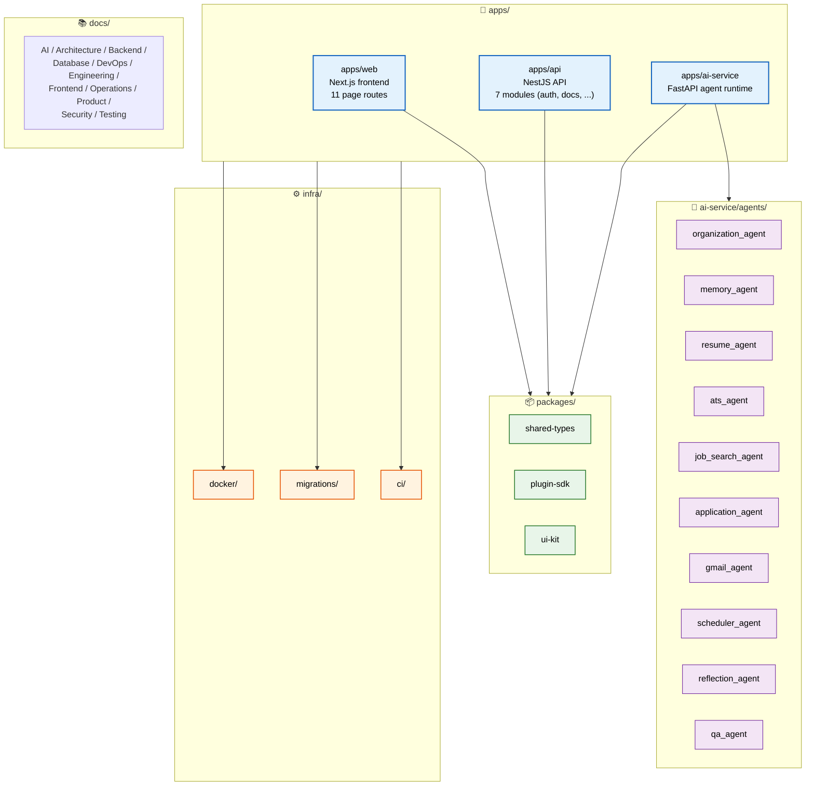

# Folder Structure

> **Purpose:** Define the monorepo folder structure for Vaeloom
> **Canonical source:** [`/docs/Vaeloom-Complete-Documentation.md#131-monorepo-folder-structure`](../../docs/Vaeloom-Complete-Documentation.md#131-monorepo-folder-structure)

## Monorepo Structure



> **Diagram:** Monorepo structure showing **4 top-level directories** — `apps/` (web, api, ai-service with 10 agents), `packages/` (shared-types, plugin-sdk, ui-kit), `infra/` (docker, migrations, ci), and `docs/` (11 doc categories). All apps depend on shared packages, and ai-service hosts the agent ecosystem.

---

## Monorepo Structure

```text
Vaeloom/
├── apps/
│   ├── web/                      # Next.js frontend
│   │   ├── app/
│   │   │   ├── dashboard/
│   │   │   ├── workspace/
│   │   │   ├── memory-graph/
│   │   │   ├── resume/
│   │   │   ├── jobs/
│   │   │   ├── applications/
│   │   │   ├── chat/
│   │   │   ├── schedule/
│   │   │   ├── connectors/
│   │   │   ├── history/
│   │   │   └── settings/
│   │   └── components/
│   │
│   ├── api/                      # NestJS core API service
│   │   ├── auth/
│   │   ├── workspaces/
│   │   ├── documents/
│   │   ├── connectors/
│   │   ├── permissions/
│   │   ├── audit/
│   │   └── events/
│   │
│   └── ai-service/               # FastAPI agent runtime
│       ├── orchestrator/
│       ├── agents/
│       │   ├── organization_agent/
│       │   ├── memory_agent/
│       │   ├── resume_agent/
│       │   ├── ats_agent/
│       │   ├── job_search_agent/
│       │   ├── application_agent/
│       │   ├── gmail_agent/
│       │   ├── scheduler_agent/
│       │   ├── reflection_agent/
│       │   └── qa_agent/
│       ├── ingestion/
│       │   ├── parsers/
│       │   ├── ocr/
│       │   └── code_understanding/
│       ├── retrieval/
│       └── tools/
│
├── packages/
│   ├── shared-types/
│   ├── plugin-sdk/
│   └── ui-kit/
│
├── infra/
│   ├── docker/
│   ├── migrations/
│   └── ci/
│
└── docs/
```

## Common Mistakes

| Mistake | Consequence |
|---------|-------------|
| Adding files outside the established directory structure | A utility function placed in `apps/api/utils/` instead of `packages/shared-types/` isn't available to other services — one-off locations create duplication and integration issues |
| Nesting folders more than 4 levels deep | `apps/ai-service/agents/memory/tools/parsers/document.py` is hard to navigate and creates excessively long import paths — flatten after 4 levels |
| Empty or ambiguous directory names | A directory called `misc/`, `utils/`, or `helpers/` with unrelated files becomes a dumping ground — every directory should have a clear, single purpose |
| Creating new agent directories without updating this document | A new agent that exists in the filesystem but isn't documented here creates confusion — new agents must be added to the Folder Structure doc as part of the PR |

## Best Practices

| Practice | Why |
|----------|-----|
| Keep the directory structure flat — no more than 4 levels deep | Deep nesting creates long import paths and makes the structure hard to visualize — `apps/ai-service/agents/{agent_name}/` should be the deepest standard pattern |
| Name directories after the domain concept, not the implementation | Use `agents/memory_agent/` not `agents/nlp/` — names should reflect what the code does, not the technology it uses |
| Update the folder structure doc when adding new directories | A stale `Folder-Structure.md` misleads new developers — adding a new directory should include updating this document in the same PR |
| Use the monorepo tooling to enforce path conventions | Workspace-level ESLint rules should restrict imports to valid paths — prevent accidental cross-service dependencies at the lint level |

## Security Considerations

| Consideration | Mitigation |
|--------------|-----------|
| Internal-only directories exposed by tooling | The `infra/migrations/` and `infra/ci/` directories contain credentials and configuration — ensure build tooling doesn't export these to public artifacts |
| Agent isolation by directory structure | Each agent lives in its own directory with its own `permissions.py` — the directory boundary reinforces the permission boundary. Never share agent code across directories without explicit review |

## Performance Considerations

| Consideration | Approach |
|--------------|----------|
| Monorepo size and CI clone time | A monorepo with 5+ years of history can take minutes to clone — use shallow clone (`--depth=1`) in CI and sparse checkout for targeted operations |
| Directory structure and build caching | A well-organized monorepo enables granular build caching — each `apps/` directory should produce a separate build artifact so changes to `apps/web` don't rebuild `apps/ai-service` |

## Workflows

1. **New agent creation:** Create directory under `apps/ai-service/agents/{agent_name}/` with `__init__.py`, `agent.py`, `tools/`, `prompts/`, `tests/`
2. **New API module:** Add directory under `apps/api/{module_name}/` with controller, service, DTO, and test files
3. **New frontend page:** Add route directory under `apps/web/app/{route}/` with `page.tsx` and `components/`
4. **Shared package update:** Modify `packages/{package}/src/` — changes propagate to all consuming apps
5. **Infrastructure change:** Update `infra/{docker|migrations|ci}/` with corresponding Terraform or config changes
6. **Documentation update:** Update `docs/{category}/` — always verify cross-references to existing docs

---

## APIs

| Endpoint | Method | Purpose | Auth |
|----------|--------|---------|------|
| `GET /api/fs/structure` | GET | Read current monorepo structure | Admin token |
| `POST /api/fs/validate` | POST | Validate paths against allowed structure | Admin token |
| `GET /api/fs/search?pattern=*` | GET | Search files within allowed paths | Service token |
| `POST /api/fs/move` | POST | Move file to correct location (refactoring) | Admin token |

---

## Scalability

| Dimension | Current Limit | 10x Strategy | 100x Strategy |
|-----------|--------------|--------------|---------------|
| Packages in monorepo | 3 packages | 30 packages: workspace grouping with shared config | 300 packages: distributed build system (Nx/Turborepo) |
| Apps in monorepo | 3 apps | 10 apps: per-app CI caching | 50 apps: independent deployment pipelines |
| Directory depth | 4 levels max | Enforce via lint rule | Automated restructure with path analysis |
| File count | ~500 files | ~5000 files: granular build caching | ~50000 files: selective checkout per CI job |

---

## Error Handling

| Scenario | Detection | Mitigation | Recovery |
|----------|-----------|------------|----------|
| File outside expected directory | ESLint import rule violation | Reject PR, suggest correct path | Move file and update imports |
| Circular dependency between packages | Build failure | Block merge until resolved | Extract shared dependency to new package |
| Duplicate module in multiple locations | Lint warning | Merge into single location | Update all imports to new path |
| Orphaned directory after refactor | Unreferenced path detection | Move to archive/ directory | Delete after 30-day grace period |

---

## Monitoring

| Metric | Alert Threshold | Severity | Dashboard |
|--------|----------------|----------|-----------|
| Directory nesting depth > 4 | Any occurrence | Warning | Code Quality Dashboard |
| Unreferenced directories | > 3 | Info | Repo Health |
| Cross-package import violations | Any | Critical | Import Lint Dashboard |
| File count growth rate | > 20% per month | Warning | Monorepo Growth |

---

## Limitations

| Limitation | Impact | Workaround | Future Resolution |
|------------|--------|------------|-------------------|
| No automated directory structure validation | Structure drift requires manual review | Periodic structure audit | CI-enforced directory structure linting |
| Flat package structure limits code sharing | Code duplication across apps | Extract to shared-types package | Domain-based package groups with barrel exports |
| Deep nesting not prevented by tooling | Engineers can create 5+ levels | Lint rule with max-depth check | Enforced via ESLint `max-depth` rule in CI |
| No visual directory explorer | New engineers must learn structure from docs | Onboarding walkthrough | Automated structure visualization in docs |

---

## Overview

The Vaeloom monorepo follows a structured layout that separates concerns across three application services (`apps/web`, `apps/api`, `apps/ai-service`), three shared packages (`packages/shared-types`, `packages/plugin-sdk`, `packages/ui-kit`), infrastructure configuration (`infra/`), and documentation (`docs/`). This document defines every directory's purpose, naming conventions, and depth limits so engineers can navigate the codebase without guesswork.

The two-service backend split is a non-negotiable architectural decision: NestJS (`apps/api`) owns auth, CRUD, and permissions; FastAPI (`apps/ai-service`) owns agents, memory, and retrieval. They communicate over an internal RPC boundary. The frontend (`apps/web`) talks exclusively to `apps/api` — never directly to `apps/ai-service`. Each of the 10 specialist agents lives in its own directory under `apps/ai-service/agents/`, reinforcing the permission boundary at the filesystem level.

All Vaeloom engineers use this document as the canonical reference when creating new directories, modules, or agents. The structure is enforced through import-path lint rules and periodic audits, with a planned CI-enforced validation gate for Q3 2026.

## Goals

- Define a clear, navigable monorepo structure that scales from 3 apps to 50+ without reorganization
- Enforce separation between frontend, API, AI service, shared packages, and infrastructure
- Ensure every directory has a single, unambiguous purpose — no `utils/` or `misc/` dumping grounds
- Establish depth limits (max 4 levels) to keep import paths short and navigation predictable
- Provide explicit workflows for creating new agents, API modules, frontend pages, and packages

## Scope

### In Scope

- Top-level directory layout: apps/, packages/, infra/, docs/
- apps/web structure: Next.js App Router pages, components
- apps/api structure: NestJS modules (auth, workspaces, documents, connectors, permissions, audit, events)
- apps/ai-service structure: orchestrator, agents (10 specialist agents), ingestion, retrieval, tools
- packages structure: shared-types, plugin-sdk, ui-kit
- infra structure: docker, migrations, ci
- Directory depth limits and naming conventions
- Workflows for adding new directories at each level

### Out of Scope

- Automated directory structure validation in CI (planned Q3 2026)
- Automated structure diagram generation from tree (planned Q4 2026)
- Import path alias enforcement per package (planned Q3 2026)
- Cross-package dependency graph visualization (planned Q1 2027)
- Automated refactoring tool for directory moves (planned Q2 2027)

---

## Examples

```bash
# Create a new specialist agent directory structure
mkdir -p apps/ai-service/agents/new_agent/{tools,prompts,tests}
touch apps/ai-service/agents/new_agent/__init__.py
touch apps/ai-service/agents/new_agent/agent.py

# Create a new API module
mkdir -p apps/api/{module_name}/
# Creates: controller.ts, service.ts, dto.ts, test.ts

# Create a new frontend route page
mkdir -p apps/web/app/{route}/components/
touch apps/web/app/{route}/page.tsx

# Add a new shared package
mkdir -p packages/{name}/src/
# Update root package.json workspace config
```

```typescript
// Import paths following the monorepo structure
// Correct: shared types imported from package
import { Document, Workspace } from '@vaeloom/shared-types';

// Correct: agent imports from tools directory
import { searchMessages } from '../../tools/connectors/gmail';

// Incorrect: cross-service dependency (api importing from ai-service)
import { Orchestrator } from '../../../ai-service/orchestrator'; // BLOCKED BY LINT
```

---

## Future Improvements

| Improvement | Priority | Complexity | Timeline |
|-------------|----------|------------|----------|
| CI-enforced directory structure linting | High | Medium | Q3 2026 |
| Automated structure diagram generation from tree | Medium | Low | Q4 2026 |
| Import path alias enforcement per package | Medium | Low | Q3 2026 |
| Cross-package dependency graph visualization | Low | Medium | Q1 2027 |
| Automated refactoring tool for directory moves | Low | High | Q2 2027 |

## Related Documents

- [Coding Standards.md](./Coding-Standards.md)
- [`/docs/Vaeloom-Complete-Documentation.md#131-monorepo-folder-structure`](../../docs/Vaeloom-Complete-Documentation.md#131-monorepo-folder-structure)
