# Git Workflow

> **Purpose:** Define the Git workflow for Vaeloom engineering
> **Status:** 🆕 New

## Git Workflow Architecture

```mermaid
graph LR
    classDef branch fill:#e3f2fd,stroke:#1565c0,color:#000,stroke-width:2px
    classDef action fill:#e8f5e9,stroke:#2e7d32,color:#000,stroke-width:1.5px

    subgraph Branches["🌿 Branch Structure"]
        MAIN["main<br/>Production-ready"]
        DEV["develop<br/>Integration"]
        FEAT["feature/*<br/>New features"]
        FIX["fix/*<br/>Bug fixes"]
        RELEASE["release/*<br/>Release prep"]
    end

    subgraph Workflow["🔄 Workflow Steps"]
        S1["1. Branch from develop<br/>git checkout -b feature/x develop"]
        S2["2. Develop & commit locally"]
        S3["3. Push branch<br/>git push origin feature/x"]
        S4["4. Open PR against develop"]
        S5["5. Pass CI + code review"]
        S6["6. Squash merge to develop"]
        S7["7. develop → main (merge commit)"]
    end

    subgraph Merge["📦 Merge Strategy"]
        M1["Feature→develop: Squash merge"]
        M2["develop→main: Merge commit"]
        M3["Hotfix→main: Squash merge,<br/>then merge back to develop"]
    end

    MAIN --> DEV
    DEV --> FEAT & FIX & RELEASE
    Workflow --> Merge

    class MAIN,DEV,FEAT,FIX,RELEASE branch
    class S1,S2,S3,S4,S5,S6,S7 action
    class M1,M2,M3 action
```



> **Diagram:** Git workflow — **5 branch types** (main, develop, feature, fix, release) → **7-step workflow** (branch → commit → push → PR → CI → merge → promote) → **3 merge strategies** (squash for features, merge commit for develop→main, squash + backport for hotfixes).

---

## Branch Strategy

| Branch | Purpose | Base Branch |
|--------|---------|-------------|
| `main` | Production-ready code | — |
| `develop` | Integration branch | `main` |
| `feature/*` | New features | `develop` |
| `fix/*` | Bug fixes | `develop` |
| `release/*` | Release preparation | `develop` |

## Workflow

```text
1. Branch from develop: git checkout -b feature/my-feature develop
2. Develop and commit locally
3. Push branch: git push origin feature/my-feature
4. Open PR against develop
5. Pass CI + code review
6. Merge to develop (squash merge)
7. Periodically: develop → main (merge commit)
```

## Commit Convention

```text
<type>(<scope>): <description>

[optional body]
```

Types: `feat`, `fix`, `chore`, `docs`, `style`, `refactor`, `test`, `ci`

Examples:

```text
feat(api): add document upload endpoint
fix(memory): correct entity merge confidence threshold
docs(readme): update installation instructions
```

## Merge Strategy

| Operation | Strategy |
|-----------|----------|
| Feature → develop | Squash merge (single commit) |
| develop → main | Merge commit (preserves history) |
| Hotfix → main | Squash merge, then merge back to develop |

## Common Mistakes

| Mistake | Consequence |
|---------|-------------|
| Committing directly to main or develop | Bypassing PR review on protected branches introduces untested changes to production — all changes must go through PR + CI + review |
| Long-lived feature branches that diverge from develop | A feature branch open for 3+ weeks accumulates merge conflicts that are risky to resolve — rebase frequently (daily) on develop |
| Squash-merging develop→main | Squash merging loses the commit history of individual features — use merge commits for develop→main to preserve context |
| Forgetting to merge hotfixes back to develop | A hotfix applied directly to main without merging back to develop will be overwritten by the next release — hotfixes must be cherry-picked to develop |

## Best Practices

| Practice | Why |
|----------|-----|
| Rebase feature branches on develop daily | Daily rebasing keeps the branch up to date and prevents last-minute merge conflicts — it's easier to resolve one conflict per day than 20 conflicts at merge time |
| Write descriptive commit messages for squash merges | The squash commit message becomes the permanent record of the feature — it should describe what was done and why, not just "Address PR feedback" |
| Delete branches after merging | Stale branches accumulate and create confusion about what's in progress — set up automatic branch deletion after merge in repo settings |
| Tag releases immediately after merging to main | Tags are used for deployment and rollback — tagging `v1.2.0` immediately after the merge ensures the exact commit is recorded |

## Security Considerations

| Consideration | Mitigation |
|--------------|-----------|
| Branch protection rules | Main and develop must have branch protection: require PR, require CI passing, require approvals, and prevent force pushes — these are the last line of defense against unauthorized changes |
| Signed commits | All commits to main and develop should be signed with GPG or SSH keys — unsigned commits can be forged by anyone with push access |

## Performance Considerations

| Consideration | Approach |
|--------------|----------|
| CI pipeline runtime | A slow CI pipeline (20+ minutes) encourages developers to skip running it locally — optimize CI to complete in under 10 minutes with parallel job execution |
| Large binary files in git | Committing large files (datasets, model weights) bloats the repository and slows clone operations — use Git LFS or store large files separately |

## Workflows

1. **Start new feature:** `git checkout develop && git pull && git checkout -b feature/my-feature develop`
2. **Daily development:** `git add <files> && git commit -m "feat(scope): message"`
3. **Daily sync:** `git fetch origin && git rebase origin/develop` (resolve conflicts as they arise)
4. **Push branch:** `git push origin feature/my-feature`
5. **Open PR:** Against `develop` with filled template
6. **CI + review:** Wait for CI to pass and reviewer approval
7. **Squash merge:** Merge to develop with clean commit message
8. **Delete branch:** Auto-delete after merge (or `git push origin --delete feature/my-feature`)
9. **Release:** `git checkout main && git merge develop --no-ff && git tag v1.2.0 && git push origin main --tags`

---

## APIs

| Endpoint | Method | Purpose | Auth |
|----------|--------|---------|------|
| `POST /repos/{owner}/{repo}/pulls` | POST | Open a new pull request | GitHub token |
| `PUT /repos/{owner}/{repo}/pulls/{pull}/merge` | PUT | Merge a pull request (squash/merge commit) | GitHub token |
| `POST /repos/{owner}/{repo}/git/refs` | POST | Create a new branch ref | GitHub token |
| `POST /repos/{owner}/{repo}/releases` | POST | Create a release from tag | GitHub token |

---

## Scalability

| Dimension | Current Limit | 10x Strategy | 100x Strategy |
|-----------|--------------|--------------|---------------|
| Team size | 5 engineers | 50 engineers: per-team prefix branches + squads | 500 engineers: monorepo with independent deploy perms |
| Release frequency | 2/week | 20/week: automated release trains | 200/week: continuous deployment with feature flags |
| Merge throughput | 5 feature merges/day | 50 merges: auto-merge for trivial PRs | 500 merges: merge queue with batch processing |
| Hotfix handling | Manual cherry-pick | Automated hotfix → develop backport | GitOps-based hotfix pipeline |

---

## Error Handling

| Scenario | Detection | Mitigation | Recovery |
|----------|-----------|------------|----------|
| Git merge conflict | GitHub conflict indicator | `git rebase develop` and resolve conflicts manually | `git merge --abort` if resolution fails |
| Push rejected (branch protection) | Git push error | Create PR instead of direct push | Rebase and push to feature branch |
| Accidental merge to main | CI deployment triggers | Rollback deployment immediately | `git revert <merge-commit>` and re-open PR |
| Lost commits after force push | Reflog shows detached state | `git reflog` to find commit SHA | `git reset --hard <sha>` to restore |

---

## Monitoring

| Metric | Alert Threshold | Severity | Dashboard |
|--------|----------------|----------|-----------|
| Merge conflict rate per developer | > 20% | Warning | GitHub Insights |
| Time from merge to production deploy | > 2 hours | Warning | CI/CD Pipeline Dashboard |
| Hotfix count per week | > 3 | Warning | Release Health |
| Force push count per week | > 5 | Info | Git Activity Log |

---

## Limitations

| Limitation | Impact | Workaround | Future Resolution |
|------------|--------|------------|-------------------|
| Linear history requires rebase discipline | Developers must remember to rebase | Git hooks to warn before push | Enforce rebase strategy in CI pre-merge check |
| Merge conflicts on long-lived branches | High resolution effort | Daily rebasing on develop | Trunk-based development with feature flags |
| Hotfix → develop backport often forgotten | Hotfix lost on next release | Manual cherry-pick reminder | Automated hotfix backport CI job |
| No automatic release note generation | Manual release notes | Conventional commit changelog | Auto-generate from conventional commits |

---

## Overview

This document defines the end-to-end Git workflow that every Vaeloom engineer follows from starting a new feature through deploying to production. It covers branch strategy, the 7-step development workflow, commit conventions, merge strategies, and release tagging. The workflow follows a modified GitHub Flow model with a permanent `develop` integration branch — simple enough for a 5-person team yet structured enough to scale.

The merge strategy is context-dependent: feature branches merge to `develop` via squash (single clean commit), while `develop` merges to `main` via merge commit (preserves feature history). Hotfixes branch from `main` and are backported to `develop` after merge. This dual-strategy approach keeps the release history readable without losing per-feature context.

Every engineer working on the Vaeloom monorepo follows this workflow. It integrates with the branch protection rules in `Branch-Strategy.md`, the commit format in `Commit-Convention.md`, and the PR process in `PR-Guidelines.md`.

## Goals

- Provide a repeatable, documented 7-step workflow that eliminates guesswork about Git operations
- Define context-dependent merge strategies (squash vs. merge commit) for different branch transitions
- Ensure hotfixes to main are always backported to develop to prevent regression
- Establish daily rebasing discipline to minimize merge conflicts on long-lived branches
- Automate release tagging and changelog generation from conventional commit history

## Scope

### In Scope
- Branch strategy: main (production), develop (integration), feature, fix, release, hotfix branches
- 7-step development workflow: branch, commit, push, PR, CI, merge, promote
- Commit convention: Conventional Commits with type, scope, description, and optional body
- Merge strategies: squash merge (feature→develop), merge commit (develop→main), hotfix backport
- Release tagging and changelog generation commands
- Common mistakes and best practices for daily Git operations

### Out of Scope
- Auto-merge for approved small PRs (planned Q3 2026)
- Automated hotfix backport CI job (planned Q4 2026)
- Merge queue with batch processing (planned Q1 2027)
- Trunk-based development with feature flags (planned Q2 2027)
- AI-generated release notes from commits (planned Q1 2027)

---

## Examples

```bash
# Start a new feature
git checkout develop && git pull
git checkout -b feature/document-upload develop

# Daily development cycle
git add apps/api/src/documents/
git commit -m "feat(api): add document upload endpoint"
git push origin feature/document-upload

# Daily sync with develop (rebase, don't merge)
git fetch origin
git rebase origin/develop
# Resolve any conflicts, then:
git push origin feature/document-upload --force-with-lease

# Create release
git checkout main && git merge develop --no-ff
git tag -a v1.2.0 -m "Release v1.2.0: Add document upload, ATS scoring"
git push origin main --tags

# Hotfix workflow
git checkout -b hotfix/auth-expiry main
# Fix, commit, PR, merge to main
git checkout develop && git cherry-pick <hotfix-commit-sha>
git push origin develop
```

---

## Future Improvements

| Improvement | Priority | Complexity | Timeline |
|-------------|----------|------------|----------|
| Auto-merge for approved, CI-passed small PRs | High | Low | Q3 2026 |
| Automated hotfix backport CI job | High | Medium | Q4 2026 |
| Merge queue with batch processing | Medium | High | Q1 2027 |
| Trunk-based development migration with feature flags | Low | High | Q2 2027 |
| AI-generated release notes from commits | Low | Medium | Q1 2027 |

## Related Documents

- [Branch Strategy.md](./Branch-Strategy.md)
- [Commit Convention.md](./Commit-Convention.md)
- [PR Guidelines.md](./PR-Guidelines.md)
- [`/Docs/Engineering/Implementation/00-master-build-order.md`](../../Docs/Engineering/Implementation/00-master-build-order.md)
