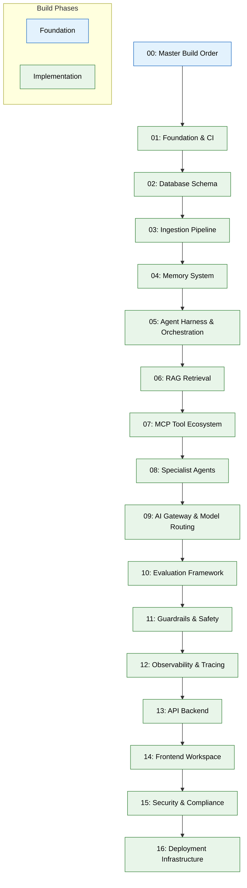

# 00 — Master Build Order (MVP)

> **Purpose:** Entry-point document defining the complete build sequence for the Vaeloom MVP. Read this first before any implementation phase.
> **Status:** ✅ Upgraded to enterprise quality
> **Owner:** Engineering Team
> **Last Updated:** 2026-07-13

## Read this first. This file is the entry point for Claude Code / Cursor

## Overview

The Master Build Order is the single source of truth for the Vaeloom MVP implementation sequence. It defines 16 ordered build phases — from foundation infrastructure through deployment — each depending on the phases before it. This document establishes architectural non-negotiables, global conventions, and the definition of "MVP done" that every subsequent phase works toward.

This file does not contain implementation details; it is the map. Each row in the build-order table below links to a phase-specific implementation guide (files 01–16) that provides full requirements, acceptance criteria, and quality guardrails. Engineers must read this document first, understand the dependency chain, and follow the numbered sequence without skipping ahead.

The companion product documents (`Vaeloom-Complete-Documentation.md` and `01-Vaeloom-MVP-Spec.md`) provide the product context and the "why" behind each build decision. This file and those that follow are purely the "how, in order."

## Goals

1. Provide an unambiguous, dependency-ordered build sequence that eliminates guesswork about phase ordering
2. Establish architectural decisions that are non-negotiable and must not be re-litigated during implementation
3. Define global conventions (language choice, testing requirements, local-dev standards) that apply uniformly across all 16 phases
4. Set a clear, measurable definition of "MVP done" that every phase contributes toward
5. Prevent scope creep by documenting out-of-scope boundaries for the entire project



## What you're building

Vaeloom: a second brain for a person's education and career. It ingests documents, code, and communications; builds a continuously updated, structured memory of who the person is and what they've done; and runs specialized, permission-scoped agents on top of that memory to organize files, maintain a resume, search for and apply to jobs, and track deadlines. Full product context lives in the companion docs `Vaeloom-Complete-Documentation.md` and `01-Vaeloom-MVP-Spec.md` — read those for the "why," this file and the ones after it are the "how, in order."

## Non-negotiable architectural decisions (already made — do not re-litigate)

- **Agent contract:** every agent shares one structure — fixed mission, declared tool list, explicit memory read/write permissions, a stated default autonomy level (suggest-mode unless stated otherwise), and a required fallback (ask, never guess).
- **Agentic loop:** Plan → Act → Observe → Reflect → Improve, implemented once in the shared harness (file 05), not reimplemented per agent.
- **Memory before features:** every agent action that teaches the system something new is a memory write; every feature is a memory read. If a feature can't be expressed as a read/write against memory, question whether it belongs.
- **MCP-shaped tools everywhere:** every connector and internal tool is defined with the same shape (name, input schema, output schema, required scope) from day one, even before real MCP transport is wired up.
- **Suggest-mode by default:** no agent takes a consequential, irreversible action without approval in MVP. Earned autonomy is a v1.5+ concern, not MVP.
- **Two-service backend split:** `apps/api` (NestJS, TypeScript) owns auth/CRUD/permissions; `apps/ai-service` (FastAPI, Python) owns agents/memory/retrieval. They talk over an internal RPC boundary.

## Build order

Run these prompts in order. Each depends on the ones before it. Do not skip ahead — a later file assumes the earlier ones' schemas/interfaces exist.

| # | File | Builds | Depends on |
|---|---|---|---|
| 01 | `01-foundation-infra.md` | Repo scaffold, CI, auth, empty services | — |
| 02 | `02-database-schema.md` | Postgres schema, migrations | 01 |
| 03 | `03-ingestion-pipeline.md` | File parsing, OCR, extraction, queue | 01, 02 |
| 04 | `04-memory-system.md` | Memory Agent, knowledge graph, vector store | 02, 03 |
| 05 | `05-agent-harness-orchestration.md` | Shared agent runtime, Orchestrator, agentic loop | 04 |
| 06 | `06-rag-retrieval.md` | Agentic RAG hybrid retrieval | 04, 05 |
| 07 | `07-mcp-tool-ecosystem.md` | MCP-shaped connectors (Gmail, GitHub, Drive) | 01, 05 |
| 08 | `08-specialist-agents.md` | Organization, Resume, ATS, Job Search, Application, Gmail, Scheduler agents | 05, 06, 07 |
| 09 | `09-ai-gateway-model-routing.md` | Model router, fallback, prompt caching | 05 |
| 10 | `10-evaluation-framework.md` | Golden datasets, eval runner, CI gating | 08 |
| 11 | `11-guardrails-safety.md` | Input validation, injection defense, QA gate | 05, 08 |
| 12 | `12-observability-tracing.md` | Tracing, structured logs, audit log | 05 |
| 13 | `13-api-backend.md` | Core REST API, permission engine | 02, 08 |
| 14 | `14-frontend-workspace.md` | Next.js frontend, all MVP screens | 13 |
| 15 | `15-security-compliance.md` | Encryption, secrets, export/delete | all above |
| 16 | `16-deployment-infrastructure.md` | Containers, CI/CD, staging/prod | all above |

## Global conventions (apply in every file below)

- **Languages:** TypeScript (strict mode) for `apps/web` and `apps/api`; Python 3.11+ with full type hints for `apps/ai-service`.
- **Testing:** every phase ships with tests before being marked done — unit tests minimum, integration tests where a real external dependency (DB, queue) is involved. No phase is "complete" without a green test suite.
- **Local dev:** every service must run locally via `docker-compose up` with a documented `.env.example` — never require a cloud account to develop against. Secrets in local dev come from `.env` (gitignored); production secrets come from a secrets manager (file 15).
- **Commits:** conventional commits (`feat:`, `fix:`, `chore:`), one logical change per commit.
- **No silent scope creep:** if a prompt file's "Out of scope" section excludes something, do not build it "while you're in there" — flag it as a note instead.

## Definition of "MVP done"

A new user can sign up, connect at least one source, upload a resume, see it organized and reflected in an always-current master resume, search for and (with approval) apply to a role, and see relevant deadlines surfaced automatically — with zero manual intervention from the engineering team. This is the acceptance bar for file 16.

## Common Mistakes

| Mistake | Consequence |
|---------|-------------|
| Re-ordering prompts or skipping ahead | Downstream files reference schemas/interfaces that don't exist yet |
| Second-guessing the build order | Wastes time rebuilding modules that would have been correct if done in order |
| Silently changing architectural decisions (e.g., merging api+ai-service) | Violates the two-service split, causing permission/auth coupling issues |

## Best Practices

| Practice | Why |
|----------|-----|
| Read the companion docs first (spec + complete documentation) | Ensures you understand the "why" before implementing the "how" |
| Run each prompt's test suite before moving to the next | Catches regressions immediately against known-correct baselines |
| Commit after each phase completes (not mid-phase) | Keeps the audit trail clean and rollbacks simple |

## Security Considerations

| Concern | Mitigation |
|---------|------------|
| Two-service backend introduces a broader attack surface | Enforce the internal RPC boundary strictly — never allow direct service-to-database cross-talk |
| Suggest-mode agents could still leak context if untested | Always run guardrail checks before any agent output is returned to a user |

## Performance Considerations

| Concern | Approach |
|---------|----------|
| Sequential build order creates a linear dependency chain | Parallelize where possible (e.g., api + ai-service schemas can be validated independently) |
| Redis-based state persistence may become a bottleneck at scale | Plan for enterprise-phase migration to Kafka or similar event-streaming platform |

## Scope

### In Scope

- Complete 16-phase MVP build sequence with explicit dependency ordering from foundation (01) through deployment (16)
- Non-negotiable architectural decisions: two-service backend split, agent contract, agentic loop, memory-before-features, MCP-shaped tools, suggest-mode by default
- Global conventions: TypeScript/Python language choice, testing requirements, local-dev standards, commit format, scope-creep prohibition
- Definition of "MVP done" with measurable user-facing acceptance criteria
- Cross-referencing between phases so downstream engineers understand upstream contracts

### Out of Scope

- Product specifications and design rationale (covered in `Vaeloom-Complete-Documentation.md` and `01-Vaeloom-MVP-Spec.md`)
- Enterprise-phase scaling, migration guides, or additional agent roster
- Performance benchmarking beyond what each phase's acceptance criteria define
- Multi-region deployment, Kubernetes orchestration, or disaster recovery (planned for enterprise)
- Any feature or agent not explicitly listed in the 16-phase build order

---

## Examples

```bash
# Verify phase dependency before starting work
# Phase 05 requires Phase 04 (Memory System) to be complete
# Check: Does the retrieve() function exist in apps/ai-service/retrieval/?
grep -r "def retrieve" apps/ai-service/retrieval/

# Run the full build sequence locally
cd Vaeloom/
docker-compose up -d
npx prisma migrate dev  # Phase 02
pytest apps/ai-service/tests/  # Phase validation

# Commit after completing each phase
git add -A
git commit -m "feat(ai): implement memory system with entity extraction
- Implements extraction pipeline for typed entities and relationships
- Builds merge/dedup with multi-signal confidence scoring
- Creates write path through Postgres, AGE, and pgvector
- Implements agentic RAG retrieval with hybrid strategy support

Closes #42"
```

---

## Future Improvements

| Improvement | Priority | Complexity | Timeline |
|-------------|----------|------------|----------|
| Automated phase-dependency validation in CI | High | Medium | Q4 2026 |
| Visual build-progress dashboard showing completion per phase | Medium | Low | Q4 2026 |
| Parallel-phase execution with DAG-based dependency resolution | Low | High | Q2 2027 |
| Auto-generated build-order visualization from phase metadata | Medium | Medium | Q1 2027 |

## Related Documents

- [01 — Foundation Infrastructure](01-foundation-infra.md) — First build phase: repo scaffold, CI, auth
- [Architecture System Design](../../Architecture/System-Design.md) — System architecture context
- [Vaeloom Complete Documentation](../../Vaeloom-Complete-Documentation.md) — Full product specification
- [01-Vaeloom-MVP-Spec.md](../../01-Vaeloom-MVP-Spec.md) — MVP product requirements
