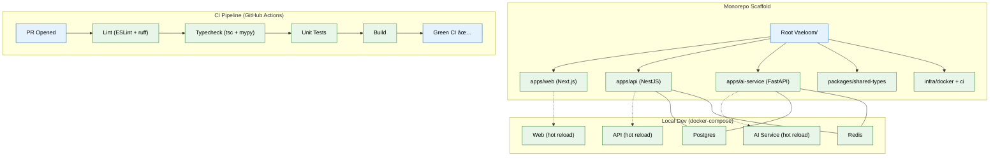

# 01 — Foundation & Infrastructure Scaffolding (MVP)

> **Purpose:** Stand up the deployable monorepo skeleton — three services that boot, talk to each other, pass CI, and let a user sign up.
> **Status:** ✅ Upgraded to enterprise quality
> **Owner:** Engineering Team
> **Last Updated:** 2026-07-13

## Overview

This is the first implementation phase and the foundation every later phase builds upon. It establishes the monorepo structure (`apps/web`, `apps/api`, `apps/ai-service`, `packages/shared-types`), the CI pipeline via GitHub Actions, local development via Docker Compose, and the authentication scaffold. No feature logic exists yet — the goal is a working, deployable, empty version of Vaeloom.

The three-service architecture reflects the non-negotiable two-service backend split: NestJS (`apps/api`) handles auth, CRUD, and permissions, while FastAPI (`apps/ai-service`) handles agents, memory, and retrieval. They communicate over an internal RPC boundary established in later phases. The Next.js frontend (`apps/web`) provides a placeholder dashboard that file 14 replaces with the full UI.

All later phases (02–16) assume this skeleton is green and running. Every engineer must be able to run `docker-compose up` from a clean checkout and see all three services boot with zero manual steps beyond copying `.env.example` to `.env`.

## Goals

1. Create a reproducible monorepo scaffold with three services, shared types, and infrastructure configuration
2. Establish a CI pipeline (lint, typecheck, test, build) that gates every PR before merge
3. Implement auth (email/password signup + login) with a structured interface for future OAuth/SSO replacement
4. Provide a local development environment via Docker Compose that does not require any cloud accounts
5. Define `.env.example` documenting every required environment variable



## Context
Read `00-master-build-order.md` first. This is the first build phase — the deployable skeleton every later phase builds on top of. No feature logic yet.

## Objective
Stand up a working, deployable, empty version of Vaeloom: three services that boot, talk to each other, pass CI, and let a user sign up and see a blank workspace.

## Requirements

**Monorepo structure** (create exactly this layout):
```
Vaeloom/
├── apps/
│   ├── web/            # Next.js 14+, TypeScript, App Router, Tailwind CSS
│   ├── api/             # NestJS, TypeScript
│   └── ai-service/      # FastAPI, Python 3.11+
├── packages/
│   └── shared-types/    # types shared between web and api
├── infra/
│   ├── docker/          # Dockerfiles per service
│   └── ci/
└── docker-compose.yml   # Postgres, Redis, all three services, for local dev
```

**apps/api (NestJS):**
- Health-check endpoint (`GET /health`) returning service status.
- Auth module: email/password signup + login to start (bcrypt-hashed passwords), structured so an OAuth/SSO provider can be swapped in later (file 15) without changing the interface.
- Auth middleware/guard usable by every future endpoint.
- `POST /workspaces` — provisions a new, empty workspace for the authenticated user (see file 02 for the table this writes to).

**apps/ai-service (FastAPI):**
- Health-check endpoint.
- Empty `orchestrator/` and `agents/` folders with a `README.md` stub explaining they're populated in file 05.

**apps/web (Next.js):**
- Signup and login pages, calling the api service.
- An empty, authenticated Dashboard route that renders "Workspace ready" once a workspace exists — this is the placeholder file 14 replaces.

**CI (`infra/ci/`, GitHub Actions):**
- On every PR: lint (ESLint + Python ruff/flake8), typecheck (`tsc --noEmit`, `mypy`), unit tests, build, for all three apps.
- Must be green before any later phase's PR merges.

**Local dev:**
- `docker-compose.yml` bringing up Postgres, Redis, and all three apps with hot reload.
- `.env.example` at the repo root documenting every required variable (DB URL, Redis URL, JWT secret, etc.) — no service should require an undocumented env var to boot.

## Out of scope
Real OAuth/SSO providers (file 15 stub only), any AI/agent logic (file 05+), any memory or ingestion logic (files 02–04), production deployment (file 16 — this phase is local + CI only).

## Acceptance criteria
- [ ] `docker-compose up` boots all services with no manual steps beyond copying `.env.example` to `.env`.
- [ ] A new user can sign up, log in, and see an empty, correctly-provisioned workspace.
- [ ] CI is green on a fresh PR with no changes.
- [ ] `packages/shared-types` is imported by both `web` and `api` with no type duplication between them.

## Common Mistakes

| Mistake | Consequence |
|---------|-------------|
| Hardcoding env vars instead of using `.env.example` | Production secrets leak or dev environment becomes non-portable |
| Skipping Dockerfile optimization | Slow cold starts and large images waste CI/dev time |
| Monorepo misconfiguration (workspace hoisting issues) | Broken imports and duplicate dependency versions across packages |

## Best Practices

| Practice | Why |
|----------|-----|
| Keep `.env.example` in sync with every new dependency | Prevents "works on my machine" issues across the team |
| Use `tsc --noEmit` in CI, not just in editor | Catches type errors that IDE extensions might miss |
| Test `docker-compose up --build` from clean checkout before merging | Ensures new dependencies are properly wired into the compose file |

## Security Considerations

| Concern | Mitigation |
|---------|------------|
| JWT secret stored in env without rotation guidance | Document rotation procedure in `.env.example`; use keystore in staging/prod |
| Auth scaffold could allow weak passwords | Enforce minimum password complexity from day one (not as a later patch) |
| Exposed health endpoints in production | Restrict `/health` to internal network or add auth for production deployments |

## Performance Considerations

| Concern | Approach |
|---------|----------|
| Monorepo build times grow with each new service | Use Turborepo or Nx for build caching from the start |
| Hot reload on three concurrent services consumes significant memory | Set explicit Node memory limits in docker-compose |

## Scope

### In Scope
- Monorepo scaffold with three services: apps/web (Next.js), apps/api (NestJS), apps/ai-service (FastAPI)
- packages/shared-types for cross-service type sharing
- CI pipeline via GitHub Actions: lint (ESLint + ruff), typecheck (tsc + mypy), test, build on every PR
- Auth module: email/password signup + login with bcrypt, structured for OAuth/SSO swap-in
- Docker Compose local dev environment with Postgres, Redis, and all three services (hot reload)
- .env.example documenting every required environment variable

### Out of Scope
- Real OAuth/SSO providers (deferred to Phase 15)
- Any AI or agent logic (deferred to Phase 05+)
- Memory or ingestion logic (deferred to Phases 02–04)
- Production deployment configuration (Phase 16)
- Kubernetes or container orchestration (enterprise phase)

---

## Examples

```bash
# Clone and bootstrap the monorepo
git clone git@github.com:Vaeloom/Vaeloom.git
cd Vaeloom
cp .env.example .env
docker-compose up --build -d

# Verify all three services are running
curl http://localhost:3000/api/health    # Web
curl http://localhost:4000/health        # API
curl http://localhost:8000/health        # AI Service

# Create a new user via API
curl -X POST http://localhost:4000/auth/signup \
  -H "Content-Type: application/json" \
  -d '{"email": "test@vaeloom.dev", "password": "SecurePass123!"}'

# Login and get JWT
curl -X POST http://localhost:4000/auth/login \
  -H "Content-Type: application/json" \
  -d '{"email": "test@vaeloom.dev", "password": "SecurePass123!"}'
```

```typescript
// packages/shared-types/src/index.ts — types shared between web and api
export interface User {
  id: string;
  email: string;
  createdAt: Date;
}

export interface Workspace {
  id: string;
  userId: string;
  createdAt: Date;
}
```

```yaml
# .github/workflows/ci.yml — CI pipeline entry
name: CI
on: [pull_request]
jobs:
  lint:
    runs-on: ubuntu-latest
    steps:
      - uses: actions/checkout@v4
      - run: npx eslint . --max-warnings 0
      - run: ruff check .
  typecheck:
    runs-on: ubuntu-latest
    steps:
      - uses: actions/checkout@v4
      - run: npx tsc --noEmit
      - run: mypy .
```

---

## Future Improvements

| Improvement | Priority | Complexity | Timeline |
|-------------|----------|------------|----------|
| Turborepo remote caching for faster CI builds | High | Medium | Q4 2026 |
| Automated dependency-update PRs via Dependabot/Renovate | Medium | Low | Q4 2026 |
| Multi-architecture Docker builds (arm64 + amd64) | Low | Medium | Q1 2027 |
| Developer onboarding script (auto-copy `.env.example`, install hooks) | Medium | Low | Q4 2026 |

## Related Documents

- [00 — Master Build Order](00-master-build-order.md) — Entry point and build sequence
- [02 — Database Schema](02-database-schema.md) — Next phase: Postgres schema and migrations
- [15 — Security & Compliance](15-security-compliance.md) — Auth upgrade and secrets management
- [Architecture System Design](../../Architecture/System-Design.md) — System architecture context
