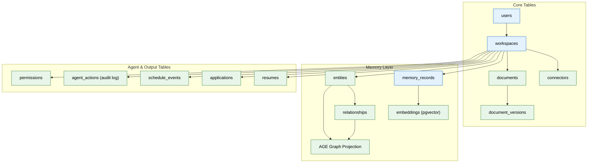

# 02 — Database & Schema Design (MVP)

> **Purpose:** Implement the complete MVP relational schema in Postgres — the durable source of truth for every other system in the project.
> **Status:** ✅ Upgraded to enterprise quality
> **Owner:** Engineering Team
> **Last Updated:** 2026-07-13

## Overview

This phase establishes the entire relational schema that every later phase reads from and writes to. It implements 13 core tables spanning users, workspaces, documents, memory, agents, and permissions — plus vector storage via pgvector, graph storage via Apache AGE, indexes, migrations, and seed data. The schema is accessed by both services (`apps/api` via Prisma, `apps/ai-service` via SQLAlchemy) and must remain perfectly synchronized between them.

The schema is organized into three logical layers: Core Tables (users, workspaces, connectors, documents), Memory Layer (memory_records, entities, relationships, embeddings, AGE graph), and Agent & Output Tables (resumes, applications, schedule_events, agent_actions, permissions). Every table includes a `workspace_id` foreign key to enforce tenant isolation at the database level — a non-negotiable security requirement.

All migrations are transactional, both ORMs share identical schema definitions, and seed data provides a realistic demo workspace for local development. Performance-critical indexes are specified upfront, not retrofitted after data growth reveals problems.

## Goals

1. Define and implement all 13 MVP tables with exact columns, types, and constraints
2. Enable both TypeScript (Prisma) and Python (SQLAlchemy) ORMs to access an identical, drift-free schema
3. Install and configure pgvector for vector similarity search and Apache AGE for graph traversal
4. Create transactional migrations and seed data for local development and CI
5. Establish explicit indexes on query-critical paths before production data exists



## Context
Read `01-foundation-infra.md` first — this assumes Postgres is already running via docker-compose. This phase implements the full relational schema every later phase reads from and writes to.

## Objective
Implement the complete MVP relational schema in Postgres, with migrations, seed data, and indexes — the durable source of truth for every other system in this project.

## Requirements

**Migration tool:** use Prisma (TypeScript) for type-safe schema access from `apps/api`, with raw SQL migrations mirrored for `apps/ai-service` (Python) to consume via SQLAlchemy — pick whichever ORM pairing you're most confident keeping in sync; the requirement is that both services see an identical schema, never two drifted copies.

**Tables to create** (exact columns, not illustrative):

- `users(id, email, password_hash, auth_provider, created_at)`
- `workspaces(id, user_id, created_at)`
- `connectors(id, workspace_id, type, scopes text[], status, token_ref, last_synced_at)`
- `documents(id, workspace_id, source_connector_id, path, type, raw_storage_key, summary, created_at, updated_at)`
- `document_versions(id, document_id, version_number, storage_key, superseded_by, created_at)`
- `memory_records(id, workspace_id, type, content jsonb, confidence float, importance float, freshness_at timestamptz, source_document_id, created_at, updated_at)`
- `entities(id, workspace_id, type, canonical_name, aliases text[], embedding_id)`
- `relationships(id, workspace_id, from_entity_id, to_entity_id, relation_type, confidence float, source_memory_id)`
- `resumes(id, workspace_id, variant_type, content jsonb, version int, generated_from_snapshot, created_at)`
- `applications(id, workspace_id, job_external_id, platform, status, resume_version_id, cover_letter, submitted_at, outcome, outcome_at)`
- `schedule_events(id, workspace_id, source, title, date, type, conflict_flag boolean)`
- `agent_actions(id, workspace_id, agent_name, action_type, input_ref, output_ref, status, created_at)` — this is the audit log
- `permissions(id, workspace_id, connector_id, agent_name, action_type, scope, granted_at, revoked_at)`

**Memory type enum** (used in `memory_records.type`, MVP set only — enterprise adds 14 more): `profile`, `document`, `career`, `episodic`, `preference`, `working`.

**Indexes (required, not optional):**
- `workspace_id` on every table.
- Composite `(type, workspace_id)` on `memory_records`.
- `(workspace_id, created_at)` on `agent_actions` for time-range audit queries.
- `(source_connector_id)` on `documents` for connector-scoped resync.

**Vector storage:** enable the `pgvector` extension; add an `embeddings` table: `id, workspace_id, source_type, source_id, vector, model_version, created_at`.

**Graph storage:** enable Apache AGE (Postgres extension) for the MVP graph layer — do not stand up a separate Neo4j instance yet (that's an enterprise-phase upgrade). Nodes/edges in AGE should mirror `entities`/`relationships` as a query-optimized projection, not a second source of truth — `entities`/`relationships` in plain Postgres remain canonical.

**Seed script:** a `seed.ts`/`seed.py` that creates one demo workspace with a handful of sample entities and a sample document, for local development and manual QA.

## Out of scope
Any actual write logic from agents (file 04 populates this schema for real), read replicas / partitioning (enterprise upgrade), a dedicated vector DB migration (enterprise upgrade).

## Acceptance criteria
- [ ] `prisma migrate dev` (or equivalent) runs cleanly from an empty database.
- [ ] Both `apps/api` and `apps/ai-service` can read/write the same tables with no schema drift.
- [ ] Seed script produces a workspace with queryable sample data.
- [ ] A `pgvector` similarity query against the seeded `embeddings` table returns results.
- [ ] An AGE graph query traversing seeded `entities`/`relationships` returns the expected path.

## Common Mistakes

| Mistake | Consequence |
|---------|-------------|
| Schema drift between Prisma (TS) and SQLAlchemy (Python) | Both services see different columns, causing silent data corruption |
| Forgetting indexes on foreign keys | JOIN-heavy queries degrade as row counts grow |
| Not using transactional DDL for migrations | Partial migration failure leaves the schema in an inconsistent state |

## Best Practices

| Practice | Why |
|----------|-----|
| Run both ORMs' migration checks in CI | Catches drift before it reaches staging |
| Always add `ON DELETE CASCADE` or explicit cleanup logic | Prevents orphaned rows when a parent workspace is deleted |
| Name indexes explicitly with a convention (`idx_tablename_column`) | Makes `EXPLAIN ANALYZE` output readable and index management predictable |

## Security Considerations

| Concern | Mitigation |
|---------|------------|
| Raw SQL in migrations could expose injection paths | Parameterize all raw migration queries; prefer ORM-generated SQL where possible |
| Embedding vectors contain semantic content, not just IDs | Apply same workspace-scoped access control to `embeddings` as to primary tables |
| AGE graph extension adds an attack surface | Restrict AGE function execution to the ai-service database user; never expose to API layer |

## Performance Considerations

| Concern | Approach |
|---------|----------|
| pgvector index build time grows with embedding count | Use IVFFlat index with a reasonable `lists` parameter for MVP; plan HNSW for enterprise |
| Composite indexes can become stale | Monitor query plans via `pg_stat_statements`; rebuild indexes during low-usage windows |
| Graph queries via AGE can be slower than relational for simple traversals | Keep canonical data in plain Postgres; use AGE only for multi-hop path queries |

## Scope

### In Scope
- 13 core MVP tables: users, workspaces, connectors, documents, document_versions, memory_records, entities, relationships, resumes, applications, schedule_events, agent_actions, permissions
- pgvector extension for vector similarity search with embeddings table
- Apache AGE extension for graph projection mirroring entities/relationships
- Prisma schema (TypeScript) for apps/api and SQLAlchemy models (Python) for apps/ai-service
- Transactional migrations and seed data for local development
- Required indexes on workspace_id, (type, workspace_id), (workspace_id, created_at), and (source_connector_id)

### Out of Scope
- Actual write logic from agents (Phase 04 populates the schema for real)
- Read replicas or table partitioning (enterprise-phase scaling)
- Dedicated vector database (Qdrant) migration from pgvector (enterprise)
- Dedicated graph database (Neo4j) migration from Apache AGE (enterprise)
- Automated schema-drift detection between Prisma and SQLAlchemy (planned Q4 2026)

---

## Examples

```sql
-- Core users table
CREATE TABLE users (
    id UUID PRIMARY KEY DEFAULT gen_random_uuid(),
    email VARCHAR(255) UNIQUE NOT NULL,
    password_hash VARCHAR(255) NOT NULL,
    auth_provider VARCHAR(50) DEFAULT 'email',
    created_at TIMESTAMPTZ NOT NULL DEFAULT NOW()
);

-- Memory records with vector support
CREATE TABLE memory_records (
    id UUID PRIMARY KEY DEFAULT gen_random_uuid(),
    workspace_id UUID NOT NULL REFERENCES workspaces(id) ON DELETE CASCADE,
    type VARCHAR(50) NOT NULL CHECK (type IN ('profile','document','career','episodic','preference','working')),
    content JSONB NOT NULL,
    confidence FLOAT DEFAULT 1.0,
    freshness_at TIMESTAMPTZ NOT NULL DEFAULT NOW(),
    created_at TIMESTAMPTZ NOT NULL DEFAULT NOW()
);
CREATE INDEX idx_memory_records_workspace_type ON memory_records(workspace_id, type);

-- Vector embeddings with model version tracking
CREATE TABLE embeddings (
    id UUID PRIMARY KEY DEFAULT gen_random_uuid(),
    workspace_id UUID NOT NULL REFERENCES workspaces(id) ON DELETE CASCADE,
    vector VECTOR(1536) NOT NULL,
    model_version VARCHAR(100) NOT NULL,
    created_at TIMESTAMPTZ NOT NULL DEFAULT NOW()
);
```

```typescript
// Prisma schema (apps/api)
model MemoryRecord {
  id          String   @id @default(uuid())
  workspaceId String   @map("workspace_id")
  type        String   // profile, document, career, episodic, preference, working
  content     Json
  confidence  Float    @default(1.0)
  createdAt   DateTime @default(now()) @map("created_at")
  @@index([workspaceId, type])
  @@map("memory_records")
}
```

```python
# SQLAlchemy model (apps/ai-service)
from sqlalchemy import Column, String, Float, DateTime, JSON
from sqlalchemy.dialects.postgresql import UUID

class MemoryRecord(Base):
    __tablename__ = "memory_records"
    id = Column(UUID(as_uuid=True), primary_key=True, default=uuid.uuid4)
    workspace_id = Column(UUID(as_uuid=True), nullable=False)
    type = Column(String(50), nullable=False)
    content = Column(JSONB, nullable=False)
    confidence = Column(Float, default=1.0)
    created_at = Column(DateTime(timezone=True), default=func.now())
```

---

## Future Improvements

| Improvement | Priority | Complexity | Timeline |
|-------------|----------|------------|----------|
| Read replicas and connection pooling for production scaling | High | Medium | Q4 2026 |
| Dedicated vector database (Qdrant) migration from pgvector | Medium | High | Q2 2027 |
| Dedicated graph database (Neo4j) migration from AGE | Medium | High | Q2 2027 |
| Table partitioning for time-series data (agent_actions, memory_records) | Low | Medium | Q1 2027 |
| Automated schema-drift detection in CI between Prisma and SQLAlchemy | High | Low | Q4 2026 |

## Related Documents

- [01 — Foundation Infrastructure](01-foundation-infra.md) — Prerequisite: Postgres running via Docker Compose
- [03 — Ingestion Pipeline](03-ingestion-pipeline.md) — Next phase: writes to documents and document_versions
- [04 — Memory System](04-memory-system.md) — Consumes entities, relationships, embeddings
- [13 — API Backend](13-api-backend.md) — Builds the REST API on top of this schema
