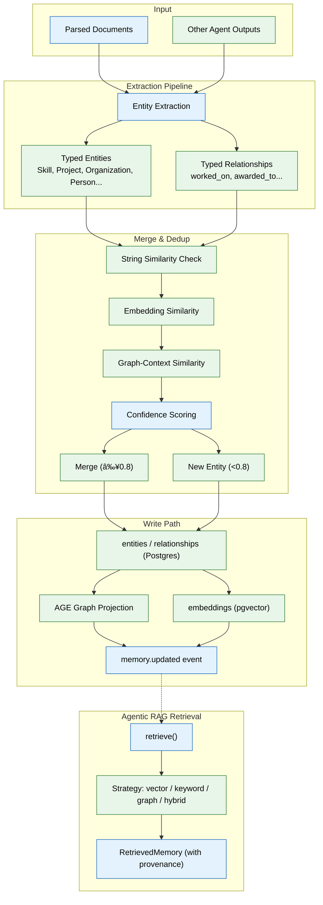

# 04 — Memory System (MVP)

> **Purpose:** Build the Memory Agent that extracts entities and relationships from parsed documents into a structured, queryable knowledge graph and vector store.
> **Status:** ✅ Upgraded to enterprise quality
> **Owner:** Engineering Team
> **Last Updated:** 2026-07-13

### The memory prompt. This is the core of the product — take more care here than anywhere else.

## Overview

The Memory System is the intellectual core of Vaeloom. It transforms parsed documents (from Phase 03) into structured, queryable memory by extracting typed entities (Skill, Project, Organization, Person, etc.) and typed relationships (worked_on, awarded_to, etc.) using JSON schema-constrained LLM generation. Every extracted fact undergoes a merge/dedup process that combines string similarity, embedding similarity, and graph-context similarity before being committed to the knowledge graph and vector store.

The system implements the full write path: candidate facts → merge/dedup check → write to entities/relationships (Postgres) → mirror into AGE graph projection → generate embedding → write to embeddings table → publish `memory.updated` event. On the read side, the agentic RAG retrieval layer provides a single `retrieve()` function supporting four strategies (vector, keyword, graph, hybrid) with re-ranking by relevance, freshness, and confidence.

Six memory types are implemented for MVP (profile, document, career, episodic, preference, working), matching the `memory_records.type` enum from Phase 02. Every fact includes traceable provenance (`source_document_id` or `source_memory_id`), and the consolidation job periodically merges low-confidence duplicates while preserving an audit trail.

## Goals

1. Build the Memory Agent extraction pipeline that converts parsed content into typed entities and relationships with confidence scores
2. Implement a multi-signal merge/dedup system that prioritizes false negatives over false positives
3. Create the full write path through Postgres, AGE, and pgvector with event publishing
4. Build the agentic RAG retrieval layer with hybrid strategy support and provenance tracking
5. Implement a basic consolidation job for periodic duplicate management



## Context
Read `03-ingestion-pipeline.md` first. Ingestion produces parsed `documents`; this phase turns that into structured, queryable memory. Every other agent (file 08) reads from and writes to what you build here. If this is shallow or wrong, everything built on top of it is shallow or wrong too.

## Objective
Build the Memory Agent: the internal agent that extracts entities and relationships from every parsed document (and, later, every other agent's output), merges them correctly against existing memory, and writes to the knowledge graph and vector store — plus the agentic RAG retrieval layer other agents use to read it back.

## Memory types (MVP — six, not the full enterprise taxonomy)
Implement exactly these, matching the `memory_records.type` enum from file 02: `profile` (stable facts — education, skills, certifications), `document` (per-file summary + embedding), `career` (applications, outcomes), `episodic` (timestamped events), `preference` (inferred/stated patterns), `working` (current session context — the only type cleared per session; everything else is permanent unless explicitly deleted).

## Requirements

**Extraction (`apps/ai-service/agents/memory_agent/extraction.py`):**
- Input: a parsed `documents` row (or any other agent's output — this module is called by more than just ingestion, design the interface accordingly: `extract(content: str, source_type: str, source_id: str, workspace_id: str) -> ExtractedFacts`).
- Output: candidate entities (typed: `Skill`, `Project`, `Organization`, `Person`, `Certificate`, `Event`, `Job`, `Course`, `Publication`) and candidate typed relationships (`worked_on`, `awarded_to`, `requires_skill`, `applied_to`, `mentored_by`) between them, each with an initial confidence score based on source clarity.
- Use structured output (JSON schema-constrained generation), not free-form text parsing — precision matters more than fluency here.

**Merge & dedup (`apps/ai-service/agents/memory_agent/merge.py`):**
- Before writing a candidate entity, check for an existing match using a combination of: string similarity on `canonical_name`/`aliases`, embedding similarity, and graph-context similarity (shared relationships).
- **Critical rule:** if match confidence is below a defined threshold (e.g. 0.8), do NOT merge — create a new, separate entity instead, and log it to a `needs_reflection` queue for the Reflection Agent (enterprise phase) to revisit later. A wrong merge silently corrupts two records; a missed merge is a correctable annoyance. Never trade the former for the latter.
- Write a test suite specifically for this: seed "React" and "React.js" mentions and assert they merge; seed two genuinely different people with the same first name and assert they do NOT merge.

**Write path:**
```
Candidate facts → merge/dedup check → write to entities/relationships (Postgres)
   → mirror into AGE graph projection → generate embedding → write to embeddings table
   → publish memory.updated event
```

**Agentic RAG retrieval (`apps/ai-service/retrieval/`):**
- Expose one function: `retrieve(query: str, workspace_id: str, strategy: Literal["vector","keyword","graph","hybrid"] = "hybrid", limit: int = 10) -> list[RetrievedMemory]`, where each `RetrievedMemory` carries its source provenance (which document/event produced it) — never return a fact without a traceable source.
- `hybrid` (the default) combines vector similarity (pgvector), keyword match (Postgres full-text search is sufficient for MVP — no dedicated search engine yet), and graph traversal (AGE) and re-ranks the combined candidates by relevance, freshness (`freshness_at`), and confidence.
- The calling agent chooses the strategy explicitly when it knows better (e.g. an exact course-code lookup should pass `strategy="keyword"`), and falls back to `hybrid` by default.

**Consolidation (basic MVP version — full Reflection Agent is enterprise-phase):**
- A scheduled job that finds `memory_records` of the same type/entity with overlapping content and merges the lowest-confidence, oldest duplicates into the highest-confidence one, preserving the merged-away record's content in an audit trail rather than deleting it.

## Out of scope
The full 20-type memory taxonomy, the standalone Reflection Agent, memory export/import, a dedicated vector DB or Neo4j migration (all enterprise upgrades — see `enterprise/04-memory-system.md`).

## Acceptance criteria
- [ ] Ingesting three documents that separately mention "React", "React.js", and "ReactJS" in project descriptions results in exactly one `Skill` entity, linked to all three projects.
- [ ] Ingesting documents about two different people who happen to share a first name does NOT merge them.
- [ ] `retrieve("machine learning projects", workspace_id, strategy="hybrid")` returns entities that never contain the literal phrase "machine learning" but are semantically related, ranked above less-relevant literal matches.
- [ ] Every item returned by `retrieve()` includes a traceable `source_document_id` or `source_memory_id`.
- [ ] The consolidation job, run against seeded duplicate-heavy data, reduces record count without losing any distinct fact (verified by comparing pre/post content coverage, not just row count).

## Common Mistakes

| Mistake | Consequence |
|---------|-------------|
| Setting merge confidence threshold too low | Two distinct entities silently merge, corrupting both records |
| Extracting entities without typed relationships | Graph becomes a bag of disconnected nodes, useless for traversal |
| Storing embeddings without a `model_version` column | A future model upgrade silently mixes incompatible vector spaces |

## Best Practices

| Practice | Why |
|----------|-----|
| Always include `source_document_id` on every extracted fact | Enables provenance tracing and audit without re-extraction |
| Use JSON schema-constrained structured output for extraction | Precision matters more than fluency — free-text parsing introduces ambiguity |
| Run the merge/dedup test suite before every extraction pipeline change | Wrong merges are the hardest memory-system bug to detect after data is written |

## Security Considerations

| Concern | Mitigation |
|---------|------------|
| Memory records contain inferred personal data | Apply workspace-scoped access to all memory reads; never allow cross-workspace retrieval |
| Embeddings encode semantic information permanently | Treat embedding vectors as PII-equivalent — apply same export/delete controls |
| Consolidation could accidentally merge cross-entity data | Restrict merge operations to entities within the same workspace only |

## Performance Considerations

| Concern | Approach |
|---------|----------|
| Multi-strategy hybrid retrieval (vector + keyword + graph) has additive latency | Run retrieval strategies in parallel with a timeout, not sequentially |
| Embedding generation for every write is expensive | Batch embedding requests; cache embeddings for unchanged content |
| Graph traversal depth impacts query time | Limit graph traversal to max 3 hops in MVP; index traversal starting nodes |

## Scope

### In Scope
- Memory Agent extraction pipeline converting parsed content into typed entities (Skill, Project, Organization, Person, Certificate, Event, Job, Course, Publication) and typed relationships (worked_on, awarded_to, requires_skill, applied_to, mentored_by)
- Multi-signal merge/dedup system using string similarity, embedding similarity, and graph-context similarity with 0.8 confidence threshold
- Full write path: candidate facts → merge/dedup → entities/relationships (Postgres) → AGE graph projection → embeddings (pgvector) → memory.updated event
- Agentic RAG retrieval: single `retrieve()` function with four strategies (vector, keyword, graph, hybrid) and re-ranking
- Six MVP memory types: profile, document, career, episodic, preference, working
- Basic consolidation job for periodic duplicate merging

### Out of Scope
- Full 20-type enterprise memory taxonomy (enterprise expansion)
- Standalone Reflection Agent for deep merge analysis (enterprise)
- Memory export/import for cross-workspace migration (planned Q1 2027)
- Dedicated vector database (Qdrant) migration (planned Q2 2027)
- Real-time memory update streaming via WebSocket (planned Q2 2027)

---

## Examples

```python
# Entity extraction with structured output
from pydantic import BaseModel

class ExtractedEntity(BaseModel):
    name: str
    entity_type: str  # Skill | Project | Organization | Person | Certificate ...
    confidence: float
    aliases: list[str] = []

class ExtractedRelationship(BaseModel):
    from_entity: str
    to_entity: str
    relation_type: str  # worked_on | awarded_to | requires_skill ...
    confidence: float

async def extract(content: str, source_type: str, source_id: str, workspace_id: str) -> ExtractedFacts:
    response = await gateway.complete(
        "memory_agent",
        messages=[{
            "role": "user",
            "content": f"Extract entities and relationships from:\n\n{content}"
        }],
        response_model=ExtractedFacts,
    )
    return response.parsed
```

```python
# Agentic RAG retrieval with hybrid strategy
async def retrieve(
    query: str,
    workspace_id: str,
    strategy: str = "hybrid",
    limit: int = 10,
) -> list[RetrievedMemory]:
    vector_results = await vector_search(query, workspace_id, limit)
    keyword_results = await keyword_search(query, workspace_id, limit)
    graph_results = await graph_traversal(query, workspace_id, limit)

    if strategy == "vector":
        return vector_results
    elif strategy == "hybrid":
        combined = vector_results + keyword_results + graph_results
        return await rerank(combined, query, limit=limit)
```

```python
# Merge/dedup test
async def test_merge_threshold():
    # "React" and "React.js" should merge
    result = await merge_check("React", ["React.js"], workspace_id)
    assert result.action == "merge"

    # Two people with same first name should NOT merge
    result = await merge_check("Alice Smith", ["Alice Jones"], workspace_id)
    assert result.action == "create_new"
```

---

## Future Improvements

| Improvement | Priority | Complexity | Timeline |
|-------------|----------|------------|----------|
| Full 20-type memory taxonomy (enterprise expansion) | Medium | Medium | Q2 2027 |
| Standalone Reflection Agent for deep merge analysis | High | High | Q2 2027 |
| Memory export/import for cross-workspace migration | Low | Medium | Q1 2027 |
| Dedicated vector database (Qdrant) for production scale | Medium | High | Q2 2027 |
| Real-time memory update streaming via WebSocket | Low | High | Q2 2027 |

## Related Documents

- [03 — Ingestion Pipeline](03-ingestion-pipeline.md) — Prerequisite: parsed documents as extraction input
- [05 — Agent Harness & Orchestration](05-agent-harness-orchestration.md) — Consumes the retrieval layer in the Plan phase
- [06 — RAG Retrieval](06-rag-retrieval.md) — Hardens retrieval with chunking, re-ranking, context assembly
- [08 — Specialist Agents](08-specialist-agents.md) — All agents read from and write to this memory system
