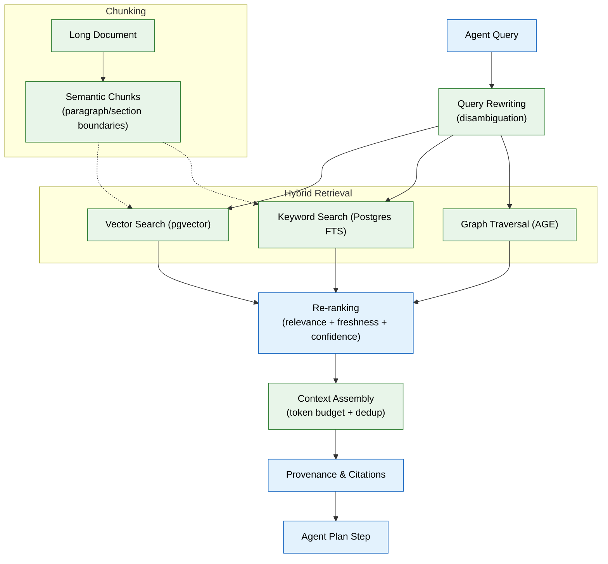

# 06 — RAG & Retrieval (MVP)

> **Purpose:** Harden the retrieval layer with semantic chunking, re-ranking, context assembly, and provenance citations — making it reliable enough for every agent to depend on.
> **Status:** ✅ Upgraded to enterprise quality
> **Owner:** Engineering Team
> **Last Updated:** 2026-07-13

## Overview

This phase builds on the core `retrieve()` function from Phase 04 and hardens it into a production-grade retrieval system. While Phase 04 established the basic retrieval capability, this phase adds the critical quality layers: semantic chunking (by paragraph/section boundary, not fixed character count), embedding model selection with explicit version tracking, multi-factor re-ranking (relevance + freshness + confidence), token-budget-aware context assembly, provenance citation chains, and basic query rewriting for ambiguous inputs.

Every agent in the system (Phase 08) depends on this layer for the "Plan" step. The quality of retrieval directly determines whether an agent makes correct decisions — a weak retrieval layer produces weak agent behavior regardless of how good the underlying model is. Re-ranking weights are configurable per agent, so a Job Search Agent can prioritize freshness while a Profile Agent prioritizes confidence.

All retrieved results include traceable provenance back to the source document. No fact reaches an agent without a citation chain, and no context assembly exceeds the calling agent's declared token budget. Query rewriting handles basic ambiguity using recent conversation context before falling back to asking the user.

## Goals

1. Implement semantic chunking that respects paragraph/section boundaries and never splits tables or sentences
2. Select and version an embedding model, recording `model_version` on every embedding row
3. Build a configurable re-ranking layer that weights relevance, freshness, and confidence per agent
4. Implement token-budget-aware context assembly with deduplication and provenance retention
5. Add basic query rewriting for ambiguous queries using recent working memory



## Context

Read `04-memory-system.md` and `05-agent-harness-orchestration.md` first. File 04 already implements the core `retrieve()` function — this phase hardens it into something every agent can depend on for quality, not just correctness, and wires it into the harness's "Plan" step.

## Objective

Make retrieval good enough that agents make correct decisions from it: proper chunking, the right embedding model, real re-ranking, and mandatory citations — not just "a vector search that returns something."

## Requirements

**Chunking (`apps/ai-service/retrieval/chunking.py`):**

- Chunk long documents by semantic boundary (paragraph/section), not fixed character count — a chunk should never split a sentence or a table row.
- Store chunk-to-document mapping so a retrieved chunk always resolves back to its full source document for provenance.

**Embedding model:** pick one embedding model for MVP (state your choice and reasoning in code comments — optimize for retrieval quality and cost, not the largest available model) and record `model_version` on every row in `embeddings` (file 02) so a future model upgrade can re-embed deliberately instead of silently mixing incompatible vector spaces.

**Re-ranking (`apps/ai-service/retrieval/rerank.py`):**

- After hybrid retrieval (file 04) returns candidates, re-rank by a weighted combination of: relevance (similarity score), freshness (`freshness_at`), and confidence (`memory_records.confidence` / `entities` confidence).
- Make the weights configurable per agent — a Job Search Agent query should weight freshness higher than a Profile lookup, for example.

**Context assembly (`apps/ai-service/retrieval/context.py`):**

- Given re-ranked candidates and a token budget (passed by the calling agent), select the most relevant, non-redundant subset that fits — don't just concatenate the top N.
- Every assembled context item retains its provenance pointer through to the final agent output — this is what makes citations possible, not an afterthought bolted onto the response.

**Query rewriting (basic):** if a user's query is ambiguous relative to the workspace's known entities (e.g., "that project" with no clear antecedent), the retrieval layer should attempt one rewrite pass using recent conversation context (`working` memory) before falling back to asking the user.

## Out of scope

Semantic caching, a dedicated vector database (pgvector is sufficient for MVP scale), context compression beyond basic dedup, a standalone Knowledge Graph exploration UI (file 14 covers the basic viewer).

## Acceptance criteria

- [ ] A test document with a table survives chunking without the table being split mid-row.
- [ ] Re-ranking demonstrably changes result order versus raw similarity score alone, on a seeded test case where a fresher, lower-similarity result should outrank a stale, higher-similarity one.
- [ ] Context assembly respects a token budget — a deliberately small budget still returns a coherent, non-truncated-mid-sentence context.
- [ ] Every fact surfaced in an agent's final output (tested via the Resume Agent stub) can be traced back to a specific source document through the citation chain.

## Common Mistakes

| Mistake | Consequence |
|---------|-------------|
| Fixed-character chunking splits sentences or table rows | Retrieved chunks are unreadable or lose semantic meaning |
| Mixing embedding models without tracking `model_version` | Different vector spaces produce meaningless similarity scores |
| Omitting freshness from reranking weights | Stale but highly similar results outrank recent, lower-similarity but more relevant ones |

## Best Practices

| Practice | Why |
|----------|-----|
| Store chunk-to-document mappings | Enables every retrieved chunk to resolve back to its source for full context |
| Make reranking weights configurable per agent | A Job Search Agent needs fresh results; a Profile Agent needs high-confidence ones |
| Always pass a token budget to context assembly | Prevents overflowing the model's context window with redundant candidates |

## Security Considerations

| Concern | Mitigation |
|---------|------------|
| Retrieved context could include cross-workspace data | Filter every retrieval by `workspace_id` at the query layer, not just at presentation |
| Query rewriting could expose user intent to unintended agents | Log rewritten queries and link them to the original; include trace ID in logs |
| Context assembly could inadvertently include PII from aggregated chunks | Run assembled context through the PII detector (file 11) before handing to the agent |

## Performance Considerations

| Concern | Approach |
|---------|----------|
| Hybrid retrieval (3 strategies) is 3x the latency | Run all three strategies in parallel; use the fastest-returning results while waiting for others |
| Re-ranking on every retrieval adds O(n log n) cost | Limit re-rank candidates to top 50 from each strategy before combining |
| Embedding lookup on every retrieval at scale is expensive | Add semantic caching for repeated queries (cache keyed by query embedding hash) |

## Scope

### In Scope

- Semantic chunking by paragraph/section boundary (not fixed character count) with chunk-to-document mapping
- Embedding model selection with explicit model_version tracking on every embedding row
- Multi-factor re-ranking by relevance (similarity score), freshness (freshness_at), and confidence with per-agent configurable weights
- Token-budget-aware context assembly with deduplication and provenance retention
- Provenance citation chains from retrieved chunk back to source document
- Basic query rewriting for ambiguous queries using recent working memory

### Out of Scope

- Semantic caching for repeated query patterns (planned Q1 2027)
- Dedicated search engine migration (Meilisearch → OpenSearch, planned Q2 2027)
- Multi-modal retrieval (images, tables as independent search units, planned Q2 2027)
- Query expansion with learned synonyms from memory graph (planned Q1 2027)
- A/B comparison framework for embedding model upgrades (planned Q1 2027)

---

## Examples

```python
# Semantic chunking by section boundary
async def chunk_document(content: str) -> list[Chunk]:
    sections = split_by_heading_boundaries(content)
    chunks = []
    for section in sections:
        if contains_table(section):
            # Don't split tables — keep as one chunk
            chunks.append(Chunk(content=section, is_table=True))
        elif len(section) > 1000:
            # Split long sections by paragraph, not character count
            paragraphs = split_by_paragraph_boundary(section)
            chunks.extend([Chunk(content=p) for p in paragraphs])
        else:
            chunks.append(Chunk(content=section))
    return chunks
```

```python
# Per-agent re-ranking with configurable weights
AGENT_RERANK_CONFIG = {
    "job_search_agent": {"relevance": 0.3, "freshness": 0.5, "confidence": 0.2},
    "resume_agent": {"relevance": 0.5, "freshness": 0.2, "confidence": 0.3},
    "ats_agent": {"relevance": 0.4, "freshness": 0.1, "confidence": 0.5},
}

async def rerank(
    candidates: list[RetrievedMemory],
    query: str,
    agent_name: str,
    limit: int = 10,
) -> list[RetrievedMemory]:
    weights = AGENT_RERANK_CONFIG.get(agent_name, {"relevance": 0.4, "freshness": 0.3, "confidence": 0.3})
    scored = []
    for c in candidates:
        score = (
            weights["relevance"] * c.similarity +
            weights["freshness"] * freshness_score(c.freshness_at) +
            weights["confidence"] * c.confidence
        )
        scored.append((score, c))
    scored.sort(reverse=True)
    return [c for _, c in scored[:limit]]
```

```python
# Context assembly with token budget enforcement
async def assemble_context(
    candidates: list[RetrievedMemory],
    token_budget: int,
) -> str:
    selected = []
    used_tokens = 0
    for c in candidates:
        tokens = estimate_tokens(c.content)
        if used_tokens + tokens > token_budget:
            break
        selected.append(c)
        used_tokens += tokens
    # Deduplicate near-identical chunks
    selected = deduplicate_by_embedding(selected, threshold=0.95)
    return format_context_with_citations(selected)
```

---

## Future Improvements

| Improvement | Priority | Complexity | Timeline |
|-------------|----------|------------|----------|
| Semantic caching for repeated query patterns | Medium | Medium | Q1 2027 |
| Dedicated search engine (Meilisearch → OpenSearch) migration | High | High | Q2 2027 |
| Multi-modal retrieval (images, tables as independent search units) | Low | High | Q2 2027 |
| Query expansion with learned synonyms from memory graph | Medium | Medium | Q1 2027 |
| A/B comparison framework for embedding model upgrades | High | Medium | Q1 2027 |

## Related Documents

- [04 — Memory System](04-memory-system.md) — Core `retrieve()` function this phase hardens
- [05 — Agent Harness & Orchestration](05-agent-harness-orchestration.md) — Wires retrieval into the Plan phase
- [08 — Specialist Agents](08-specialist-agents.md) — All agents consume this retrieval layer
- [11 — Guardrails & Safety](11-guardrails-safety.md) — PII filtering on assembled context
