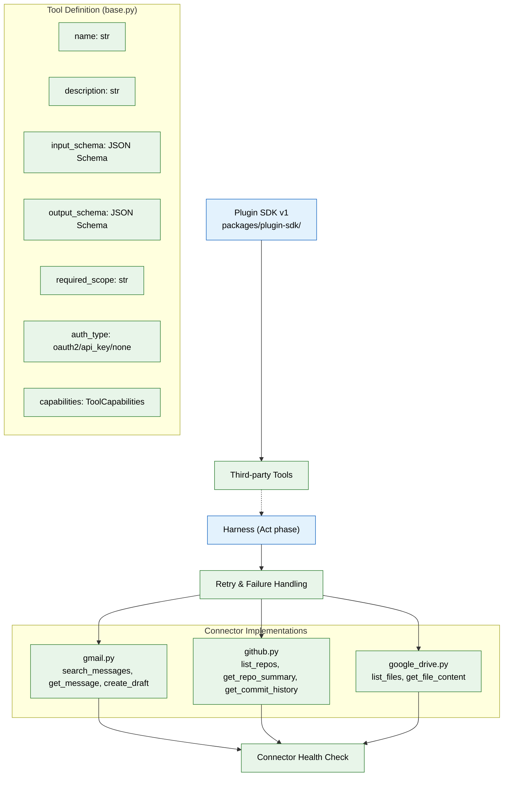

# 07 — MCP & Tool Ecosystem (MVP)

> **Purpose:** Implement the tool/connector layer as MCP-shaped internal tools and ship the first three real connectors — Gmail, GitHub, and Google Drive.
> **Status:** ✅ Upgraded to enterprise quality
> **Owner:** Engineering Team
> **Last Updated:** 2026-07-13

## Overview

The Tool Ecosystem gives agents real capabilities to call. Every tool — whether internal or connector-backed — is defined using the MCP-compatible shape: name, JSON Schema input/output, required scope, auth type, and capabilities declaration. This ensures that when real MCP transport is wired up in the enterprise phase, it's a transport change to `call()`, not a redesign of the tool class itself.

Three MVP connectors are implemented: Gmail (read + draft-only via OAuth2), GitHub (read-only via OAuth2 or PAT), and Google Drive (read-only via OAuth2). Each connector exposes multiple tools (e.g., `search_messages`, `get_message`, `create_draft` for Gmail), and each tool declares its `required_scope` — enforced at the harness layer, not by connector self-discipline. OAuth tokens are stored via `token_ref` pointing to the secrets manager, never as plaintext in the database.

All tool calls are wrapped by the harness's Act phase with consistent retry/failure handling: transient failures (network blips, rate limits) retry with backoff, permanent failures (invalid input, revoked auth) fail immediately. The Plugin SDK v1 (`packages/plugin-sdk/`) provides the seam for third-party tool registration without modifying core code. Connector health checks run on a background schedule to detect expired or revoked tokens proactively.

## Goals

1. Define the MCP-compatible tool shape (name, JSON Schema input/output, required scope, auth type, capabilities) used by all tools
2. Implement three real connectors — Gmail, GitHub, Google Drive — with OAuth integration and scope enforcement
3. Build consistent retry/failure handling that classifies errors as transient or permanent
4. Create the Plugin SDK v1 for third-party tool registration without core code changes
5. Implement connector health checks for proactive expired-token detection



## Context
Read `01-foundation-infra.md` and `05-agent-harness-orchestration.md` first. This phase gives agents something real to call — connectors, defined as MCP-shaped tools from day one.

## Objective
Implement the tool/connector layer as MCP-shaped internal tools (name, JSON-schema input/output, required scope, auth type) and ship the first three real connectors: Gmail (read + draft only), GitHub (read-only), Google Drive (read-only).

## Requirements

**Tool definition format (`apps/ai-service/tools/base.py`):** every tool — internal or connector-backed — is defined as:
```python
class Tool:
    name: str
    description: str
    input_schema: dict       # JSON Schema
    output_schema: dict      # JSON Schema
    required_scope: str      # e.g. "gmail:read"
    auth_type: Literal["oauth2", "api_key", "none"]
    capabilities: ToolCapabilities   # e.g. {"streaming": bool, "idempotent": bool}
    async def call(self, input: dict, context: ToolContext) -> dict: ...
```
This shape is deliberately identical to an MCP tool definition — when you later wire up real MCP transport (consuming or exposing MCP servers), it should be a transport change to `call()`, not a redesign of this class.

**Retry and failure handling:** every tool call is wrapped by the harness (file 05's "Act" phase), not left to each connector to handle inconsistently. Classify failures as transient (network blip, rate limit, timeout — safe to retry with backoff) or permanent (invalid input, revoked auth, not-found — do not retry, surface immediately). A tool that doesn't declare which of its failure modes are which defaults to "permanent" (fail fast) rather than silently retrying something that will never succeed.

**Streaming support:** for tool calls that can take a while (a large file OCR pass, a broad search), a tool may declare `capabilities.streaming = true` and yield partial results the harness's "Observe" phase can attach incrementally, rather than the caller blocking until the entire operation finishes. Tools that don't support streaming return a single blocking result, which remains the default and is fine for most MVP tool calls.

**Connector implementations (`apps/ai-service/tools/connectors/`):**
- `gmail.py` — OAuth2, scopes limited to `gmail.readonly` and `gmail.compose` (draft creation only, never send). Tools exposed: `search_messages`, `get_message`, `create_draft`.
- `github.py` — OAuth2 or PAT, read-only scopes. Tools exposed: `list_repos`, `get_repo_summary`, `get_commit_history`.
- `google_drive.py` — OAuth2, `drive.readonly` scope. Tools exposed: `list_files`, `get_file_content`.
- Each connector's OAuth token is stored via `connectors.token_ref` (file 02) pointing to a secret, never the token itself in the database row.

**Connector health:** each connector implementation must expose a `health_check()` used by a background job to detect expired/revoked tokens and mark `connectors.status` accordingly, surfaced later on the Connectors screen (file 14).

**Plugin SDK v1 (`packages/plugin-sdk/`):** a minimal TypeScript/Python package that lets a third party define a new `Tool` following the exact shape above, without touching `apps/ai-service` core code — even if no external plugin exists yet, build the seam now so it's not a later rewrite.

## Out of scope
Real MCP transport/protocol wiring (the shape is MCP-compatible now; actual MCP server consumption/exposure is enterprise phase), the Plugin Marketplace, additional connectors beyond the three listed (Slack, Notion, LinkedIn, etc. are enterprise phase), sandboxing hardening beyond basic scope enforcement.

## Acceptance criteria
- [ ] A user can connect Gmail, GitHub, and Google Drive via OAuth and immediately revoke any one of them from a test endpoint.
- [ ] Every tool call is checked against `required_scope` before execution — calling `create_draft` without `gmail.compose` scope granted fails at the tool layer, not silently.
- [ ] `health_check()` correctly detects a deliberately revoked token in a test.
- [ ] A sample third-party tool built against the Plugin SDK, with no changes to `apps/ai-service` core, successfully registers and is callable by a stub agent.
- [ ] A tool call forced to fail with a transient error (simulated timeout) retries with backoff; a tool call forced to fail with a permanent error (invalid input) fails immediately with no retry.
- [ ] A tool declaring `capabilities.streaming = true` yields at least one partial result before completion, visible to the harness's Observe phase before the full call finishes.

## Common Mistakes

| Mistake | Consequence |
|---------|-------------|
| Storing OAuth tokens in the database plaintext (not via `token_ref`) | A database breach leaks all connector credentials |
| Not classifying failures as transient vs permanent | Retrying a revoked-token error wastes resources and delays user notification |
| Defining tool shapes differently from MCP schema | A future MCP transport migration becomes a rewrite instead of a configuration change |

## Best Practices

| Practice | Why |
|----------|-----|
| Build the Plugin SDK seam even with zero plugins planned | Adding plugin support later without breaking existing tools requires the same interface anyway |
| Always expose a `health_check()` per connector | Detecting expired tokens proactively is far better than failing mid-request |
| Declare `capabilities.idempotent` on every tool | Enables safe retry — non-idempotent tools need special handling in the harness's Act phase |

## Security Considerations

| Concern | Mitigation |
|---------|------------|
| OAuth token refresh flow could leak refresh tokens | Never pass refresh tokens to the tool layer; handle refresh entirely in connector internals |
| Plugin SDK allows third-party code execution | Sandbox plugin execution; require plugin capabilities declaration at registration time |
| Connector scopes may grant more access than documented | Enforce `required_scope` at the tool layer, not just the OAuth consent screen |

## Performance Considerations

| Concern | Approach |
|---------|----------|
| Streaming tool calls hold open connections longer | Set a streaming timeout per-tool; close idle streams after the deadline |
| Health-check jobs hit connector APIs on a schedule | Use exponential backoff between health checks for previously-failing connectors |
| Plugin SDK adds import-time overhead | Lazy-load plugins on first tool call, not at service startup |

## Scope

### In Scope
- MCP-compatible tool definition format: name, JSON Schema input/output, required_scope, auth_type, capabilities
- Three MVP connectors: Gmail (read + draft-only via OAuth2), GitHub (read-only via OAuth2/PAT), Google Drive (read-only via OAuth2)
- Consistent retry/failure handling classifying errors as transient (retry with backoff) or permanent (fail fast)
- Streaming support for long-running tool calls via capabilities.streaming flag
- Connector health checks on background schedule for proactive expired-token detection
- Plugin SDK v1 (`packages/plugin-sdk/`) for third-party tool registration without core code changes

### Out of Scope
- Real MCP transport/protocol wiring (MCP server consumption/exposure, enterprise phase)
- Plugin Marketplace for third-party tool distribution (planned Q2 2027)
- Additional connectors beyond the three listed (Slack, Notion, LinkedIn — enterprise phase)
- Sandboxed plugin execution environment beyond basic scope enforcement (planned Q1 2027)
- Tool-call caching for idempotent operations (planned Q1 2027)

---

## Examples

```python
# MCP-compatible tool definition
class Tool:
    name: str
    description: str
    input_schema: dict       # JSON Schema
    output_schema: dict      # JSON Schema
    required_scope: str      # e.g. "gmail:read"
    auth_type: Literal["oauth2", "api_key", "none"]
    capabilities: ToolCapabilities  # {"streaming": bool, "idempotent": bool}

    async def call(self, input: dict, context: ToolContext) -> dict:
        ...
```

```python
# Gmail connector with scope enforcement
class GmailConnector:
    @tool(
        name="search_messages",
        required_scope="gmail:read",
        input_schema={
            "type": "object",
            "properties": {
                "query": {"type": "string"},
                "max_results": {"type": "integer", "default": 10},
            },
        },
    )
    async def search_messages(self, query: str, max_results: int = 10) -> list[dict]:
        service = await self._get_authenticated_service()
        results = service.users().messages().list(
            userId="me", q=query, maxResults=max_results
        ).execute()
        return results.get("messages", [])

    @tool(
        name="create_draft",
        required_scope="gmail:compose",
        input_schema={
            "type": "object",
            "properties": {
                "to": {"type": "string"},
                "subject": {"type": "string"},
                "body": {"type": "string"},
            },
            "required": ["to", "subject", "body"],
        },
    )
    async def create_draft(self, to: str, subject: str, body: str) -> dict:
        # Draft-only — never sends mail
        ...
```

```python
# Retry/failure handling in the harness Act phase
async def execute_tool_call(tool: Tool, input: dict) -> dict:
    for attempt in range(3):
        try:
            return await tool.call(input, context=ToolContext())
        except TransientError as e:
            if attempt < 2:
                await asyncio.sleep(2 ** attempt)  # exponential backoff
                continue
            raise MaxRetriesExceededError(tool.name, e)
        except PermanentError:
            raise  # fail immediately, no retry
```

---

## Future Improvements

| Improvement | Priority | Complexity | Timeline |
|-------------|----------|------------|----------|
| Real MCP transport wiring (MCP server consumption/exposure) | High | High | Q2 2027 |
| Plugin Marketplace for third-party tool distribution | Low | High | Q2 2027 |
| Additional connectors (Slack, Notion, LinkedIn, Calendar) | Medium | Medium | Q2 2027 |
| Sandboxed plugin execution environment | High | Medium | Q1 2027 |
| Tool-call caching for idempotent, deterministic operations | Medium | Medium | Q1 2027 |

## Related Documents

- [01 — Foundation Infrastructure](01-foundation-infra.md) — Prerequisite: service scaffold
- [05 — Agent Harness & Orchestration](05-agent-harness-orchestration.md) — Act phase that wraps tool calls
- [08 — Specialist Agents](08-specialist-agents.md) — Agents that consume these tools
- [15 — Security & Compliance](15-security-compliance.md) — Secrets management for OAuth tokens
