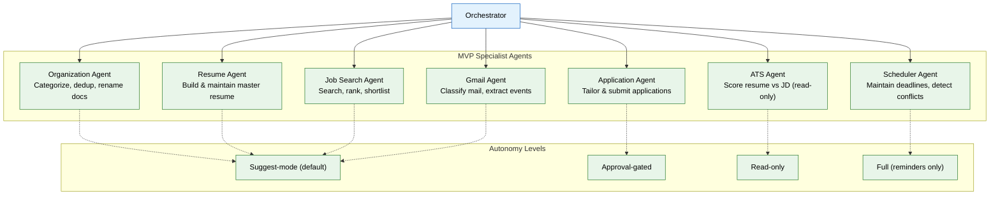

# 08 — Specialist Agents (MVP)

> **Purpose:** Implement seven user-facing specialist agents — the first point where the product becomes usable end to end.
> **Status:** ✅ Upgraded to enterprise quality
> **Owner:** Engineering Team
> **Last Updated:** 2026-07-13

## Overview

This phase builds the seven MVP specialist agents that collectively deliver the core Vaeloom value proposition. Each agent extends the base agent contract from Phase 05, runs inside the shared harness, and lives in its own file under `apps/ai-service/agents/`. The agents span the full product workflow: organizing files (Organization Agent), maintaining a master resume (Resume Agent), scoring against job descriptions (ATS Agent), searching for roles (Job Search Agent), submitting applications (Application Agent), classifying email (Gmail Agent), and managing deadlines (Scheduler Agent).

Each agent has a fixed mission, a declared tool list, explicit memory read/write permissions, a stated autonomy level (suggest-mode by default), and a required fallback that asks the user rather than guessing. Autonomy levels range from read-only (ATS Agent) through suggest-mode (most agents) to approval-gated (Application Agent) and full autonomy for safe operations (Scheduler Agent reminders). These defaults are hard-coded in MVP and configurable in enterprise.

The Organization, Resume, ATS, Job Search, and Application Agents form a logical chain: documents come in → get organized → get extracted into the resume → get scored against JDs → get applied to. The Gmail and Scheduler Agents run alongside this chain, keeping the user's calendar and deadlines synchronized.

## Goals

1. Implement the Organization Agent for document categorization, deduplication, and rename proposals
2. Build the Resume Agent that maintains a master resume with variant generation and gap-fill questioning
3. Create the ATS Agent for read-only resume-vs-JD scoring with keyword gap analysis
4. Implement the Job Search and Application Agents for search, ranking, and approval-gated submission
5. Build the Gmail Agent (scheduled + push-triggered) and Scheduler Agent for deadline management



## Context

Read `05-agent-harness-orchestration.md`, `06-rag-retrieval.md`, and `07-mcp-tool-ecosystem.md` first. This phase builds the seven user-facing agents on top of the harness — the first point where the product becomes usable end to end.

## Objective

Implement the seven MVP specialist agents, each as a class extending the base agent contract (file 05), each with its own file under `apps/ai-service/agents/`.

## Agents to build (one file each)

**`organization_agent/`** — Mission: name, categorize, deduplicate documents. Reads: `document` memory. Writes: proposed rename/folder (via `agent_actions`, status `proposed`), never auto-applies in MVP. Must detect version chains (e.g. `Resume_v2_final_FINAL.pdf` recognized as a version of `Resume.pdf`) using the dedup logic from file 03.

**`resume_agent/`** — Mission: build and maintain the master resume. Reads: `profile`, `career` memory via retrieval (file 06). Writes: `resumes` rows. When a referenced fact is missing (e.g. no GPA recorded anywhere it's expected), triggers a specific, narrow clarifying question to the user rather than guessing or leaving a blank. Must support generating at least: Master Resume, ATS Resume, one Role-specific variant.

**`ats_agent/`** — Mission: score a resume against a pasted job description. Reads: a `resumes` row + raw JD text (not stored as a document, ephemeral input). Writes: nothing to memory — output is a score + gap list returned directly to the caller. Read-only autonomy — never edits the resume itself, only proposes edits for the Resume Agent or user to apply.

**`job_search_agent/`** — Mission: search connected platforms, rank against memory, return a shortlist. Reads: `career`, `preference` memory. Must filter out roles the user has previously rejected (check `applications.status`). Output: a ranked shortlist with a stated fit reason per role — never an unexplained score.

**`application_agent/`** — Mission: tailor documents and submit or hand off an application. Reads: `resumes`, ATS Agent output. Writes: `applications` rows. **Approval-gated autonomy — never submits without an explicit per-application user approval in MVP.** Where no application API exists for a platform, generate the tailored documents and return a deep link instead of attempting to scrape/auto-fill the platform's form (see the companion MVP spec, §9, for why).

**`gmail_agent/`** — Mission: classify mail, extract deadlines/tasks. Reads: Gmail connector (file 07). Writes: `schedule_events`, `episodic` memory. Runs on a schedule (default 6 AM daily) plus a push-triggered path for high-priority classifications (interview, deadline-today) — implement both, not just the scheduled pass, since a same-day-urgent email missing the daily window is a known failure mode. Drafts only — never sends mail.

**`scheduler_agent/`** — Mission: maintain deadlines, detect conflicts. Reads: `schedule_events` from all sources (Gmail Agent, manual entry, Application Agent outcomes). Writes: conflict flags on `schedule_events`. Full autonomy for reminders (notify-only actions are safe to automate), suggest-only for adding/editing events.

## Out of scope

The remaining ~20 agents from the full enterprise roster (Learning, Research, Coding, Calendar, Internship, Document, PDF, Planning, Reminder, Analytics, Recommendation, Security, Plugin, Connector, Reflection, Self-Improvement, Quality Assurance — all `enterprise/08-specialist-agents.md`). Earned autonomy upgrades beyond the stated defaults (v1.5+, not MVP).

## Acceptance criteria

- [ ] Each agent has its own test suite exercising at least the happy path and one "asks rather than guesses" path.
- [ ] Organization Agent, run against a seeded messy folder of 10 mixed files, produces proposals a human reviewer approves at >90% without edits.
- [ ] Resume Agent correctly asks a specific clarifying question when a seeded profile is missing an expected field, rather than fabricating a value.
- [ ] Job Search Agent, run against seeded career memory including a prior rejection, excludes that previously-rejected role from a new shortlist.
- [ ] Application Agent never calls a submission tool without a preceding recorded approval action in the test harness.
- [ ] Gmail Agent's push-triggered path fires on a seeded "interview tomorrow" test email without waiting for the scheduled pass.

## Common Mistakes

| Mistake | Consequence |
|---------|-------------|
| Building all seven agents before the harness is stable | Every agent needs rework when the harness interface changes; build one fully after harness is green |
| Leaving stub `fallback()` implementations that guess instead of asking | Agents silently fabricate data when uncertain, undermining the entire memory system |
| Hard-coding autonomy levels inside agent classes | Changing an agent's autonomy requires a code deploy instead of a config change |

## Best Practices

| Practice | Why |
|----------|-----|
| Test each agent's "asks rather than guesses" path specifically | This is the most important safety property an agent has — it must be explicitly tested |
| Wire Approval Agent flows through the same Permission Engine | Ensures no "special" agent bypasses the standard authorization path |
| Run the Gmail Agent's push-triggered and scheduled paths as separate tests | The push path is easy to forget and hard to verify without a dedicated test |

## Security Considerations

| Concern | Mitigation |
|---------|------------|
| Gmail Agent drafting replies could expose confidential information | Draft-only policy enforced at the connector level, with output filtering for cross-conversation content |
| Application Agent storing cover letters with PII | Treat all generated documents as containing PII; apply same retention/export rules |
| Job Search Agent could send queries to unintended platforms | Scrub platform identifiers from queries; validate platform selection against approved list |

## Performance Considerations

| Concern | Approach |
|---------|----------|
| Seven agents all running against the same model provider could cause contention | Use the AI gateway (file 09) to queue agent requests with per-agent priority |
| Resume Agent generating multiple resume variants is compute-heavy | Generate variants asynchronously; cache results keyed by variant type + version |
| Gmail Agent's scheduled pass could coincide with high user traffic | Stagger scheduled agent runs across the hour; avoid top-of-the-hour alignment |

## Scope

### In Scope

- Seven MVP specialist agents: Organization, Resume, ATS (read-only), Job Search, Application (approval-gated), Gmail, Scheduler
- Each agent as a class extending the base agent contract with fixed mission, tool list, memory scopes, autonomy level, and fallback method
- Autonomy levels: suggest-mode (default), read-only (ATS Agent), approval-gated (Application Agent), full autonomy (Scheduler Agent reminders)
- Logical chain: Organization → Resume → ATS → Job Search → Application with Gmail and Scheduler running alongside
- Agent-specific test suites covering happy path and "asks rather than guesses" paths
- Gmail Agent with both scheduled (6 AM daily) and push-triggered classification paths

### Out of Scope

- Enterprise agent roster (~20 additional specialist agents: Learning, Research, Coding, Calendar, etc.)
- Earned autonomy upgrades based on approval-rate history (v1.5+)
- Multi-agent negotiation for complex cross-domain tasks (planned Q2 2027)
- Per-agent performance analytics dashboard (planned Q1 2027)
- Agent capability discovery and automatic tool assignment (planned Q2 2027)

---

## Examples

```python
# Organization Agent — categorizes and renames documents
class OrganizationAgent(BaseAgent):
    mission = "Organize, categorize, and deduplicate workspace documents"
    tools = [rename_file, move_file, categorize_document]
    memory_scopes = MemoryScopes(read_types=["document"], write_types=["agent_actions"])
    default_autonomy = "suggest"

    async def execute(self, request: AgentRequest) -> AgentResponse:
        documents = await self.retrieve(
            query="all workspace documents",
            strategy="keyword",
        )
        proposals = []
        for doc in documents:
            category = await self.classify_document(doc)
            new_name = await self.suggest_filename(doc)
            proposals.append(Proposal(
                document_id=doc.id,
                suggested_name=new_name,
                suggested_folder=category,
            ))
        return AgentResponse(
            action="propose",
            proposals=proposals,
            requires_approval=True,
        )
```

```python
# ATS Agent — read-only resume scoring
class ATSAgent(BaseAgent):
    mission = "Score resumes against job descriptions (read-only)"
    memory_scopes = MemoryScopes(read_types=["profile", "career"], write_types=[])
    default_autonomy = "read_only"

    async def score(self, resume: Resume, job_description: str) -> ATSResult:
        gaps = await self.identify_keyword_gaps(resume, job_description)
        score = self.calculate_match_score(resume, gaps)
        return ATSResult(
            score=score,
            matched_keywords=gaps["matched"],
            missing_keywords=gaps["missing"],
            recommendations=[],  # Read-only — proposes edits back to caller
        )
```

```python
# Application Agent — approval-gated submission flow
class ApplicationAgent(BaseAgent):
    default_autonomy = "approval_gated"

    async def submit_application(self, job: Job, resume: Resume) -> AgentResponse:
        # Never submits without explicit per-application approval
        tailored = await self.tailor_documents(resume, job)
        return AgentResponse(
            action="request_approval",
            payload={"job": job.id, "tailored_resume": tailored["resume"]},
            requires_approval=True,
        )
```

---

## Future Improvements

| Improvement | Priority | Complexity | Timeline |
|-------------|----------|------------|----------|
| Enterprise agent roster (~20 additional specialist agents) | Medium | High | Q2 2027 |
| Earned autonomy upgrades based on approval-rate history | High | Medium | Q2 2027 |
| Multi-agent negotiation for complex cross-domain tasks | Low | High | Q2 2027 |
| Per-agent performance analytics dashboard | Medium | Low | Q1 2027 |
| Agent capability discovery and automatic tool assignment | Low | High | Q2 2027 |

## Related Documents

- [05 — Agent Harness & Orchestration](05-agent-harness-orchestration.md) — Shared runtime all agents extend
- [06 — RAG Retrieval](06-rag-retrieval.md) — Context assembly consumed by every agent's Plan phase
- [07 — MCP Tool Ecosystem](07-mcp-tool-ecosystem.md) — Connector tools agents call during Act phase
- [09 — AI Gateway & Model Routing](09-ai-gateway-model-routing.md) — Model routing for agent requests
- [10 — Evaluation Framework](10-evaluation-framework.md) — Golden datasets for agent quality measurement
