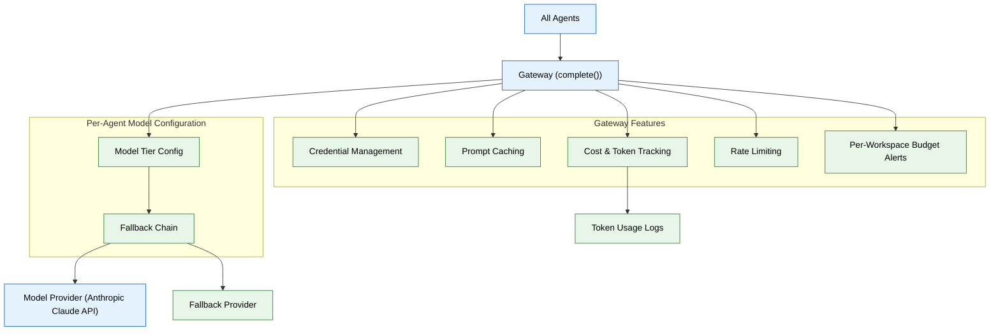

# 09 — AI Gateway & Model Routing (MVP)

> **Purpose:** Centralize every model call into a single gateway — governing auth, routing, rate limits, caching, and cost tracking in one place.
> **Status:** ✅ Upgraded to enterprise quality
> **Owner:** Engineering Team
> **Last Updated:** 2026-07-13

## Overview

The AI Gateway sits between every agent and the model provider, providing a single `complete()` function that all agents call instead of directly invoking provider SDKs. This centralization means that changing a model tier, switching providers, enabling prompt caching, or adjusting rate limits is a configuration change in `gateway/config.py` — not a refactor across every agent's code. The gateway is the only component that holds model provider credentials, resolved from the secrets manager at startup.

Key gateway features include per-agent model tier configuration (lighter models for classification-heavy agents, stronger models for reasoning-heavy agents), a fallback chain that retries against a secondary provider on failure, prompt caching for static system prompts, per-workspace rate limiting, token usage and cost logging correlated with traces, and soft per-workspace budget alerts. For MVP, all agents route to a single provider (Anthropic Claude API) with the fallback chain ready for a second provider to be added later.

The gateway's cost tracking publishes data into the same trace spans used by the observability layer (Phase 12), ensuring that agent-level cost analysis is correlated with request behavior rather than stored in a disconnected logging silo. Per-workspace budget alerts are soft (warning only) until enterprise billing and policy infrastructure is in place.

## Goals

1. Implement the `complete()` gateway function that every agent calls instead of direct provider SDK invocations
2. Build per-agent model tier configuration with declarative fallback chains
3. Centralize provider credential management so no agent or tool holds API keys
4. Implement prompt caching, per-workspace rate limiting, and cost tracking
5. Add soft per-workspace budget alerts with trace-correlated token usage logging



## Context

Read `05-agent-harness-orchestration.md` first. Every agent's "Act"/"Plan" phase eventually calls a model — this phase centralizes that call so it's governed in one place instead of scattered `fetch()` calls to a provider.

## Objective

Build a thin AI gateway sitting between every agent and the underlying model provider: one place for auth, routing, rate limits, caching, and logging — the point that makes "the model got smarter" or "we switched providers" a config change, not a refactor.

## Requirements

**Gateway module (`apps/ai-service/gateway/`):**

- Single function every agent calls instead of hitting a provider SDK directly: `complete(agent_name: str, messages: list, tools: list[Tool] | None, config: ModelConfig) -> ModelResponse`.
- Per-agent model configuration (`gateway/config.py`): which model an agent uses by default, is not hardcoded inside the agent — it's declared config, swappable without touching agent logic. For MVP, all agents route to a single provider (Anthropic Claude API) with per-agent model tier (e.g. a lighter/faster model for classification-heavy agents like Gmail Agent, a stronger model for reasoning-heavy agents like Job Search Agent).
- **Fallback chain:** if the configured model/provider call fails or times out, retry once against a configured fallback model before surfacing an error to the agent — implement this now even with only one provider, so adding a second provider later is additive.
- **Centralized credential management:** the gateway is the *only* place that holds the model provider's API key/credential, resolved through the secrets manager (file 15) at startup — no agent, tool, or connector ever holds a provider credential directly. This is what "Authentication" means at the gateway layer: not user auth (that's file 13's Permission Engine), but the gateway's own authenticated relationship with the model provider on behalf of every agent that calls through it.

**Prompt caching:** where the underlying provider supports prompt caching (shared system prompts, tool definitions), use it — agents' system prompts (file 05's agent contract) are static and highly cacheable, this is close to free latency/cost savings.

**Cost & token tracking:** every `complete()` call logs token usage (input/output) and estimated cost, tagged by `agent_name` and `workspace_id`, into a table/log the observability layer (file 12) surfaces per-agent cost dashboards from — this log is published as its own span in the same trace (file 12), not a separate, disconnected logging silo the gateway keeps to itself.

**Per-workspace cost budget (soft alert only):** each workspace has a configurable monthly cost budget; when usage crosses a threshold (e.g. 80%), an alert is surfaced to the workspace owner (and, internally, to the team) — MVP does not throttle or block on this, it only warns. Hard enforcement is an enterprise-tier concern (see `enterprise/09-ai-gateway-model-routing.md`) once tenant billing/policy exists to make throttling a coherent product decision rather than an arbitrary cutoff.

**Rate limiting:** per-workspace request rate limiting at the gateway level, so one workspace's heavy usage (e.g. a large batch re-ingestion) can't starve another workspace's interactive requests.

## Out of scope

Multi-provider routing beyond the fallback chain (OpenAI/Gemini/local models as full alternatives is enterprise phase), dynamic cost-based routing logic, semantic/model-response caching beyond prompt caching.

## Acceptance criteria

- [ ] Changing an agent's configured model tier requires editing `gateway/config.py` only — zero changes to any agent's own code.
- [ ] A forced failure of the primary model call in a test correctly triggers the fallback model and still returns a valid response.
- [ ] Every `complete()` call produces a token-usage log entry queryable by `agent_name` and `workspace_id`.
- [ ] A workspace deliberately sending a burst of requests is rate-limited without affecting a concurrent request from a different workspace.
- [ ] No provider API key/credential appears anywhere in agent, tool, or connector code — only in the gateway's resolved-at-startup configuration.
- [ ] A workspace crossing its configured cost-budget threshold in a test produces an alert without blocking or throttling any request.

## Common Mistakes

| Mistake | Consequence |
|---------|-------------|
| Hard-coding model provider API keys in agent code | Key rotation requires touching every agent; a single missed update causes outages |
| Not implementing fallback chain with only one provider | Adding a second provider later becomes a refactor, not just a config entry |
| Rate-limiting per-service instead of per-workspace | One workspace's batch operation can starve another workspace's real-time requests |

## Best Practices

| Practice | Why |
|----------|-----|
| Make model configuration declarative, not programmatic | Changing an agent's model tier should be a config update, not a code change |
| Log token usage and cost in the same trace as the request | Correlating cost with behavior is impossible if logs are in separate systems |
| Soft alerts on budget thresholds in MVP (don't hard-block) | Hard enforcement before billing/policy exists creates confusing product behavior |

## Security Considerations

| Concern | Mitigation |
|---------|------------|
| Gateway is the single holder of provider credentials | Store credentials in the secrets manager (file 15); resolve at startup, never at runtime |
| Rate-limiting could be bypassed by direct provider calls | Enforce that all model calls route through the gateway — no agent may call a provider directly |
| Prompt caching could leak cached responses across workspaces | Verify the provider's prompt cache is scoped to your API key; tag cache entries by workspace |

## Performance Considerations

| Concern | Approach |
|---------|----------|
| Prompt caching benefits are lost if system prompts change frequently | Keep agent system prompts static; version them explicitly when changes are needed |
| Fallback retries add latency to already-failing requests | Set aggressive timeouts on primary calls; trigger fallback within the agent loop's timeout budget |
| Per-request rate limiting adds a Redis call to every `complete()` | Use a local token bucket with periodic sync for per-workspace limits |

## Scope

### In Scope

- Single `complete()` gateway function called by every agent instead of direct provider SDK invocations
- Per-agent model tier configuration with declarative fallback chains
- Centralized credential management — gateway is the only component holding provider API keys
- Prompt caching for static system prompts
- Per-workspace rate limiting at the gateway level
- Cost & token tracking logged with trace correlation (trace_id, agent_name, workspace_id)
- Soft per-workspace budget alerts (warning only, no throttling)

### Out of Scope

- Multi-provider routing beyond fallback chain (OpenAI, Gemini, local models as full alternatives — enterprise)
- Dynamic cost-based routing (cheapest adequate model per request — planned Q2 2027)
- Semantic/model-response caching beyond prompt caching (planned Q1 2027)
- Hard budget enforcement with throttling (requires billing infrastructure — planned Q2 2027)
- Per-tenant model access policies and tiered service levels (planned Q2 2027)

---

## Examples

```python
# Gateway configuration — per-agent model tiers
MODEL_TIERS = {
    "gmail_agent": {
        "primary": "claude-sonnet-4",       # Fast, cheap — classification-heavy
        "fallback": "claude-haiku-3.5",
        "max_tokens": 2000,
        "timeout": 10,
    },
    "resume_agent": {
        "primary": "claude-opus-4",         # Strong model — reasoning-heavy
        "fallback": "claude-sonnet-4",
        "max_tokens": 8000,
        "timeout": 30,
    },
    "ats_agent": {
        "primary": "claude-sonnet-4",
        "fallback": None,                   # No fallback — fail fast
        "max_tokens": 4000,
        "timeout": 15,
    },
}
```

```python
# Gateway complete() function
async def complete(
    agent_name: str,
    messages: list[dict],
    tools: list[Tool] | None = None,
) -> ModelResponse:
    config = MODEL_TIERS[agent_name]

    # Rate limit check
    await rate_limiter.check(workspace_id=extract_workspace(messages))

    # Prompt caching for static system prompts
    cache_key = hash_system_prompt(messages)
    if cached := await prompt_cache.get(cache_key):
        return cached

    try:
        response = await anthropic_client.messages.create(
            model=config["primary"],
            messages=messages,
            max_tokens=config["max_tokens"],
        )
    except Exception:
        if config["fallback"]:
            response = await anthropic_client.messages.create(
                model=config["fallback"],
                messages=messages,
                max_tokens=config["max_tokens"],
            )
        else:
            raise GatewayError(f"Primary model failed, no fallback configured")

    # Cost tracking
    await track_cost(agent_name, response.usage, response.model)
    return response
```

```python
# Cost tracking with trace correlation
async def track_cost(agent_name: str, usage: Usage, model: str):
    cost = estimate_cost(usage.input_tokens, usage.output_tokens, model)
    await cost_logger.log(
        agent_name=agent_name,
        workspace_id=get_current_workspace(),
        trace_id=OpenTelemetry.get_current_trace_id(),
        input_tokens=usage.input_tokens,
        output_tokens=usage.output_tokens,
        cost=cost,
    )
```

---

## Future Improvements

| Improvement | Priority | Complexity | Timeline |
|-------------|----------|------------|----------|
| Multi-provider routing beyond fallback (OpenAI, Gemini, local models) | High | High | Q2 2027 |
| Dynamic cost-based routing (cheapest adequate model per request) | Medium | High | Q2 2027 |
| Semantic/model-response caching beyond prompt caching | Medium | Medium | Q1 2027 |
| Hard budget enforcement with throttling (requires billing infrastructure) | Low | Medium | Q2 2027 |
| Per-tenant model access policies and tiered service levels | Low | High | Q2 2027 |

## Related Documents

- [05 — Agent Harness & Orchestration](05-agent-harness-orchestration.md) — Agents that call through the gateway
- [08 — Specialist Agents](08-specialist-agents.md) — Per-agent model tier configuration consumers
- [12 — Observability & Tracing](12-observability-tracing.md) — Cost tracking into trace spans
- [15 — Security & Compliance](15-security-compliance.md) — Secrets manager for provider credentials
