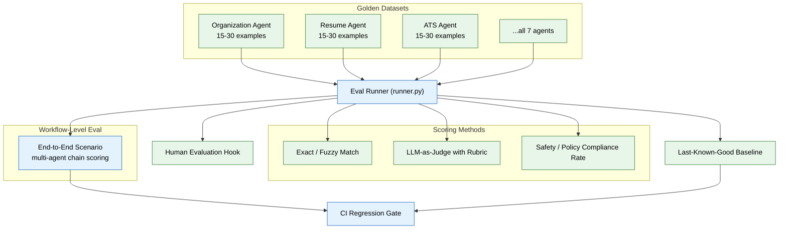

# 10 — Evaluation Framework (MVP)

> **Purpose:** Make agent quality measurable and regression-checkable in CI — before real users are affected by a quality drop.
> **Status:** ✅ Upgraded to enterprise quality
> **Owner:** Engineering Team
> **Last Updated:** 2026-07-13

## Overview

The Evaluation Framework transforms agent quality from subjective ("it looks good in a manual test") to quantitative and regression-checkable. It provides a golden dataset per agent (15–30 examples each across all seven MVP agents), an automated eval runner that scores outputs using exact/fuzzy match or LLM-as-judge with explicit rubrics, a CI regression gate that blocks merges on quality regressions beyond a threshold, and workflow-level (multi-agent) scenario scoring.

The eval runner tracks four dimensions per agent: accuracy/quality score, latency, cost (pulled from the AI gateway's token tracking), and safety/policy-compliance rate (pulled from guardrail flag data). All four dimensions appear in the same report, because an agent that's accurate but frequently trips guardrails is not production-ready. Workflow-level scenarios score full multi-agent chains (e.g., "resume uploaded → organized → extracted → resume updated → job search") to catch context hand-off failures that per-agent evals miss.

A human evaluation hook samples real agent outputs for manual labeling, seeding future golden-dataset growth and catching gaps the initial datasets didn't anticipate. Baseline scores are stored per dataset version, and CI fails explicitly if a regression exceeds the threshold without a conscious baseline update.

## Goals

1. Create golden datasets (15–30 examples each) for all seven MVP agents
2. Build an automated eval runner supporting exact/fuzzy match and LLM-as-judge scoring
3. Implement CI regression gating with stored baselines and versioned datasets
4. Build workflow-level (multi-agent chain) scenario scoring to catch hand-off failures
5. Provide a human evaluation sampling hook for ongoing dataset improvement



## Context

Read `08-specialist-agents.md` first. "It looks good in a manual test" is not a production metric — this phase makes agent quality measurable and regression-checkable in CI, before real users are affected by a quality drop.

## Objective

Build a lightweight eval harness: a golden dataset per agent, an automated scoring run, and a CI gate that blocks a merge if an agent's measured quality regresses.

## Requirements

**Golden datasets (`apps/ai-service/evals/datasets/`):** for each of the seven MVP agents (file 08), create a small (15–30 example) golden dataset of realistic inputs and expected/acceptable outputs — e.g. for Organization Agent: sample messy filenames + the correct proposed name/folder; for ATS Agent: a resume + JD pair + the expected score range and required flagged keywords.

**Eval runner (`apps/ai-service/evals/runner.py`):**

- Runs every agent against its golden dataset and scores each output. For agents with a clear correct answer (Organization Agent naming, ATS keyword detection), use exact/fuzzy match scoring. For agents with a range of acceptable outputs (Resume Agent phrasing, Job Search Agent ranking rationale), use LLM-as-judge scoring against a rubric — write the rubric explicitly in the dataset file, don't leave it to the judge model's own discretion.
- Tracks per-agent: accuracy/quality score, latency, cost (pulled from file 09's token tracking), **and safety/policy-compliance rate** — pulled from how often the guardrail middleware (file 11) flagged or blocked that agent's outputs during the eval run. "Looks good" isn't just correctness; an agent that's accurate but frequently trips guardrails is not production-ready either, and this should be visible in the same report, not buried in a separate guardrails log nobody checks.

**Workflow-level (multi-agent) scenarios:** in addition to per-agent golden datasets, build at least one end-to-end scenario that scores a full chain, not a single agent in isolation — e.g. "resume uploaded → Organization Agent files it → Memory Agent extracts entities → Resume Agent updates the master resume → Job Search Agent returns a shortlist" scored as one sequence with an expected final state, not just each step's individual output. A system can pass every per-agent eval and still fail at handing context correctly from one agent to the next — this is the check that catches that failure mode specifically.

**Regression gating:** store each agent's last-known-good score; CI fails the PR if a new run's score drops by more than a defined threshold (e.g. 5 percentage points) versus the stored baseline, unless the baseline is explicitly updated in the same PR (forcing a human to consciously accept a regression, not silently ship one).

**Human evaluation hook:** even in MVP, provide a simple CLI or script that samples N recent real agent outputs (from `agent_actions`) for a human to manually label pass/fail — this seeds future golden-dataset growth and catches gaps the initial dataset didn't anticipate.

## Out of scope

A full benchmark suite, formal human-eval rotation process, per-tenant eval segmentation (all enterprise phase). Online (live-traffic) evaluation beyond the human-sampling hook.

## Acceptance criteria

- [ ] Every one of the seven MVP agents has a golden dataset and passes its own eval run above a defined baseline.
- [ ] Deliberately degrading one agent's prompt (as a test) causes the eval run to catch the regression and fail CI.
- [ ] The human-eval sampling script successfully pulls real `agent_actions` entries and presents them for labeling.
- [ ] Eval run output includes latency and cost per agent, not just a quality score.
- [ ] Eval run output includes a safety/policy-compliance rate per agent, pulled from guardrail flag data, visible in the same report as accuracy/latency/cost.
- [ ] The end-to-end workflow scenario passes as one scored sequence, and a deliberately broken hand-off between two agents (e.g. Resume Agent not picking up a newly-extracted entity) causes the workflow-level eval to fail even if each individual agent's own golden-dataset eval still passes.

## Common Mistakes

| Mistake | Consequence |
|---------|-------------|
| Only building per-agent golden datasets without workflow-level evals | Each agent passes individually but the end-to-end chain fails on context hand-off |
| Using LLM-as-judge without an explicit rubric | The judge model applies its own criteria, making scores inconsistent across runs |
| Storing baselines without the dataset version | A dataset change invalidates the baseline, but no one notices until a false regression blocks CI |

## Best Practices

| Practice | Why |
|----------|-----|
| Include safety/policy-compliance rate in the same eval report | An agent that's accurate but frequently trips guardrails is not production-ready |
| Version golden datasets explicitly | CI must compare against the same dataset revision the baseline was computed from |
| Build the human evaluation hook from day one | The initial golden dataset will have blind spots — human labels surface them |

## Security Considerations

| Concern | Mitigation |
|---------|------------|
| Golden datasets may contain realistic PII-like data | Use synthetic data in all eval fixtures; never use real user data in golden datasets |
| Eval runner has access to agent outputs with user content | Restrict eval runner workspace access to test tenants only in CI |
| LLM-as-judge sends agent outputs to a model provider | Ensure eval judge prompts don't include PII; use the same data-delimiter approach as file 11 |

## Performance Considerations

| Concern | Approach |
|---------|----------|
| Running all seven agent evals sequentially is slow | Parallelize per-agent eval runs; aggregate results at the end |
| LLM-as-judge scoring is expensive (calls a model per output) | Batch judge calls; use a cheaper model for scoring than the agent itself uses |
| Workflow-level evals require full system state setup | Seed workspace state once per workflow eval, not per scenario |

## Scope

### In Scope

- Golden datasets (15–30 examples each) for all seven MVP specialist agents
- Automated eval runner supporting exact/fuzzy match and LLM-as-judge with explicit rubrics
- CI regression gate blocking merges when agent quality drops beyond threshold (5 percentage points)
- Workflow-level (multi-agent chain) scenario scoring for context hand-off validation
- Per-agent tracking: accuracy/quality score, latency, cost, and safety/policy-compliance rate in a single report
- Human evaluation sampling hook for ongoing dataset improvement
- Stored baselines per dataset version with explicit update requirement on regression

### Out of Scope

- Full benchmark suite with standardized industry metrics (planned Q2 2027)
- Formal human-eval rotation process with labeled data management (planned Q1 2027)
- Per-tenant eval segmentation for multi-tenant quality monitoring (planned Q2 2027)
- Online (live-traffic) evaluation alongside golden datasets (planned Q2 2027)
- Automated golden-dataset generation from human-eval labels (planned Q1 2027)

---

## Examples

```python
# Golden dataset structure (Organization Agent example)
GOLDEN_ORGANIZATION_AGENT = [
    {
        "input": {
            "files": [
                {"name": "Resume_v2_final_FINAL.pdf", "path": "/documents/"},
                {"name": "resume_draft.docx", "path": "/documents/"},
            ]
        },
        "expected": {
            "proposals": [
                {"file": "Resume_v2_final_FINAL.pdf", "suggested_name": "Resume.pdf"},
                {"file": "resume_draft.docx", "suggested_name": "Resume-Draft.docx"},
            ]
        },
    },
    # ... 14-29 more examples
]
```

```python
# Eval runner
class EvalRunner:
    async def run(self, agent_name: str) -> EvalResult:
        dataset = self.load_dataset(agent_name)
        scores = []
        for example in dataset:
            response = await agents[agent_name].execute(example["input"])
            score = self.score_output(response, example["expected"])
            scores.append(score)

        baseline = self.load_baseline(agent_name)
        avg_score = sum(scores) / len(scores)
        regression = baseline.score - avg_score

        return EvalResult(
            agent=agent_name,
            score=avg_score,
            baseline=baseline.score,
            regression=regression,
            passed=regression <= 0.05,  # within 5% of baseline
            cost=await self.get_eval_cost(agent_name),
            safety_rate=await self.get_safety_rate(agent_name),
        )
```

```python
# CI regression gate
def check_regression_gate(results: dict[str, EvalResult]) -> bool:
    for agent_name, result in results.items():
        if not result.passed:
            print(f"FAIL: {agent_name} regressed from {result.baseline:.2f} to {result.score:.2f}")
            return False
        print(f"PASS: {agent_name} at {result.score:.2f} (baseline: {result.baseline:.2f})")
    return True
```

---

## Future Improvements

| Improvement | Priority | Complexity | Timeline |
|-------------|----------|------------|----------|
| Online (live-traffic) evaluation alongside golden datasets | Medium | High | Q2 2027 |
| Full benchmark suite with standardized industry metrics | Low | Medium | Q2 2027 |
| Formal human-eval rotation process with labeled data management | Medium | Medium | Q1 2027 |
| Per-tenant eval segmentation for multi-tenant quality monitoring | Low | High | Q2 2027 |
| Automated golden-dataset generation from human-eval labels | High | Medium | Q1 2027 |

## Related Documents

- [08 — Specialist Agents](08-specialist-agents.md) — Agents being evaluated by this framework
- [09 — AI Gateway & Model Routing](09-ai-gateway-model-routing.md) — Cost tracking data source
- [11 — Guardrails & Safety](11-guardrails-safety.md) — Safety/policy-compliance rate data source
- [16 — Deployment Infrastructure](16-deployment-infrastructure.md) — CI gate integration for deployment pipeline
