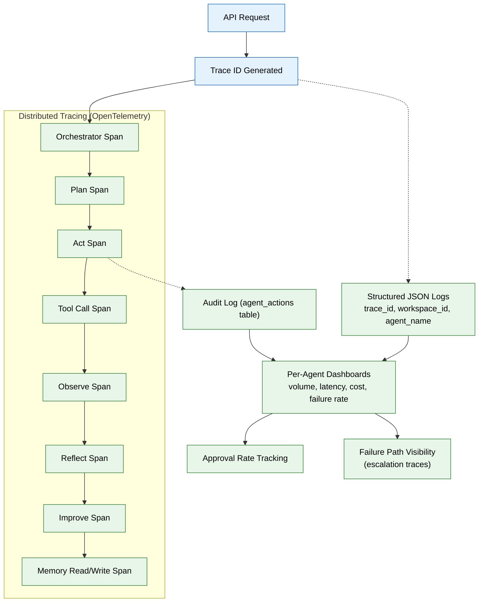

# 12 — Observability & Tracing (MVP)

> **Purpose:** Instrument the full request path — API → Orchestrator → agent loop → tool calls → memory — so any single request can be reconstructed end to end.
> **Status:** ✅ Upgraded to enterprise quality
> **Owner:** Engineering Team
> **Last Updated:** 2026-07-13

## Overview

Traditional applications fail in predictable ways; agents can drift, loop, or quietly do the wrong thing while appearing to succeed. This phase makes the entire request path — not just errors — inspectable through distributed tracing, structured logging, and a queryable audit log. OpenTelemetry is adopted across both services (`apps/api` and `apps/ai-service`) so that a single trace ID propagates from the API entry point through every agent loop phase, tool call, and memory read/write.

Every log line is structured JSON carrying `trace_id`, `workspace_id`, `agent_name`, and `timestamp`. The `agent_actions` table (from Phase 02) serves as the audit log with sufficient detail (`input_ref`, `output_ref`) to reconstruct what an agent did without re-executing it. Per-agent dashboards aggregate call volume, latency percentiles, token cost, and failure rate — plus approval rate, so a declining approval trend is as visible as a rising error rate.

Special attention is paid to failure path visibility: when the Reflect→re-Plan loop hits its retry cap and escalates, that escalation is distinctly traceable. The feedback signal tracking surfaces every approval, rejection, and correction as a first-class observability data stream, not a status field buried in individual audit rows.

## Goals

1. Implement OpenTelemetry distributed tracing across both services with single trace ID propagation
2. Enforce structured JSON logging (trace_id, workspace_id, agent_name, level, message, timestamp) everywhere
3. Wire the `agent_actions` table as the audit log with full reconstructability
4. Build per-agent dashboards covering volume, latency, cost, failure rate, and approval rate
5. Implement distinct failure path tracing for escalations and first-class feedback signal tracking



## Context
Read `05-agent-harness-orchestration.md` first. Traditional apps mostly just fail; agents can drift, loop, or quietly do the wrong thing while "succeeding." This phase makes the whole request path — not just errors — inspectable.

## Objective
Instrument the full chain (API request → Orchestrator → agent loop phases → tool calls → memory reads/writes) with distributed tracing, structured logs, and a queryable audit log, so any single request can be reconstructed end to end.

## Requirements

**Tracing (`apps/api` and `apps/ai-service`):** adopt OpenTelemetry across both services. A single incoming API request generates one trace ID that propagates through the Orchestrator, every loop phase (file 05: Plan/Act/Observe/Reflect/Improve), every tool call (file 07), and every memory read/write (file 04) — each as a child span. Export traces to a local Jaeger/Zipkin instance in dev (via docker-compose) and note the production target (e.g. a hosted APM) as a config point for file 16.

**Structured logging:** every log line is JSON with, at minimum: `trace_id`, `workspace_id`, `agent_name` (if applicable), `level`, `message`, `timestamp`. No unstructured `print()`/bare string logs anywhere in `apps/ai-service` or `apps/api`.

**Audit log wiring:** every agent action that reaches the "Act" phase writes a row to `agent_actions` (file 02) — this table IS the audit log surfaced later on the History screen (file 14), not a separate system. Include enough detail (`input_ref`, `output_ref` pointing to stored payloads) to reconstruct what happened without re-running the agent.

**Per-agent dashboards (basic MVP version):** a simple internal endpoint/script aggregating, per agent: call volume, latency percentiles, token cost (from file 09), and failure rate over a time window — doesn't need a polished UI yet, just needs to exist and be queryable.

**Failure path visibility:** when the bounded Reflect→re-Plan loop (file 05) hits its retry cap and escalates, that escalation must be traced distinctly from a normal completion — a reviewer should be able to filter traces specifically for "agent gave up and asked the user."

**Feedback signal tracking:** every approval, rejection, and correction a user makes on an agent's proposed action (file 08's suggest-mode flows) is surfaced as its own continuous, queryable stream — not just a status field buried inside individual `agent_actions` rows. Add a per-agent "approval rate" view to the same dashboards as call volume/latency/cost, so a declining approval rate for a given agent is visible the same way a rising failure rate would be. This is the signal the eval framework's human-eval hook (file 10) and, later, the Self-Improvement Agent (enterprise) actually consume — it needs to be a first-class observability concern, not an implicit byproduct of the audit log.

## Out of scope
A polished observability UI (a hosted APM's own UI is sufficient for MVP), anomaly detection / drift alerting (enterprise — Security Agent territory), long-retention compliance-grade audit storage (enterprise phase).

## Acceptance criteria
- [ ] A single test request can be traced from the API entry point through every agent loop phase to the final response, with no gaps in the span chain.
- [ ] Every `agent_actions` row has enough stored detail to answer "what exactly did this agent do and why" without re-running it.
- [ ] The per-agent dashboard query correctly surfaces a deliberately-injected slow/expensive test call as an outlier.
- [ ] A forced max-retries escalation produces a trace that's distinctly filterable from normal successful traces.
- [ ] A deliberately seeded run of rejected proposals for one agent produces a visibly declining approval-rate trend on that agent's dashboard, queryable independently of the raw audit log.

## Common Mistakes

| Mistake | Consequence |
|---------|-------------|
| Tracing only successful paths, not errors | The most important debugging scenarios (failures, escalations) have the least instrumentation |
| Using unstructured logs with no trace_id | Correlating a log line to a specific request requires manual timestamp matching across services |
| Keeping audit log and observability traces in separate systems | Reconstructing "what happened" requires cross-referencing two sources of truth |

## Best Practices

| Practice | Why |
|----------|-----|
| Propagate one trace ID from the API entry through every downstream call | A single trace ID ties together all spans, logs, and database rows for one request |
| Make every agent loop phase a distinct OpenTelemetry span | Enables filtering traces by phase — e.g. "show me all requests that failed during Act" |
| Surface approval rate on the same dashboard as latency and cost | A declining approval rate is an early warning for quality issues that latency doesn't capture |

## Security Considerations

| Concern | Mitigation |
|---------|------------|
| Trace spans and logs may contain sensitive user content | Apply PII-filtering to span attributes and log payloads; never log full document content |
| audit log data must survive workspace deletion | Implement the documented minimal audit retention (file 15) with anonymized records |
| Approval rate dashboards could reveal user behavior patterns | Aggregate approval rate data at the team level, not per-user detail, in observability tools |

## Performance Considerations

| Concern | Approach |
|---------|----------|
| Every loop phase publishes an event → tracing overhead grows with loop iterations | Sample trace data for high-volume agents; full traces only for errors and escalations |
| Writing `agent_actions` rows on every Act phase adds database load | Batch audit log writes; flush on completion of the Improve phase |
| OpenTelemetry export to Jaeger adds network overhead | Use gRPC exporter with batching; configure max export batch size |

## Scope

### In Scope
- OpenTelemetry distributed tracing across apps/api and apps/ai-service with single trace ID propagation from API entry through every agent loop phase, tool call, and memory read/write
- Structured JSON logging with trace_id, workspace_id, agent_name, level, message, timestamp — no unstructured print() calls
- agent_actions table wiring as audit log with input_ref/output_ref for full reconstructability
- Per-agent dashboards: call volume, latency percentiles, token cost, failure rate, and approval rate
- Distinct failure path tracing when bounded Reflect→re-Plan loop escalates to user
- First-class feedback signal tracking (approvals, rejections, corrections) as queryable stream

### Out of Scope
- Anomaly detection and drift alerting for agent behavior (planned Q2 2027)
- Polished observability UI beyond hosted APM defaults (planned Q2 2027)
- Long-retention compliance-grade audit storage (planned Q2 2027)
- Real-time trace streaming with WebSocket push (planned Q1 2027)
- Automated regression detection from approval-rate trends (planned Q2 2027)

---

## Examples

```python
# OpenTelemetry span instrumentation in the agent loop
from opentelemetry import trace

tracer = trace.get_tracer("agent-harness")

async def run_agent_loop(request: AgentRequest) -> AgentResponse:
    with tracer.start_as_current_span("agent.loop") as loop_span:
        loop_span.set_attribute("agent.name", request.agent.name)
        loop_span.set_attribute("workspace_id", request.workspace_id)

        with tracer.start_as_current_span("plan") as plan_span:
            plan = await plan_phase(request)
            plan_span.set_attribute("plan.action", plan.action)

        with tracer.start_as_current_span("act") as act_span:
            result = await act_phase(plan)
            act_span.set_attribute("tool.name", result.tool_name)
            act_span.set_attribute("tool.success", result.success)

        with tracer.start_as_current_span("reflect") as reflect_span:
            satisfied = await reflect_phase(request, result)
            reflect_span.set_attribute("loop.satisfied", satisfied)
            if not satisfied:
                reflect_span.set_attribute("loop.iteration", request.iteration)
```

```jsonc
// Structured JSON log format
{
  "timestamp": "2026-07-14T10:30:00.000Z",
  "level": "info",
  "trace_id": "abc123def456",
  "workspace_id": "ws_789",
  "agent_name": "organization_agent",
  "message": "Document classified successfully",
  "metadata": {
    "document_id": "doc_001",
    "category": "resume",
    "confidence": 0.92
  }
}
```

```sql
-- Audit log query — reconstruct what an agent did
SELECT
    agent_name,
    action_type,
    input_ref,
    output_ref,
    status,
    created_at
FROM agent_actions
WHERE workspace_id = 'ws_789'
  AND agent_name = 'organization_agent'
  AND created_at >= NOW() - INTERVAL '7 days'
ORDER BY created_at DESC;
```

---

## Future Improvements

| Improvement | Priority | Complexity | Timeline |
|-------------|----------|------------|----------|
| Anomaly detection and drift alerting for agent behavior | High | High | Q2 2027 |
| Polished observability UI (beyond hosted APM defaults) | Low | Medium | Q2 2027 |
| Long-retention compliance-grade audit storage | Medium | High | Q2 2027 |
| Real-time trace streaming with WebSocket push | Low | Medium | Q1 2027 |
| Automated regression detection from approval-rate trends | Medium | High | Q2 2027 |

## Related Documents

- [05 — Agent Harness & Orchestration](05-agent-harness-orchestration.md) — Loop phases that generate trace spans
- [09 — AI Gateway & Model Routing](09-ai-gateway-model-routing.md) — Cost tracking into trace spans
- [14 — Frontend Workspace](14-frontend-workspace.md) — History screen consuming audit log
