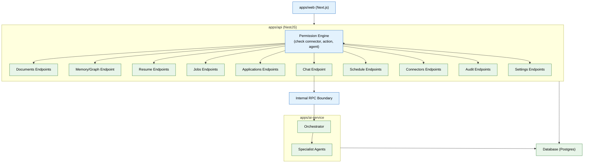

# 13 — API & Backend Services (MVP)

> **Purpose:** Build the resource-oriented REST API in NestJS with the Permission Engine enforced on every call — the only door into the system.
> **Status:** ✅ Upgraded to enterprise quality
> **Owner:** Engineering Team
> **Last Updated:** 2026-07-13

## Overview

The API Backend is the sole entry point for all Meridian functionality. Built in NestJS, it exposes resource-oriented REST endpoints under `/workspaces/{id}/...` covering documents, memory/graph, resume, jobs, applications, chat, schedule, connectors, audit, and settings. Every single endpoint passes through the Permission Engine — a middleware that checks requests against the `permissions` table along three axes: connector, action type (read/write/act), and requesting agent. No endpoint, including internal service-to-service calls from `apps/ai-service`, bypasses this check.

The frontend (`apps/web`, Phase 14) communicates exclusively with `apps/api`. When agent/memory operations are needed (chat, resume generation, job search), `apps/api` calls `apps/ai-service` over an internal RPC boundary — `apps/web` never directly calls `apps/ai-service`, preserving the Permission Engine as a singular enforcement point. An OpenAPI spec is generated from NestJS decorators, serving as the contract between frontend and backend.

The Permission Engine is designed to be stateless (no local cache) so it always reflects the current state of the `permissions` table. Internal RPC calls between services are authenticated with a shared service secret, and the OpenAPI endpoint is restricted to admin access in production.

## Goals

1. Implement all MVP REST endpoints under `/workspaces/{id}/...` for documents, memory, resume, jobs, applications, chat, schedule, connectors, audit, and settings
2. Build the Permission Engine as a non-bypassable middleware checking connector, action type, and agent
3. Enforce the internal RPC boundary so `apps/web` never calls `apps/ai-service` directly
4. Generate an accurate OpenAPI spec from NestJS decorators as the frontend contract
5. Implement stateless permission checking and authenticated internal service-to-service communication



## Context
Read `02-database-schema.md` and `08-specialist-agents.md` first. This phase is the resource-oriented API surface `apps/web` (file 14) consumes — it's the only door into the system; nothing bypasses it.

## Objective
Build the core REST API in `apps/api` (NestJS): resource endpoints for every MVP feature, with the Permission Engine enforced on every single call.

## Requirements

**Permission Engine (`apps/api/permissions/`):** a single middleware/guard every endpoint passes through, checking the request against `permissions` (file 02) along three axes — connector, action type (read/write/act), and requesting agent (if the call originates from an internal agent action rather than direct user action). No endpoint, including internal service-to-service calls from `apps/ai-service`, bypasses this.

**Endpoints (resource-oriented, `/workspaces/{id}/...`):**
- `documents` — list, get, upload (enqueues file 03's pipeline), approve/reject Organization Agent proposals.
- `memory/graph` — read-only graph query endpoint for the Memory Graph screen.
- `resume` — get master resume, generate variant, answer a gap-fill question.
- `jobs` — get shortlist, approve/reject a match.
- `applications` — list, get detail, update outcome.
- `chat` — post a message, routed through the Orchestrator (file 05).
- `schedule` — list events, add/edit manually.
- `connectors` — list, initiate OAuth connect, revoke.
- `audit` — query `agent_actions` with filters (agent, date range, type).
- `settings` — get/update per-agent autonomy level, trigger export/delete (file 15).

**Internal RPC boundary:** `apps/api` calls `apps/ai-service` for anything agent/memory-related (chat, resume generation, job search) over an internal HTTP/RPC interface — `apps/web` never calls `apps/ai-service` directly. This keeps the Permission Engine's enforcement point singular.

**API documentation:** generate an OpenAPI spec from the NestJS decorators — this is what file 14's frontend team (or agent) builds against, and later becomes the seed for the public API (enterprise phase).

## Out of scope
Public API/SDK for external developers, webhook architecture, API versioning strategy, rate-limit tiers beyond the basic per-workspace limiting already in file 09 (all enterprise phase).

## Acceptance criteria
- [ ] Every endpoint has an automated test asserting it rejects a request lacking the required permission scope.
- [ ] The generated OpenAPI spec accurately reflects every implemented endpoint (verified by a contract test, not just manual inspection).
- [ ] A chat request round-trips correctly through `apps/api` → `apps/ai-service` → Orchestrator → back, with the trace (file 12) showing the full path.
- [ ] Revoking a connector immediately blocks any endpoint that depends on it, without requiring a service restart.

## Common Mistakes

| Mistake | Consequence |
|---------|------------|
| Bypassing the Permission Engine for internal service-to-service calls | Internal routes become an unguarded backdoor into the system |
| Not generating an OpenAPI spec from NestJS decorators | Frontend and API get out of sync; manual docs drift from reality |
| Allowing `apps/web` to call `apps/ai-service` directly | The Permission Engine's singular enforcement point is completely bypassed |

## Best Practices

| Practice | Why |
|----------|-----|
| Every endpoint must pass through the Permission Engine | No endpoint, including health and status, should be exempt from at least a basic auth check |
| Generate and test the OpenAPI spec in CI | Contract tests catch mismatches between documented and actual endpoints automatically |
| Keep the internal RPC interface thin and stable | A chatty RPC boundary creates coupling — batch related calls into single RPC requests |

## Security Considerations

| Concern | Mitigation |
|---------|------------|
| The Permission Engine is a single point of failure for auth | Make it stateless (no local cache of permissions) so it's always current with the database |
| Internal RPC from api to ai-service could be spoofed | Authenticate internal RPC calls with a shared service secret, not just network-level access |
| OpenAPI spec exposes the full endpoint surface | Restrict OpenAPI endpoint to admin access in production; never expose to unauthenticated users |

## Performance Considerations

| Concern | Approach |
|---------|----------|
| Permission Engine check on every endpoint adds per-request latency | Cache permission evaluations in Redis (short TTL — 30s); invalidate on permission change |
| Aggregated query endpoints (dashboard) can be slow without dedicated indexes | Create materialized views or dedicated summary endpoints for dashboard queries |
| Chat endpoint blocks the request thread while the agent loop runs | Use async request handling; return a request ID immediately and let the frontend poll for completion |

## Scope

### In Scope
- Resource-oriented REST endpoints under /workspaces/{id}/... for documents, memory/graph, resume, jobs, applications, chat, schedule, connectors, audit, and settings
- Permission Engine middleware checking every request against permissions table along three axes: connector, action type (read/write/act), and requesting agent
- Internal RPC boundary enforcing apps/web → apps/api → apps/ai-service call chain — no direct web → ai-service calls
- OpenAPI spec generation from NestJS decorators as frontend-backend contract
- Stateless permission checking (no local cache, always reads current DB state)
- Authenticated internal service-to-service communication with shared service secret

### Out of Scope
- Public API/SDK for external developers (planned Q2 2027)
- Webhook architecture for event-driven integrations (planned Q2 2027)
- API versioning strategy and deprecation lifecycle (planned Q1 2027)
- Rate-limit tiers beyond basic per-workspace limiting (planned Q2 2027)
- GraphQL endpoint alongside REST (planned Q2 2027)

---

## Examples

```typescript
// NestJS Permission Engine guard
@Injectable()
export class PermissionGuard implements CanActivate {
    constructor(private permissions: PermissionsService) {}

    async canActivate(context: ExecutionContext): Promise<boolean> {
        const request = context.switchToHttp().getRequest();
        const { workspaceId } = request.params;
        const { user, agent } = request;

        return this.permissions.check({
            workspaceId,
            userId: user?.id,
            agentName: agent?.name,
            actionType: this.resolveActionType(request),
            resource: this.resolveResource(request),
        });
    }

    private resolveActionType(request: Request): ActionType {
        switch (request.method) {
            case 'GET': return 'read';
            case 'POST': return 'write';
            case 'PUT': return 'write';
            case 'DELETE': return 'act';
        }
    }
}
```

```typescript
// Resource-oriented endpoints example
@Controller('workspaces/:workspaceId/documents')
export class DocumentsController {
    constructor(private docs: DocumentsService) {}

    @Get()
    @UseGuards(PermissionGuard)
    async list(@Param('workspaceId') workspaceId: string): Promise<Document[]> {
        return this.docs.findAll(workspaceId);
    }

    @Post()
    @UseGuards(PermissionGuard)
    async upload(
        @Param('workspaceId') workspaceId: string,
        @UploadedFile() file: Express.Multer.File,
    ): Promise<{ jobId: string }> {
        return this.docs.enqueueUpload(workspaceId, file);
    }
}
```

```typescript
// OpenAPI spec generation
// Generated automatically from NestJS decorators
// npx nest start --entry-file openapi.ts produces openapi.json
import { DocumentBuilder, SwaggerModule } from '@nestjs/swagger';

const config = new DocumentBuilder()
    .setTitle('Meridian API')
    .setVersion('1.0.0')
    .addBearerAuth()
    .build();

const document = SwaggerModule.createDocument(app, config);
SwaggerModule.setup('api/docs', app, document);
```

---

## Future Improvements

| Improvement | Priority | Complexity | Timeline |
|-------------|----------|------------|----------|
| Public API/SDK for external developers | Low | High | Q2 2027 |
| Webhook architecture for event-driven integrations | Medium | High | Q2 2027 |
| API versioning strategy and deprecation lifecycle | Medium | Medium | Q1 2027 |
| Rate-limit tiers beyond basic per-workspace limiting | Low | Medium | Q2 2027 |
| GraphQL endpoint alongside REST for frontend flexibility | Low | High | Q2 2027 |

## Related Documents

- [02 — Database Schema](02-database-schema.md) — Tables the API reads from and writes to
- [08 — Specialist Agents](08-specialist-agents.md) — Agents the API routes to via internal RPC
- [12 — Observability & Tracing](12-observability-tracing.md) — Tracing from API entry through completion
- [14 — Frontend Workspace](14-frontend-workspace.md) — Frontend consuming these endpoints
