# 14 — Frontend & Workspace UI (MVP)

> **Purpose:** Build the Next.js frontend covering all MVP screens — the phase where the product becomes something a real user can actually use.
> **Status:** ✅ Upgraded to enterprise quality
> **Owner:** Engineering Team
> **Last Updated:** 2026-07-13

## Overview

The Frontend Workspace is the user-facing face of Vaeloom, built in Next.js with the App Router. It replaces the placeholder dashboard from Phase 01 with 11 fully realized screens: Dashboard, Workspace (file browser), Memory Graph, Resume editor, Jobs shortlist, Applications kanban board, Chat thread, Schedule, Connectors management, History audit log, and Settings. Every screen consumes the API from Phase 13 — no screen talks directly to a database or agent.

The design system follows the established Vaeloom visual identity: dark theme by default, deep ink backgrounds, periwinkle-blue accents, coral highlights, Space Grotesk for display type, and IBM Plex Mono for labels. Every screen has explicit empty states (e.g., a fresh workspace with zero files) and error states (API unreachable, permission denied). Approval flows — where users accept or reject agent proposals — are designed as first-class, low-friction interactions, since this is the primary interaction loop for most of the product.

Keyboard navigation works across all screens, and the full MVP user journey (sign up → connect source → upload resume → see organization → approve job match → track application) flows end to end against the real API with no mocked data.

## Goals

1. Build 11 MVP screens including Dashboard, Workspace, Memory Graph, Resume, Jobs, Applications, Chat, Schedule, Connectors, History, and Settings
2. Implement the dark-theme Vaeloom design system consistently across all screens
3. Create explicit empty states, error states, and approval flows for every screen
4. Ensure the full MVP user journey works end-to-end against the real API with no mocked data
5. Provide basic keyboard navigation across all screens

```mermaid
graph TD
    classDef primary fill:#e3f2fd,stroke:#1565c0,color:#000
    classDef secondary fill:#e8f5e9,stroke:#2e7d32,color:#000

    API["apps/api (NestJS)"]:::primary

    subgraph Screens["Frontend Screens (Next.js, App Router)"]
        DASH["Dashboard<br/>Summary, activity, suggestions"]:::secondary
        WS["Workspace<br/>File browser, viewer, proposals"]:::secondary
        MG["Memory Graph<br/>Navigable knowledge graph nodes"]:::secondary
        RES["Resume<br/>Editor, variants, gap-fill prompts"]:::secondary
        JOBS["Jobs<br/>Shortlist cards, approve/reject"]:::secondary
        APPS["Applications<br/>Kanban status board"]:::secondary
        CHAT["Chat<br/>Thread with source citations"]:::secondary
        SCHED["Schedule<br/>Calendar + list view"]:::secondary
        CONN["Connectors<br/>Connection cards"]:::secondary
        HIST["History<br/>Agent actions audit log"]:::secondary
        SETT["Settings<br/>Autonomy, export, delete"]:::secondary
    end

    subgraph UX["UX Requirements"]
        EMPTY["Empty States"]:::secondary
        ERROR["Error States"]:::secondary
        APPROVAL["Approval Flows"]:::secondary
        KEYNAV["Keyboard Navigation"]:::secondary
    end

    API --> DASH
    API --> WS
    API --> MG
    API --> RES
    API --> JOBS
    API --> APPS
    API --> CHAT
    API --> SCHED
    API --> CONN
    API --> HIST
    API --> SETT
    DASH -.-> EMPTY
    WS -.-> APPROVAL
    JOBS -.-> APPROVAL
    APPS -.-> APPROVAL
    CHAT -.-> KEYNAV
```



## Context

Read `13-api-backend.md` first — every screen here consumes that API, nothing talks to a database or agent directly from the frontend. This phase is where the product becomes something a real user can actually use.

## Objective

Build the Next.js frontend covering every MVP screen, replacing the placeholder Dashboard from file 01.

## Requirements

**Design system:** dark theme by default (reuse the established Vaeloom visual identity if design files are available in the repo/docs: deep ink background, periwinkle-blue accent, coral highlight, Space Grotesk for display type, IBM Plex Mono for labels/data) — consistent branding across every screen, not a generic admin-dashboard template look. Reference the design tokens in `Vaeloom-Documentation-Site.html` / `Vaeloom-How-It-Works-Visual.html` if present in the project for exact values.

**Screens to build:**

- **Dashboard** — aggregated summary (memory growth, active applications, upcoming deadlines, recent activity, suggestions) — read-only composition of other screens' data, no unique logic of its own.
- **Workspace** — file/folder browser, in-app viewer (PDF, image, text minimum for MVP), Organization Agent proposal approval cards.
- **Memory Graph** — a navigable (not just illustrative) view of the knowledge graph; clicking a node shows its connections and source documents.
- **Resume** — rich text/structured editor for the master resume, variant picker, gap-fill question prompts inline.
- **Jobs** — ranked shortlist cards with fit reasons, approve/reject actions.
- **Applications** — status board (kanban-style: shortlisted → tailoring → submitted → interviewing → offer/rejected).
- **Chat** — message thread with the Orchestrator, showing which agent responded and citing sources (file 06's provenance).
- **Schedule** — calendar + list view, conflict flags visible.
- **Connectors** — connection cards with status, connect/revoke actions.
- **History** — filterable `agent_actions` log (audit trail from file 12).
- **Settings** — per-agent autonomy level controls, data export/delete buttons (file 15).

**Empty and error states:** every screen needs an explicit empty state (e.g. Workspace with zero files yet) and error state (API unreachable, permission denied) — not a blank white screen or an unhandled exception.

**Approval flows:** anywhere an agent proposes a suggest-mode action (Organization Agent renames, Job Search Agent shortlist, Application Agent submission), the UI must make approve/reject a first-class, low-friction action — this is the primary interaction loop for most of the product, it should never feel buried.

## Out of scope

Admin console, Analytics screen, Developer Mode/Plugin management UI, full accessibility audit pass (a basic keyboard-navigable pass is expected, a formal audit is enterprise phase), mobile app (a companion, not full parity).

## Acceptance criteria

- [ ] A full click-through of the MVP user journey (sign up → connect a source → upload a resume → see it organized → see the master resume update → search for and approve a job match → see it on the Applications board) works against the real API with no mocked data.
- [ ] Every screen has a tested empty state and error state.
- [ ] Approval/rejection of any proposed agent action updates both the UI and the underlying `agent_actions` record correctly.
- [ ] Basic keyboard navigation works across all screens (tab order, focus states, no mouse-only interactions).

## Common Mistakes

| Mistake | Consequence |
|---------|-------------|
| Building screens against mocked data instead of the real API | Integration fails at the last mile when real API shapes differ from mocks |
| Forgetting empty and error states for every screen | Users see blank white screens or unhandled exceptions on first use or network issues |
| Burying the approve/reject action in submenus | The primary interaction loop becomes frustrating, reducing user engagement with agent suggestions |

## Best Practices

| Practice | Why |
|----------|-----|
| Build against the real API from day one (not mocked data) | Catches API contract mismatches early, not during the integration phase |
| Implement approval flows as first-class UI components | Approve/reject is the most frequent user action — it should be a single click, not a multi-step form |
| Test every screen's empty state by loading with a fresh workspace | The first-run experience must feel intentional, not broken |

## Security Considerations

| Concern | Mitigation |
|---------|------------|
| Frontend API calls could expose auth tokens in client-side logs | Never log full API responses; sanitize error payloads before displaying them |
| Memory Graph screen renders sensitive knowledge | Enforce workspace-scoped access at the API level (file 13); the frontend trusts the API's response |
| Approval flows could be abused with rapid clicking | Debounce approve/reject actions; verify idempotency on the backend |

## Performance Considerations

| Concern | Approach |
|---------|----------|
| Memory Graph rendering with many nodes is slow | Use WebGL-based graph rendering (e.g., d3-force with canvas) for MVP; paginate connections |
| Dashboard aggregates data from multiple endpoints | Build a dedicated dashboard endpoint to avoid N+1 frontend requests |
| Chat history grows quickly in the UI | Virtualize the chat list; load earlier messages on scroll, not on initial render |

## Scope

### In Scope

- 11 MVP screens built with Next.js App Router: Dashboard, Workspace, Memory Graph, Resume, Jobs, Applications, Chat, Schedule, Connectors, History, Settings
- Dark-theme Vaeloom design system across all screens (deep ink background, periwinkle-blue accent, coral highlight, Space Grotesk + IBM Plex Mono)
- Empty states and error states for every screen
- First-class approval flows (approve/reject) for agent proposals as low-friction interactions
- Keyboard navigation across all screens (tab order, focus states, no mouse-only interactions)
- End-to-end MVP user journey working against the real API with no mocked data

### Out of Scope

- Admin console and Analytics screen (planned Q1 2027)
- Developer Mode and Plugin management UI (planned Q2 2027)
- Full accessibility audit pass for WCAG 2.1 AA compliance (planned Q2 2027)
- Mobile companion app (React Native, planned Q2 2027)
- Server-side rendering optimizations and ISR for public pages (planned Q1 2027)

---

## Examples

```typescript
// Workspace page — file browser with Organization Agent proposals
export default async function WorkspacePage({
    params: { workspaceId },
}: { params: { workspaceId: string } }) {
    const documents = await api.getDocuments(workspaceId);
    const proposals = await api.getProposals(workspaceId);

    return (
        <div className="workspace-layout">
            <FileBrowser files={documents} />
            {proposals.length > 0 && (
                <ProposalPanel>
                    {proposals.map((p) => (
                        <ProposalCard key={p.id}>
                            <p>Rename <Code>{p.originalName}</Code> → <Code>{p.suggestedName}</Code></p>
                            <div className="approval-actions">
                                <Button variant="primary" onClick={() => api.approveProposal(p.id)}>
                                    Approve
                                </Button>
                                <Button variant="secondary" onClick={() => api.rejectProposal(p.id)}>
                                    Reject
                                </Button>
                            </div>
                        </ProposalCard>
                    ))}
                </ProposalPanel>
            )}
        </div>
    );
}
```

```typescript
// Approval flow — first-class interaction
// apps/web/components/approval/ProposalCard.tsx
export function ProposalCard({ proposal, onApprove, onReject }: ProposalCardProps) {
    return (
        <div className="proposal-card" role="region" aria-label="Agent proposal">
            <div className="proposal-content">
                <Icon icon="lightbulb" color="coral" />
                <p>{proposal.description}</p>
            </div>
            <div className="proposal-actions">
                <Button onClick={() => onApprove(proposal.id)} variant="approve" autoFocus>
                    Approve
                </Button>
                <Button onClick={() => onReject(proposal.id)} variant="reject">
                    Reject
                </Button>
            </div>
        </div>
    );
}
```

```typescript
// Empty state component — shown when workspace has no documents yet
export function EmptyState({ title, description, action }: EmptyStateProps) {
    return (
        <div className="empty-state" role="status">
            <Icon icon="folder-open" size="large" />
            <h2>{title}</h2>
            <p>{description}</p>
            {action && <Button onClick={action.onClick}>{action.label}</Button>}
        </div>
    );
}
```

---

## Future Improvements

| Improvement | Priority | Complexity | Timeline |
|-------------|----------|------------|----------|
| Full accessibility audit pass (WCAG 2.1 AA compliance) | High | Medium | Q2 2027 |
| Mobile companion app (React Native) | Low | High | Q2 2027 |
| Admin console and Analytics screen | Medium | Medium | Q1 2027 |
| Developer Mode and Plugin management UI | Low | Medium | Q2 2027 |
| Server-side rendering optimizations and ISR for public pages | Medium | Medium | Q1 2027 |

## Related Documents

- [13 — API Backend](13-api-backend.md) — All screens consume this API
- [08 — Specialist Agents](08-specialist-agents.md) — Agent proposals surfaced in approval flows
- [12 — Observability & Tracing](12-observability-tracing.md) — History screen consuming audit log
