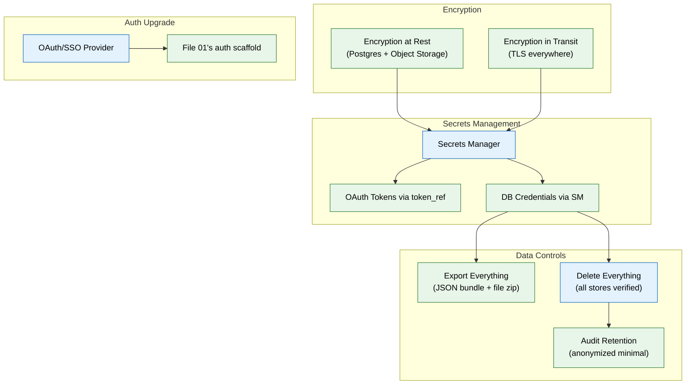

# 15 — Security & Compliance (MVP)

> **Purpose:** Harden the entire system with encryption, real secrets management, and the two data controls every user must have from day one: export everything, delete everything.
> **Status:** ✅ Upgraded to enterprise quality
> **Owner:** Engineering Team
> **Last Updated:** 2026-07-13

## Overview

This phase hardens every component built in Phases 01–14 rather than adding new user-facing features. It is a mandatory gate before Phase 16's deployment — not an optional polish pass. Three core requirements are addressed: encryption (at rest for Postgres and object storage, in transit via TLS everywhere including internal service calls), secrets management (replacing `.env`-only local dev with a real secrets manager for OAuth client secrets, database credentials, and connector tokens), and data controls (export-everything and delete-everything actions that are immediate and verifiable).

The export-everything action produces a complete, structured JSON bundle plus a zip of raw files covering every data category. The delete-everything action removes all rows across Postgres, AGE, pgvector, and object storage, with an automated test that verifies zero remaining artifacts. Audit log records (`agent_actions`) are retained in a minimal, anonymized form even through deletion, with the retention policy explicitly documented.

The auth scaffold from Phase 01 is upgraded to support real OAuth/SSO providers. Object storage for raw files replaces local disk, using S3-compatible stores with Signed URLs for access. All secrets go through the secrets manager — never committed, never in plaintext database columns.

## Goals

1. Implement encryption at rest (Postgres + object storage) and in transit (TLS everywhere, including internal)
2. Replace local-only `.env` secrets with a real secrets manager for staging/production
3. Upgrade auth scaffold to support OAuth/SSO providers
4. Build verifiable export-everything and delete-everything actions covering all storage backends
5. Implement documented audit retention policy with minimal anonymized records surviving deletion



## Context
Read every prior file — this phase hardens what's already built rather than adding new user-facing features. Treat it as a gate before file 16's deployment, not an optional polish pass.

## Objective
Encryption, real secrets management, and the two data controls every user must have from day one: export everything, delete everything — both immediate and verifiable.

## Requirements

**Encryption:** encryption at rest for Postgres (raw documents in object storage + database), encryption in transit (TLS everywhere, including internal service-to-service calls). Object storage for raw uploaded files (file 03) — not local disk — even in MVP, using an S3-compatible store.

**Secrets management:** replace file 01's local `.env`-only approach for anything beyond local dev — OAuth client secrets, database credentials, and connector tokens (file 02's `token_ref`) must resolve through a real secrets manager in staging/production, never committed, never in a plain database column.

**Auth upgrade:** wire in a real OAuth/SSO-capable auth provider (replacing file 01's basic email/password scaffold) — the interface built in file 01 should make this a swap, not a rewrite.

**Export everything:** a single endpoint/action producing a complete, structured export of a workspace's data — every `memory_records`, `documents` (with links to raw files), `resumes`, `applications`, `schedule_events` row, in a portable format (e.g. a JSON bundle + a zip of raw files). No partial export — if it's the user's data, it's in the bundle.

**Delete everything:** a single endpoint/action that immediately and verifiably removes all of a workspace's data — Postgres rows, AGE graph nodes/edges, pgvector embeddings, object storage files, and any cached copies. Write an automated test that runs delete-everything against a fully-seeded workspace and asserts zero remaining rows/objects across all stores, not just the primary tables.

**Audit retention:** `agent_actions` (the audit log) is retained even through a delete-everything action in a minimal, anonymized form sufficient for security investigation — decide and document explicitly what's kept vs. purged, don't leave this ambiguous.

## Out of scope
Full RBAC, SAML/OIDC enterprise SSO, GDPR/SOC2 formal readiness documentation, regional data residency (all enterprise phase — see `enterprise/15-security-compliance.md`).

## Acceptance criteria
- [ ] TLS is enforced on every service-to-service and client-to-service connection, including in the docker-compose dev environment (self-signed is fine locally).
- [ ] No secret (OAuth client secret, DB credential, connector token) appears in plaintext in any committed file or database column in staging/production configuration.
- [ ] The delete-everything test passes: a fully-seeded workspace has zero remaining rows/objects across Postgres, AGE, pgvector, and object storage after the action, except the documented minimal audit residue.
- [ ] Export-everything produces a bundle that, when inspected, contains every category of data the user created or the system inferred about them.

## Common Mistakes

| Mistake | Consequence |
|---------|------------|
| Only encrypting data in transit, not at rest | A storage breach leaks all user data even if TLS is perfect |
| Storing OAuth tokens or secrets in the database `token_ref` plaintext | A database dump exposes all connected service credentials |
| Implementing delete-everything without testing all storage backends | Some stores (AGE graph, pgvector, object storage) retain orphaned records |

## Best Practices

| Practice | Why |
|----------|-----|
| Resolve all secrets through the secrets manager, not env vars | Enables rotation without service restart; prevents secret sprawl in env files |
| Test the delete-everything action against every storage backend | A partially-deleted workspace violates user trust and compliance requirements |
| Document the audit retention policy explicitly | Avoids ambiguity about what survives deletion, preventing future legal discovery surprises |

## Security Considerations

| Concern | Mitigation |
|---------|------------|
| Secret rotation could cause service disruption if not handled gracefully | Load secrets at startup with a hot-reload fallback; log a warning on stale credentials |
| Object storage bucket misconfiguration exposes raw user files | Use Signed URLs for access; enforce bucket policies that prevent public listing |
| Audit log retention after delete creates a data remnant | Anonymize retained audit records; limit retention to the minimum needed for security investigations |

## Performance Considerations

| Concern | Approach |
|---------|----------|
| TLS on internal service-to-service calls adds overhead | Use connection pooling and TLS session resumption to minimize handshake cost |
| Export-everything on a large workspace can take minutes | Run exports asynchronously; notify the user via the notification system when the bundle is ready |
| Encryption at rest adds CPU overhead for large objects | Use envelope encryption (per-file keys wrapped by a master key) to minimize re-encryption cost |

## Scope

### In Scope
- Encryption at rest for Postgres and object storage; encryption in transit (TLS) for all service-to-service and client-to-service connections
- Real secrets manager (replacing .env-only approach) for OAuth client secrets, database credentials, and connector tokens
- OAuth/SSO provider integration upgrading Phase 01's email/password auth scaffold
- Export-everything action: complete structured JSON bundle plus zip of raw files covering all data categories
- Delete-everything action: immediate removal from Postgres, AGE, pgvector, and object storage with automated verification test
- Documented audit retention policy: minimal anonymized agent_actions records surviving deletion

### Out of Scope
- Full RBAC with role hierarchy and custom roles (planned Q2 2027)
- SAML/OIDC enterprise SSO integration (planned Q2 2027)
- GDPR/SOC2 formal readiness documentation and audit (planned Q2 2027)
- Regional data residency support (planned Q2 2027)
- Automated secret rotation with zero-downtime propagation (planned Q2 2027)

---

## Examples

```bash
# Export everything — trigger and download
curl -X POST https://api.meridian.dev/v1/workspaces/{id}/export \
  -H "Authorization: Bearer $JWT"

# Async export — poll until ready
curl https://api.meridian.dev/v1/workspaces/{id}/export/status \
  -H "Authorization: Bearer $JWT"
# Response: {"status": "ready", "download_url": "https://..."}
```

```python
# Delete everything — verifiable across all stores
async def delete_workspace(workspace_id: str) -> DeleteResult:
    async with db.transaction():
        await db.execute("DELETE FROM memory_records WHERE workspace_id = $1", workspace_id)
        await db.execute("DELETE FROM documents WHERE workspace_id = $1", workspace_id)
        await db.execute("SELECT age_graph.delete_workspace($1)", workspace_id)
        await db.execute("DELETE FROM embeddings WHERE workspace_id = $1", workspace_id)

    await object_store.delete_prefix(f"workspaces/{workspace_id}/")

    # Verify zero remaining
    assert await db.fetch_val("SELECT COUNT(*) FROM memory_records WHERE workspace_id = $1", workspace_id) == 0
    assert await db.fetch_val("SELECT COUNT(*) FROM embeddings WHERE workspace_id = $1", workspace_id) == 0
    assert not await object_store.exists(f"workspaces/{workspace_id}/")

    return DeleteResult(status="complete")
```

```python
# Secrets management — resolve at startup, never at runtime
class SecretsManager:
    async def resolve(self, secret_name: str) -> str:
        if os.getenv("ENVIRONMENT") == "local":
            return os.environ[secret_name]  # .env for local dev
        return await self._vault_client.read_secret(f"meridian/{secret_name}")

# Usage in gateway — only the gateway holds provider credentials
provider_key = await secrets.resolve("ANTHROPIC_API_KEY")
anthropic_client = Anthropic(api_key=provider_key)
```

---

## Future Improvements

| Improvement | Priority | Complexity | Timeline |
|-------------|----------|------------|----------|
| Full RBAC with role hierarchy and custom roles | High | Medium | Q2 2027 |
| SAML/OIDC enterprise SSO integration | Medium | High | Q2 2027 |
| GDPR/SOC2 formal readiness documentation and audit | High | High | Q2 2027 |
| Regional data residency support | Low | High | Q2 2027 |
| Automated secret rotation with zero-downtime propagation | Medium | High | Q2 2027 |

## Related Documents

- [01 — Foundation Infrastructure](01-foundation-infra.md) — Auth scaffold this phase upgrades
- [11 — Guardrails & Safety](11-guardrails-safety.md) — Runtime safety checks alongside this security hardening
- [16 — Deployment Infrastructure](16-deployment-infrastructure.md) — Deployment that consumes this security configuration
