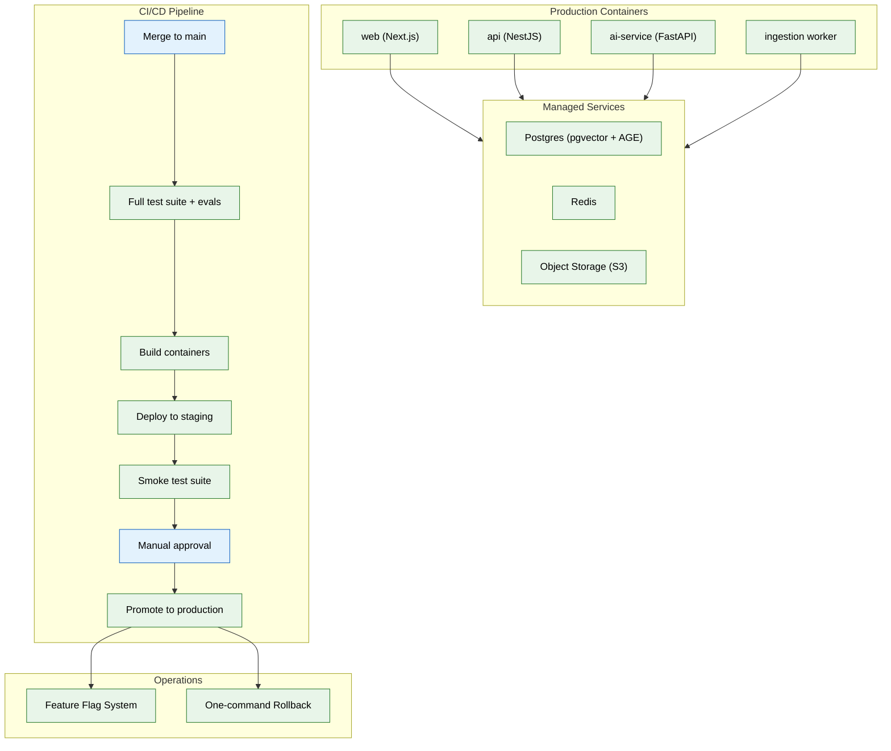

# 16 — Deployment & Infrastructure (MVP)

> **Purpose:** Containerize every service, stand up staging and production environments, and wire CI/CD for automated deployments — making Vaeloom real for actual users.
> **Status:** ✅ Upgraded to enterprise quality
> **Owner:** Engineering Team
> **Last Updated:** 2026-07-13

## Overview

This is the final MVP phase — the culmination of every phase that came before. It takes the system that has been built and tested locally and in CI and makes it available to real users. Every service (web, api, ai-service, ingestion worker) receives a production-optimized Dockerfile with attention to image size and cold-start time. Staging and production environments are stood up on a managed PaaS (Render, Fly.io, or equivalent), chosen deliberately over Kubernetes for operational simplicity at MVP scale.

The CI/CD pipeline extends Phase 01's per-PR CI with a full deployment pipeline: on merge to `main`, the full test suite plus evals runs → containers are built → staging is auto-deployed → smoke tests run against staging → a manual approval gate is required → the build is promoted to production. A basic feature flag system allows new agents and features to be enabled for internal cohorts before general availability, and one-command rollback to the previous known-good build is verified before the phase is complete.

Managed services (Postgres with pgvector + AGE, Redis, S3-compatible object storage) are provisioned as cloud services, not self-hosted. The specific conditions that would trigger a Kubernetes migration (multi-region need, complex autoscaling) are documented in `infra/docker/README.md`.

## Goals

1. Produce optimized Dockerfiles for all four services (web, api, ai-service, ingestion worker)
2. Stand up staging (auto-deploy from main) and production (manually promoted) environments on managed PaaS
3. Wire the full CI/CD pipeline: test → build → deploy staging → smoke test → manual approval → promote to production
4. Implement a basic feature flag system and one-command rollback capability
5. Document enterprise-phase migration triggers for Kubernetes



## Context
Read all prior files. This is the last MVP phase — everything before this has been built and tested locally/in CI; this phase makes it real for actual users.

## Objective
Containerize every service, stand up staging and production environments on a PaaS (not Kubernetes yet — that's an enterprise-scale upgrade), and wire CI/CD to auto-deploy on merge.

## Requirements

**Containers (`infra/docker/`):** a production Dockerfile per service (`web`, `api`, `ai-service`, plus the ingestion worker as a distinct process/container from file 03), optimized for image size and cold-start time, not just "it builds."

**Environments:** staging (auto-deployed from `main` on every merge) and production (manually promoted from a known-good staging build) — on a PaaS (e.g. Render, Fly.io, or equivalent managed container platform) chosen for operational simplicity at MVP scale over Kubernetes' flexibility, with an explicit note in `infra/docker/README.md` on what would trigger a Kubernetes migration (multi-region need, complex autoscaling policy needs — this is the enterprise-phase trigger, not a default).

**Managed services:** Postgres (with pgvector + AGE extensions available — confirm the chosen provider supports both before committing), Redis, and object storage as managed cloud services, not self-hosted, at MVP scale.

**CI/CD pipeline (extends file 01's CI):** on merge to `main` — run full test suite (including evals from file 10) → build containers → deploy to staging → run a smoke test suite against staging → require manual approval → promote to production.

**Feature flagging:** a basic flag system (even a simple config-driven one is fine) so new agents/features (e.g. the Application Agent's real submission path) can be enabled for an internal cohort before general availability, per the phased rollout implied by the build order in file 00.

**Rollback:** deployment must support a one-command rollback to the previous known-good build — verify this works before considering the phase complete, don't assume it from the platform's marketing.

## Out of scope
Kubernetes, multi-region deployment, autoscaling policies beyond the PaaS's default, disaster recovery runbooks, chaos engineering (all enterprise phase — see `enterprise/16-deployment-infrastructure.md`).

## Acceptance criteria
- [ ] A merged PR auto-deploys to staging with zero manual steps, and the smoke test suite runs automatically against it.
- [ ] Production promotion requires an explicit manual approval step — no accidental production deploys.
- [ ] A deliberate rollback (reverting to the prior build) is tested and completes without data loss.
- [ ] The eval suite (file 10) runs as a required CI gate before any deploy, not just as a local/manual check.

## Common Mistakes

| Mistake | Consequence |
|---------|------------|
| Skipping the smoke test suite against staging before promotion | A broken staging deploy silently reaches production after manual approval |
| Using Kubernetes before it's needed | Operational complexity explodes while the team should be focused on product — PaaS is sufficient for MVP |
| No rollback verification before considering deployment complete | When a bad deploy happens, the team discovers the rollback procedure doesn't work |

## Best Practices

| Practice | Why |
|----------|-----|
| Let staging auto-deploy on every merge to main | Catches integration issues in a production-like environment before any user sees them |
| Require manual approval for production promotion | Prevents an accidental deploy from reaching real users even if CI passes |
| Verify rollback before the phase is marked complete | A rollback that's never been tested is not a rollback — it's a hope |

## Security Considerations

| Concern | Mitigation |
|---------|------------|
| Container images may contain secrets baked in at build time | Use build args for non-sensitive config; resolve secrets at runtime from the secrets manager |
| Staging environment has access to production-like data stores | Isolate staging credentials; never give staging access to production data |
| Feature flags may expose incomplete features to unauthorized users | Flag evaluation must check user role/workspace, not just the flag value |

## Performance Considerations

| Concern | Approach |
|---------|----------|
| Full eval suite before every deploy adds minutes to CI | Run per-agent evals in parallel on separate CI workers |
| Cold-start time for AI service with model loading is slow | Pre-warm model connections in the container entrypoint; keep a warm connection pool |
| Feature flag evaluation on every request adds latency | Cache flag evaluations at the edge/API layer with short TTL |

## Scope

### In Scope
- Production-optimized Dockerfiles for all four services: web (Next.js), api (NestJS), ai-service (FastAPI), ingestion worker
- Staging environment auto-deployed from main on every merge, production manually promoted from known-good staging build
- Managed PaaS (Render, Fly.io, or equivalent) — not Kubernetes — for operational simplicity at MVP scale
- Managed cloud services: Postgres (pgvector + AGE), Redis, S3-compatible object storage
- CI/CD pipeline: merge to main → full test suite + evals → build containers → deploy staging → smoke tests → manual approval → promote to production
- Basic feature flag system for phased rollouts to internal cohorts before general availability
- One-command rollback to previous known-good build, verified before phase completion

### Out of Scope
- Kubernetes migration for multi-region and complex autoscaling (planned Q2 2027)
- Disaster recovery runbooks and automated failover testing (planned Q2 2027)
- Chaos engineering pipeline for resilience validation (planned Q2 2027)
- Blue-green deployment strategy for zero-downtime releases (planned Q1 2027)
- Automated canary analysis for production deployment safety (planned Q2 2027)

---

## Examples

```dockerfile
# Dockerfile — ai-service (optimized for image size and cold start)
FROM python:3.11-slim AS builder
COPY --from=ghcr.io/astral-sh/uv:latest /uv /uv/bin/uv
WORKDIR /app
COPY pyproject.toml uv.lock ./
RUN uv sync --frozen --no-dev

FROM python:3.11-slim
WORKDIR /app
COPY --from=builder /app/.venv .venv/
COPY apps/ai-service/ .
EXPOSE 8000
CMD [".venv/bin/uvicorn", "main:app", "--host", "0.0.0.0", "--port", "8000"]
```

```yaml
# CI/CD pipeline — deploy on merge to main
name: Deploy
on:
  push:
    branches: [main]
jobs:
  test:
    runs-on: ubuntu-latest
    steps:
      - uses: actions/checkout@v4
      - run: npm test && pytest && ruff check
      - run: npx tsc --noEmit && mypy .
      - run: python -m evals.runner --check-regression

  deploy-staging:
    needs: test
    runs-on: ubuntu-latest
    steps:
      - run: flyctl deploy --app Vaeloom-staging --image ghcr.io/Vaeloom/api:${{ github.sha }}
      - run: npm run test:smoke -- --base-url https://staging.Vaeloom.dev

  promote-production:
    needs: deploy-staging
    environment: production
    runs-on: ubuntu-latest
    steps:
      - run: flyctl deploy --app Vaeloom-prod --image ghcr.io/Vaeloom/api:${{ github.sha }}
```

```bash
# One-command rollback
flyctl deploy apps/api --image ghcr.io/Vaeloom/api:v1.1.0
flyctl deploy apps/web --image ghcr.io/Vaeloom/web:v1.1.0
flyctl deploy apps/ai-service --image ghcr.io/Vaeloom/ai-service:v1.1.0

# Verify rollback
curl -f https://api.Vaeloom.dev/v1/health
npm run test:smoke -- --base-url https://api.Vaeloom.dev
```

---

## Future Improvements

| Improvement | Priority | Complexity | Timeline |
|-------------|----------|------------|----------|
| Kubernetes migration for multi-region and complex autoscaling | Medium | High | Q2 2027 |
| Disaster recovery runbooks and automated failover testing | High | High | Q2 2027 |
| Chaos engineering pipeline for resilience validation | Low | High | Q2 2027 |
| Blue-green deployment strategy for zero-downtime releases | Medium | Medium | Q1 2027 |
| Automated canary analysis for production deployment safety | High | High | Q2 2027 |

## Related Documents

- [01 — Foundation Infrastructure](01-foundation-infra.md) — CI pipeline this phase extends
- [10 — Evaluation Framework](10-evaluation-framework.md) — Eval suite that gates every deployment
- [15 — Security & Compliance](15-security-compliance.md) — Security hardening consumed by deployment config
