# PR Guidelines

> **Purpose:** Define Pull Request guidelines for Vaeloom
> **Status:** 🆕 New

## PR Architecture

```mermaid
graph TD
    classDef req fill:#e3f2fd,stroke:#1565c0,color:#000,stroke-width:2px
    classDef size fill:#e8f5e9,stroke:#2e7d32,color:#000,stroke-width:1.5px
    classDef etiquette fill:#fff3e0,stroke:#e65100,color:#000,stroke-width:1.5px

    subgraph Requirements["📋 PR Requirements"]
        R1["Title: Conventional commit format"]
        R2["Description: Template with context"]
        R3["Tests: Included for new code"]
        R4["Lint: No errors (CI check)"]
        R5["Build: Passes successfully (CI)"]
        R6["Review: ≥ 1 approval (branch protection)"]
        R7["Size: < 500 lines preferred"]
    end

    subgraph Size["📏 Size Guidelines"]
        S1["Small: < 100 lines<br/>Single reviewer"]
        S2["Medium: 100-500 lines<br/>Single reviewer"]
        S3["Large: 500+ lines<br/>Split into smaller PRs"]
        S4["Massive: 1000+ lines<br/>Requires lead approval"]
    end

    subgraph Etiquette["🤝 PR Etiquette"]
        E1["Author: Provide context, respond to feedback"]
        E2["Author: Don't merge without approval"]
        E3["Reviewer: Be specific + constructive + timely"]
        E4["Reviewer: Don't leave vague comments"]
        E5["Both: Assume good intent"]
    end

    Requirements --> Size --> Etiquette

    class R1,R2,R3,R4,R5,R6,R7 req
    class S1,S2,S3,S4 size
    class E1,E2,E3,E4,E5 etiquette
```



> **Diagram:** PR guidelines covering **7 requirements** (conventional title, template description, tests, lint, build, review, size) → **4 size categories** (small through massive) → **5 etiquette rules** for both authors and reviewers.

---

## PR Requirements

| Requirement | Standard | Enforced By |
|-------------|----------|-------------|
| Title | Conventional commit format | PR template |
| Description | Template with context | PR template |
| Tests | Included for new code | CI |
| Lint | No lint errors | CI |
| Build | Builds successfully | CI |
| Review | At least 1 approval | Branch protection |
| Size | < 500 lines preferred | Manual review |

## PR Template

```markdown
## Description
[Describe the change and why it was made]

## Related Issues
Closes #[issue_number]

## Type of Change
- [ ] feat: New feature
- [ ] fix: Bug fix
- [ ] refactor: Code restructure
- [ ] test: Test changes
- [ ] docs: Documentation
- [ ] chore: Maintenance

## Testing
- [ ] Unit tests added/updated
- [ ] Integration tests added/updated
- [ ] E2E tests pass
- [ ] Manual testing performed

## Checklist
- [ ] Code follows coding standards
- [ ] No new lint errors
- [ ] Documentation updated
- [ ] PR is < 500 lines
```

## PR Size Guidelines

| Size | Lines Changed | Review Process |
|------|---------------|----------------|
| Small | < 100 | Single reviewer |
| Medium | 100-500 | Single reviewer |
| Large | 500+ | Split into smaller PRs |
| Massive | 1000+ | Requires team lead approval |

## PR Etiquette

| Role | Should | Should Not |
|------|--------|------------|
| Author | Provide context, respond to feedback | Merge without approval |
| Reviewer | Be specific, constructive, timely | Leave vague comments |
| Both | Assume good intent | Take feedback personally |

## Common Mistakes

| Mistake | Consequence |
|---------|-------------|
| Opening PRs without a description | A PR without context forces reviewers to guess the purpose, scope, and testing instructions — 70% of review time is spent understanding what the PR does |
| Requesting reviews from too many people at once | 5+ reviewers on a single PR leads to diffusion of responsibility — everyone assumes someone else will review, and the PR sits for days |
| Merging without addressing all reviewer comments | Unresolved comments that are silently dismissed erode trust in the review process — every comment should have a response (fix or explanation) |
| Creating PRs that mix refactoring with feature work | A PR that renames 20 files and adds a new endpoint in the same diff makes it impossible to distinguish the functional change from the noise |

## Best Practices

| Practice | Why |
|----------|-----|
| Fill out the PR template completely | A thorough description answers "what", "why", and "how tested" — this single paragraph saves each reviewer 10-15 minutes of context-gathering |
| Request 1-2 reviewers maximum | Code review quality decreases with more reviewers — pick reviewers who know the code area, not everyone on the team |
| Respond to every comment with a fix or explanation | An unresolved comment left dangling means the reviewer's concern wasn't addressed — either make the change or explain why it's unnecessary |
| Keep refactoring in separate PRs from feature work | A PR that only restructures code can be reviewed quickly — a PR that restructures AND adds functionality requires two separate mental passes |

## Security Considerations

| Consideration | Mitigation |
|--------------|-----------|
| PR description exposure | PR descriptions may contain details about security vulnerabilities being fixed — avoid publishing exploit details or affected versions in the PR description |
| Automated dependency scanning | Require dependency scanning (Dependabot, Snyk) as a CI check — a PR that introduces a vulnerable dependency should be blocked before review |

## Performance Considerations

| Consideration | Approach |
|--------------|----------|
| PR size and review velocity | PRs under 100 lines are reviewed 2x faster than PRs under 500 lines — break large features into a stack of smaller, incremental PRs |
| CI check runtime | A PR with CI checks that take 20+ minutes to complete delays the feedback loop — optimize slow checks (E2E tests, performance benchmarks) to run in parallel |

## Workflows

1. **Create branch:** `git checkout -b feature/my-feature develop`
2. **Develop + commit:** Follow conventional commits, keep commits focused
3. **Push branch:** `git push origin feature/my-feature`
4. **Open PR:** Fill template (description, related issues, type of change, testing, checklist)
5. **CI checks:** Wait for lint, test, build to pass
6. **Request review:** Tag 1-2 reviewers via GitHub or Slack
7. **Address feedback:** Respond to every comment — fix or explain
8. **Merge:** Squash merge to develop (features) or merge commit to main (releases)
9. **Delete branch:** Auto-delete or manual `git push origin --delete`

---

## APIs

| Endpoint | Method | Purpose | Auth |
|----------|--------|---------|------|
| `POST /repos/{owner}/{repo}/pulls` | POST | Create a pull request | GitHub token |
| `GET /repos/{owner}/{repo}/pulls/{pull}` | GET | Get PR details and status checks | GitHub token |
| `PUT /repos/{owner}/{repo}/pulls/{pull}/merge` | PUT | Merge approved PR | GitHub token |
| `POST /repos/{owner}/{repo}/pulls/{pull}/requested_reviewers` | POST | Request specific reviewers | GitHub token |

---

## Scalability

| Dimension | Current Limit | 10x Strategy | 100x Strategy |
|-----------|--------------|--------------|---------------|
| Team size | 5 engineers | 50 engineers: per-team CODEOWNERS + auto-reviewer assignment | 500 engineers: distributed review queues by service |
| PR throughput | 10 PRs/day | 100 PRs/day: auto-merge trivial PRs | 1000 PRs/day: AI triage + merge train |
| PR size enforcement | Manual review | CI size check + split recommendation | Auto-reject PRs > 1000 lines |
| Review SLA | Manual tracking | Automated SLA breach notifications | Deploy gate on review SLA compliance |

---

## Error Handling

| Scenario | Detection | Mitigation | Recovery |
|----------|-----------|------------|----------|
| PR description missing or incomplete | PR template validation | Guide author to fill required fields | Block merge until template complete |
| CI checks fail after review | Status check re-runs | Block merge automatically | Fix code and re-push |
| Reviewer not responding within SLA | Slack reminder bot | Re-assign to secondary reviewer | Escalate to tech lead |
| Merge conflicts on target | GitHub conflict indicator | Require rebase on target branch | `git rebase develop` and resolve conflicts |

---

## Monitoring

| Metric | Alert Threshold | Severity | Dashboard |
|--------|----------------|----------|-----------|
| PR open → merge time (p95) | > 48 hours | Warning | Engineering Velocity |
| PR size > 500 lines count | > 20% of PRs | Info | PR Quality |
| Review response time | > 24 hours | Warning | Review SLA |
| PR without description | > 5% | Info | PR Quality Dashboard |

---

## Limitations

| Limitation | Impact | Workaround | Future Resolution |
|------------|--------|------------|-------------------|
| No auto-suggested reviewers by expertise | Manual reviewer selection | Request specific reviewer in PR body | CODEOWNERS with role-based routing |
| PR template not enforced in GitHub UI | Authors may skip fields | Manual review of template compliance | PR template validation GitHub Action |
| No merge conflict preview in web UI | Must pull branch locally to resolve | GitHub conflict editor for simple conflicts | In-browser merge conflict resolution |
| No parallel review (blocking vs. non-blocking) | One slow reviewer blocks merge | Request 2+ reviewers for critical PRs | GitHub's "required reviews" with dismissal |

---

## Overview

Pull Requests are the primary collaboration mechanism for every change in the Vaeloom monorepo. This document defines the PR requirements, size guidelines, template, etiquette, and workflows that every engineer follows. A well-structured PR reduces review time, catches issues before merge, and maintains the quality standards defined in `Code-Review.md` and `Coding-Standards.md`.

Each PR must have a conventional-commit-formatted title, a completed template describing the change and testing approach, passing CI checks (lint, typecheck, test, build), and at least one reviewer approval. PRs under 100 lines target a 4-hour review SLA, while PRs over 500 lines are split into smaller, focused changes. The PR template enforces the documentation, testing, and standards requirements that every Vaeloom change must meet.

The goal is to maintain a throughput of 10 PRs/day with an average review-to-merge time under 24 hours, enabling the bi-weekly release cadence defined in `Release-Process.md`.

## Goals

- Define clear, enforceable PR requirements — title format, description template, CI gates, reviewer count
- Reduce review friction by keeping PRs small (< 500 lines) and focused on a single logical change
- Establish reviewer etiquette that produces specific, actionable feedback without unnecessary delays
- Ensure every PR includes adequate testing, documentation, and standards compliance documentation
- Maintain a consistent review SLA: small PRs in < 4 hours, medium PRs in < 24 hours

## Scope

### In Scope

- PR requirements: conventional commit title, template description, tests, lint, build, review, size limits
- PR template with sections for description, related issues, type of change, testing, and checklist
- PR size guidelines: small (< 100), medium (100-500), large (500+), massive (1000+)
- PR etiquette rules for authors and reviewers
- Workflow from branch creation through merge and branch deletion
- Security considerations for PR descriptions and dependency scanning

### Out of Scope

- Auto-merge for approved, CI-passed small PRs (planned Q3 2026)
- PR template validation GitHub Action (planned Q3 2026)
- Automated reviewer assignment by expertise and load (planned Q4 2026)
- PR size auto-rejection for PRs > 1000 lines (planned Q4 2026)
- AI-assisted PR description generation from diff (planned Q2 2027)

---

## Examples

```markdown
# Example PR title (conventional commit format)
feat(api): add content-based deduplication to ingestion pipeline

# Example PR description (filled template)
## Description
Implements content-based deduplication so uploading the same file twice
creates a document_versions row instead of a duplicate document. Uses
SHA-256 content hash plus filename similarity for match detection.

## Related Issues
Closes #184

## Type of Change
- [x] feat: New feature
- [ ] fix: Bug fix

## Testing
- [x] Unit tests added for dedup logic
- [x] Integration test: duplicate upload creates version
- [x] E2E tests pass
```

```bash
# Create a focused, small PR
git checkout -b fix/merge-threshold develop
# Make one logical change
git add apps/ai-service/agents/memory_agent/merge.py
git commit -m "fix(ai): correct entity merge confidence threshold"
git push origin fix/merge-threshold
# Open PR (size: ~50 lines → 1 reviewer, < 4 hours SLA)

# Request reviewers
gh pr create --title "fix(ai): correct entity merge confidence threshold" \
  --body "## Description\nFixes merge threshold from 0.5 to 0.95..." \
  --reviewer @team-lead
```

---

## Future Improvements

| Improvement | Priority | Complexity | Timeline |
|-------------|----------|------------|----------|
| Auto-merge for approved, CI-passed small PRs | High | Low | Q3 2026 |
| PR template validation GitHub Action | High | Low | Q3 2026 |
| Automated reviewer assignment by expertise and load | Medium | Medium | Q4 2026 |
| PR size auto-rejection (> 1000 lines) | Medium | Low | Q4 2026 |
| AI-assisted PR description generation from diff | Low | High | Q2 2027 |

## Related Documents

- [Code Review.md](./Code-Review.md)
- [Git Workflow.md](./Git-Workflow.md)
- [Commit Convention.md](./Commit-Convention.md)
