# Engineering

> **Purpose:** Implementation guides, backend/frontend architecture, database design, and build prompts
> **Status:** ✅ Upgraded to enterprise quality
> **Owner:** Engineering Team
> **Last Updated:** 2026-07-13

## Overview

This directory serves as the central engineering hub for the Vaeloom platform, containing both the master build orchestration plan and 16 sequential implementation guides that together form the complete MVP build path. Every engineering team member — from infrastructure engineers to AI specialists to frontend developers — uses this directory as the single source of truth for what to build, in what order, and to what standard.

The implementation files follow a strict dependency chain: foundation phases (01–02) must complete before core AI phases (03–07), which in turn precede specialist agent and quality phases (08–12), with the final shipping phases (13–16) depending on everything before them. Each file contains requirements, acceptance criteria, security considerations, and performance guardrails specific to its domain, ensuring that every component is built with production readiness from day one.

The accompanying architecture documents in `../Architecture/` provide the design rationale behind the implementation decisions captured here. Engineers are expected to read both the implementation guide and its corresponding architecture document before beginning work on any phase.

## Goals

1. Provide a complete, dependency-ordered build plan that any engineer can execute from zero to production-ready MVP without external guidance
2. Ensure every implementation phase includes explicit acceptance criteria, security considerations, and performance guardrails
3. Maintain cross-referencing between phases so downstream engineers understand upstream dependencies and contracts
4. Establish a quality standard (header metadata, overview, goals, related documents) that makes every implementation file self-documenting and auditable
5. Serve as the onboarding entry point for new engineers joining the Vaeloom engineering team

## What's here

| Document | Location | Status |
|----------|----------|--------|
| Tech Stack & Rationale | [`/Docs/Vaeloom-Complete-Documentation.md#10-tech-stack`](../../Docs/Vaeloom-Complete-Documentation.md#10-tech-stack) | ✅ Excellent |
| Database Schema & Design | [`/Docs/Engineering/Implementation/02-database-schema.md`](../../Docs/Engineering/Implementation/02-database-schema.md) | ✅ Excellent |
| Master Build Order | [`/Docs/Engineering/Implementation/00-master-build-order.md`](../../Docs/Engineering/Implementation/00-master-build-order.md) | ✅ Excellent |
| Implementation Blueprint | [`/Docs/Vaeloom-Complete-Documentation.md#13-implementation-blueprint`](../../Docs/Vaeloom-Complete-Documentation.md#13-implementation-blueprint) | ✅ Good |
| Implementation Files (16) | [`/Docs/Engineering/Implementation/`](../../Docs/Engineering/Implementation/) | ✅ Good |

```mermaid
graph LR
    subgraph Foundation["🏗️ Foundation"]
        F1["01 · Foundation Infra<br/>Scaffold, CI, Auth"]
        F2["02 · Database Schema<br/>Postgres, Migrations"]
    end
    subgraph Core["⚙️ Core"]
        C1["03 · Ingestion Pipeline<br/>Parse, OCR, Extract"]
        C2["04 · Memory System<br/>Graph, Vector Store"]
        C3["05 · Agent Harness<br/>Runtime, Orchestrator"]
        C4["06 · RAG Retrieval<br/>Agentic Hybrid Search"]
        C5["07 · MCP Tools<br/>Connectors"]
    end
    subgraph AI["🤖 AI"]
        A1["08 · Specialist Agents<br/>All 8 MVP Agents"]
        A2["09 · AI Gateway<br/>Model Router"]
    end
    subgraph Quality["✅ Quality"]
        Q1["10 · Evaluation<br/>Golden Datasets"]
        Q2["11 · Guardrails<br/>Safety, QA Gate"]
        Q3["12 · Observability<br/>Tracing, Audit"]
    end
    subgraph Ship["🚀 Ship"]
        S1["13 · API Backend<br/>REST, Permissions"]
        S2["14 · Frontend<br/>All MVP Screens"]
        S3["15 · Security<br/>Encryption, Secrets"]
        S4["16 · Deployment<br/>Containers, CI/CD"]
    end

    F1 --> F2 --> C1 --> C2 --> C3 --> C4 --> C5
    C5 --> A1 --> A2
    A2 --> Q1 --> Q2 --> Q3
    Q3 --> S1 --> S2 --> S3 --> S4

    classDef foundation fill:#e3f2fd,stroke:#1565c0
    classDef core fill:#e8f5e9,stroke:#2e7d32
    classDef ai fill:#fff3e0,stroke:#e65100
    classDef quality fill:#f3e5f5,stroke:#7b1fa2
    classDef ship fill:#e0f2f1,stroke:#00695c

    class F1,F2 foundation
    class C1,C2,C3,C4,C5 core
    class A1,A2 ai
    class Q1,Q2,Q3 quality
    class S1,S2,S3,S4 ship
```



## Implementation files (build order)

| # | File | Builds | Depends on |
|---|------|--------|------------|
| 00 | Master Build Order | Entry point — read first | — |
| 01 | Foundation Infra | Repo scaffold, CI, auth, empty services | — |
| 02 | Database Schema | Postgres schema, migrations | 01 |
| 03 | Ingestion Pipeline | File parsing, OCR, extraction, queue | 01, 02 |
| 04 | Memory System | Memory Agent, knowledge graph, vector store | 02, 03 |
| 05 | Agent Harness Orchestration | Shared agent runtime, Orchestrator | 04 |
| 06 | RAG Retrieval | Agentic RAG hybrid retrieval | 04, 05 |
| 07 | MCP Tool Ecosystem | MCP-shaped connectors (Gmail, GitHub, Drive) | 01, 05 |
| 08 | Specialist Agents | Organization, Resume, ATS, Job Search, etc. | 05, 06, 07 |
| 09 | AI Gateway / Model Routing | Model router, fallback, prompt caching | 05 |
| 10 | Evaluation Framework | Golden datasets, eval runner, CI gating | 08 |
| 11 | Guardrails & Safety | Input validation, injection defense, QA gate | 05, 08 |
| 12 | Observability & Tracing | Tracing, structured logs, audit log | 05 |
| 13 | API Backend | Core REST API, permission engine | 02, 08 |
| 14 | Frontend Workspace | Next.js frontend, all MVP screens | 13 |
| 15 | Security & Compliance | Encryption, secrets, export/delete | all above |
| 16 | Deployment Infrastructure | Containers, CI/CD, staging/prod | all above |

## Tech stack (MVP)

| Category | Choice | Enterprise evolution |
|----------|--------|---------------------|
| Frontend | React + TypeScript, Next.js | Same, micro-frontends if needed |
| Styling | Tailwind CSS | Same |
| State | TanStack Query | Same |
| Core API | Node.js + TypeScript, NestJS | Same, horizontally scaled |
| AI Service | Python, FastAPI | Same, independently scaled |
| Agent Reasoning | Anthropic Claude API | Multi-model routing |
| Database | PostgreSQL | Same + read replicas |
| Graph | Apache AGE | Neo4j at scale |
| Vector | pgvector | Qdrant at scale |
| Search | Meilisearch | OpenSearch at scale |
| Queue/Cache | Redis + BullMQ | Kafka at scale |

## Common Mistakes

| Mistake | Better Approach |
|---------|----------------|
| Reading implementation docs without the architecture context | Implementation files assume familiarity with the system design — start with `Architecture/System-Design.md` before reading build prompts |
| Jumping straight to the implementation build prompts | The 16 build prompts are ordered by dependency — start at `00-master-build-order.md` and follow the sequence, don't skip ahead |
| Modifying build prompts without understanding the scope | Build prompts define what each phase builds — modifying a prompt scope mid-implementation creates inconsistency with the dependent phases |

## Best Practices

| Practice | Why |
|----------|-----|
| Read the tech stack table first | Understanding the technology choices (Next.js, NestJS, FastAPI, PostgreSQL, Redis) provides context for every implementation decision that follows |
| Follow the build order strictly — each phase depends on the previous | Phase 02 (Database Schema) depends on Phase 01 (Foundation Infra) — completing phases out of order creates dependency issues and rework |
| Cross-reference with the Architecture docs | Each implementation phase has a corresponding architecture document — reading both together provides the "why" and the "how" simultaneously |

## Security

| Concern | Mitigation |
|---------|------------|
| Implementation prompts that bypass security review | Build prompts define what each phase implements — if security review isn't gated in the build order, vulnerabilities ship before they're caught. Include a security review step in the build pipeline definition |
| Outdated dependency versions in the tech stack | The technology choices table (Next.js, NestJS, FastAPI, PostgreSQL) lists versions at a point in time — without a dependency update cadence, known vulnerabilities accumulate. Run monthly dependency audits |
| Implementation files that don't reference security controls | Each build phase should include cross-references to security documentation — a developer implementing RAG (Phase 06) needs to know about guardrails (Phase 11) and the permission engine (Phase 13) |

## Performance

| Concern | Mitigation |
|---------|------------|
| Build phases implemented without considering downstream performance | Each phase is a dependency for subsequent phases — a poorly indexed database schema (Phase 02) affects RAG retrieval speed (Phase 06). Include performance acceptance criteria in each phase definition |
| Tech stack decisions made without performance benchmarking | The technology choices list (pgvector vs. Qdrant, BullMQ vs. Kafka) has scaling notes — benchmark these decisions against projected workload before committing to a migration path |
| Implementation order not optimized for performance-critical paths | The build order (01→16) is dependency-driven, but performance-critical paths (agent runtime, RAG retrieval, API gateway) should have dedicated performance testing phases. Add a performance validation step after each major component |

## Security Considerations

| Concern | Mitigation |
|---------|------------|
| Implementation prompts that bypass security review | Build prompts define what each phase implements — if security review isn't gated in the build order, vulnerabilities ship before they're caught. Include a security review step in the build pipeline definition |
| Outdated dependency versions in the tech stack | The technology choices table (Next.js, NestJS, FastAPI, PostgreSQL) lists versions at a point in time — without a dependency update cadence, known vulnerabilities accumulate. Run monthly dependency audits |
| Implementation files that don't reference security controls | Each build phase should include cross-references to security documentation — a developer implementing RAG (Phase 06) needs to know about guardrails (Phase 11) and the permission engine (Phase 13) |

## Performance Considerations

| Concern | Approach |
|---------|----------|
| Build phases implemented without considering downstream performance | Each phase is a dependency for subsequent phases — a poorly indexed database schema (Phase 02) affects RAG retrieval speed (Phase 06). Include performance acceptance criteria in each phase definition |
| Tech stack decisions made without performance benchmarking | The technology choices list (pgvector vs. Qdrant, BullMQ vs. Kafka) has scaling notes — benchmark these decisions against projected workload before committing to a migration path |
| Implementation order not optimized for performance-critical paths | The build order (01→16) is dependency-driven, but performance-critical paths (agent runtime, RAG retrieval, API gateway) should have dedicated performance testing phases. Add a performance validation step after each major component |

## Workflows

1. **Start a new implementation phase:** Read `00-master-build-order.md` → identify dependencies → check previous phase completion
2. **Implement the build prompt:** Follow the phase-specific prompt in `Implementation/` — build all files listed, adhere to tech stack
3. **Cross-reference with architecture docs:** Read corresponding `Architecture/` doc → verify implementation matches design
4. **Write tests:** Add unit + integration tests per phase — run `npm test` and `pytest` to validate
5. **Run lint + typecheck:** `npm run lint && npm run typecheck` (TS) / `ruff check && mypy` (Python)
6. **Commit and PR:** Use conventional commits → open PR against develop → pass CI + review → merge
7. **Update documentation:** Update the relevant Engineering doc to reflect the completed implementation
8. **Verify downstream phases:** Confirm next phase can build on your implementation

---

## APIs

| Endpoint | Method | Purpose | Auth |
|----------|--------|---------|------|
| `POST /api/workspaces/{id}/documents` | POST | Upload document to workspace (Phase 13) | JWT |
| `GET /api/workspaces/{id}/documents` | GET | List documents in workspace | JWT |
| `POST /api/ai/agents/{agent}/execute` | POST | Execute an AI agent (Phase 08) | JWT + Agent token |
| `GET /api/admin/build/phases` | GET | Get build phase completion status | Admin JWT |

---

## Scalability

| Dimension | Current Limit | 10x Strategy | 100x Strategy |
|-----------|--------------|--------------|---------------|
| Implementation phases | 16 sequential phases | 32 parallel tracks per service | 100+ parallel tracks with dependency orchestration |
| Engineers per phase | 1-2 | 3-5 per phase with clear interface contracts | 10+ per phase: micro-service per phase |
| Build prompt size | ~200 lines each | ~500 lines with detailed test specs | ~2000 lines with full acceptance criteria |
| Phase dependency chain | 16 phases linear | 3 dependency levels (foundation → core → ship) | DAG-based phase orchestration |

---

## Error Handling

| Scenario | Detection | Mitigation | Recovery |
|----------|-----------|------------|----------|
| Phase implementation doesn't meet specs | Code review feedback | Revise implementation per architecture doc | Re-submit for review |
| Breaking change in upstream phase | Downstream phase build breaks | Communicate via Slack #engineering | Coordinate fix with upstream team |
| Configuration drift across phases | Test failures | Re-run setup scripts for affected phase | Document environment requirements per phase |
| Incomplete implementation submitted for review | PR flagged as draft | Complete missing tests/docs before merging | Use draft PRs for in-progress phases |

---

## Monitoring

| Metric | Alert Threshold | Severity | Dashboard |
|--------|----------------|----------|-----------|
| Build phase completion rate | < 2 phases per sprint | Warning | Implementation Tracker |
| PR review cycle time for implementation | > 3 days | Warning | Engineering Velocity |
| Phase dependency blocking count | > 1 per sprint | Critical | Phase Dependency Graph |
| Documentation update lag after merge | > 1 week | Info | Documentation Health |

---

## Limitations

| Limitation | Impact | Workaround | Future Resolution |
|------------|--------|------------|-------------------|
| Implementation docs assume architecture knowledge | New engineers must read architecture first | Onboarding checklist with arch doc links | Embed architecture references in each build prompt |
| Build prompts are sequential — can't parallelize easily | Long time-to-completion for full stack | Run infra phases in parallel with app phases | DAG-based dependency resolver for phases |
| No automated test for phase completeness | Manual verification of build prompt completion | Phase-specific checklists in PR template | CI-enforced phase completion validation |
| Documentation and implementation can drift | Build prompts become stale | Cross-reference during code review | Auto-generated docs from implementation |

---

## Scope

### In Scope

- Master build orchestration plan (00-master-build-order.md) defining the complete 16-phase MVP implementation sequence
- 16 sequential implementation guides (01-foundation-infra through 16-deployment-infrastructure) with dependency ordering
- Cross-referencing architecture documents in `../Architecture/` that provide design rationale
- Tech stack documentation with enterprise evolution paths for each technology choice
- Global conventions (language choice, testing requirements, local-dev standards, commit format)
- Definition of "MVP done" with measurable acceptance criteria across all phases

### Out of Scope

- Detailed product specifications (covered in `Vaeloom-Complete-Documentation.md` and `01-Vaeloom-MVP-Spec.md`)
- Operational runbooks and incident response procedures (covered in `../DevOps/`)
- Security compliance documentation and audit trails (covered in `./Implementation/15-security-compliance.md`)
- Testing strategy beyond per-phase test requirements (covered in `../Testing/`)
- Enterprise-phase scaling or migration guides (future extension beyond MVP)

---

## Examples

```bash
# Quick start with Vaeloom engineering tools
Vaeloom init my-project
cd my-project
Vaeloom dev                                    # Start dev environment

# Run the full test suite
Vaeloom test --coverage
Vaeloom lint --fix
```

```bash
# Build and release
Vaeloom build --env production
Vaeloom release patch                           # Bump version & tag
Vaeloom deploy --environment staging
```

```bash
# Code quality checks
Vaeloom check types                            # TypeScript type checking
Vaeloom check format                           # Format all source files
Vaeloom audit dependencies                     # Check for vulnerable deps
```

## Future Improvements

| Improvement | Priority | Complexity | Timeline |
|-------------|----------|------------|----------|
| CI-enforced phase completion validation | High | Medium | Q4 2026 |
| Phase dependency graph with blocking alerts | Medium | Medium | Q1 2027 |
| Auto-generated documentation from implementation | Medium | High | Q2 2027 |
| Parallel-phase execution support | Low | High | Q2 2027 |
| Onboarding checklist auto-generated from build order | Low | Low | Q4 2026 |

## Related categories

- [`Architecture/`](../Architecture/) — Architecture that engineering implements
- [`AI/`](../AI/) — AI system implementation
- [`DevOps/`](../DevOps/) — Deployment and infrastructure

## Related Documents

- [Architecture Overview](../Architecture/README.md) — System architecture being implemented
- [Build Prompts Reference](../Build_Prompts/README.md) — Build order index
- [Master Build Order](Implementation/00-master-build-order.md) — Implementation entry point
