# Release Process

> **Purpose:** Define the release process for Vaeloom
> **Status:** 🆕 New

## Release Architecture

```mermaid
graph TD
    classDef version fill:#e3f2fd,stroke:#1565c0,color:#000,stroke-width:2px
    classDef cadence fill:#e8f5e9,stroke:#2e7d32,color:#000,stroke-width:1.5px
    classDef process fill:#fff3e0,stroke:#e65100,color:#000,stroke-width:1.5px
    classDef rollback fill:#f3e5f5,stroke:#6a1b9a,color:#000,stroke-width:1px

    subgraph Versioning["📊 Semantic Versioning"]
        V1["MAJOR: Breaking changes<br/>Example: 2.0.0"]
        V2["MINOR: New features<br/>Example: 1.3.0"]
        V3["PATCH: Bug fixes<br/>Example: 1.3.1"]
    end

    subgraph Cadence["📅 Release Cadence"]
        C1["Major: Quarterly · Full cycle"]
        C2["Minor: Monthly · Standard"]
        C3["Patch: As needed · Expedited"]
    end

    subgraph Process["🔄 Release Process (GitHub Flow)"]
        P1["1. Feature/hotfix branch from main"]
        P2["2. Open PR against main"]
        P3["3. CI: lint --> typecheck --> test --> build"]
        P4["4. Merge to main after review + CI"]
        P5["5. Auto-deploy to staging"]
        P6["6. Verify staging --> manual prod deploy"]
        P7["7. Tag: git tag v1.2.0"]
    end

    subgraph Rollback["⚠️ Rollback Process"]
        R1["Within 1 hour: Deploy previous image<br/>flyctl deploy --image $PREVIOUS_SHA"]
        R2["After 1 hour: git revert + hotfix PR<br/>CI/CD deploys staging --> manual prod"]
    end

    Versioning --> Cadence --> Process --> Rollback

    class V1,V2,V3 version
    class C1,C2,C3 cadence
    class P1,P2,P3,P4,P5,P6,P7 process
    class R1,R2 rollback
```



> **Diagram:** Release process flowing from **SemVer** (major/minor/patch) → **cadence** (quarterly/monthly/as-needed) → **GitHub Flow process** (7 steps: branch → PR → CI → merge → staging → prod → tag) → **rollback strategies** (immediate image rollback or git revert + hotfix).

---

## Versioning

Vaeloom follows **Semantic Versioning** (SemVer):

| Component | Version | Example |
|-----------|---------|---------|
| Major | Breaking changes | `2.0.0` |
| Minor | New features, non-breaking | `1.3.0` |
| Patch | Bug fixes, non-breaking | `1.3.1` |

## Release Cadence

| Release Type | Cadence | Process |
|-------------|---------|---------|
| Major | Quarterly | Full release cycle |
| Minor | Monthly | Standard release |
| Patch | As needed | Expedited review |

## Release Process

Vaeloom uses **GitHub Flow** — a single `main` branch with short-lived feature branches and release tags:

```text
1. Create feature/hotfix branch from main
2. Open PR against main
3. CI runs lint → typecheck → test → build (every push)
4. Merge to main after review + CI passes
5. Merge to main → auto-deploy to staging
6. After staging verification → manually trigger production deploy
7. Tag release: git tag v1.2.0 && git push origin v1.2.0
```

> **Note on branches:** Vaeloom does not use a `develop` branch. All development work happens on short-lived feature branches that merge directly to `main`. The CI/CD pipeline handles staging and production deployment automatically from `main`.

## Rollback Process

```bash
# If release has issues within 1 hour — redeploy previous image
flyctl deploy apps/api --image ghcr.io/Vaeloom/api:$PREVIOUS_SHA
flyctl deploy apps/web --image ghcr.io/Vaeloom/web:$PREVIOUS_SHA

# Verify rollback
curl -f https://api.Vaeloom.dev/v1/health && echo "Rollback OK"

# If release has been running for > 1 hour — revert + hotfix PR
git revert <release-commit>
git push origin main
# CI/CD deploys staging; manual approval for production
```

> See [`DevOps/CI-CD.md`](../DevOps/CI-CD.md) for the full pipeline definition including environment approval gates and rollback automation.

## Common Mistakes

| Mistake | Consequence |
|---------|-------------|
| Releasing on a Friday afternoon | A Friday release leaves no time for monitoring — issues discovered over the weekend require on-call engineers to handle without the full team available |
| Skipping staging deployment before production | Deploying directly to production without staging validation means integration issues are caught by real users — always deploy to staging first and verify |
| Forgetting to tag the release after deployment | Without a git tag, there's no way to know which commit was deployed — rollback requires finding the right commit in the git history manually |
| Not having a rollback plan before deploying | A release with no tested rollback process turns a minor bug into a prolonged outage — the rollback procedure must be verified before every production deployment |

## Best Practices

| Practice | Why |
|----------|-----|
| Deploy early in the week during business hours | Monday-Thursday during working hours gives the team 8+ hours to monitor for issues — Friday deployments should be reserved for critical security patches only |
| Always deploy to staging first and verify | Staging should mirror production configuration — a staging verification catches environment-specific issues (DNS, secrets, database migrations) before production |
| Tag every release immediately after deployment | `git tag v1.2.0 && git push origin v1.2.0` creates an immutable reference — rollback means deploying the tagged commit, not guessing which SHA was live |
| Test the rollback process before every major release | A rollback that has never been tested will fail under pressure — include rollback verification in the release checklist as a required step |

## Security Considerations

| Consideration | Mitigation |
|--------------|-----------|
| Release artifact integrity | Release artifacts must be signed and verified with checksums — an unsigned artifact could be replaced by a malicious version in transit to the deployment target |
| Rollback as a security risk | Rolling back to a previous version may reintroduce fixed vulnerabilities — the rollback target must be checked for known vulnerabilities before deployment |
| Release notes exposure | Release notes that detail security fixes may help attackers identify unpatched versions — publish security release notes separately with CVE identifiers |

## Performance Considerations

| Consideration | Approach |
|--------------|----------|
| Deployment window impact | Deployments consume CI/CD resources and may affect production performance during rolling updates — schedule major releases during low-traffic periods |
| Rollback speed | The 1-hour rollback window requires a fast rollback mechanism — pre-build container images with version tags and keep the last 5 images available for instant rollback |

## Workflows

1. **Create release branch:** `git checkout -b release/v1.2.0 develop`
2. **CI validation:** Run full test suite, typecheck, lint, build, security scan
3. **Version bump:** Update `package.json` version and run `npx conventional-changelog`
4. **Staging deploy:** Auto-deploy to staging environment for verification
5. **QA testing:** Run smoke tests, E2E tests, regression tests against staging
6. **Production deploy:** Manual approval → deploy to production
7. **Tag release:** `git tag -a v1.2.0 -m "Release v1.2.0" && git push origin v1.2.0`
8. **Post-release monitoring:** Monitor error rates, latency, and business metrics for 1 hour
9. **Rollback if needed:** `flyctl deploy --image $PREVIOUS_SHA` (within 1 hour window)

---

## APIs

| Endpoint | Method | Purpose | Auth |
|----------|--------|---------|------|
| `POST /repos/{owner}/{repo}/releases` | POST | Create a GitHub release from tag | GitHub token |
| `GET /repos/{owner}/{repo}/releases/latest` | GET | Get latest release info | GitHub token |
| `POST /api/deploy/staging` | POST | Trigger staging deployment | Deploy token |
| `POST /api/deploy/production` | POST | Trigger production deployment | Admin JWT + MFA |

---

## Scalability

| Dimension | Current Limit | 10x Strategy | 100x Strategy |
|-----------|--------------|--------------|---------------|
| Release frequency | 2/week | 20/week: automated CI/CD with zero-downtime deploys | 200/week: continuous deployment with feature flags |
| Staging environments | 1 shared | 5 per-team staging environments | 50 preview environments per PR |
| Rollback speed | 10 minutes | 5 minutes: pre-warmed images | 1 minute: blue-green instant switch |
| Release notes | Manual | Auto-generated from conventional commits | AI-summarized per-team release notes |

---

## Error Handling

| Scenario | Detection | Mitigation | Recovery |
|----------|-----------|------------|----------|
| Staging deploy fails | CI job failure | Fix build error and retry | Check logs, fix issue, re-deploy |
| Production deploy fails health check | Smoke test failure | Auto-rollback to previous version | Investigate deploy artifact |
| Database migration error during deploy | Migration failure | Rollback migration and deployment | Fix migration script, re-deploy |
| Post-release error rate spike | Monitoring alert | Feature flag disable + hotfix | Rollback to previous version if severe |

---

## Monitoring

| Metric | Alert Threshold | Severity | Dashboard |
|--------|----------------|----------|-----------|
| Deploy success rate | < 95% | Critical | CI/CD Pipeline |
| Time from merge to production | > 2 hours | Warning | Release Velocity |
| Rollback frequency | > 1 per week | Critical | Release Health |
| Staging verification time | > 4 hours | Warning | Release Pipeline |

---

## Limitations

| Limitation | Impact | Workaround | Future Resolution |
|------------|--------|------------|-------------------|
| No canary deployments | Full traffic cutover risk | Deploy during low-traffic window | Progressive canary with traffic splitting |
| Manual production approval gate | Delays urgent patches | Pre-approved deploy window for hotfixes | Automated approval for low-risk changes |
| No feature flag system | Rollback requires full redeploy | Quick rollback with previous image | Feature flag system with gradual rollout |
| No automated rollback on health check failure | Manual rollback decision needed | Document rollback procedure clearly | Auto-rollback with health check gate |

---

## Overview

The Vaeloom release process governs how changes move from merged code to production deployment. This document defines the semantic versioning scheme (SemVer 2.0.0), release cadence (major quarterly, minor monthly, patch as-needed), the GitHub Flow release process (7 steps from branch to tag), and rollback strategies for both immediate and delayed issue detection.

Unlike the branching-heavy model in `Branch-Strategy.md`, Vaeloom uses a simplified GitHub Flow for releases: short-lived feature branches merge directly to `main`, and CI/CD handles staging and production deployment automatically. There is no `develop` branch in this model — a deliberate simplification for a team shipping 2 releases per week.

Every engineer involved in the release process — developers, reviewers, QA, and DevOps — follows this document. The process prioritizes staging verification before production promotion, automated rollback within 1 hour of deployment, and explicit tagging for every release.

## Goals

- Define a repeatable release process that moves code from merge to production with minimal manual steps
- Establish SemVer 2.0.0 versioning with clear rules for MAJOR, MINOR, and PATCH version bumps
- Ensure every release passes staging verification before production promotion
- Provide tested, documented rollback procedures for both immediate and delayed issue detection
- Automate the release pipeline: CI/CD handles build, deploy, and tag with manual approval for production

## Scope

### In Scope

- Semantic Versioning (SemVer 2.0.0): MAJOR (breaking), MINOR (new features), PATCH (bug fixes)
- Release cadence: major (quarterly), minor (monthly), patch (as-needed)
- GitHub Flow release process: 7 steps from branch creation to tag
- Rollback procedures: immediate (< 1 hour, image rollback) and delayed (> 1 hour, git revert + hotfix)
- Release tagging, changelog generation from conventional commits
- Staging verification requirements before production promotion

### Out of Scope

- Canary deployments with traffic splitting (planned Q1 2027)
- Feature flag system for gradual rollouts (planned Q4 2026)
- Auto-rollback on health check failure (planned Q4 2026)
- Preview environments per PR (planned Q1 2027)
- AI-prioritized release notes from conventional commits (planned Q2 2027)

---

## Examples

```bash
# Tag a release after deployment
git tag -a v1.2.0 -m "Release v1.2.0: Add ATS scoring, document upload"
git push origin v1.2.0

# Generate changelog from conventional commits
npx conventional-changelog -p angular -i CHANGELOG.md -s

# Rollback within 1 hour — redeploy previous image
flyctl deploy apps/api --image ghcr.io/Vaeloom/api:v1.1.0
flyctl deploy apps/web --image ghcr.io/Vaeloom/web:v1.1.0

# Verify rollback
curl -f https://api.Vaeloom.dev/v1/health && echo "Rollback OK"

# Rollback after 1 hour — revert + hotfix PR
git revert <release-commit>
git push origin main

# Staging deploy verification
curl -f https://staging.Vaeloom.dev/v1/health
npm run test:smoke -- --base-url https://staging.Vaeloom.dev
```

---

## Future Improvements

| Improvement | Priority | Complexity | Timeline |
|-------------|----------|------------|----------|
| Canary deployments with traffic splitting | High | High | Q1 2027 |
| Feature flag system for gradual rollouts | High | Medium | Q4 2026 |
| Auto-rollback on health check failure | Medium | Medium | Q4 2026 |
| Preview environments per PR | Medium | High | Q1 2027 |
| AI-prioritized release notes from conventional commits | Low | Medium | Q2 2027 |

## Related Documents

- [Git Workflow.md](./Git-Workflow.md)
- [Versioning.md](./Versioning.md)
- [`DevOps/CI-CD.md`](../DevOps/CI-CD.md)
