# Versioning

> **Purpose:** Define versioning strategy for Vaeloom
> **Status:** 🆕 New

## Versioning Architecture

```mermaid
graph TD
    classDef scheme fill:#e3f2fd,stroke:#1565c0,color:#000,stroke-width:2px
    classDef artifact fill:#e8f5e9,stroke:#2e7d32,color:#000,stroke-width:1.5px
    classDef api fill:#fff3e0,stroke:#e65100,color:#000,stroke-width:1.5px
    classDef deprecate fill:#f3e5f5,stroke:#6a1b9a,color:#000,stroke-width:1px

    subgraph Scheme["📐 SemVer 2.0.0"]
        S1["MAJOR<br/>Breaking changes<br/>2.0.0"]
        S2["MINOR<br/>New features, non-breaking<br/>1.3.0"]
        S3["PATCH<br/>Bug fixes, perf improvements<br/>1.3.1"]
    end

    subgraph Artifacts["📦 Artifacts We Version"]
        A1["Application release<br/>Source: package.json"]
        A2["API<br/>Source: /v1/ URL path"]
        A3["Database schema<br/>Source: Migration files"]
        A4["AI prompts<br/>Source: v1_, v2_ filenames"]
        A5["Embedding model<br/>Source: model_version field"]
        A6["Documentation<br/>Source: Git history"]
    end

    subgraph APIVersioning["🌐 API Versioning"]
        V1["Path: /v1/workspaces/{id}"]
        V2["Header: Accept: application/vnd.Vaeloom.v1+json"]
    end

    subgraph Deprecation["⏳ Deprecation Policy"]
        D1["Announce: Document + set EOL (6mo min)"]
        D2["Warning: Deprecation headers in responses"]
        D3["Sunset: Remove after EOL → 410 Gone"]
    end

    Scheme --> Artifacts --> APIVersioning --> Deprecation

    class S1,S2,S3 scheme
    class A1,A2,A3,A4,A5,A6 artifact
    class V1,V2 api
    class D1,D2,D3 deprecate
```



> **Diagram:** Versioning strategy — **SemVer scheme** (MAJOR/MINOR/PATCH), **6 versioned artifacts** (app, API, DB, prompts, embeddings, docs), **API versioning** (URL path + Accept header), **deprecation policy** (announce → warn → sunset with 6-month minimum).

---

## Versioning Scheme

Vaeloom uses **Semantic Versioning** (SemVer 2.0.0):

```text
MAJOR.MINOR.PATCH (e.g., 1.3.2)
```

| Component | Increment When |
|-----------|----------------|
| MAJOR | Breaking API changes, breaking data migrations |
| MINOR | New features, non-breaking API additions |
| PATCH | Bug fixes, performance improvements |

## What We Version

| Artifact | Versioned? | Version Source | Notes |
|----------|------------|---------------|-------|
| Application release | ✅ | package.json | All services |
| API | ✅ | API version header (`/v1/`) | Breaking = new version |
| Database schema | ✅ | Migration files | Sequential |
| AI prompts | ✅ | Prompt version in filename | `v1_`, `v2_` |
| Embedding model | ✅ | `model_version` field | Vector store |
| Documentation | ✅ | Git history | Per document |

## API Versioning

```http
# Version in URL path
GET /v1/workspaces/{id}/documents
GET /v2/workspaces/{id}/documents

# Version in header (alternative)
Accept: application/vnd.Vaeloom.v1+json
```

## Deprecation Policy

| Phase | Action |
|-------|--------|
| Announce | Document deprecation, set EOL date (6 months minimum) |
| Warning | Add deprecation warning headers to responses |
| Sunset | Remove after EOL date, return 410 Gone |

## Release Versioning

```bash
# Tag a release
git tag -a v1.2.0 -m "Release v1.2.0: Add ATS scoring"
git push origin v1.2.0

# Generate changelog
npx conventional-changelog -p angular -i CHANGELOG.md -s
```

## Common Mistakes

| Mistake | Consequence |
|---------|-------------|
| Bumping MAJOR version for every breaking change without migration path | Breaking changes without a deprecation window break clients that haven't updated — provide a minimum 6-month overlap where both versions work |
| PATCH version bumps that include new features | PATCH should only include bug fixes — new features in a PATCH release break automated tooling that relies on SemVer for safe upgrades |
| Forgetting to update the version in all artifacts | Updating `package.json` but not the API version or migration files creates inconsistency — all versioned artifacts must be updated together in the release PR |
| Versioning the entire monorepo as one unit | A single version for all services means a frontend-only change bumps the API version — consider independent versioning for loosely coupled services |

## Best Practices

| Practice | Why |
|----------|-----|
| Follow SemVer strictly for API versioning | MAJOR = breaking, MINOR = additive, PATCH = fixes — clients depend on this contract for safe upgrades, and breaking it erodes trust |
| Announce deprecations with a clear EOL timeline | 6 months minimum notice with deprecation warning headers gives clients time to migrate — no-surprise deprecations are a hallmark of platform stability |
| Version API and application releases independently | The API version (`/v1/`, `/v2/`) represents the public contract — the application version (1.2.0) represents the internal release. They should not be coupled |
| Automate version bumping in CI/CD | Manual version bumps are error-prone — use semantic-release or similar tools to determine the next version from commit messages |

## Security Considerations

| Consideration | Mitigation |
|--------------|-----------|
| Sunset versions as a security risk | Deprecated API versions that are no longer maintained may have unpatched vulnerabilities — sunset old versions proactively, not just when there's a replacement |
| Version disclosure in error responses | API error responses should not include version information that reveals the application version — a 404 response for `/v2/users` shouldn't confirm v2 exists |

## Performance Considerations

| Consideration | Approach |
|--------------|----------|
| Multi-version maintenance overhead | Maintaining multiple API versions (`/v1/` and `/v2/`) doubles the code paths that need testing — minimize the overlap window and deprecate aggressively |
| Version negotiation performance | Content negotiation via Accept headers is slower than URL-path versioning — prefer `/v1/` in the URL path for performance-critical APIs |

## Workflows

1. **Determine version bump:** Review commits since last release — `fix:` = PATCH, `feat:` = MINOR, breaking change = MAJOR
2. **Update version files:** Bump `package.json`, API version header, and changelog
3. **Create release branch:** `git checkout -b release/v1.2.0 develop`
4. **Run CI:** Full test suite against release branch
5. **Tag release:** `git tag -a v1.2.0 -m "Release v1.2.0: Add ATS scoring"`
6. **Push tag:** `git push origin v1.2.0` (triggers CI/CD deploy)
7. **Generate changelog:** `npx conventional-changelog -p angular -i CHANGELOG.md -s`
8. **Announce deprecation:** For API version sunset, communicate EOL 6 months in advance
9. **Sunset old version:** After EOL, return `410 Gone` for deprecated endpoints

---

## APIs

| Endpoint | Method | Purpose | Auth |
|----------|--------|---------|------|
| `GET /v1/workspaces/{id}` | GET | Access v1 API (current stable) | JWT |
| `GET /v2/workspaces/{id}` | GET | Access v2 API (latest) | JWT |
| `DELETE /v1/workspaces/{id}` | DELETE | v1 sunset endpoint after EOL | JWT |
| `GET /api/version` | GET | Get current API version and deprecation status | None |

---

## Scalability

| Dimension | Current Limit | 10x Strategy | 100x Strategy |
|-----------|--------------|--------------|---------------|
| API versions maintained | 2 versions | 3 versions: v1/v2/v3 co-existing | 5 versions: versioned API gateway routing |
| Deprecation window | 6 months | 12 months for enterprise API contracts | Per-contract deprecation schedule |
| Artifacts versioned | 6 | 20: per-microservice versioning | 100: automated version tracking per service |
| Breaking changes per year | 2 | 5: feature-flagged behind API version | 10: automated migration paths per version |

---

## Error Handling

| Scenario | Detection | Mitigation | Recovery |
|----------|-----------|------------|----------|
| API version mismatch between client and server | `404` or `406 Not Acceptable` | Return supported version list in error response | Client updates API version header |
| Deprecated endpoint still receiving traffic | Monitoring on deprecated endpoints | Warn via `Sunset` response header | Migrate clients before sunset date |
| Version bump conflict in monorepo | CI merge conflict | Separate version files per service | Automated version bump per service |
| Missing version tag on release | Deployment fails | Manually tag from commit SHA | Add automated tagging in CI/CD |

---

## Monitoring

| Metric | Alert Threshold | Severity | Dashboard |
|--------|----------------|----------|-----------|
| Deprecated API usage volume | > 1000 req/day after announcement | Warning | API Usage Dashboard |
| Version migration completion rate | < 80% 30 days before EOL | Critical | API Sunset Tracker |
| API version consistency across services | Any mismatch | Warning | Version Compliance |
| Breaking changes introduced without MAJOR bump | Automatic detection | Critical | Version Audit |

---

## Limitations

| Limitation | Impact | Workaround | Future Resolution |
|------------|--------|------------|-------------------|
| Manual version bump in package.json | Error-prone during releases | Checklist in release PR | Automated version bump from conventional commits |
| No cross-service version compatibility check | Deploying incompatible API versions | Manual testing of version combinations | Automated integration test matrix |
| Monorepo single-version default | All services share one version | Independent version per service config | Per-service versioning in monorepo |
| No automated migration path for API consumers | Clients must manually update | Extended deprecation window | Auto-generated migration guides per version |

---

## Overview

Versioning is the contract between Vaeloom and everything that depends on it — frontend clients, API consumers, internal services, and third-party integrations. This document defines the SemVer 2.0.0 scheme used across all versioned artifacts (application releases, API versions, database schemas, AI prompts, embedding models, and documentation), the API versioning strategy (URL path + Accept header), and the deprecation policy for sunsetting old versions.

The Vaeloom monorepo versions six artifact types, each with its own version source and update cadence. API versioning follows a dual approach: primary versioning via URL path (`/v1/workspaces`) with an alternative via Accept header for clients that prefer content negotiation. The deprecation policy provides a minimum 6-month overlap window between announcement and sunset.

All Vaeloom engineers, API consumers, and DevOps engineers use this document as the reference for understanding which version of any artifact is current and what the upgrade path looks like.

## Goals

- Define SemVer 2.0.0 versioning rules applied consistently across the entire platform
- Establish API versioning strategy using URL path (`/v1/`, `/v2/`) as the primary mechanism
- Provide a deprecation policy with 6-month minimum notice, warning headers, and clear sunset dates
- Ensure breaking changes are clearly communicated and migration paths are documented
- Automate version bump detection from conventional commit messages (planned Q3 2026)

## Scope

### In Scope
- SemVer 2.0.0 scheme: MAJOR (breaking), MINOR (new features), PATCH (bug fixes)
- Six versioned artifacts: application release (package.json), API (URL path), database schema (migrations), AI prompts (filename prefix), embedding model (model_version field), documentation (git history)
- API versioning: URL path (`/v1/`) and Accept header (`application/vnd.Vaeloom.v1+json`)
- Deprecation policy: 3-phase lifecycle (announce → warn → sunset) with 6-month minimum EOL
- Workflow for determining version bump, updating version files, tagging releases, and generating changelogs

### Out of Scope
- Per-service independent versioning (planned Q4 2026, monorepo currently shares one version)
- Automated version bump from conventional commits (planned Q3 2026)
- Deprecated endpoint traffic monitoring dashboard (planned Q3 2026)
- Automated API migration guide generation (planned Q1 2027)
- Feature-flag-based versioning for A/B testing (planned Q2 2027)

---

## Examples

```bash
# Tag a release with SemVer
git tag -a v1.2.0 -m "Release v1.2.0: Add ATS scoring"
git push origin v1.2.0

# Generate changelog for the release
npx conventional-changelog -p angular -i CHANGELOG.md -s

# Determine version bump from commit messages
# git log --oneline v1.1.0..HEAD
# feat(api): add document upload → MINOR bump
# fix(ai): correct merge threshold → PATCH bump
# feat(api)!: redesign permission engine → MAJOR bump
```

```http
# API versioning in URL path
GET /v1/workspaces/{id}/documents    # Current stable
GET /v2/workspaces/{id}/documents    # Latest (with breaking changes)

# API versioning via Accept header
GET /workspaces/{id}/documents
Accept: application/vnd.Vaeloom.v1+json

# Deprecation warning header response
HTTP/1.1 200 OK
Sunset: Sat, 14 Jul 2027 00:00:00 GMT
Deprecation: true
Link: </v2/workspaces/{id}/documents>; rel="successor-version"
```

```typescript
// Prompt versioning in filenames
// apps/ai-service/agents/resume_agent/prompts/
//   v1_extract_entities.txt
//   v2_extract_entities.txt   ← Breaking prompt change

// Embedding model version tracking
await db.query(`
  INSERT INTO embeddings (vector, model_version, workspace_id)
  VALUES ($1, 'text-embedding-3-small-001', $2)
`);
```

---

## Future Improvements

| Improvement | Priority | Complexity | Timeline |
|-------------|----------|------------|----------|
| Automated version bump from conventional commits | High | Low | Q3 2026 |
| Per-service independent versioning | High | Medium | Q4 2026 |
| Deprecated endpoint traffic monitoring dashboard | Medium | Low | Q3 2026 |
| Automated API migration guide generation | Medium | High | Q1 2027 |
| Feature-flag-based versioning for A/B testing | Low | High | Q2 2027 |

## Related Documents

- [Release Process.md](./Release-Process.md)
- [Git Workflow.md](./Git-Workflow.md)
- [`DevOps/CI-CD.md`](../DevOps/CI-CD.md)
