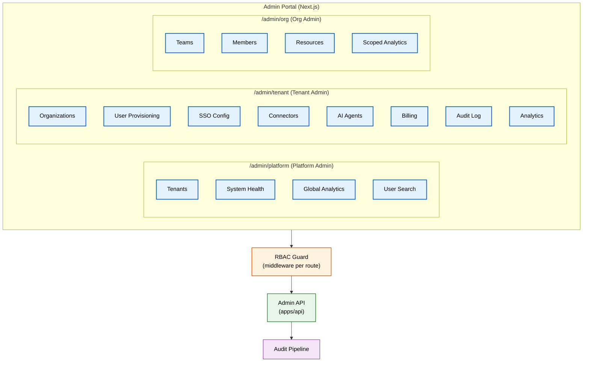
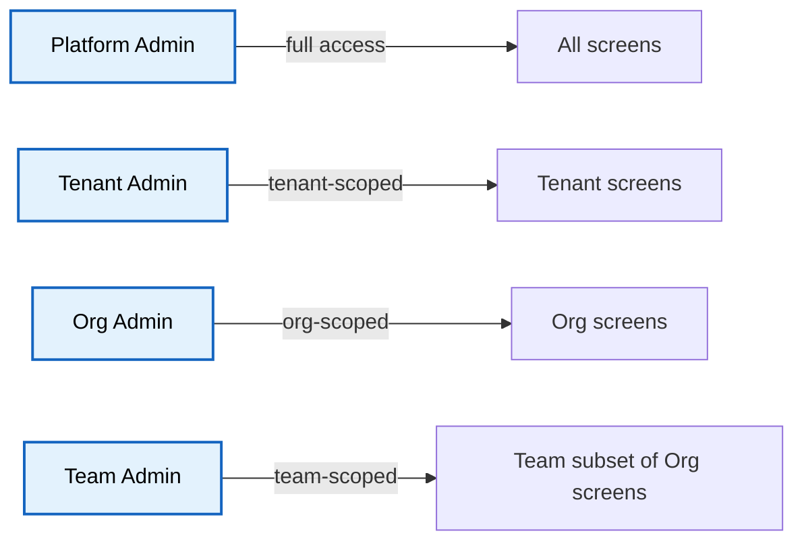

# Admin Portal

> **Purpose:** Define the enterprise admin portal — its screens, permissions, workflows, and technical implementation for managing tenants, organizations, users, billing, and AI agents
> **Status:** 🆕 New
> **Owner:** Frontend Team
> **Version:** 1.0
> **Last Updated:** 2026-07-16
> **Dependencies:** [`Multi-Tenancy.md`](./Multi-Tenancy.md), [`Organizations.md`](./Organizations.md), [`Billing.md`](./Billing.md), [`Feature-Flags.md`](./Feature-Flags.md), [`../Frontend/UI-Architecture.md`](../Frontend/UI-Architecture.md), [`../Backend/API-Reference.md`](../Backend/API-Reference.md)
> **Implementation Status:** 📋 Spec Only

## Overview

The Admin Portal is the web interface where tenant admins, organization admins, and Vaeloom platform operators manage the system. It is distinct from the user-facing application (which is the personal workspace) — the Admin Portal is a separate route tree in the Next.js application, protected by elevated RBAC roles, and serves a fundamentally different user: someone managing the platform, not someone using their second brain.

This document specifies every admin screen, its data requirements, its permission model, and the technical implementation. It is organized by permission tier: Platform Admin (Vaeloom internal ops), Tenant Admin (enterprise customer admin), and Org Admin (department/team admin within an enterprise tenant).

## Goals

- Define all admin portal screens organized by permission tier
- Specify the permission model for each screen and action
- Establish the technical architecture (Next.js route groups, shared layouts, data fetching)
- Define the admin API surface that the portal consumes
- Document the audit trail for every admin action

## Scope

### In Scope

- Platform Admin screens: tenant management, system health, global analytics, user search, incident management
- Tenant Admin screens: organization management, user provisioning, SSO configuration, connector management, AI agent configuration, billing, audit log viewer, analytics dashboards
- Org Admin screens: team management, member management, resource management, scoped analytics
- Admin portal technical architecture

### Out of Scope

- User-facing workspace screens (covered in [`../Frontend/Dashboard.md`](../Frontend/Dashboard.md))
- API implementation details (covered in [`../Backend/API-Reference.md`](../Backend/API-Reference.md))
- Design system and component library (covered in [`../Frontend/Design-System.md`](../Frontend/Design-System.md))

## Architecture



> **Diagram:** Admin portal route architecture. Three route groups (platform, tenant, org) each protected by RBAC guards that verify the caller has the required admin role. Every mutation call emits an audit event.

## Components

| Component | Responsibility | Technology | Scale Strategy |
|-----------|----------------|-----------|----------------|
| Admin Layout | Shared sidebar, header, breadcrumbs, role switcher | Next.js layout + Radix UI | N/A (stateless component) |
| RBAC Guard | Verify admin role before rendering route; redirect to unauthorized | Next.js middleware | Stateless; edge-cached |
| Admin API Client | Typed client for admin endpoints; auth token injection | React Query + Axios | Client-side caching with stale-while-revalidate |
| Data Tables | Sortable, filterable, paginated tables for users, tenants, events | TanStack Table | Virtualization for >1000 rows |
| Audit Log Viewer | Searchable, exportable audit event viewer with timeline view | Custom component + API | Server-side search; client-side rendering |

## Screen Specifications

### Platform Admin Screens

| Screen | Route | Data | Key Actions |
|--------|-------|------|-------------|
| **Tenant List** | `/admin/platform/tenants` | All tenants (name, status, plan, seat count, MRR) | Suspend, offboard, view details |
| **Tenant Detail** | `/admin/platform/tenants/:id` | Single tenant + organizations + usage + billing | Edit plan, adjust limits, view audit trail |
| **System Health** | `/admin/platform/health` | Service status, error rates, latency, queue depth | No mutations (read-only) |
| **Global Analytics** | `/admin/platform/analytics` | Platform-wide DAU/MAU, revenue, agent runs, token usage | Date range picker; export CSV |
| **User Search** | `/admin/platform/users` | Global user search by email, tenant, status | Suspend user, impersonate (audited), view profile |

### Tenant Admin Screens

| Screen | Route | Data | Key Actions |
|--------|-------|------|-------------|
| **Organizations** | `/admin/tenant/orgs` | Organization tree within tenant | Create org, edit, delete, manage hierarchy |
| **User Provisioning** | `/admin/tenant/users` | All users in tenant with org membership | Invite user, assign org/role, suspend, bulk import |
| **SSO Configuration** | `/admin/tenant/sso` | IdP metadata, attribute mapping, SCIM status | Upload SP metadata, test connection, enable/disable |
| **Connector Management** | `/admin/tenant/connectors` | Configured connectors (Gmail, GitHub, Drive) | Add/remove connector, configure scopes, view sync status |
| **AI Agent Configuration** | `/admin/tenant/agents` | Available agents, per-agent policies, autonomy levels | Enable/disable agent, set autonomy level, view agent health |
| **Billing** | `/admin/tenant/billing` | Current plan, usage, invoices, seat management | Upgrade/downgrade, adjust seats, download invoices |
| **Audit Log** | `/admin/tenant/audit` | All audit events for the tenant | Search, filter by user/action/severity, export |
| **Analytics Dashboard** | `/admin/tenant/analytics` | Org-level and tenant-level analytics | Adoption metrics, agent usage, storage trends |

## Permission Model



> **Diagram:** Permission hierarchy. Each tier has access to its own screens and all screens below it. Platform Admin can view any tenant.

## Data Flow

1. **Page load**: Admin layout fetches user context (role, tenant_id, org_id) → RBAC guard checks route access → if allowed, data tables fetch from admin API endpoints.
2. **Mutation**: Admin clicks action (e.g., "Suspend Tenant") → confirmation dialog → API call with admin token → backend validates permission at service layer (defense-in-depth) → mutation applied → audit event emitted → UI refreshes.
3. **Audit export**: Admin selects date range + filters → backend queries immutable audit store → streams CSV/JSON response.

## Security

| Concern | Mitigation | Verification |
|---------|-----------|--------------|
| Admin route accessed by non-admin | RBAC guard in Next.js middleware + backend permission check | Integration test: non-admin gets 403 on all /admin routes |
| Admin impersonating user (support) | Impersonation creates an audit trail; session marked as impersonated; actions logged with impersonator ID | Audit log query for impersonation events |
| Admin portal XSS (complex DOM) | Content-Security-Policy header; no dangerouslySetInnerHTML; sanitization of user-generated data | CSP header validation; automated XSS scanner |
| Admin deleting audit logs | Audit logs in immutable append-only storage; admin has read-only access | Attempt to delete returns 403 |

## Performance

| Concern | Budget | Measurement | Optimization |
|---------|--------|-------------|--------------|
| Admin data table load (1000 rows) | <2s | Page load timing | Server-side pagination (50 rows/page); virtual scroll for client-side lists |
| Audit log search | <5s for 30-day range | Search query timing | Elasticsearch index for audit events; backend-side search |
| Analytics dashboard aggregation | <3s | Query timing | Pre-computed materialized views; cached for 5 minutes |

## Scalability

| Dimension | Current Limit | 10x Strategy | 100x Strategy |
|-----------|---------------|--------------|---------------|
| Tenant list (Platform Admin) | ~100 tenants | Pagination; server-side filtering | Search-backed filtering |
| User list (Tenant Admin) | ~5,000 users | Virtual scroll; lazy loading | Elasticsearch-backed user search |
| Audit log volume | ~1M events/month | Partitioning by month; hot/cold tiering | ClickHouse for analytics queries |

## Error Handling

| Error Scenario | Detection | Mitigation | Recovery |
|----------------|-----------|------------|----------|
| Admin API returns 403 | RBAC guard denies route access | Show "Access Denied" page with request escalation link | Contact platform admin for role assignment |
| Admin action fails silently | Backend returns error; frontend shows toast | All mutations wrapped in try/catch; error toast displays message | Retry with refreshed token |
| Analytics aggregation timeout | Query exceeds 30s | Pre-computed views return cached data; background refresh | Reduce date range; alert ops for investigation |

## Monitoring

| Metric | Alert Threshold | Severity | Dashboard |
|--------|-----------------|----------|-----------|
| `admin_page_load_p99` | >3s | P3 | Frontend |
| `admin_api_error_rate` | >1% | P2 | Backend |
| `admin_audit_export_duration` | >60s | P3 | Operations |
| `admin_impersonation_events` | Any (all audited) | Info | Audit |

## Examples

```typescript
// Admin route guard (Next.js middleware)
export async function middleware(request: NextRequest) {
  const session = await getSession(request);
  const requiredRole = getRequiredRole(request.pathname); // platform_admin | tenant_admin | org_admin

  if (!session?.roles?.includes(requiredRole)) {
    return NextResponse.redirect(new URL('/unauthorized', request.url));
  }

  // Inject admin context for downstream use
  const requestHeaders = new Headers(request.headers);
  requestHeaders.set('x-admin-role', requiredRole);
  requestHeaders.set('x-admin-tenant-id', session.tenant_id);

  return NextResponse.next({ request: { headers: requestHeaders } });
}

export const config = {
  matcher: ['/admin/:path*'],
};
```

## Best Practices

| # | Practice | Rationale |
|---|----------|-----------|
| 1 | Every admin mutation must emit an audit event | Admins hold elevated power; every action must be traceable |
| 2 | Implement defense-in-depth (frontend guard + backend check) | Frontend guards improve UX; backend checks prevent bypass |
| 3 | Use confirmation dialogs for destructive actions | Prevents accidental tenant suspension or user deletion |
| 4 | Paginate all admin data tables | Admin portals can have thousands of rows; unbounded lists crash browsers |

## Common Mistakes

| Mistake | Consequence | Fix |
|---------|-------------|-----|
| Trusting frontend role claims alone | Attacker with browser DevTools can escalate | Backend validates role from verified JWT on every admin API call |
| Admin portal sharing auth state with user app | Admin actions appear in user context; audit trail is ambiguous | Separate route group; separate auth middleware |

## Risks

| Risk | Likelihood | Impact | Mitigation |
|------|-----------|--------|------------|
| Admin portal becomes a bottleneck for support | Medium | Medium | Self-service tools reduce ticket volume; impersonation for triage |
| Admin UI complexity grows unbounded | High | Medium | Feature flags per screen; progressive disclosure |

## Limitations

| Limitation | Impact | Workaround | Future Resolution |
|------------|--------|------------|-------------------|
| No real-time streaming of admin events | Admin must refresh to see updates | SSE/polling for critical events (system health) | WebSocket-based real-time admin dashboard |

## Future Improvements

| Improvement | Priority | Complexity | Timeline |
|-------------|----------|------------|----------|
| Real-time system health via WebSocket | High | Medium | Q1 2027 |
| Admin API rate limiting dashboard | Medium | Low | Q4 2026 |
| Self-service tenant onboarding wizard | High | Medium | Q1 2027 |
| Admin action undo (within 30 seconds) | Medium | High | Q2 2027 |

## Related Documents

- [`Multi-Tenancy.md`](./Multi-Tenancy.md) — tenant management
- [`Organizations.md`](./Organizations.md) — org structure
- [`Billing.md`](./Billing.md) — billing screens
- [`../Frontend/UI-Architecture.md`](../Frontend/UI-Architecture.md) — frontend architecture
- [`../Backend/API-Reference.md`](../Backend/API-Reference.md) — admin API endpoints
