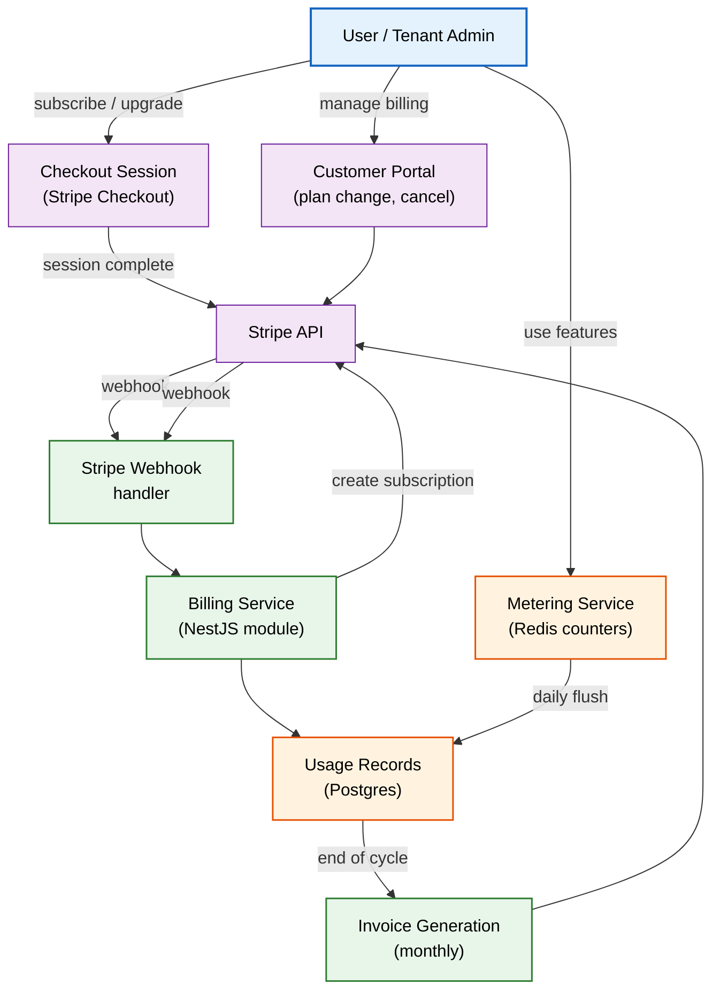
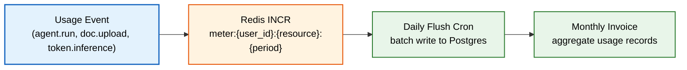
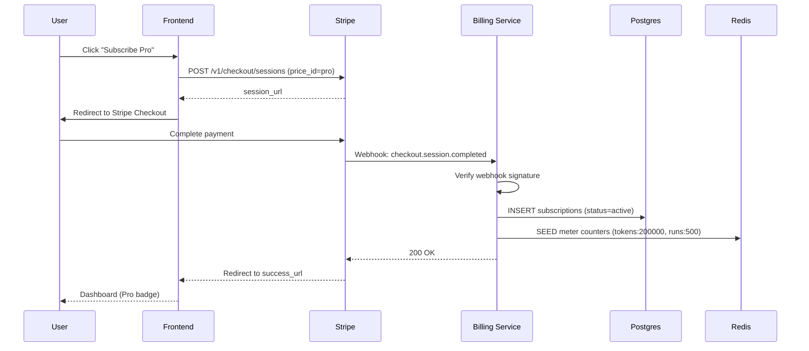

# Billing

> **Purpose:** Define Vaeloom's billing architecture, subscription plans, metering, invoicing, and payment integration for individual and enterprise customers
> **Status:** 🆕 New
> **Owner:** Product Team
> **Version:** 1.0
> **Last Updated:** 2026-07-16
> **Dependencies:** [`Multi-Tenancy.md`](./Multi-Tenancy.md), [`Organizations.md`](./Organizations.md), [`../Product/Pricing.md`](../Product/Pricing.md), [`../Product/Business-Model.md`](../Product/Business-Model.md)
> **Implementation Status:** 📋 Spec Only

## Overview

Vaeloom monetizes through a freemium subscription model for individuals and a seat-based enterprise plan for organizations. This document specifies the billing system: plans and pricing tiers, usage metering (storage, agent runs, AI tokens), payment integration (Stripe), invoicing, proration, dunning, and the billing data model. The billing system is not a core product differentiator, but it must be reliable — incorrect charges, failed renewals, or opaque invoicing erode trust, especially with enterprise customers who expect precise usage attribution.

This document is implementation-ready: it defines the data model, API contracts, webhook handlers, and operational runbooks that an engineer builds against.

## Goals

- Define subscription plans and pricing tiers aligned with [`Pricing.md`](../Product/Pricing.md)
- Specify the metering system for usage-based components (AI tokens, agent runs, storage)
- Document Stripe integration (checkout, webhooks, portal, invoicing)
- Establish proration, credit, and dunning rules
- Define enterprise billing (seat-based, PO/invoice, custom terms)

## Scope

### In Scope

- Subscription plans and pricing tiers
- Usage metering and billing cycle
- Stripe integration (checkout sessions, webhooks, customer portal, invoicing)
- Proration, credits, refunds
- Dunning (failed payment recovery)
- Enterprise billing (seats, PO, custom terms)
- Billing data model

### Out of Scope

- Marketing page copy and pricing UX design — see [`Pricing.md`](../Product/Pricing.md)
- Payment fraud detection — covered by Stripe Radar
- Tax calculation — delegated to Stripe Tax

## Architecture



> **Diagram:** Billing architecture. Users interact with Stripe Checkout and Portal; the Billing Service reconciles webhooks and usage records; the Metering Service collects per-feature usage via Redis counters and flushes to Postgres daily.

## Components

| Component | Responsibility | Technology | Scale Strategy |
|-----------|----------------|------------|----------------|
| Billing Service | Process webhooks, manage subscription state, generate invoices | NestJS module in apps/api | Stateless; horizontal |
| Metering Service | Increment Redis counters per feature per billing period | Redis INCR + daily batch flush | Redis cluster for >10K users |
| Stripe Integration | Checkout sessions, customer portal, webhook verification | Stripe SDK (Node) | Delegated to Stripe |
| Invoice Generator | Monthly aggregation of usage records into Stripe invoices | Cron job (monthly) | Single worker; horizontal if needed |
| Dunning Manager | Retry failed payments per Stripe retry schedule, send reminders | NestJS + email worker | Delegated to Stripe Smart Retries |
| Enterprise Billing | Seat management, PO generation, custom term handling | NestJS module | Single worker; low volume |

## Subscription Plans

| Plan | Price | Storage | Agent Runs/month | AI Tokens/month | Seats |
|------|-------|---------|-------------------|-----------------|-------|
| **Free** | $0 | 1 GB | 50 | 10K | 1 |
| **Pro** | $19/mo | 20 GB | 500 | 200K | 1 |
| **Team** | $49/mo | 50 GB | 1,000 | 500K | 5 |
| **Enterprise** | Custom | Unlimited | Unlimited | Custom | Unlimited |

## Metering Model



> **Diagram:** Metering pipeline. Usage events increment Redis counters (fast, cheap). A daily cron flushes counters to Postgres as `usage_records`. At month end, records are aggregated into the Stripe invoice.

## Workflows

```text
New subscription
  1. User selects plan on pricing page.
  2. Frontend creates Stripe Checkout Session (mode=subscription, price_id, success_url, cancel_url).
  3. Stripe renders the hosted checkout; user completes payment.
  4. Stripe sends checkout.session.completed webhook.
  5. Billing Service receives webhook; verifies signature.
  6. Creates local Subscription record (user_id, plan, stripe_customer_id, stripe_subscription_id, status=active).
  7. Seeds usage meter counters for the new billing period.
  8. Returns success to frontend; user redirected to dashboard.

Plan upgrade (mid-cycle proration)
  1. User clicks "Upgrade" in Stripe Customer Portal.
  2. Stripe creates a prorated invoice for the remaining cycle.
  3. Stripe sends customer.subscription.updated webhook.
  4. Billing Service updates local Subscription record with new plan and billing period reset.
  5. Metering counters are preserved; the new plan's limits take effect immediately.
```

## Sequence Diagrams



## Data Flow

1. **Ingestion**: Usage events (agent run started, token inference, document uploaded) are emitted by the producing service and increment Redis counters.
2. **Aggregation**: Daily cron reads all Redis counters and writes `usage_records` rows (user_id, resource, quantity, period_start, period_end).
3. **Invoicing**: Monthly cron queries `usage_records` for the billing period, calculates charges for metered items, and creates a Stripe invoice item for each.
4. **Retention**: Usage records retained for 13 months (regulatory + dispute window), then archived.

## APIs

| Endpoint | Method | Purpose | Auth |
|----------|--------|---------|------|
| `/v1/billing/portal` | POST | Create Stripe Customer Portal session | Bearer (user) |
| `/v1/billing/usage` | GET | Current period usage across all metered resources | Bearer (user) |
| `/v1/billing/usage/history` | GET | Historical usage records (paginated) | Bearer (user) |
| `/v1/billing/invoices` | GET | List invoices | Bearer (user) |
| `/v1/enterprises/:id/billing` | GET | Enterprise billing summary (admin) | Platform Admin |
| `/v1/enterprises/:id/seats` | PATCH | Adjust seat count | Platform Admin |

## Database

| Table | Purpose | Key Columns | Indexes |
|-------|---------|-------------|---------|
| `subscriptions` | Active subscription state | `user_id, plan, status, stripe_customer_id, stripe_subscription_id, current_period_start, current_period_end` | PK(id), (user_id), (stripe_subscription_id) |
| `usage_records` | Daily aggregated usage | `user_id, resource, quantity, period_start, period_end, tenant_id` | (user_id, period_start), (tenant_id, period_start) |
| `billing_events` | Webhook event log (idempotency) | `stripe_event_id, type, processed_at` | UNIQUE(stripe_event_id) |

## Security

| Concern | Mitigation | Verification |
|---------|-----------|--------------|
| Webhook forgery | Verify Stripe-Signature header using endpoint secret | Every webhook handler checks signature before processing |
| Webhook replay | Idempotent processing via `billing_events` table with UNIQUE(stripe_event_id) | Duplicate events silently acknowledged |
| User accessing another user's invoices | All billing queries scoped to authenticated user_id | RLS / repository tenant-scoping |
| Stripe secret exposure | Secrets stored in AWS Secrets Manager / vault; never in code or env | CI scan for secret patterns |

## Performance

| Concern | Budget | Measurement | Optimization |
|---------|--------|-------------|--------------|
| Meter counter increment | <1ms | Redis latency monitoring | Pipeline commands for batch increments |
| Daily flush latency | <30s for 100K records | Cron job duration | Batch INSERT (1000 rows/batch) |
| Invoice generation | <5 min for 10K users | Cron job duration | Parallelize per-user invoice creation |
| Portal session creation | <2s | Stripe API latency | Pre-fetch Stripe customer to reduce round-trips |

## Scalability

| Dimension | Current Limit | 10x Strategy | 100x Strategy |
|-----------|---------------|--------------|---------------|
| Concurrent meter events | ~5K/sec (Redis single-node) | Redis Cluster (shard by user_id) | Sharded Redis + local batching per service |
| Monthly invoice generation | ~10K users/cycle | Parallel workers (per-user partition) | Stripe auto-invoicing for metered usage |
| Webhook throughput | ~100/sec (single worker) | Webhook fan-out to queue | Multiple webhook consumers |

## Error Handling

| Error Scenario | Detection | Mitigation | Recovery |
|----------------|-----------|------------|----------|
| Stripe webhook delivery fails | Stripe retries (up to 72h with backoff) | Idempotent processing; retry queue | Manual replay from Stripe dashboard |
| Meter counter loss (Redis crash) | Redis persistence (AOF + RDB); daily Postgres flush | Rebuild from usage_records + application logs | Replay events from dead-letter queue |
| Overcharge | Usage record audit trail | Refund via Stripe API; alert to finance | Root cause analysis; fix meter logic |
| Payment failure | Stripe dunning webhooks | Stripe Smart Retries (auto); email reminders | Suspend access after 14 days of failure |

## Monitoring

| Metric | Alert Threshold | Severity | Dashboard |
|--------|-----------------|----------|-----------|
| `billing_webhook_errors_total` | >10/min | P2 | Billing |
| `billing_meter_flush_lag_seconds` | >60s | P2 | Billing |
| `billing_invoice_generation_failures` | Any | P2 | Billing |
| `subscription_churn_daily` | Spike >3x baseline | P3 | Product |
| `stripe_api_latency_p99` | >2s | P3 | External |

## Examples

```typescript
// Metering middleware: increment counter on every agent run
@Injectable()
export class MeteringInterceptor implements NestInterceptor {
  constructor(private readonly redis: Redis) {}

  async intercept(context: ExecutionContext, next: CallHandler) {
    const request = context.switchToHttp().getRequest();
    const userId = request.user.id;
    const period = getCurrentBillingPeriod();

    return next.handle().pipe(
      tap(() => {
        // Increment agent runs counter
        this.redis.incr(`meter:${userId}:agent_runs:${period}`);
        // Increment token usage (extracted from AI service response)
        const tokens = request.tokenUsage;
        if (tokens) {
          this.redis.incrby(`meter:${userId}:ai_tokens:${period}`, tokens.total);
        }
      }),
    );
  }
}
```

```bash
# Create a checkout session
curl -X POST https://api.vaeloom.dev/v1/billing/checkout \
  -H "Authorization: Bearer $TOKEN" \
  -d '{"price_id": "price_pro_monthly", "success_url": "https://app.vaeloom.dev/billing/success"}'
```

## Best Practices

| # | Practice | Rationale |
|---|----------|-----------|
| 1 | Always verify webhook signatures before processing | Prevents forged events from creating fraudulent subscriptions |
| 2 | Process webhooks idempotently | Stripe may deliver the same event multiple times; dedup prevents double charges |
| 3 | Use Redis for metering, not the database | Redis INCR is O(1) and handles 100K+ ops/sec; DB writes would be a bottleneck |
| 4 | Flush meter counters to Postgres daily, not monthly | Daily flush bounds data loss to 24h if Redis fails; monthly flush risks losing a full billing cycle |
| 5 | Let Stripe handle dunning retries | Stripe Smart Retries are battle-tested; custom retry logic introduces bugs |

## Common Mistakes

| Mistake | Consequence | Fix |
|---------|-------------|-----|
| Not flushing meter counters before invoice generation | Usage under-reported → lost revenue | Flush must complete before invoice cron runs; use a lock to serialize |
| Storing Stripe secret keys in environment variables | Secrets leaked in logs, containers, CI | Use AWS Secrets Manager; inject at runtime |
| Blocking the webhook response while doing DB work | Stripe marks the event as failed and retries → duplicate processing | Acknowledge webhook immediately; process asynchronously via queue |

## Risks

| Risk | Likelihood | Impact | Mitigation |
|------|-----------|--------|------------|
| Stripe outage blocks all payments | Low (99.999% SLA) | Critical | Stripe has multi-region; we have no fallback — accept the risk |
| Meter counter drift over long periods | Medium | Medium (billing inaccuracy) | Daily flush + monthly reconciliation against application-level logs |
| Enterprise custom terms create billing edge cases | High | Medium | Cap custom term variations; document every exception in the contract |

## Limitations

| Limitation | Impact | Workaround | Future Resolution |
|------------|--------|------------|-------------------|
| No real-time usage dashboard for free users | Users hit limits without warning | Email notification at 80% usage | Real-time usage widget in frontend |
| No cryptocurrency or bank-transfer payment | Limits enterprise customers in some regions | Wire transfer for annual enterprise contracts | Expand payment methods based on demand |
| No usage-based overage billing | Users on free plan are hard-capped | Upgrade prompt when limit reached | Implement pay-as-you-go overage for Pro+ |

## Future Improvements

| Improvement | Priority | Complexity | Timeline |
|-------------|----------|------------|----------|
| Real-time usage widget in dashboard | High | Low | Q3 2026 |
| Annual billing discount (pay annually, get 2 months free) | High | Low | Q4 2026 |
| Usage-based overage billing for Pro+ plans | Medium | Medium | Q1 2027 |
| Enterprise self-service seat management | Medium | Medium | Q1 2027 |
| Multi-currency support | Low | Medium | Q2 2027 |

## Related Documents

- [`Multi-Tenancy.md`](./Multi-Tenancy.md) — tenant-scoped billing
- [`Organizations.md`](./Organizations.md) — enterprise org structure and seat allocation
- [`../Product/Pricing.md`](../Product/Pricing.md) — plan definitions and marketing pricing
- [`../Product/Business-Model.md`](../Product/Business-Model.md) — revenue model
- [`../Security/Secrets.md`](../Security/Secrets.md) — secret management for Stripe keys
