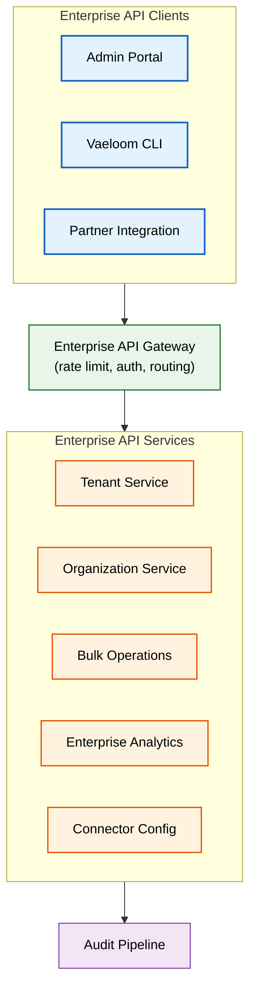

# Enterprise APIs

> **Purpose:** Define Vaeloom's enterprise-specific API surface — tenant management, organization provisioning, bulk operations, admin endpoints, and partner integrations beyond the standard user API
> **Status:** 🆕 New
> **Owner:** Architecture Team
> **Version:** 1.0
> **Last Updated:** 2026-07-16
> **Dependencies:** [`Multi-Tenancy.md`](./Multi-Tenancy.md), [`Organizations.md`](./Organizations.md), [`Billing.md`](./Billing.md), [`Admin-Portal.md`](./Admin-Portal.md), [`../Backend/API-Reference.md`](../Backend/API-Reference.md), [`../Backend/REST-Standards.md`](../Backend/REST-Standards.md)
> **Implementation Status:** 📋 Spec Only

## Overview

The Enterprise API extends Vaeloom's standard user-facing API with endpoints that require Platform Admin or Tenant Admin roles. These endpoints manage tenants, organizations, users at scale, bulk operations, enterprise analytics, and partner integrations. They are not exposed to individual users — they are the API surface that the Admin Portal, CLI tools, and partner integrations consume.

This document defines every enterprise endpoint, its authentication requirements, request/response contracts, error handling, and rate limits. It is the API reference that enterprise customers and Vaeloom platform operators build against.

## Goals

- Define the complete enterprise API surface
- Specify authentication and authorization for each endpoint group
- Document request/response contracts with examples
- Establish rate limits and quota policies for enterprise endpoints
- Enable partner and integration use cases

## Scope

### In Scope

- Tenant management APIs (provision, configure, suspend, offboard)
- Organization management APIs
- Bulk user operations (invite, suspend, export)
- Enterprise analytics APIs
- Enterprise connector configuration
- Partner integration APIs (webhook callbacks, SSO metadata)

### Out of Scope

- Standard user-facing API — see [`../Backend/API-Reference.md`](../Backend/API-Reference.md)
- AI agent APIs — see [`../AI/AI-Agents.md`](../AI/AI-Agents.md)
- Plugin marketplace APIs — see [`Plugin-Marketplace.md`](./Plugin-Marketplace.md)

## Architecture



> **Diagram:** Enterprise API architecture. All enterprise endpoints pass through a gateway that enforces authentication (Platform Admin or Tenant Admin JWT), rate limits, and audit logging. The gateway routes to domain-specific services.

## Authentication

Enterprise APIs require one of:

| Auth Type | Scope | Use Case |
|-----------|-------|----------|
| **Platform Admin JWT** | All endpoints | Vaeloom internal ops; manage any tenant |
| **Tenant Admin JWT** | Tenant-scoped endpoints | Enterprise customer admins; manage their own tenant |
| **Service Account Token** | Tenant-scoped endpoints | Automated tools, CI/CD, partner integrations |

```bash
# Platform Admin request
curl -X GET https://api.vaeloom.dev/v1/enterprises/tenants \
  -H "Authorization: Bearer $PLATFORM_ADMIN_TOKEN"

# Tenant Admin request
curl -X GET https://api.vaeloom.dev/v1/enterprises/tenants/acme/orgs \
  -H "Authorization: Bearer $TENANT_ADMIN_TOKEN"

# Service Account (automated tool)
curl -X POST https://api.vaeloom.dev/v1/enterprises/tenants/acme/users/bulk-invite \
  -H "Authorization: Bearer $SERVICE_ACCOUNT_TOKEN" \
  -H "X-Tenant-ID: acme"
```

## API Surface

### Tenant Management

| Endpoint | Method | Purpose | Auth | Scope |
|----------|--------|---------|------|-------|
| `/v1/enterprises/tenants` | GET | List all tenants | Platform Admin | Global |
| `/v1/enterprises/tenants` | POST | Provision new tenant | Platform Admin | Global |
| `/v1/enterprises/tenants/:id` | GET | Get tenant details | Platform Admin | Global |
| `/v1/enterprises/tenants/:id` | PATCH | Update tenant config | Platform Admin | Global |
| `/v1/enterprises/tenants/:id/suspend` | POST | Suspend tenant | Platform Admin | Global |
| `/v1/enterprises/tenants/:id/offboard` | POST | Begin offboarding | Platform Admin | Global |
| `/v1/enterprises/tenants/:id/health` | GET | Tenant health metrics | Platform Admin | Global |

### Organization Management

| Endpoint | Method | Purpose | Auth | Scope |
|----------|--------|---------|------|-------|
| `/v1/enterprises/tenants/:id/orgs` | GET | List organizations | Tenant Admin | Tenant |
| `/v1/enterprises/tenants/:id/orgs` | POST | Create organization | Tenant Admin | Tenant |
| `/v1/enterprises/tenants/:id/orgs/:orgId` | PATCH | Update organization | Tenant Admin | Tenant |
| `/v1/enterprises/tenants/:id/orgs/:orgId` | DELETE | Delete organization | Tenant Admin | Tenant |
| `/v1/enterprises/tenants/:id/orgs/:orgId/members` | GET | List org members | Tenant Admin / Org Admin | Org |
| `/v1/enterprises/tenants/:id/orgs/:orgId/members` | POST | Add member to org | Tenant Admin / Org Admin | Org |
| `/v1/enterprises/tenants/:id/orgs/:orgId/members/:userId` | DELETE | Remove member | Tenant Admin / Org Admin | Org |

### Bulk Operations

| Endpoint | Method | Purpose | Auth | Scope |
|----------|--------|---------|------|-------|
| `/v1/enterprises/tenants/:id/users/bulk-invite` | POST | Bulk invite users (CSV or JSON array) | Tenant Admin | Tenant |
| `/v1/enterprises/tenants/:id/users/bulk-suspend` | POST | Bulk suspend users | Tenant Admin | Tenant |
| `/v1/enterprises/tenants/:id/users/bulk-export` | POST | Export user data (async, returns job ID) | Tenant Admin | Tenant |
| `/v1/enterprises/tenants/:id/jobs/:jobId` | GET | Get bulk operation job status | Tenant Admin | Tenant |

### Enterprise Analytics

| Endpoint | Method | Purpose | Auth | Scope |
|----------|--------|---------|------|-------|
| `/v1/enterprises/tenants/:id/analytics/usage` | GET | Tenant usage summary | Tenant Admin | Tenant |
| `/v1/enterprises/tenants/:id/analytics/adoption` | GET | Feature adoption metrics | Tenant Admin | Tenant |
| `/v1/enterprises/tenants/:id/analytics/agents` | GET | Agent usage and performance metrics | Tenant Admin | Tenant |
| `/v1/enterprises/tenants/:id/analytics/storage` | GET | Storage utilization breakdown | Tenant Admin | Tenant |

## Request/Response Contracts

### POST /v1/enterprises/tenants (Provision)

```json
// Request
{
  "name": "Acme University",
  "domain": "acme.edu",
  "plan": "enterprise",
  "isolation_mode": "rls",
  "region": "us-east-1",
  "admin_email": "admin@acme.edu",
  "seat_count": 500,
  "features": {
    "sso": true,
    "audit_retention_years": 7,
    "custom_ai_model": false
  }
}

// Response (201 Created)
{
  "id": "tenant_acme_20260716",
  "name": "Acme University",
  "status": "provisioning",
  "plan": "enterprise",
  "isolation_mode": "rls",
  "region": "us-east-1",
  "admin_email": "admin@acme.edu",
  "created_at": "2026-07-16T10:00:00Z",
  "provisioning_job_id": "job_abc123"
}
```

### POST /v1/enterprises/tenants/:id/users/bulk-invite

```json
// Request
{
  "users": [
    { "email": "alice@acme.edu", "role": "org_admin", "org_id": "org_cs" },
    { "email": "bob@acme.edu", "role": "member", "org_id": "org_cs" },
    { "email": "carol@acme.edu", "role": "member", "org_id": "org_business" }
  ]
}

// Response (202 Accepted)
{
  "job_id": "job_bulk_invite_xyz",
  "total": 3,
  "status": "processing",
  "estimated_completion": "2026-07-16T10:02:00Z",
  "results_url": "/v1/enterprises/tenants/acme/jobs/job_bulk_invite_xyz"
}
```

## Rate Limits

| Endpoint Group | Rate Limit | Scope | Measurement |
|----------------|-----------|-------|-------------|
| Tenant management | 50 req/min | Per service account | Token bucket |
| Organization CRUD | 200 req/min | Per tenant | Token bucket |
| Bulk operations | 5 req/min (async) | Per tenant | Low — operations are async |
| Analytics | 100 req/min | Per tenant | Token bucket |
| Global (all enterprise) | 1,000 req/min | Per tenant | Hard cap |

## Error Handling

Enterprise APIs use the standard error envelope from [`Error-Standards.md`](../Backend/Error-Standards.md):

| Error Code | HTTP Status | Meaning |
|------------|-------------|---------|
| `TENANT_NOT_FOUND` | 404 | Tenant ID does not exist |
| `TENANT_SUSPENDED` | 403 | Tenant is suspended; no write operations allowed |
| `TENANT_PROVISIONING` | 409 | Tenant is still being provisioned; retry after |
| `ORG_HIERARCHY_INVALID` | 400 | Circular or too-deep org hierarchy |
| `BULK_JOB_IN_PROGRESS` | 409 | A conflicting bulk operation is already running |
| `ENTERPRISE_FEATURE_REQUIRED` | 403 | Feature requires enterprise plan |
| `SEAT_LIMIT_EXCEEDED` | 402 | Seat count exceeds contracted limit |

## Security

| Concern | Mitigation | Verification |
|---------|-----------|--------------|
| Tenant Admin accessing another tenant | JWT tenant_id claim enforced by gateway | Integration test: cross-tenant request returns 403 |
| Service account token leak | Token scoped to single tenant; rotatable; audit-logged | Token usage audit; anomaly detection on unusual patterns |
| Bulk export data breach | Export is async; results downloadable via time-limited URL (1h) | URL expires; download logged |
| Enterprise API DDoS | Per-tenant rate limits; global caps | Rate limiter monitoring; auto-block at threshold |

## Performance

| Concern | Budget | Measurement | Optimization |
|---------|--------|-------------|--------------|
| Tenant list (100 tenants) | <200ms | API timing | Paginated; cached; read replica |
| Bulk invite (500 users) | <60s async | Job duration | Batch DB writes (100/batch); parallel email sends |
| Analytics aggregation | <3s | Query timing | Materialized views; cached (5-min TTL) |
| Export generation | <5 min for 10K users | Job duration | Streaming CSV generation; S3 presigned URL |

## Scalability

| Dimension | Current Limit | 10x Strategy | 100x Strategy |
|-----------|---------------|--------------|---------------|
| Concurrent tenant provisions | 5 | Provisioning queue with priority | Parallel Terraform workers |
| Bulk user invite batch size | 500 | Larger batches with pagination | Streaming job processing |
| Analytics query latency | <3s | Pre-aggregated materialized views | ClickHouse for large-scale analytics |

## Monitoring

| Metric | Alert Threshold | Severity | Dashboard |
|--------|-----------------|----------|-----------|
| `enterprise_api_error_rate` | >1% | P2 | API |
| `enterprise_api_latency_p99` | >1s | P3 | API |
| `bulk_job_failure_rate` | >5% | P2 | Enterprise |
| `enterprise_rate_limit_rejections` | >10/min | P3 | API |

## Best Practices

| # | Practice | Rationale |
|---|----------|-----------|
| 1 | Use async operations for bulk endpoints | Bulk invites/exports can take minutes; synchronous would timeout |
| 2 | Scope every endpoint to tenant_id from JWT | Prevents cross-tenant access even if URL is manipulated |
| 3 | Provide downloadable results for async jobs | Users need to retrieve results after job completes |
| 4 | Audit every enterprise API call | Elevated permissions require full traceability |

## Common Mistakes

| Mistake | Consequence | Fix |
|---------|-------------|-----|
| Returning full tenant list without pagination | Unbounded response for Platform Admin with 100+ tenants | Paginate (50 per page); cursor-based for large datasets |
| Synchronous bulk operations | HTTP timeout (30s) kills the request before it finishes | All bulk ops are async; return job_id immediately |

## Risks

| Risk | Likelihood | Impact | Mitigation |
|------|-----------|--------|------------|
| Enterprise API becomes a bottleneck for admin tools | Low | Medium | Async operations; pagination; caching |
| Service account tokens never rotated | Medium | High | Auto-rotation every 90 days; audit for unchanged tokens |

## Limitations

| Limitation | Impact | Workaround | Future Resolution |
|------------|--------|------------|-------------------|
| No GraphQL for enterprise APIs (REST only) | Complex nested queries require multiple calls | Add GraphQL in v2 | Enterprise GraphQL gateway (Q2 2027) |
| Bulk export limited to CSV | Enterprise customers may want JSON/Parquet | Parameterized format (future) | Multi-format export |

## Future Improvements

| Improvement | Priority | Complexity | Timeline |
|-------------|----------|------------|----------|
| GraphQL enterprise API | Medium | High | Q2 2027 |
| Webhook callbacks for enterprise events | High | Medium | Q4 2026 |
| Enterprise API SDK (Python, Java) | Medium | Medium | Q1 2027 |
| Self-service tenant provisioning (for partners) | Medium | High | Q2 2027 |

## Related Documents

- [`Multi-Tenancy.md`](./Multi-Tenancy.md) — tenant model
- [`Organizations.md`](./Organizations.md) — organization structure
- [`Admin-Portal.md`](./Admin-Portal.md) — admin portal screens
- [`../Backend/API-Reference.md`](../Backend/API-Reference.md) — standard API reference
- [`../Backend/REST-Standards.md`](../Backend/REST-Standards.md) — REST conventions
