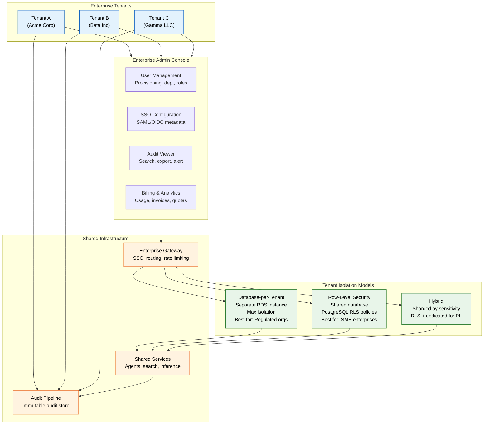
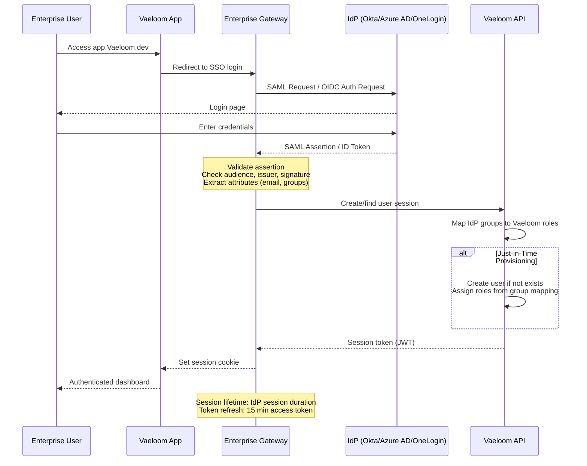
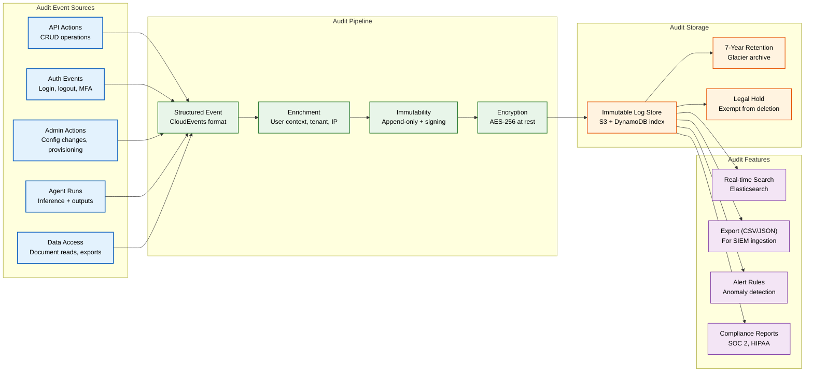

# Enterprise Architecture

> **Purpose:** Deep-dive reference for Vaeloom's multi-tenant enterprise architecture, tenant isolation, SSO/SAML integration, audit requirements, compliance mappings, and private cloud deployment options
> **Status:** 🆕 New
> **Owner:** Architecture Team
> **Last Updated:** 2026-07-13

## Overview

Vaeloom Enterprise serves organizations with advanced security, compliance, and administrative requirements. The architecture is built on a multi-tenant foundation with configurable isolation levels (database-per-tenant or row-level security), federated SSO (SAML 2.0 / OIDC), comprehensive audit logging, and optional private cloud / VPC deployment.

This document covers the complete enterprise architecture: tenant lifecycle, isolation models, identity federation, audit pipeline, compliance mappings (SOC 2, GDPR, HIPAA readiness), and the private cloud deployment option.

## Multi-Tenant Architecture



## Tenant Isolation Models

| Feature | Database-per-Tenant | Row-Level Security (RLS) | Hybrid |
|---------|--------------------|-------------------------|--------|
| **Isolation level** | Physical database | Logical (PostgreSQL RLS) | PII: physical, rest: logical |
| **Data separation** | Complete | Policy-based row filtering | Tiered |
| **Performance** | Dedicated resources | Shared resource pool | Per-tier allocation |
| **Backup/Restore** | Per-tenant backup | Whole-database backup | Per-PII-tenant backup |
| **Cost** | Highest (per-tenant DB) | Lowest (shared DB) | Medium |
| **Migration complexity** | Low | High (RLS policy management) | Medium |
| **Compliance fit** | HIPAA, SOC 2 Type II | SOC 2, GDPR | Best for mixed workloads |

### Implementation: Row-Level Security

```sql
-- Enable RLS on tables
ALTER TABLE documents ENABLE ROW LEVEL SECURITY;
ALTER TABLE agent_runs ENABLE ROW LEVEL SECURITY;
ALTER TABLE connectors ENABLE ROW LEVEL SECURITY;

-- Create tenant isolation policy
CREATE POLICY tenant_isolation_documents ON documents
  USING (tenant_id = current_setting('app.current_tenant_id')::UUID);

CREATE POLICY tenant_isolation_agent_runs ON agent_runs
  USING (tenant_id = current_setting('app.current_tenant_id')::UUID);

-- Set tenant context at connection time (via PgBouncer or middleware)
-- app.current_tenant_id is set by the API gateway after JWT validation
```

### Implementation: Database-per-Tenant

```typescript
// Tenant routing middleware
async function tenantMiddleware(req: Request, res: Response, next: NextFunction) {
  const tenantId = req.user.tenant_id;
  const tenantDb = tenantConnectionPool.get(tenantId);

  if (!tenantDb) {
    // Create new connection to tenant-specific database
    const config = await tenantConfigService.getDatabaseConfig(tenantId);
    const pool = new Pool({
      host: config.host,
      database: `Vaeloom_tenant_${tenantId}`,
      user: config.username,
      password: config.password,
    });
    tenantConnectionPool.set(tenantId, pool);
    req.db = pool;
  } else {
    req.db = tenantDb;
  }
  next();
}
```

## SSO / SAML / OIDC Integration



### Supported Identity Providers

| IdP | Protocol | SCIM Provisioning | Directory Sync |
|-----|----------|-------------------|----------------|
| Okta | SAML 2.0, OIDC | ✅ | ✅ (via SCIM) |
| Azure AD / Entra ID | SAML 2.0, OIDC | ✅ | ✅ (via SCIM) |
| OneLogin | SAML 2.0 | ✅ | ✅ |
| Google Workspace | OIDC | ✅ | ✅ (via SCIM) |
| Any SAML 2.0 IdP | SAML 2.0 | ❌ (manual) | ❌ |

### Configuration Requirements

```xml
<!-- SAML 2.0 Service Provider Metadata -->
<EntityDescriptor entityID="https://auth.Vaeloom.dev/saml/metadata">
  <SPSSODescriptor>
    <AssertionConsumerService
      Binding="urn:oasis:names:tc:SAML:2.0:bindings:HTTP-POST"
      Location="https://auth.Vaeloom.dev/saml/acs"
      index="1"/>
    <SingleLogoutService
      Binding="urn:oasis:names:tc:SAML:2.0:bindings:HTTP-Redirect"
      Location="https://auth.Vaeloom.dev/saml/slo"/>
    <NameIDFormat>urn:oasis:names:tc:SAML:1.1:nameid-format:emailAddress</NameIDFormat>
  </SPSSODescriptor>
</EntityDescriptor>
```

## Enterprise Audit Requirements



### Audit Event Schema

```json
{
  "specversion": "1.0",
  "type": "com.Vaeloom.document.deleted",
  "source": "/v1/documents/doc_abc123",
  "id": "evt_abc123xyz",
  "time": "2026-07-13T10:00:00Z",
  "datacontenttype": "application/json",
  "data": {
    "tenant_id": "tenant_acme",
    "user_id": "user_xyz",
    "user_email": "admin@acme.com",
    "action": "delete",
    "resource_type": "document",
    "resource_id": "doc_abc123",
    "resource_name": "employee_handbook.pdf",
    "workspace_id": "ws_42",
    "ip_address": "203.0.113.42",
    "user_agent": "Mozilla/5.0...",
    "changes": null,
    "reason": "user_request",
    "severity": "info"
  },
  "subject": "user_xyz",
  "tenantid": "tenant_acme"
}
```

## Compliance Mappings

| Requirement | SOC 2 | GDPR | HIPAA (Readiness) | Vaeloom Implementation |
|-------------|-------|------|-------------------|------------------------|
| Access Control | CC6.1 | Art. 32 | §164.312(a)(1) | RBAC + ABAC + tenant isolation; API gateway enforces all access |
| Encryption at Rest | CC6.7 | Art. 32 | §164.312(a)(2)(iv) | AES-256 for all data stores; KMS-managed keys |
| Encryption in Transit | CC6.7 | Art. 32 | §164.312(e)(1) | TLS 1.3 for all API, database, and inter-service communication |
| Audit Logging | CC7.2 | Art. 5(2) | §164.312(b) | Immutable audit events; 7-year retention; real-time search |
| Data Retention | CC7.3 | Art. 17 | §164.310(d)(1) | Per-data-type retention schedules; automated enforcement |
| Incident Response | CC7.4 | Art. 33 | §164.308(a)(6) | Documented IR plan; 24-hour notification SLA |
| Business Continuity | CC7.5 | Art. 32 | §164.308(a)(7) | RTO 4h, RPO 1h; annual failover test |
| Vendor Management | CC3.2 | Art. 28 | §164.308(b)(1) | Annual vendor assessments; DPAs with all vendors |
| Data Deletion | CC6.1 | Art. 17 | §164.310(d)(2)(iii) | Soft delete + retention cron; legal hold override |
| Employee Access | CC6.1 | Art. 32 | §164.308(a)(3) | JIT access; MFA for all operations; quarterly access review |

## Private Cloud / VPC Deployment

For enterprises with strict data residency or compliance requirements, Vaeloom can be deployed in the customer's VPC:

```yaml
deployment_options:
  Vaeloom_cloud:
    description: "Fully managed by Vaeloom"
    data_residency: "us-east-1 (default); configurable regions"
    compliance: "SOC 2, GDPR"
    maintenance: "Automatic updates"
    sla: "99.99%"
  
  dedicated_vpc:
    description: "Vaeloom-managed in customer's AWS account"
    data_residency: "Customer-specified region"
    compliance: "SOC 2, GDPR, HIPAA readiness"
    maintenance: "Approved maintenance windows"
    sla: "99.95%"
    requirements:
      - "Dedicated AWS account with VPC"
      - "Minimum 3 AZs"
      - "KMS key for encryption"
      - "12-week deployment timeline"
  
  on_premises:
    description: "Customer-managed on-premises"
    data_residency: "Customer-controlled"
    compliance: "Full customer responsibility"
    maintenance: "Customer-managed"
    sla: "Best effort"
    requirements:
      - "Kubernetes cluster (EKS, AKS, or self-managed)"
      - "PostgreSQL 16+"
      - "Redis 7+"
      - "GPU nodes for AI inference"
      - "16-week deployment timeline"
```

## Best Practices

| Practice | Rationale |
|----------|----------|
| Prefer row-level security for most enterprises | Database-per-tenant doubles operational cost and backup complexity; RLS provides sufficient isolation for all but the most regulated customers |
| Use Just-in-Time (JIT) provisioning with SCIM | Prevents stale user records; SCIM sync ensures deprovisioned IdP users are suspended in Vaeloom within 15 minutes |
| Sign all audit events at creation | Append-only log with hash chaining prevents tampering — each event includes the hash of the previous event |
| Map IdP groups to Vaeloom roles | Group-based role assignment scales better than per-user configuration; supports org-chart changes without manual intervention |

## Common Mistakes

| Mistake | Consequence | Fix |
|---------|-------------|-----|
| Applying RLS policies inconsistently | Some tables expose cross-tenant data; hard to detect without cross-tenant testing | Run automated cross-tenant data leak tests in CI; RLS policies must be applied to every table with a `tenant_id` column |
| Over-scoping SAML attribute mapping | Mapping all IdP groups to roles creates permission sprawl; unused groups create confusion | Only map groups explicitly configured in the admin console; ignore unmapped groups |
| No tenant-level rate limiting | One noisy tenant can degrade performance for all others | Implement tenant-level rate limits separate from user-level limits; enforce at the enterprise gateway |
| Ignoring audit log integrity | Audit logs stored in mutable storage (database) — if compromised, logs can be altered or deleted | Use append-only storage (S3 + hashing); audit log access is read-only even for admins |

## Security Considerations

| Concern | Mitigation |
|---------|-----------|
| Cross-tenant data access (vertical privilege escalation) | RLS policies enforced at database level; tenant routing ensured by API gateway; cross-tenant query attempts logged and alerted |
| IdP impersonation | SAML assertion signature validation with X.509 certificates; OIDC JWT signature + audience validation |
| Tenant key compromise | Per-tenant encryption keys (KMS); key rotation on tenant admin change; compromised key rotation <1 hour |
| Audit log tampering | Hash-chained audit events; periodic integrity verification; detection of missing or modified events triggers alert |
| VPC peering exposure | VPC peering limited to specific routes; security groups restrict inter-service communication; network ACLs block unexpected traffic |

## Performance Considerations

| Concern | Mitigation |
|---------|-----------|
| RLS policy evaluation overhead | RLS policies add <1ms per query on indexed `tenant_id` columns; composite indexes created on `(tenant_id, ...)` for common query patterns |
| Database-per-tenant connection pooling | Connection pool per tenant creates overhead at 100+ tenants; PgBouncer with `session` pooling mode reduces connections |
| Audit event ingestion at scale | Audit events buffered and batch-written (1000 events / batch); target <1s from event creation to searchable |
| SCIM sync frequency | SCIM sync runs every 15 minutes; delta sync (not full) to minimize load on IdP and Vaeloom API |
| Private cloud deployment provisioning | VPC deployment automated via Terraform; 12-week timeline includes compliance validation and network security review |

## Goals

- Define the multi-tenant architecture options (database-per-tenant, RLS, hybrid) with trade-off analysis
- Document SSO/SAML/OIDC integration patterns for major identity providers
- Establish enterprise audit requirements with immutable, hash-chained event storage
- Map compliance requirements (SOC 2, GDPR, HIPAA) to Vaeloom implementation controls
- Specify private cloud and VPC deployment options with SLAs and timelines

---

## Scope

### In Scope
- Multi-tenant architecture and isolation models
- SSO/SAML/OIDC integration with major IdPs (Okta, Azure AD, OneLogin, Google Workspace)
- Enterprise audit pipeline (CloudEvents format, immutability, retention)
- Compliance mappings (SOC 2, GDPR, HIPAA readiness)
- Private cloud / VPC deployment options
- SCIM provisioning and directory sync

### Out of Scope
- Individual account management (covered in Product docs)
- Agent and memory system architecture (covered in AI docs)
- Frontend implementation details
- Specific compliance certification timelines
- Third-party vendor security assessments

---

## Examples

```yaml
# Multi-tenant isolation configuration
tenancy:
  mode: silo                    # silo | pool | bridge
  database_per_tenant: true
  shared_services:
    - monitoring
    - alerting
    - audit-log
```

```bash
# Enterprise cluster management
Vaeloom enterprise cluster add-node --role worker --size large
Vaeloom enterprise cluster remove-node node-42 --drain
Vaeloom enterprise cluster status
```

```typescript
// Enterprise-level API with tenant context
import { VaeloomEnterprise } from '@vaeloom/enterprise';

const enterprise = new VaeloomEnterprise({
  tenantId: 'tenant_acme_corp',
  region: 'eu-west-1',
});
const workspace = await enterprise.workspaces.create({ name: 'Acme HR' });
```

## Future Improvements

| Improvement | Priority | Complexity | Timeline |
|-------------|----------|------------|----------|
| Automated cross-tenant data leak testing in CI | High | Medium | Q4 2026 |
| Per-tenant encryption key auto-rotation | High | Medium | Q1 2027 |
| SCIM v2 full lifecycle management (push/pull) | Medium | Medium | Q1 2027 |
| AI-powered audit log anomaly detection | Medium | High | Q2 2027 |
| Self-service private cloud provisioning | Low | High | Q3 2027 |

## Related Documents

- [Security Architecture.md](../Security/Security-Architecture.md)
- [RBAC Model.md](../Backend/RBAC.md)
- [ABAC Model.md](../Backend/ABAC.md)
- [Audit Logs.md](../Security/Audit-Logs.md)
- [Data Retention Policy.md](../Security/Data-Retention-Policy.md)
- [Business Continuity Plan.md](../Operations/Business-Continuity-Plan.md)
