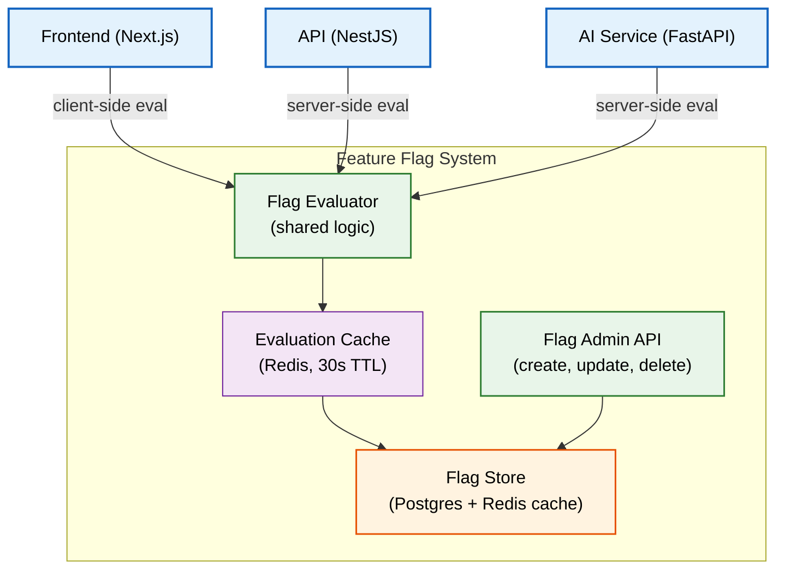
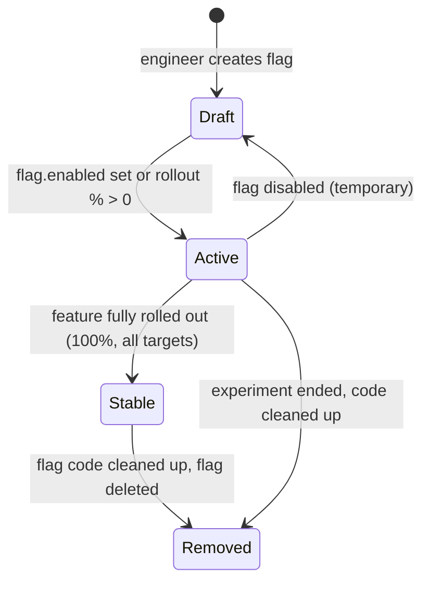

# Feature Flags

> **Purpose:** Define Vaeloom's feature flag system — types, lifecycle, governance, implementation, and integration across API, frontend, and agent layers
> **Status:** 🆕 New
> **Owner:** Architecture Team
> **Version:** 1.0
> **Last Updated:** 2026-07-16
> **Dependencies:** [`Multi-Tenancy.md`](./Multi-Tenancy.md), [`Organizations.md`](./Organizations.md), [`../Backend/API-Architecture.md`](../Backend/API-Architecture.md), [`../DevOps/Configuration-Management.md`](../DevOps/Configuration-Management.md)
> **Implementation Status:** 📋 Spec Only

## Overview

Feature flags (also called feature toggles) decouple code deployment from feature release, enabling trunk-based development, canary releases, A/B testing, and instant kill switches. Vaeloom uses feature flags at three layers: **API/backend** (gate new endpoints or business logic), **frontend** (gate UI components), and **AI agents** (gate agent capabilities, autonomy levels, or model versions per tenant or user).

This document defines the flag system architecture, flag types, lifecycle governance, implementation patterns, and emergency kill-switch procedures. The system must be simple enough that adding a flag takes less than 5 minutes, but robust enough that flags cannot cause dead code accumulation or permission bypasses.

## Goals

- Define flag types and evaluation semantics
- Establish flag lifecycle governance (creation, rollout, stabilization, removal)
- Specify implementation patterns for backend, frontend, and AI layers
- Define emergency kill-switch procedures
- Prevent flag sprawl and dead code accumulation

## Scope

### In Scope

- Flag types (boolean, percentage, targeted, multivariate)
- Flag lifecycle and governance
- Implementation in NestJS (backend), Next.js (frontend), FastAPI (AI service)
- Flag evaluation flow and caching
- Emergency kill switches
- Flag documentation requirements

### Out of Scope

- A/B test statistical analysis — see [`../Product/KPIs.md`](../Product/KPIs.md)
- Configuration management (broader than flags) — see [`../DevOps/Configuration-Management.md`](../DevOps/Configuration-Management.md)

## Architecture



> **Diagram:** Feature flag evaluation flow. Backend and AI services evaluate flags server-side against the Flag Store (Postgres) with a Redis cache (30s TTL). The frontend evaluates a subset of flags client-side via an initial payload seeded at page load.

## Flag Types

| Type | Use Case | Evaluation | Example |
|------|----------|------------|---------|
| **Boolean** | On/off gates for features in development | `flag.enabled` returns true/false | `agent.resume_v2 = true` |
| **Percentage** | Gradual rollout (canary) | Hash(user_id) % 100 < flag.percentage | Roll new agent to 10% of users |
| **Targeted** | Enable for specific users, tenants, plans, orgs | Match against targeting rules | Enable for enterprise tier only |
| **Multivariate** | A/B testing with variants | Assign variant based on hash bucket | Test two different resume layouts |

## Flag Lifecycle



> **Diagram:** Flag lifecycle states. Every flag must progress through this cycle. `Stable` flags (100% rollout, no targeting) must be removed within 30 days — they are dead weight.

## Governance Rules

| Rule | Enforcement |
|------|-------------|
| Every flag must have a JIRA/ticket number in its `description` | CI rejects flags without ticket reference |
| Every flag must have an `owner` (team email) | CI rejects ownerless flags |
| Every flag must have an `expiry_date` (max 90 days from creation) | Expired flags emit a P3 alert; after 30 more days they auto-delete |
| Stable flags (100% rollout) must be removed within 30 days | Nightly scan lists stale flags; blocks release if count > 10 |
| Flag removal must include code cleanup (no dead `if (flag)` branches) | PR reviewer must confirm flag references are removed |

## Implementation Patterns

### Backend (NestJS)

```typescript
// Flag guard decorator
@Injectable()
export class FeatureFlagGuard implements CanActivate {
  constructor(private readonly flags: FlagService) {}

  canActivate(context: ExecutionContext): boolean {
    const { flag, fallback } = Reflect.getMetadata('flag', context.getHandler());
    return this.flags.isEnabled(flag, context.switchToHttp().getRequest(), fallback);
  }
}

// Usage on a controller method
@Controller('v1/resumes')
export class ResumeController {
  @Post('optimize')
  @FeatureFlag('agent.resume_v2', false) // flag name, fallback value
  async optimizeResume(@Body() dto: OptimizeResumeDto) {
    // Only reached if flag is enabled
  }
}
```

### Frontend (Next.js)

```typescript
// Feature flag hook
export function useFlag(flag: string): boolean {
  const flags = useFeatureFlags(); // loaded at app init, refreshed every 30s
  return flags[flag]?.enabled ?? false;
}

// Usage in a component
export function ResumeV2() {
  const enabled = useFlag('agent.resume_v2');
  if (!enabled) return <ResumeV1 />; // fallback
  return <ResumeV2Component />;
}
```

### AI Service (FastAPI)

```python
# Agent flag check
from vaeloom.flags import flag_service

class AgentHarness:
    async def execute(self, mission: AgentMission) -> AgentResult:
        # Check if agent is enabled for this tenant
        if not await flag_service.is_enabled(
            flag="agent.resume",
            context={"tenant_id": mission.tenant_id},
            fallback=True,
        ):
            return AgentResult.skipped(reason="Agent disabled for tenant")

        # Check autonomy level flag
        autonomy = await flag_service.get_variant(
            flag="agent.autonomy_level",
            context={"tenant_id": mission.tenant_id},
            fallback="suggest",
        )
        mission.autonomy = autonomy
        return await self.run(mission)
```

## Data Flow

1. **Creation**: Admin creates flag via Flag Admin API → stored in `feature_flags` table with initial state.
2. **Evaluation**: Client calls `FlagService.isEnabled()` → checks Redis cache (30s TTL) → cache miss → queries Postgres → caches result → returns boolean/variant.
3. **Rollout**: Admin updates flag targeting/percentage via admin API → cache invalidated → next evaluation reflects change.
4. **Removal**: Admin deletes flag; engineer removes all code references → PR review confirms no references remain.

## Database

| Table | Purpose | Key Columns | Indexes |
|-------|---------|-------------|---------|
| `feature_flags` | Flag definitions | `id, name (unique), type, description, owner, ticket, created_at, expiry_date` | PK(id), UNIQUE(name) |
| `flag_variants` | Multivariate variants | `flag_id, variant_key, weight, payload` | (flag_id, variant_key) |
| `flag_targeting` | Targeting rules | `flag_id, attribute (user_id/tenant_id/plan/org_id), operator, value` | (flag_id) |
| `flag_evaluations` | Audit log of evaluations (sampling) | `flag_id, context_hash, result, evaluated_at` | (flag_id, evaluated_at) |

## Security

| Concern | Mitigation | Verification |
|---------|-----------|--------------|
| User spoofing targeting to enable features | Targeting rules evaluated server-side; client cannot set targeting attributes | Server-side eval; client gets only boolean result |
| Flag Admin API accessible by non-admins | RBAC guard on Flag Admin endpoints | Integration test: non-admin gets 403 |
| Flag evaluation leaks user data | Evaluation audit log samples (1%) do not include PII; only context hash | Audit log inspection |

## Performance

| Concern | Budget | Measurement | Optimization |
|---------|--------|-------------|--------------|
| Flag evaluation latency | <2ms per check | Flag service timing | Redis cache (30s TTL); batch eval for multiple flags |
| Frontend flag payload | <5KB | Payload size monitoring | Only send flags relevant to the user's tier/plan |
| Flag store query load | <100 QPS | DB connection monitoring | Cache hit ratio >99% target |

## Scalability

| Dimension | Current Limit | 10x Strategy | 100x Strategy |
|-----------|---------------|--------------|---------------|
| Active flags | ~50 | Governance enforces removal of stable flags | Flag cleanup automation |
| Evaluations/sec | ~10K (cached) | Redis cluster | Local eval cache per service instance |
| Targeting rules per flag | ~100 | Rule engine optimization | Pre-computed targeting sets |

## Error Handling

| Error Scenario | Detection | Mitigation | Recovery |
|----------------|-----------|------------|----------|
| Flag store unavailable | Cache serves stale results | Fallback value used when cache miss + store down | Alert ops; restore store connection |
| Flag misconfigured (no fallback) | CI rejects flags without default | Every `isEnabled()` call requires a fallback parameter | Review flag configuration |
| Expired flag still in code | Nightly scan detects | Alert to owner; 30-day grace period | Owner removes flag or extends expiry |

## Monitoring

| Metric | Alert Threshold | Severity | Dashboard |
|--------|-----------------|----------|-----------|
| `flag_stale_count` (stable >30 days) | >10 | P3 | Governance |
| `flag_expired_count` | >0 | P3 | Governance |
| `flag_eval_cache_miss_rate` | >5% | P3 | Performance |
| `flag_eval_latency_p99` | >10ms | P3 | Performance |

## Emergency Kill Switches

Critical system flags that must never be removed and are always available:

| Flag | Purpose | Default | Trigger |
|------|---------|---------|---------|
| `system.maintenance_mode` | Disable all user-facing features; show maintenance page | `false` | Ops manual flip during incidents |
| `ai.agents_disabled` | Disable all agent execution globally | `false` | AI safety incident; model provider outage |
| `ai.autonomy_blocked` | Force all agents to suggest-mode regardless of tenant setting | `false` | Agent produces harmful output |
| `auth.new_signups_disabled` | Block new user registrations | `false` | Spam attack; security incident |
| `tenant.isolated` | Force single-tenant isolation mode (no cross-tenant anything) | `false` | Suspected cross-tenant data leak |

## Best Practices

| # | Practice | Rationale |
|---|----------|-----------|
| 1 | Always provide a fallback value | Prevents crashes when flag store is unavailable |
| 2 | Remove stable flags within 30 days | Prevents dead `if (flag)` branches from accumulating |
| 3 | Use flags for decoupling deploy from release, not for permanent config | Permanent config belongs in env vars or database settings |
| 4 | Test both branches of every flag in CI | A flag that's only tested when enabled will break when disabled |

## Common Mistakes

| Mistake | Consequence | Fix |
|---------|-------------|-----|
| Leaving dead flag checks in code after removal | Code bloat; confusing conditional branches | PR review must confirm all `if (flag)` references are removed |
| Setting flag targeting based on client-supplied values | User can enable features by modifying requests | Targeting attributes come only from server-side verified context (JWT claims, DB lookup) |
| Too many flags (>50 active) | Cognitive load; testing explosion | Governance: flag expiry + cleanup automation |

## Risks

| Risk | Likelihood | Impact | Mitigation |
|------|-----------|--------|------------|
| Flag sprawl overwhelms governance | High | Medium | Automated expiry + nightly cleanup scan |
| Cache inconsistency during flag rollout | Low | Low (30s max staleness) | Acceptable for non-critical flags; instant invalidation for kill switches |
| Flag evaluation adds latency to every request | Low | Low | Sub-2ms eval with cache; negligible vs. overall request latency |

## Limitations

| Limitation | Impact | Workaround | Future Resolution |
|------------|--------|------------|-------------------|
| No flag-level analytics (who saw which variant) | A/B test analysis requires separate tooling | Integrate with analytics pipeline | Native flag analytics in v2 |
| Client-side flags visible in page source | Users could theoretically modify flags in browser | All permission-critical flags are server-side evaluated | Server-side-only eval for security flags |

## Future Improvements

| Improvement | Priority | Complexity | Timeline |
|-------------|----------|------------|----------|
| Flag analytics dashboard (rollout progress, variant distribution) | High | Medium | Q1 2027 |
| Automated flag cleanup bot (PR-creates flag removal) | Medium | Medium | Q1 2027 |
| Gradual rollout with automated rollback on error-rate spike | High | High | Q2 2027 |

## Related Documents

- [`Multi-Tenancy.md`](./Multi-Tenancy.md) — tenant-scoped flags
- [`Organizations.md`](./Organizations.md) — org-scoped flags
- [`../DevOps/Configuration-Management.md`](../DevOps/Configuration-Management.md) — broader config management
- [`../Backend/API-Architecture.md`](../Backend/API-Architecture.md) — API guard integration
- [`../Product/KPIs.md`](../Product/KPIs.md) — A/B test metrics
