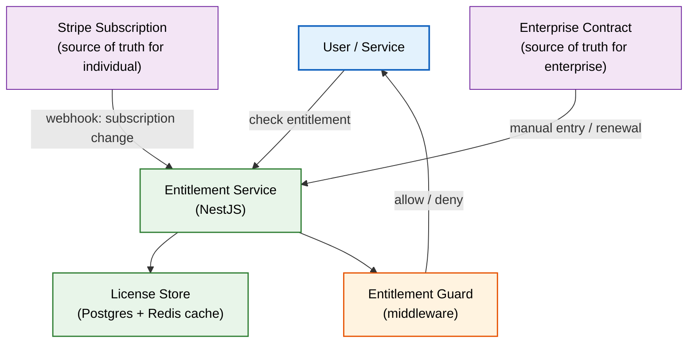
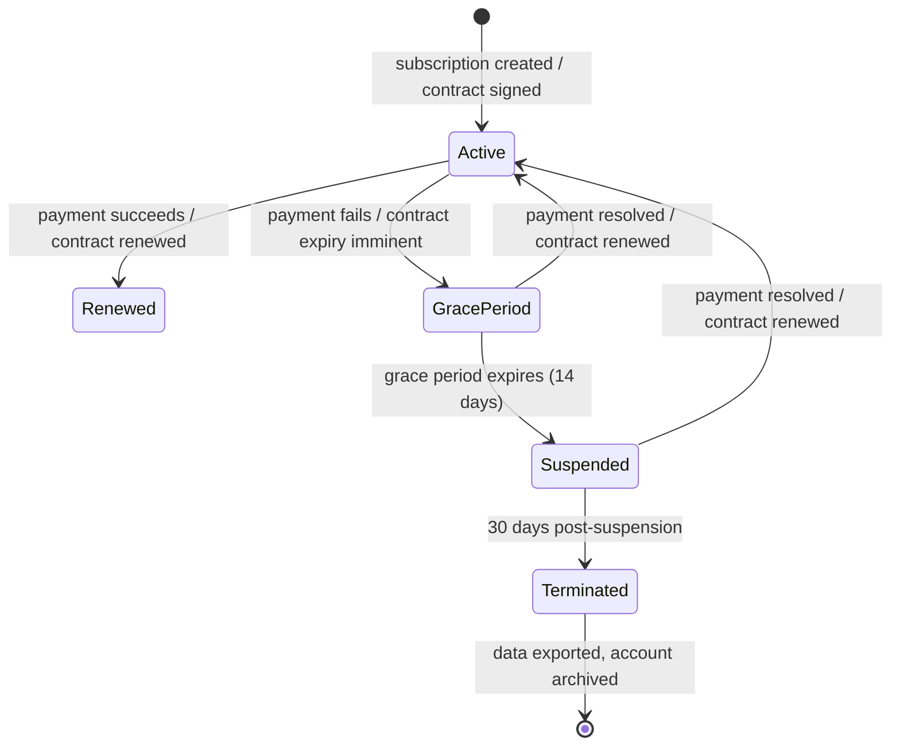

# Licensing

> **Purpose:** Define Vaeloom's software licensing model, license tiers, entitlement management, enforcement, and compliance for individual and enterprise customers
> **Status:** 🆕 New
> **Owner:** Product Team
> **Version:** 1.0
> **Last Updated:** 2026-07-16
> **Dependencies:** [`Billing.md`](./Billing.md), [`Multi-Tenancy.md`](./Multi-Tenancy.md), [`Enterprise-APIs.md`](./Enterprise-APIs.md), [`../Product/Pricing.md`](../Product/Pricing.md)
> **Implementation Status:** 📋 Spec Only

## Overview

Vaeloom is a SaaS product with a subscription-based licensing model. Individual users subscribe to Free, Pro, or Team plans. Enterprise customers sign a negotiated contract with custom terms (seats, data residency, SLA, support). This document defines the licensing model, how entitlements are enforced at runtime, what happens when a license expires, and how the system handles edge cases (grace periods, plan downgrades, contract renewals).

Licensing is not a technical differentiator, but it must be unambiguous. A user who paid for Pro should never see a "upgrade to Pro" prompt. An enterprise tenant on a 500-seat contract should be blocked from adding seat 501, not silently over-billed. This document specifies the rules that make those guarantees hold.

## Goals

- Define the licensing model and entitlement matrix
- Specify runtime license enforcement (API + frontend + AI service)
- Define license lifecycle (activation, renewal, expiry, grace period, termination)
- Handle edge cases (downgrade, overage, contract gap)
- Document the license data model

## Scope

### In Scope

- License tiers and entitlement matrix
- Runtime entitlement enforcement
- License lifecycle (activation, renewal, grace period, termination)
- Enterprise contract licensing (custom terms)
- Overage handling and seat management

### Out of Scope

- Payment processing (see [`Billing.md`](./Billing.md))
- Marketing pricing page (see [`../Product/Pricing.md`](../Product/Pricing.md))

## Architecture



> **Diagram:** License enforcement flow. The Entitlement Service is the single source of truth for what a user or tenant is entitled to use. It reconciles Stripe subscriptions (individuals) and contracts (enterprise), caches results, and exposes a guard that all services call before permitting an action.

## Entitlement Matrix

| Entitlement | Free | Pro ($19/mo) | Team ($49/mo) | Enterprise (Custom) |
|------------|------|-------------|---------------|---------------------|
| Storage | 1 GB | 20 GB | 50 GB | Custom |
| Agent runs/month | 50 | 500 | 1,000 | Custom |
| AI tokens/month | 10K | 200K | 500K | Custom |
| Seats | 1 | 1 | 5 | Custom |
| Specialist agents | 3 (Org, Resume, Scheduler) | All 8 MVP | All 8 MVP + priority | All 28 (Enterprise) |
| Connectors | 1 (manual upload) | 3 (Gmail, GitHub, Drive) | 5 (+ Slack, Calendar) | Custom |
| RAG queries/month | 100 | 5,000 | 10,000 | Custom |
| Knowledge graph nodes | 500 | 50,000 | 200,000 | Custom |
| API access | Read-only | Full | Full + higher limits | Full + enterprise endpoints |
| Support | Community | Email (48h) | Email (24h) | Dedicated + SLA |
| SSO | — | — | — | SAML/OIDC |

## Components

| Component | Responsibility | Technology | Scale Strategy |
|-----------|----------------|-----------|----------------|
| Entitlement Service | Resolve entitlements for a user/tenant; reconcile with Stripe/contracts | NestJS module | Stateless; Redis cache |
| License Store | Persisted entitlement state (plan, limits, expiry) | Postgres | Read replicas |
| Entitlement Guard | Middleware that checks before permitting actions | NestJS guard + FastAPI middleware | Stateless |
| Overage Tracker | Track usage vs limits; block or allow with overage | Redis counters (shared with Billing metering) | Same as Billing |
| Contract Manager | Enterprise contract entry, renewal tracking, custom terms | NestJS module | Low volume; single worker |

## License Lifecycle



> **Diagram:** License lifecycle. The grace period (14 days) preserves access while payment is retried. After suspension, data is preserved for 30 days before termination and archival.

## Workflows

```text
Runtime entitlement check
  1. User initiates an action (e.g., upload document).
  2. Entitlement Guard checks: "Does this user have storage quota remaining?"
  3. Guard queries Entitlement Service → checks Redis cache → if miss, queries Postgres.
  4. If entitled: action proceeds.
  5. If not entitled: 402 Payment Required with upgrade prompt and current usage details.
  6. Usage counter incremented (shared with Billing metering).

Enterprise contract activation
  1. Sales closes deal; uploads contract terms to Contract Manager.
  2. Contract Manager creates license record: tenant_id, plan=enterprise, seats=500, custom_limits, start_date, end_date.
  3. Entitlement Service seeds Redis cache with tenant entitlements.
  4. Tenant Admin can now provision users up to the seat limit.
  5. At 80% seat utilization, alert sent to Tenant Admin.
  6. At 100%, new user provisioning blocked with "contact sales" message.
```

## Security

| Concern | Mitigation | Verification |
|---------|-----------|--------------|
| User spoofing a higher plan | Entitlements resolved server-side from verified Stripe/contract data | Client cannot set plan; all entitlement checks are server-side |
| Enterprise contract tampering | Contract records immutable once signed; changes require new contract version | Audit trail for all contract modifications |
| Grace period abuse (repeated failed payments) | Grace period limited to 2 occurrences per 12-month rolling window | Grace period counter tracked in license store |

## Performance

| Concern | Budget | Measurement | Optimization |
|---------|--------|-------------|--------------|
| Entitlement check latency | <2ms | Guard timing | Redis cache (5-min TTL); invalidation on subscription change |
| Contract creation latency | <5s | Contract Manager timing | Low volume; no optimization needed |
| Seat utilization query | <10ms | API timing | Cached seat count; increment/decrement on member add/remove |

## Scalability

| Dimension | Current Limit | 10x Strategy | 100x Strategy |
|-----------|---------------|--------------|---------------|
| Entitlement checks/sec | ~10K (cached) | Redis cluster | Per-instance local cache with short TTL |
| Enterprise contracts | ~100 | No bottleneck | N/A (low volume) |
| Seat count per tenant | ~1,000 | Pre-computed seat count cache | Sharded seat tracking per department |

## Error Handling

| Error Scenario | Detection | Mitigation | Recovery |
|----------------|-----------|------------|----------|
| Entitlement Service unavailable | Health check failure | Serve cached entitlements (stale but safe: deny access if cache stale >5min) | Restore service; cache repopulates |
| Stripe webhook missed (entitlement stale) | Webhook failure alert | Nightly reconciliation job compares Stripe state vs local state | Manual reconciliation |
| Enterprise contract expires silently | Contract Manager tracks end_date | 60-day and 30-day advance warning emails to Tenant Admin + Vaeloom sales | Renew contract |

## Monitoring

| Metric | Alert Threshold | Severity | Dashboard |
|--------|-----------------|----------|-----------|
| `entitlement_check_latency_p99` | >10ms | P3 | Performance |
| `entitlement_cache_miss_rate` | >5% | P3 | Performance |
| `enterprise_contract_expiring_30d` | Any | P2 | Sales |
| `seat_utilization_pct{tenant_id}` | >80% | P3 (info), >100% P2 | Billing |

## Best Practices

| # | Practice | Rationale |
|---|----------|-----------|
| 1 | Resolve entitlements server-side only | Client-side entitlement checks are trivially bypassable |
| 2 | Cache aggressively but invalidate on subscription change | Most entitlement checks are read-only; caching eliminates DB load |
| 3 | Never hard-delete data on termination | Export and archive; termination is reversible for 90 days |
| 4 | Warn before blocking (80% threshold) | Users should never be surprised by a hard block |

## Common Mistakes

| Mistake | Consequence | Fix |
|---------|-------------|-----|
| Trusting the plan field from the JWT without re-checking | JWT may be stale (issued before plan change) | Re-resolve entitlements from source of truth on every write action |
| Not handling downgrade gracefully | User downgrades from Pro to Free but has 15 GB of data | On downgrade, warn user about data exceeding new limit; enter read-only grace period |

## Risks

| Risk | Likelihood | Impact | Mitigation |
|------|-----------|--------|------------|
| Stripe webhook delivery gap causes entitlement drift | Medium | Medium | Nightly reconciliation; manual reconcile tool |
| Enterprise customer disputes seat count | Medium | Medium (financial) | Clear contract language; real-time seat utilization dashboard |

## Limitations

| Limitation | Impact | Workaround | Future Resolution |
|------------|--------|------------|-------------------|
| No usage-based overage purchasing | Users blocked at plan limit | Upgrade prompt; no pay-as-you-go | Usage-based overage (Q1 2027) |
| No license transfer between tenants | Enterprise mergers require manual migration | Export + import via support | License transfer API |

## Future Improvements

| Improvement | Priority | Complexity | Timeline |
|-------------|----------|------------|----------|
| Usage-based overage (pay for what you use beyond plan) | High | Medium | Q1 2027 |
| Self-service contract renewal portal | Medium | Medium | Q2 2027 |
| License transfer between tenants | Low | High | Q3 2027 |

## Related Documents

- [`Billing.md`](./Billing.md) — payment and metering
- [`Multi-Tenancy.md`](./Multi-Tenancy.md) — tenant isolation
- [`Enterprise-APIs.md`](./Enterprise-APIs.md) — enterprise-specific endpoints
- [`../Product/Pricing.md`](../Product/Pricing.md) — plan definitions
- [`../Security/Audit-Logs.md`](../Security/Audit-Logs.md) — license change audit trail
