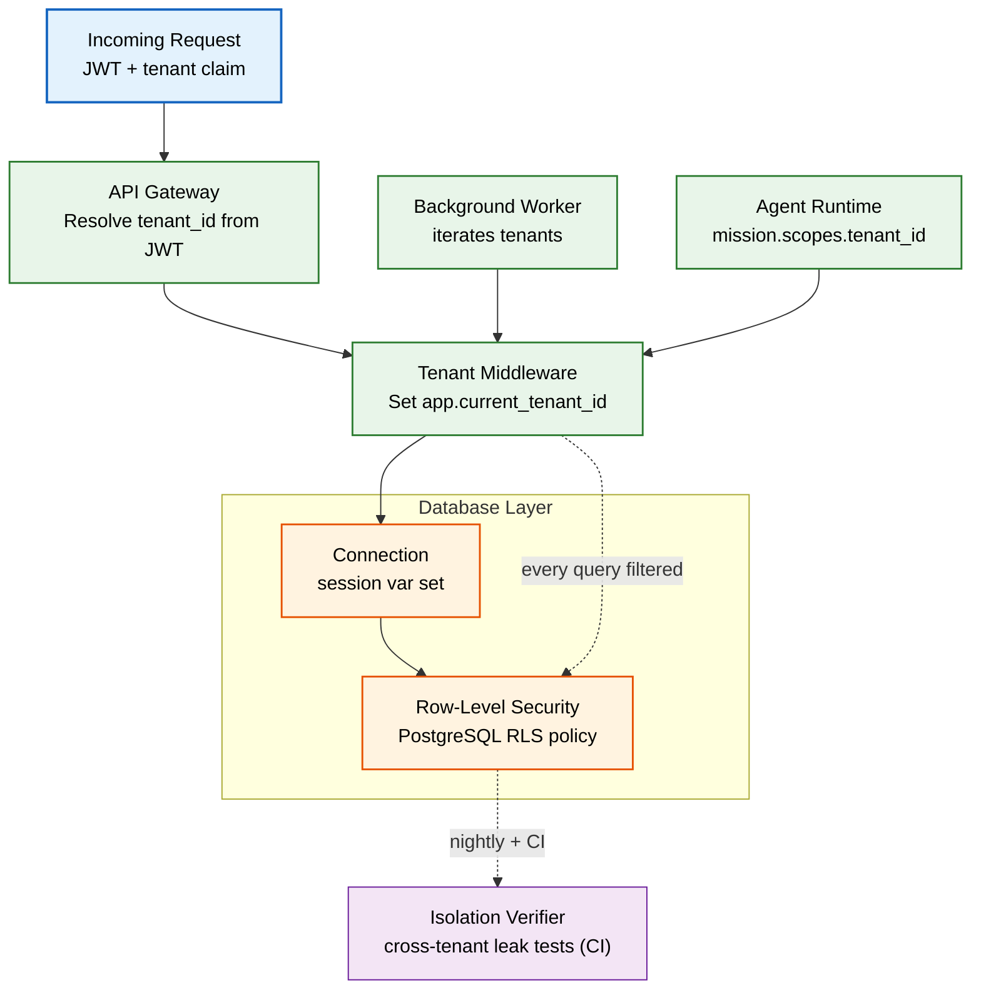
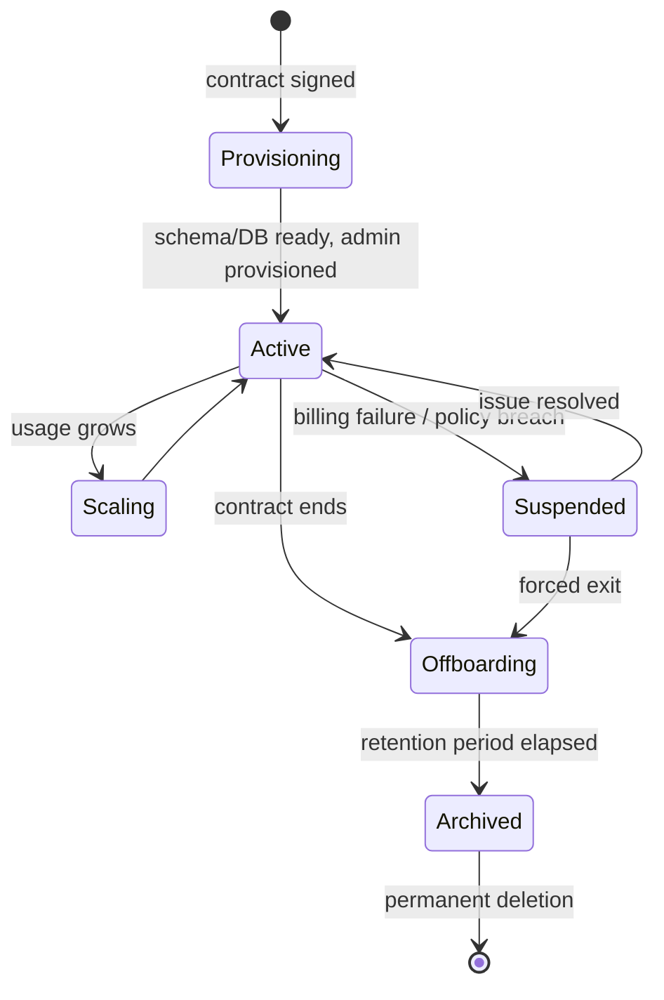
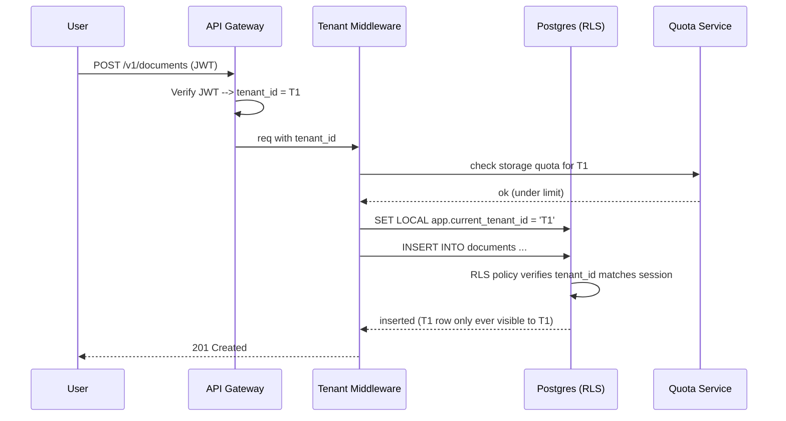

# Multi-Tenancy

> **Purpose:** Define Vaeloom's multi-tenant data architecture, tenant lifecycle, isolation enforcement, and tenant-scoped resource management
> **Status:** 🆕 New
> **Owner:** Architecture Team
> **Version:** 1.0
> **Last Updated:** 2026-07-16
> **Dependencies:** [`Enterprise-Architecture.md`](./Enterprise-Architecture.md), [`../Backend/RBAC.md`](../Backend/RBAC.md), [`../Backend/ABAC.md`](../Backend/ABAC.md), [`../Database/Schema.md`](../Database/Schema.md)
> **Implementation Status:** 📋 Spec Only

## Overview

A *tenant* is the top-level isolation boundary in Vaeloom Enterprise — typically a university, employer, bootcamp, or any organization that owns a population of member users. Every row of tenant-owned data (documents, memories, agent runs, connectors, audit events) carries a `tenant_id`, and no cross-tenant query is ever permitted. This document specifies how tenancy is modeled, how the tenant context is established on every request, how isolation is enforced and verified, and how tenant lifecycle events (provision, scale, suspend, offboard) are handled.

This is the standalone, implementation-ready companion to [`Enterprise-Architecture.md`](./Enterprise-Architecture.md), which covers the broader enterprise picture (SSO, audit pipeline, compliance, private cloud). Whereas that doc is architectural, this doc is operational: it is the contract an engineer implements against when adding any new tenant-scoped resource.

Multi-tenancy is critical because it is the single most common source of data-leak incidents in SaaS. A missing `WHERE tenant_id =` clause, a shared connection pool that forgets to set the session variable, or a background job that iterates tenants without resetting context can all expose one customer's data to another. The model below makes the safe path the default path.

## Goals

- Define the tenant model and the isolation levels Vaeloom supports
- Specify how tenant context is established, propagated, and verified on every request
- Define the tenant lifecycle (provisioning, scaling, suspension, offboarding)
- Establish verifiable isolation guarantees and the tests that enforce them
- Document tenant-scoped resource limits, quotas, and rate limiting

## Scope

### In Scope

- Tenant data model and identity
- Isolation models (database-per-tenant, row-level security, hybrid) at the implementation level
- Tenant context propagation across API, background jobs, and agents
- Tenant lifecycle operations
- Tenant quotas, limits, and rate limiting
- Cross-tenant leak testing

### Out of Scope

- SSO/SAML/OIDC federation — see [`Enterprise-Architecture.md`](./Enterprise-Architecture.md)
- Billing and metering — see [`Billing.md`](./Billing.md)
- Organization/team structure within a tenant — see [`Organizations.md`](./Organizations.md)
- Compliance audit pipeline — see [`Enterprise-Architecture.md`](./Enterprise-Architecture.md)

## Architecture



> **Diagram:** Tenant context is resolved once at the gateway, set as a session variable before any query runs, and enforced by PostgreSQL RLS so that even an application bug cannot bypass isolation. The verifier continuously proves the guarantee holds.

## Components

| Component | Responsibility | Technology | Scale Strategy |
|-----------|----------------|-----------|----------------|
| API Gateway | Resolve `tenant_id` from verified JWT; reject requests with missing/invalid tenant claim | NestJS middleware | Stateless; horizontal scale |
| Tenant Middleware | Set `app.current_tenant_id` session var per request/connection | NestJS + pg driver | Per-connection for DB-per-tenant; per-statement for RLS pool |
| RLS Policies | Enforce `tenant_id = current_setting(...)` on every tenant-scoped table | PostgreSQL RLS | Indexed `(tenant_id, ...)` columns |
| Tenant Registry | Source of truth for tenant existence, status, isolation model, limits | `tenants` table + cache | Read-through cache; invalidate on change |
| Quota Service | Track per-tenant usage (storage, agent runs, seats) and enforce limits | Redis counters + Postgres | Redis for hot counters; nightly Postgres reconcile |
| Isolation Verifier | Automated cross-tenant leak test suite | Test runner (pytest/vitest) | Runs in CI + nightly |

## Isolation Models

Vaeloom supports three isolation levels; the choice is per-tenant and recorded in `tenants.isolation_mode`:

| Model | Mechanism | When to use | Operational cost |
|-------|-----------|-------------|------------------|
| **Pool (RLS)** | Single shared database; PostgreSQL RLS filters every row by `tenant_id` | Default; SMB enterprises; most customers | Lowest |
| **Silo (DB-per-tenant)** | Dedicated database per tenant; full physical isolation | Regulated customers (HIPAA, finance); data-residency requirements | Highest |
| **Hybrid** | PII/sensitive tables in a per-tenant silo; the rest in a shared RLS pool | Customers needing tiered sensitivity | Medium |

### Implementation: RLS (default)

```sql
-- Every tenant-scoped table carries tenant_id and enables RLS
ALTER TABLE documents ENABLE ROW LEVEL SECURITY;
ALTER TABLE documents FORCE ROW LEVEL SECURITY;  -- applies even to table owners

CREATE POLICY tenant_isolation ON documents
  USING (tenant_id = current_setting('app.current_tenant_id', true)::UUID);

-- Composite indexes make the RLS predicate cheap
CREATE INDEX CONCURRENTLY idx_documents_tenant_created
  ON documents (tenant_id, created_at DESC);
```

```typescript
// NestJS middleware sets the session variable once per request,
// BEFORE handing control to any service / repository.
@Injectable()
export class TenantContextMiddleware implements NestMiddleware {
  constructor(private readonly db: PgPool) {}

  async use(req: Request, _res: Response, next: NextFunction) {
    const tenantId = req.user?.tenant_id; // populated by the auth guard from the JWT
    if (!tenantId) throw new UnauthorizedException('Missing tenant claim');

    // Set on the checked-out connection. With PgBouncer transaction mode,
    // this is re-asserted inside a transaction wrapper per query batch.
    await this.db.query(`SET LOCAL app.current_tenant_id = $1`, [tenantId]);
    next();
  }
}
```

### Implementation: Database-per-tenant (silo)

```typescript
// A connection-pool registry keyed by tenant_id. Pools are created lazily
// on first request and capped to avoid unbounded growth.
@Injectable()
export class TenantConnectionRegistry {
  private pools = new Map<string, Pool>();

  async forTenant(tenantId: string): Promise<Pool> {
    let pool = this.pools.get(tenantId);
    if (!pool) {
      const cfg = await this.tenants.getDbConfig(tenantId); // host, db name, creds
      pool = new Pool({ ...cfg, max: 10, idleTimeoutMillis: 30000 });
      this.pools.set(tenantId, pool);
    }
    return pool;
  }
}
```

## Tenant Lifecycle



> **Diagram:** Tenant states. Suspended tenants are read-only (data preserved, writes blocked). Offboarding starts a retention timer; data is archived (encrypted, cold) and only purged after the contractual retention window, unless under legal hold.

### Provisioning steps

1. Create `tenants` row with `isolation_mode`, `region`, `plan`, `status = provisioning`.
2. If silo: provision database via Terraform, run migrations, record connection config in secrets manager.
3. If pool: no DDL needed; RLS already in place.
4. Provision tenant admin user and seed default roles/quotas.
5. Emit `tenant.provisioned` event ([`../Backend/Event-Catalog.md`](../Backend/Event-Catalog.md)).
6. Flip `status = active`.

## Workflows

```text
Per-request tenant enforcement
  1. Auth guard verifies JWT; extracts tenant_id claim.
  2. Tenant middleware confirms tenant exists and status = active (else 401/403).
  3. Session variable set on the DB connection (pool) OR correct pool selected (silo).
  4. Every repository query runs; RLS filters rows automatically.
  5. On response, the connection's session state is reset before return to pool.

Background job tenant iteration
  1. Worker queries tenant registry for active tenants.
  2. For each tenant, open a scoped transaction that SETs app.current_tenant_id.
  3. Run the job. Assert no query escaped scope (verifier hook).
  4. Commit/rollback; the SET LOCAL dies with the transaction boundary.
```

## Sequence Diagrams



## Data Flow

1. **Ingestion**: Every tenant-owned resource is stamped with `tenant_id` at the controller boundary — never trusted from the client body.
2. **Storage**: All tenant-scoped tables have `tenant_id` as the first column of their primary/compound index; RLS enforces filtering even if app code forgets.
3. **Retrieval**: Every read path goes through RLS; there is no "admin bypass" path that skips tenant filtering — admin tools operate via explicit, audited, per-tenant context switches.
4. **Deletion**: Soft-delete per tenant; hard deletion only at archive-purge time and only if no legal hold.
5. **Export**: Tenant data export is itself a tenant-scoped operation; an export job inherits `tenant_id` and cannot read another tenant's data.

## APIs

| Endpoint | Method | Purpose | Auth |
|----------|--------|---------|------|
| `/v1/tenants/:id` | GET | Tenant metadata (admin only) | Platform Admin |
| `/v1/tenants` | POST | Provision a new tenant | Platform Admin |
| `/v1/tenants/:id` | PATCH | Update plan, limits, status | Platform Admin |
| `/v1/tenants/:id/suspend` | POST | Suspend tenant (read-only) | Platform Admin |
| `/v1/tenants/:id/offboard` | POST | Begin offboarding + retention timer | Platform Admin |

## Database

| Table | Purpose | Key Columns | Indexes |
|-------|---------|-------------|---------|
| `tenants` | Tenant registry | `id, name, isolation_mode, status, plan, region` | PK(id), status |
| `tenant_quotas` | Per-tenant limits | `tenant_id, resource, limit, used` | (tenant_id, resource) |
| `tenant_scoped_*` | All tenant data | `..., tenant_id, ...` | `(tenant_id, created_at)` on every table |

## Security

| Concern | Mitigation | Verification |
|---------|-----------|--------------|
| Cross-tenant read via missing WHERE clause | PostgreSQL RLS enforces filtering at the DB, independent of app code | Nightly + CI cross-tenant leak test suite |
| Session variable bleed between pooled connections | `SET LOCAL` inside explicit transactions; connection reset on release | Pool wrapper asserts variable is unset on checkout |
| Background job operating on wrong tenant | Jobs always open a scoped transaction per tenant; `SET LOCAL` auto-clears at commit | Verifier hook fails job if a query runs outside a tenant-scoped txn |
| Tenant claim forgery | `tenant_id` is a signed JWT claim, never a request body/header field | Gateway rejects any client-supplied tenant_id |
| Admin tool bypassing isolation | No skip-RLS code path exists; admin context-switch is itself a tenant-scoped, audited action | Code search CI rule blocks `BYPASSRLS` / `SECURITY DEFINER` without exception |

## Performance

| Concern | Budget | Measurement | Optimization |
|---------|--------|-------------|--------------|
| RLS predicate cost | <1ms per query | Query timing percentiles | Composite index on `(tenant_id, ...)` for every access pattern |
| Tenant existence check per request | <5ms (cached) | Middleware timing | Read-through cache; invalidate on tenant change event |
| Quota check per write | <3ms | Quota service latency | Redis counters; nightly Postgres reconciliation |
| Silo connection-pool memory | Linear in tenant count, capped | Pool registry size | Idle pool eviction; shared infra for cold tenants |

## Scalability

| Dimension | Current Limit | 10x Strategy | 100x Strategy |
|-----------|---------------|--------------|---------------|
| Tenants (pool mode) | ~5,000 on shared DB | Read replicas + connection pooling (PgBouncer txn mode) | Shard by tenant_id hash; routing layer |
| Tenants (silo mode) | ~500 (ops cost bound) | Automated DB provisioning + connection registry cap | Pool-of-silos; cold tenants archived to pool |
| Rows per tenant | ~10M | Partitioning by created_at within tenant | Archival of cold rows to object storage |
| Requests/sec per tenant | Tenant-level rate limit | Token-bucket in Redis per tenant | Distributed limiter; per-region buckets |

## Error Handling

| Error Scenario | Detection | Mitigation | Recovery |
|----------------|-----------|------------|----------|
| Tenant not found / status != active | Middleware lookup | Return 401/403; do not leak existence | Admin reactivates tenant |
| Session variable not set (pool bug) | Verifier: any query with NULL tenant context fails | Connection wrapper sets default that matches zero rows | Pool eviction + alert |
| Quota exceeded | Quota service check | 402/429 with Retry-After | Plan upgrade or usage cleanup |
| Cross-tenant leak detected | Verifier in CI/nightly | Page on-call; freeze deploy | Root-cause; add regression test; rotate any leaked data |

## Monitoring

| Metric | Alert Threshold | Severity | Dashboard |
|--------|-----------------|----------|-----------|
| `tenant_query_tenant_missing_total` (queries with no tenant context) | >0 | P1 | Isolation |
| `cross_tenant_leak_test_failures` | >0 | P1 | Isolation |
| `tenant_quota_rejections{resource}` | Sustained spike per tenant | P3 | Quotas |
| `tenant_provisioning_duration_seconds` | p99 > 120s | P3 | Lifecycle |
| `suspended_tenants_count` | Any unexpected | P2 | Lifecycle |

## Examples

```bash
# Provision a tenant (Platform Admin only)
curl -X POST https://api.vaeloom.dev/v1/tenants \
  -H "Authorization: Bearer $PLATFORM_ADMIN_TOKEN" \
  -d '{"name":"Acme Corp","isolation_mode":"pool","plan":"enterprise","region":"us-east-1"}'
```

```typescript
// Every repository extends TenantScopedRepository, making the safe path default.
abstract class TenantScopedRepository<T> {
  protected abstract tenantId: string; // injected from request context

  async findById(id: string): Promise<T | null> {
    // No WHERE tenant_id clause needed — RLS enforces it. But we still scope
    // at the app layer as defense-in-depth.
    return this.db.oneOrNone(
      `SELECT * FROM ${this.table} WHERE id = $1 AND tenant_id = $2`,
      [id, this.tenantId],
    );
  }
}
```

## Best Practices

| # | Practice | Rationale |
|---|----------|-----------|
| 1 | Make RLS the default; require explicit justification for silo | RLS gives sufficient isolation for ~95% of customers at a fraction of the ops cost |
| 2 | Never accept `tenant_id` from the client body | The tenant claim must come only from the verified JWT |
| 3 | Use `SET LOCAL`, not `SET`, for tenant context | `SET LOCAL` is scoped to the transaction and cannot bleed across pooled connections |
| 4 | Add a cross-tenant leak test for every new tenant-scoped table | Isolation that isn't continuously tested will silently decay |
| 5 | Cap silo connection pools and evict idle ones | Unbounded per-tenant pools exhaust database connections at scale |
| 6 | Treat admin "view as tenant" as an audited tenant-scoped action | Preserves the audit trail and prevents unscoped admin reads |

## Common Mistakes

| Mistake | Consequence | Fix |
|---------|-------------|-----|
| Forgetting `FORCE ROW LEVEL SECURITY` | Table owner bypasses RLS; app bugs leak data | Always use `FORCE`; CI rule blocks tables without it |
| Setting tenant context with `SET` (not `SET LOCAL`) | Context leaks to next request reusing the pooled connection | Use `SET LOCAL` inside an explicit transaction |
| Querying the `tenants` table without caching | Per-request DB hit for tenant existence at high QPS | Read-through cache invalidated by `tenant.updated` events |
| Sharing a single Redis quota key namespace across tenants | One tenant's counter collides with another's | Namespaced keys: `quota:{tenant_id}:{resource}` |

## Risks

| Risk | Likelihood | Impact | Mitigation |
|------|-----------|--------|------------|
| RLS policy drift as schema evolves | Medium | High (cross-tenant leak) | CI gate: any tenant-scoped table without RLS fails the build |
| Silo ops cost grows faster than revenue | Medium | Medium | Migrate cold/quiet silo tenants to pool mode via archive/replay |
| Quota check becomes a write hot-spot | Low | Medium | Redis counters with periodic Postgres reconcile; cache limits |

## Limitations

| Limitation | Impact | Workaround | Future Resolution |
|------------|--------|------------|-------------------|
| Cross-tenant analytics require an explicit ETL | Platform reporting needs a separate warehouse | Nightly anonymized export to analytics warehouse | Tenant-aware data-mart with differential privacy |
| Silo-to-pool migration is offline | Customer downtime during migration | Schedule in maintenance window | Online dual-write migration tool |
| No cross-tenant search by design | Global search is impossible (correct behavior) | Per-tenant search only | Intentional; not a gap |

## Future Improvements

| Improvement | Priority | Complexity | Timeline |
|-------------|----------|------------|----------|
| Automated silo→pool migration tool | High | High | Q2 2027 |
| Per-tenant encryption keys with auto-rotation | High | Medium | Q1 2027 |
| Tenant-aware cost attribution dashboard | Medium | Medium | Q1 2027 |
| Self-service tenant provisioning via marketplace | Low | High | Q3 2027 |

## Related Documents

- [`Enterprise-Architecture.md`](./Enterprise-Architecture.md) — broader enterprise architecture (SSO, audit, compliance)
- [`Organizations.md`](./Organizations.md) — team/department structure within a tenant
- [`Billing.md`](./Billing.md) — tenant billing and metering
- [`../Backend/RBAC.md`](../Backend/RBAC.md) · [`../Backend/ABAC.md`](../Backend/ABAC.md) — authorization models
- [`../Database/Schema.md`](../Database/Schema.md) · [`../Database/Data-Dictionary.md`](../Database/Data-Dictionary.md) — schema and dictionary
