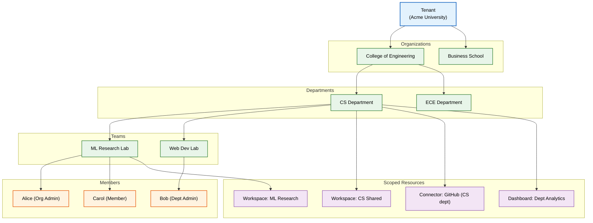
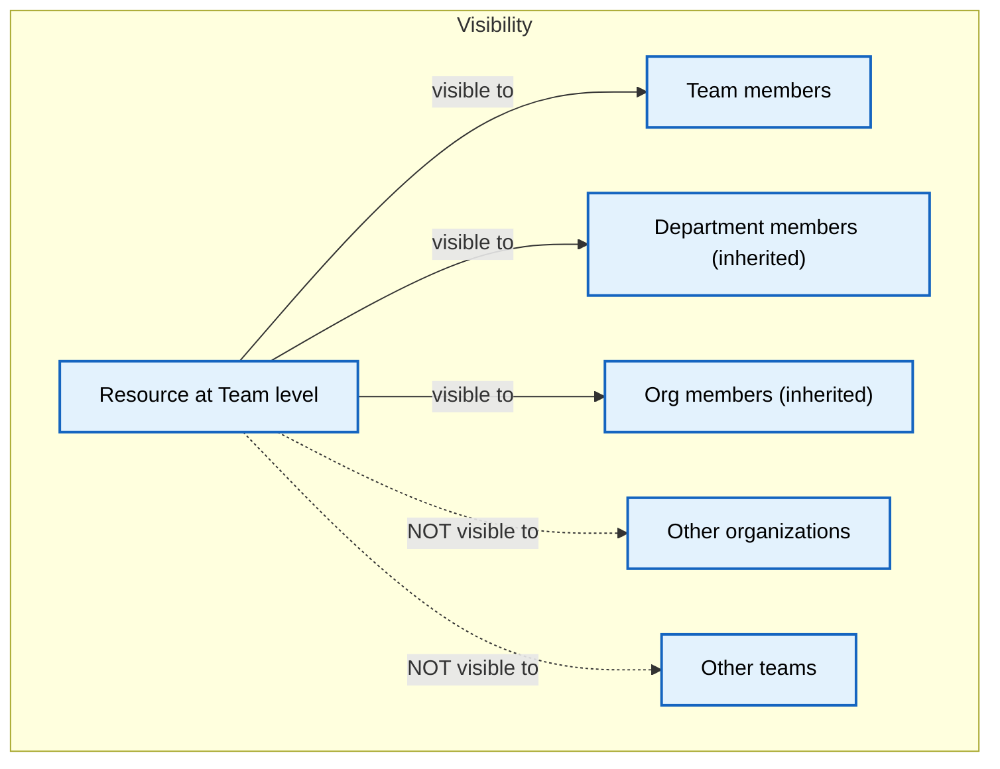
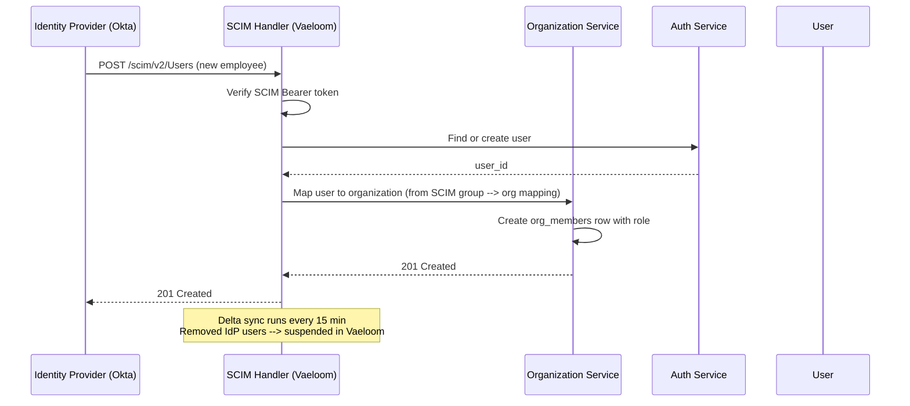

# Organizations

> **Purpose:** Define the organization and team structure model within a Vaeloom enterprise tenant — departments, groups, member roles, and hierarchical resource scoping
> **Status:** 🆕 New
> **Owner:** Architecture Team
> **Version:** 1.0
> **Last Updated:** 2026-07-16
> **Dependencies:** [`Multi-Tenancy.md`](./Multi-Tenancy.md), [`Enterprise-Architecture.md`](./Enterprise-Architecture.md), [`Billing.md`](./Billing.md), [`../Backend/RBAC.md`](../Backend/RBAC.md), [`../Backend/ABAC.md`](../Backend/ABAC.md)
> **Implementation Status:** 📋 Spec Only

## Overview

An *organization* is the structural container within a Vaeloom tenant that groups users into departments, teams, or cohorts and scopes shared resources (workspaces, connector configurations, agent policies, analytics dashboards). While a tenant is the isolation boundary enforced by the database, an organization is the administrative boundary enforced by the application — it determines who sees what, who can manage whom, and how resources are shared or partitioned within a single tenant.

This document specifies the data model, the hierarchy (tenant → organization → department → team → member), the RBAC/ABAC integration, the SCIM provisioning flow, and the resource-scoping rules that make organizations work. For a university tenant, organizations might be "College of Engineering" → "Computer Science Department" → "ML Research Lab." For an employer, "Engineering Division" → "Platform Team" → "Backend Squad."

## Goals

- Define the organization data model and hierarchy
- Specify how organizations scope shared resources (workspaces, connectors, policies)
- Document RBAC roles within organizations and the ABAC policy integration
- Establish SCIM provisioning and deprovisioning for organization members
- Define resource visibility rules across organization boundaries

## Scope

### In Scope

- Organization and department data model
- Member roles and permissions within organizations
- Resource scoping (workspaces, connectors, dashboards)
- SCIM provisioning integration
- Organization-level analytics and admin views
- Cross-organization visibility rules

### Out of Scope

- Tenant-level isolation (see [`Multi-Tenancy.md`](./Multi-Tenancy.md))
- Billing and seat management (see [`Billing.md`](./Billing.md))
- Individual user account management (see [`../Backend/Authentication.md`](../Backend/Authentication.md))

## Architecture



> **Diagram:** The tenant → organization → department → team hierarchy. Resources are scoped to the level at which they are created; a workspace created at the department level is visible to all teams and members within that department.

## Components

| Component | Responsibility | Technology | Scale Strategy |
|-----------|----------------|-----------|----------------|
| Organization Service | CRUD for orgs/departments/teams; hierarchy enforcement | NestJS module | Stateless; horizontal |
| Membership Service | Add/remove members; role assignment; SCIM sync | NestJS module + Redis cache | Cache org membership for fast authz |
| Resource Scope Resolver | Determine which resources a member can access based on org hierarchy | NestJS middleware | Cached scope tree; invalidation on change |
| SCIM Sync Handler | Receive SCIM provisioning events from IdP | NestJS webhook | Event-driven; idempotent |
| Org Analytics | Aggregate analytics scoped to org/dept/team | NestJS module + Postgres aggregates | Read replicas for heavy queries |

## Data Model

| Table | Purpose | Key Columns | Indexes |
|-------|---------|-------------|---------|
| `organizations` | Top-level org within tenant | `id, tenant_id, name, parent_id (nullable), type (org/dept/team)` | PK(id), (tenant_id, parent_id) |
| `org_members` | Member-to-org relationship with role | `user_id, org_id, role, joined_at` | UNIQUE(user_id, org_id), (org_id) |
| `org_resources` | Resource ownership scoped to org level | `resource_id, resource_type, org_id, created_at` | (org_id, resource_type) |
| `org_policies` | Organization-level ABAC policies | `org_id, effect, action, resource, condition` | (org_id) |

## Organization Roles

| Role | Scope | Permissions |
|------|-------|-------------|
| **Tenant Admin** | Entire tenant | Manage orgs, billing, SSO; full access to all tenant data |
| **Org Admin** | Organization + children | Create departments/teams; manage members; manage connectors; view analytics |
| **Department Admin** | Department + children | Manage teams and members; manage department-level resources |
| **Member** | Assigned org/dept/team | Read/write own data; use shared resources; view scoped analytics |
| **Viewer** | Assigned org/dept/team | Read-only access to shared resources; no agent execution |

## Resource Visibility Rules



> **Diagram:** Visibility flows up the hierarchy (child → parent), never sideways or down. A workspace created in "ML Research Lab" is visible to members of ML Research Lab, the CS Department (parent), and the College of Engineering (grandparent), but not to the ECE Department.

## SCIM Provisioning



## Workflows

```text
Create organization
  1. Tenant Admin navigates to Admin → Organizations.
  2. Fills org name, type (org/dept/team), optional parent.
  3. Backend validates: parent exists within same tenant; name uniqueness within parent.
  4. Creates organizations row + default admin policy.
  5. Emits org.created event.
  6. Assigns creator as Org Admin.

Remove member
  1. Org Admin or above selects member → Remove.
  2. Backend soft-deletes org_members row (retained for audit).
  3. Revokes access to all org-scoped resources.
  4. Emits org.member.removed event.
  5. Member's personal data (documents, memories) remains; shared workspace access ends.
```

## Security

| Concern | Mitigation | Verification |
|---------|-----------|--------------|
| Cross-org resource access | Resource scope resolver checks org hierarchy before granting access | Integration test: member of Org A cannot read Org B resources |
| SCIM token compromise | SCIM Bearer token scoped to tenant; rotated every 90 days | Token stored in Secrets Manager; audit all SCIM calls |
| Orphaned members | SCIM sync removes IdP-deleted users; fallback cron catches stale memberships | Nightly reconciliation job |
| Admin escalating beyond tenant scope | Tenant Admin is a tenant-level role enforced by the auth guard; Org Admin cannot promote to Tenant Admin | RBAC policy engine rejects impossible transitions |

## Performance

| Concern | Budget | Measurement | Optimization |
|---------|--------|-------------|--------------|
| Org hierarchy resolution | <5ms per request | Authz middleware timing | Cache scope tree in Redis; invalidate on org structure change |
| SCIM sync for 10K users | <60s per sync cycle | SCIM handler duration | Delta sync (not full); batch DB writes |
| Org analytics aggregation | <3s for department-level rollup | Query timing | Materialized views for org-level aggregates |

## Scalability

| Dimension | Current Limit | 10x Strategy | 100x Strategy |
|-----------|---------------|--------------|---------------|
| Organizations per tenant | ~100 | Nested set model for hierarchy queries | Shared-nothing org partitions |
| Members per organization | ~500 | Cached membership lists | Eventual-consistent membership; fan-out queries |
| SCIM sync volume | ~10K users/cycle | Batch processing + parallelism | Streaming SCIM with cursor-based pagination |

## Error Handling

| Error Scenario | Detection | Mitigation | Recovery |
|----------------|-----------|------------|----------|
| Circular org hierarchy | Validation on create (parent chain check) | Reject with 400 | Admin restructures hierarchy |
| SCIM sync fails mid-batch | Transaction per user; failed users logged | Retry on next sync cycle | Manual reconciliation from SCIM error log |
| Org deletion with active resources | Prevent deletion until resources reassigned or archived | Block delete; prompt admin for reassignment | Admin reassigns, then deletes |

## Monitoring

| Metric | Alert Threshold | Severity | Dashboard |
|--------|-----------------|----------|-----------|
| `scim_sync_errors_total` | >0 | P2 | Enterprise |
| `org_hierarchy_depth` | >6 levels | P3 | Architecture |
| `org_member_count{org_id}` | Near seat limit | P2 | Billing |
| `scim_sync_duration_seconds` | p99 > 120s | P3 | Enterprise |

## Best Practices

| # | Practice | Rationale |
|---|----------|-----------|
| 1 | Keep org hierarchy shallow (≤5 levels) | Deep hierarchies create expensive recursive queries and confusing permission inheritance |
| 2 | Use SCIM groups for org membership, not manual assignment | Automated provisioning scales; manual assignment drifts and creates stale access |
| 3 | Always inherit visibility upward, never downward | Prevents a team admin from accessing data they shouldn't see in sibling teams |
| 4 | Cache the org scope tree in Redis | The hierarchy changes infrequently but is checked on every request; caching avoids DB queries |

## Common Mistakes

| Mistake | Consequence | Fix |
|---------|-------------|-----|
| Allowing org admins to create sub-orgs at any depth | Unbounded hierarchy creates permission confusion | Cap depth at 5 levels; require Tenant Admin for top-level orgs |
| Not syncing SCIM deletions | Departed employees retain access | SCIM delete → immediate access revocation; nightly reconciliation |
| Assigning resources to individual members instead of orgs | When members leave, resources become orphaned | Always scope resources to the org; member access is derived from org membership |

## Risks

| Risk | Likelihood | Impact | Mitigation |
|------|-----------|--------|------------|
| Complex org hierarchies confuse users | Medium | Medium | Limit depth; provide clear UI for hierarchy navigation |
| SCIM sync lag leaves stale members | Medium | High (access after departure) | 15-minute sync + audit for gap detection |

## Limitations

| Limitation | Impact | Workaround | Future Resolution |
|------------|--------|------------|-------------------|
| No cross-tenant organizations | Users in separate tenants cannot collaborate | Manual data export/import | Cross-tenant sharing via invitation links (v2) |
| Org analytics limited to 90-day window | Longer-term trends not visible | Export to external BI tool | Historical data mart |

## Future Improvements

| Improvement | Priority | Complexity | Timeline |
|-------------|----------|------------|----------|
| Organization templates (pre-configured structures for common org types) | Medium | Medium | Q1 2027 |
| Cross-org collaboration spaces | Medium | High | Q2 2027 |
| Org-level AI agent policies (restrict which agents an org can use) | High | Low | Q4 2026 |

## Related Documents

- [`Multi-Tenancy.md`](./Multi-Tenancy.md) — tenant isolation (the layer above organizations)
- [`Billing.md`](./Billing.md) — seat-based billing per organization
- [`Enterprise-Architecture.md`](./Enterprise-Architecture.md) — SSO/SCIM integration
- [`../Backend/RBAC.md`](../Backend/RBAC.md) · [`../Backend/ABAC.md`](../Backend/ABAC.md) — authorization models
- [`Feature-Flags.md`](./Feature-Flags.md) — org-scoped feature flags
