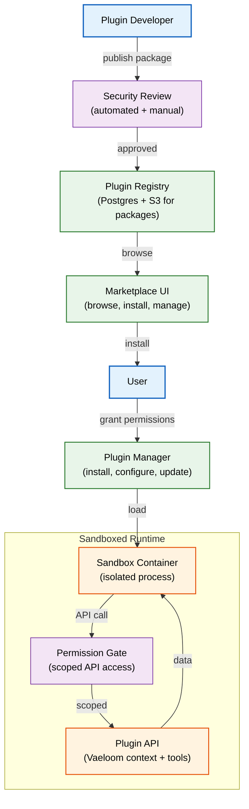
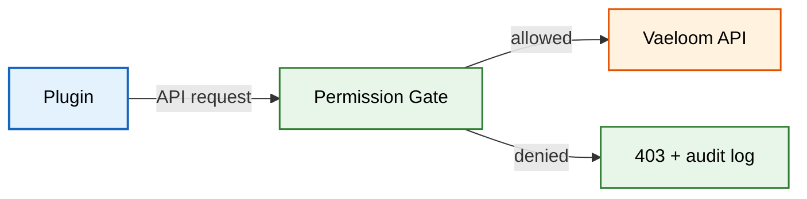
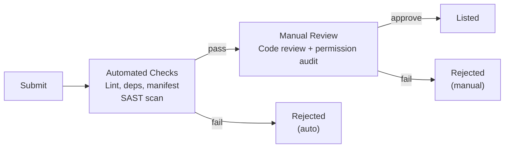

# Plugin Marketplace

> **Purpose:** Define Vaeloom's plugin marketplace architecture — how third-party and first-party plugins are discovered, installed, managed, sandboxed, and monetized
> **Status:** 🆕 New
> **Owner:** Architecture Team
> **Version:** 1.0
> **Last Updated:** 2026-07-16
> **Dependencies:** [`Multi-Tenancy.md`](./Multi-Tenancy.md), [`../AI/MCP.md`](../AI/MCP.md), [`../Backend/Connectors.md`](../Backend/Connectors.md), [`../Security/Threat-Model.md`](../Security/Threat-Model.md)
> **Implementation Status:** 📋 Spec Only

## Overview

Vaeloom's plugin marketplace extends the platform with third-party integrations, custom agent tools, data source connectors, and workflow automations — all packaged as MCP-shaped plugins that conform to Vaeloom's plugin contract. The marketplace is where users discover, install, configure, and manage these extensions. Plugins run inside a sandboxed execution environment with scoped permissions: they can access only the data and APIs the user explicitly grants.

This document defines the plugin architecture (contract, packaging, sandboxing, permission model), the marketplace UX (discovery, reviews, installation), the publishing workflow for plugin developers, and the security review process that every plugin must pass before listing.

## Goals

- Define the plugin contract and packaging format
- Specify the sandboxed execution environment and permission model
- Document the marketplace architecture (publishing, discovery, installation, reviews)
- Establish the security review process for third-party plugins
- Define the monetization model (free, paid, revenue share)

## Scope

### In Scope

- Plugin contract and MCP compatibility
- Plugin packaging and versioning
- Sandboxed execution environment
- Permission model (what a plugin can and cannot access)
- Marketplace architecture (publishing, discovery, installation, reviews, billing)
- Security review process

### Out of Scope

- Specific first-party connector implementations — see [`../Backend/Connectors.md`](../Backend/Connectors.md)
- MCP protocol specification — see [`../AI/MCP.md`](../AI/MCP.md)

## Architecture



> **Diagram:** Plugin marketplace architecture. Developers publish packages → security review → registry. Users discover on marketplace → install with explicit permission grants → plugins run in sandboxed containers with scoped API access.

## Components

| Component | Responsibility | Technology | Scale Strategy |
|-----------|----------------|-----------|----------------|
| Plugin Manager | Install, configure, update, remove plugins per user/tenant | NestJS module | Stateless; horizontal |
| Plugin Registry | Plugin metadata, versions, packages, reviews | Postgres + S3 | CDN for packages; read replicas |
| Security Review Pipeline | Automated lint + dependency scan + manual review | CI pipeline + review queue | Parallel review workers |
| Sandboxed Runtime | Execute plugin code in isolated containers | gVisor containers (Kubernetes pods) | One pod per plugin instance; horizontal scale |
| Permission Gate | Enforce plugin-scoped API access at runtime | Proxy layer between plugin and Vaeloom API | Stateless; per-request |
| Marketplace UI | Browse, search, reviews, install, manage | Next.js pages | Client-side rendering; CDN |

## Plugin Contract

Every plugin must declare:

```yaml
# vaeloom-plugin.yaml (plugin manifest)
name: github-advanced
version: 1.2.0
description: Advanced GitHub integration with PR reviews, issue triage, and commit analysis
author: vaeloom-official
category: connector
license: mit

# MCP compatibility
mcp:
  server: node
  entrypoint: dist/server.js
  tools:
    - name: search_pull_requests
      description: Search PRs across repositories
      input_schema:
        type: object
        properties:
          query: { type: string }
          state: { type: string, enum: [open, closed, all] }
          repo: { type: string }

# Required permissions (user must grant these)
permissions:
  - connector:github          # Access GitHub data via Vaeloom's GitHub connector
  - memory:read               # Read user's knowledge graph
  - memory:write              # Write to user's knowledge graph
  - agent:register_tool       # Register as an agent tool

# Sandbox constraints
sandbox:
  network: egress-only        # Plugin can make outbound HTTP, not listen
  memory_limit: 256MB
  cpu_limit: "0.5"
  timeout: 30s                # Max execution time per tool call
```

## Permission Model



> **Diagram:** Every API call from a plugin passes through the Permission Gate, which checks the plugin's granted permissions against the requested action. Denied calls are logged and blocked.

| Permission Scope | Grants access to | Risk level |
|-----------------|------------------|------------|
| `connector:{name}` | Use Vaeloom's managed connector for the named service | Low (Vaeloom controls the connector) |
| `memory:read` | Read user's knowledge graph, vector store, and long-term memories | Medium |
| `memory:write` | Write new memories, update graph, create embeddings | High |
| `agent:register_tool` | Register a tool that agents can invoke | Medium |
| `document:read` | Read user's uploaded documents | Medium |
| `network:external` | Make outbound HTTP requests to arbitrary URLs | High (requires review) |

## Marketplace Features

| Feature | Description |
|---------|-------------|
| **Discovery** | Search, filter by category, sort by rating/popularity/trending |
| **Reviews** | 1-5 star rating + text reviews; verified install required to review |
| **Installation** | One-click install; permission grant dialog; configuration form |
| **Updates** | Automatic update for minor versions; manual for major (breaking) |
| **Uninstall** | Removes plugin, revokes permissions, optionally cleans plugin data |
| **Developer Portal** | Plugin SDK, documentation, analytics (installs, usage, reviews) |
| **Billing** | Free plugins, paid plugins (one-time or subscription), 70/30 revenue split |

## Security Review Process



> **Diagram:** Every plugin goes through automated checks (lint, SAST, dependency scan) followed by manual code review. High-risk permission requests (`network:external`, `memory:write`) require senior reviewer approval.

| Check Type | Tool | Criteria |
|------------|------|----------|
| Manifest validation | Custom linter | Required fields present; permissions declared; version format valid |
| Dependency scan | npm audit / pip-audit | No critical/high vulnerabilities in dependencies |
| SAST | Semgrep | No hardcoded secrets, no eval/Function, no filesystem access outside sandbox |
| Code review | Human reviewer | Architecture review; permission audit; documentation quality |
| Permission audit | Custom tool | Each declared permission justified in code |

## Database

| Table | Purpose | Key Columns | Indexes |
|-------|---------|-------------|---------|
| `plugins` | Plugin metadata | `id, name, author, category, description, version, status, package_url, permissions` | PK(id), UNIQUE(name, version), (author), (category) |
| `plugin_installations` | Per-user/tenant installation records | `user_id, tenant_id, plugin_id, version, permissions_granted, installed_at` | (user_id, plugin_id), (tenant_id, plugin_id) |
| `plugin_reviews` | User reviews | `user_id, plugin_id, rating, review_text, verified_install, created_at` | (plugin_id, rating) |
| `plugin_versions` | All published versions | `plugin_id, version, changelog, package_hash, review_status, published_at` | (plugin_id, version) |

## Security

| Concern | Mitigation | Verification |
|---------|-----------|--------------|
| Malicious plugin steals user data | Sandboxed execution; scoped permissions; no direct filesystem/network | Sandbox escape detection; permission gate logs |
| Plugin supply chain attack (compromised dependencies) | Automated dependency scan; pinned versions; lockfile review | npm/pip audit in CI; manual review for high-risk deps |
| Plugin DOS (infinite loop, memory bomb) | Container resource limits (CPU, memory, timeout); killed after 30s | Container OOM/timeout monitoring |
| Plugin intercepts other plugins' data | Sandboxed per-plugin containers; no inter-plugin communication | Network namespace isolation |

## Performance

| Concern | Budget | Measurement | Optimization |
|---------|--------|-------------|--------------|
| Plugin cold start | <2s | Container startup timing | Pre-warmed sandbox pools; lazy init for rarely-used plugins |
| Permission gate check | <1ms per API call | Gate timing | In-process permission cache |
| Marketplace page load | <1.5s | Page timing | CDN; server-side rendering for listing |

## Scalability

| Dimension | Current Limit | 10x Strategy | 100x Strategy |
|-----------|---------------|--------------|---------------|
| Installed plugins per tenant | ~20 | Parallel sandbox containers | Plugin process pooling |
| Marketplace concurrent users | ~1,000 | CDN + read replicas | Edge-cached marketplace pages |
| Plugin review queue | ~10 pending | Parallel reviewers | Automated approval for trusted publishers |

## Error Handling

| Error Scenario | Detection | Mitigation | Recovery |
|----------------|-----------|------------|----------|
| Plugin crashes during tool call | Container exit signal | Catch error; return structured error to agent; log stack trace | Agent retries with fallback tool or reports error to user |
| Plugin exceeds timeout | Container killed after 30s | Return timeout error to caller; log | Plugin developer investigates; reduce timeout sensitivity |
| Marketplace S3 outage | Package download fails | Retry with exponential backoff; serve from CDN cache | Restore S3; cache repopulates |

## Monitoring

| Metric | Alert Threshold | Severity | Dashboard |
|--------|-----------------|----------|-----------|
| `plugin_execution_errors_total` | >100/min | P2 | AI |
| `plugin_sandbox_oom_total` | >10/min | P2 | AI |
| `plugin_review_queue_depth` | >20 | P3 | Marketplace |
| `marketplace_install_failures` | >5% | P2 | Marketplace |

## Best Practices

| # | Practice | Rationale |
|---|----------|-----------|
| 1 | Require explicit user consent for every permission | Users must understand what data a plugin accesses before installing |
| 2 | Sandbox all plugin execution, even first-party plugins | Consistent security model; first-party plugins are not exempt from sandboxing |
| 3 | Pin all dependency versions in plugin packages | Prevents supply chain drift between review and runtime |
| 4 | Provide a plugin SDK with typed interfaces | Makes it easy for developers to build correct plugins |

## Common Mistakes

| Mistake | Consequence | Fix |
|---------|-------------|-----|
| Allowing plugins to access raw database connections | Plugin can bypass all security controls | Plugins access Vaeloom only through the scoped API proxy |
| Not versioning the plugin contract | Breaking changes break installed plugins | Plugin contract follows semver; breaking changes require major version bump |

## Risks

| Risk | Likelihood | Impact | Mitigation |
|------|-----------|--------|------------|
| Malicious plugin passes review | Low | Critical (data breach) | Defense-in-depth: sandbox + permissions + monitoring + incident response |
| Plugin ecosystem remains empty | Medium | Low (nice-to-have, not core) | Seed with 10+ first-party plugins; incentivize early developers |

## Limitations

| Limitation | Impact | Workaround | Future Resolution |
|------------|--------|------------|-------------------|
| No real-time plugin-to-plugin communication | Plugins cannot collaborate directly | Plugins communicate through shared memory (with user consent) | Plugin event bus (v2) |
| No plugin marketplace for on-prem deployments | Enterprise self-hosted cannot access marketplace | Manual plugin installation via upload | Air-gapped plugin registry sync |

## Future Improvements

| Improvement | Priority | Complexity | Timeline |
|-------------|----------|------------|----------|
| Plugin SDK (TypeScript + Python) | High | Medium | Q1 2027 |
| Plugin analytics dashboard for developers | Medium | Low | Q1 2027 |
| Plugin event bus for inter-plugin communication | Low | High | Q3 2027 |
| Verified publisher program (badge for trusted developers) | Medium | Low | Q2 2027 |

## Related Documents

- [`../AI/MCP.md`](../AI/MCP.md) — MCP protocol (plugin communication layer)
- [`../Backend/Connectors.md`](../Backend/Connectors.md) — first-party connectors
- [`Multi-Tenancy.md`](./Multi-Tenancy.md) — tenant-scoped plugin installations
- [`../Security/Threat-Model.md`](../Security/Threat-Model.md) — threat model for third-party code
- [`Enterprise-APIs.md`](./Enterprise-APIs.md) — enterprise plugin management APIs
