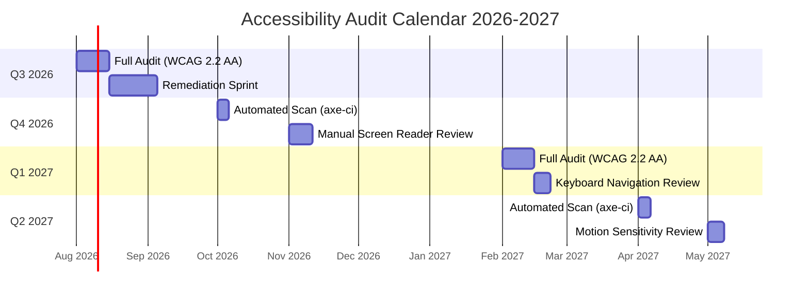
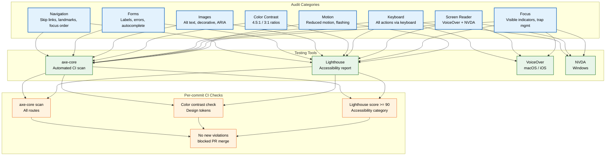

# Accessibility Audit

> **Purpose:** Define the WCAG 2.2 AA compliance audit program, testing methodology, and remediation SLAs for Vaeloom
> **Status:** 🆕 New
> **Owner:** Frontend Team
> **Last Updated:** 2026-07-13

## Overview

Vaeloom is committed to WCAG 2.2 AA compliance across all user-facing interfaces. This document defines the formal accessibility audit schedule, testing categories, tooling, severity classification, and remediation SLAs. Accessibility is treated as a quality gate in CI/CD — pull requests that introduce AA violations are blocked from merging.

The audit program covers automated scanning (axe-core, Lighthouse) and manual testing (VoiceOver, NVDA, keyboard-only navigation) on a quarterly cycle, with continuous monitoring per commit via CI integration.

## Audit Schedule



## Audit Categories



## Severity Classification & SLAs

| Severity | Definition | Remediation SLA | Examples |
|----------|-----------|-----------------|----------|
| **Critical** | Complete barrier — user cannot complete a core task | Blocking — must fix before merge; 7 days if found in production | Missing form labels, keyboard trap, no alt text on info images |
| **High** | Significant barrier — user can complete task but with great difficulty | 14 days from identification | Low contrast text, missing focus indicator, no skip link |
| **Medium** | Partial barrier — user can complete task but with some friction | 30 days from identification | Non-descriptive link text, missing ARIA landmarks, heading hierarchy issues |
| **Low** | Minor friction — does not prevent task completion | Next regular sprint | Decorative images with redundant alt text, slightly suboptimal heading order |

## WCAG 2.2 AA Success Criteria Coverage

| Category | Relevant SCs | Current Status | Tooling |
|----------|-------------|----------------|---------|
| Navigation | 2.4.1 (Bypass Blocks), 2.4.3 (Focus Order), 2.4.5 (Multiple Ways) | In Progress | axe-core, Manual check |
| Forms | 1.3.1 (Info and Relationships), 3.3.1 (Error ID), 3.3.2 (Labels) | In Progress | axe-core, Lighthouse |
| Images | 1.1.1 (Non-text Content), 1.4.5 (Images of Text) | In Progress | axe-core, Manual review |
| Color Contrast | 1.4.3 (Contrast Min), 1.4.11 (Non-text Contrast) | **Passing** | axe-core, Deque |
| Keyboard | 2.1.1 (Keyboard), 2.1.2 (No Keyboard Trap) | In Progress | Manual test, axe-core |
| Screen Reader | 4.1.2 (Name, Role, Value), 4.1.3 (Status Messages) | In Progress | VoiceOver, NVDA |
| Focus | 2.4.7 (Focus Visible), 2.4.11 (Focus Not Obscured - AA 2.2) | In Progress | Manual test |
| Motion | 2.2.2 (Pause, Stop, Hide), 2.3.1 (Three Flashes) | **Passing** | Manual test |

## CI Integration

```yaml
# .github/workflows/accessibility.yml (conceptual)
name: Accessibility Check
on: [pull_request]
jobs:
  a11y:
    runs-on: ubuntu-latest
    steps:
      - uses: actions/checkout@v4
      - run: npm ci
      - run: npm run build
      - name: Run axe-core
        run: npx axe --exit --show-reports --dir ./out
      - name: Check contrast ratios
        run: npx contrast-checker ./src/tokens/colors.ts
      - name: Lighthouse CI
        run: npx lhci autorun --collect.numberOfRuns=3
```

## Best Practices

| Practice | Rationale |
|----------|----------|
| Treat accessibility as a quality gate in CI | Blocking PRs with new violations prevents regressions; separate a11y-fix PRs from feature work |
| Test with real assistive technology weekly | Automated tools catch ~30% of WCAG issues; manual testing with VoiceOver/NVDA finds the rest |
| Use semantic HTML as the default | `button`, `nav`, `main`, `heading` elements carry built-in ARIA roles; reduces custom ARIA maintenance |
| Design for reduced motion first | Animations should be non-essential by default; respect `prefers-reduced-motion` at the design token level |

## Common Mistakes

| Mistake | Consequence | Fix |
|---------|-------------|-----|
| Relying solely on automated tools | Misses ~70% of WCAG issues including keyboard traps, focus order, and screen reader context | Schedule manual audits quarterly; train developers on basic screen reader testing |
| ARIA overuse | "When you have a hammer, everything looks like a nail" — ARIA added to divs that should be semantic HTML | Use native HTML elements first; ARIA only when no semantic element exists |
| Color-only indicators | Success/failure states conveyed purely through color inaccessible to colorblind users | Add icons, text labels, and patterns alongside color indicators |
| Focus management in SPAs | Page transitions without focus management trap keyboard users in dead space | Programmatically move focus to `h1` on route change; announce navigation via live region |
| Ignoring zoom / text resize | Fixed units (px) prevent text scaling up to 200% as required by WCAG | Use relative units (rem, em) for all text and layout containers |

## Security Considerations

| Concern | Mitigation |
|---------|-----------|
| Screen reader injection of malicious content | All dynamic content sanitized before rendering; ARIA labels interpolated through i18n with XSS escaping |
| Focus management with iframes | Sandbox attributes restrict iframe content; focus events from cross-origin iframes ignored |
| Automated scan false negatives | axe-core scans supplemented with manual reviews; any missed issue treated as a process improvement |
| CAPTCHA accessibility | hCaptcha invisible mode used as primary; fallback to audio CAPTCHA for manual verification |
| Motion trigger incidents | All animations respect `prefers-reduced-motion`; flashing content analyzed with PEAT tool before deployment |

## Performance Considerations

| Concern | Mitigation |
|---------|-----------|
| axe-core scan time in CI | Scans parallelized by route; typical PR completes in <2 minutes |
| Lighthouse audit overhead | Run on 3 representative pages per commit; full suite runs nightly |
| Screen reader testing time | Allocate 2 person-days per quarterly audit; create test scripts for repeatability |
| Accessibility overlay performance | No third-party overlays used (known to degrade performance and miss WCAG issues) |
| Focus indicator rendering | CSS `:focus-visible` used instead of JS-based focus management — zero runtime cost |

## Components

| Component | Responsibility | Technology | Scale Strategy |
|-----------|---------------|------------|----------------|
| AxeScanner | Automated WCAG scanning of all routes | axe-core + GitHub Actions | Scaled per route — runs only on changed routes for PRs, full scan nightly |
| ContrastVerifier | Validate all design token pairs against 4.5:1 | Custom Node script + token parser | Build-time — verifies 400+ token pairs in <2s |
| LighthouseReporter | Generate accessibility score reports | Lighthouse CI + Grafana | Scaled per environment — 3 representative pages per commit |
| ManualTestRunner | Orchestrate quarterly manual audit workflows | Notion + TestRail | Linear — 2 person-days per quarter, fixed scope |

## Workflows

1. **Developer submits PR**: CI triggers axe-core scan across all changed routes → results posted as GitHub Check → if 0 new violations, PR proceeds; if violations found, PR is blocked with detailed report
2. **Quarterly manual audit**: QA lead creates audit plan in TestRail → screen reader specialists test NVDA + VoiceOver → findings categorized by severity → remediation tickets filed with SLA
3. **Contrast compliance check**: Design token file updated → CI runs ContrastVerifier → all light/dark pairs checked against WCAG 4.5:1/3:1 → non-compliant tokens flagged with suggested alternatives
4. **Bug regression verification**: a11y bug fixed → failing test case added to golden dataset → full suite re-run → all routes re-scanned → fix verified and deployed

## Sequence Diagrams

```mermaid
sequenceDiagram
    participant DEV as Developer
    participant CI as GitHub Actions
    participant AXE as axe-core
    participant GH as GitHub Checks

    DEV->>CI: Push PR to branch
    CI->>AXE: Run scan on changed routes
    AXE-->>CI: Violation report (JSON)
    alt 0 new violations
        CI->>GH: ✅ Pass — post report
        GH-->>DEV: PR passes a11y gate
    else Violations found
        CI->>GH: ❌ Fail — post detailed report
        GH-->>DEV: PR blocked; fix required
        DEV->>DEV: Fix violations and re-push
    end
```

## Data Flow

1. **Ingestion**: A11y scan configuration loaded from `.a11yrc` → axe-core scans all HTML routes → violation data structured as JSON report
2. **Processing**: Report parsed by CI action → violations categorized by severity and WCAG criterion → duplicates de-duplicated → hash computed for change detection
3. **Storage**: Violation history stored in Grafana Loki → baseline snapshot kept per release tag → screenshots stored in S3 with 90-day retention
4. **Retrieval**: Developer views report in GitHub Checks → Grafana dashboard shows violation trends over time → weekly a11y health score computed
5. **Deletion**: Old screenshot artifacts deleted after 90 days → violation history aggregated after 6 months → PII in test artifacts purged quarterly

## Scalability

| Dimension | Current Limit | 10x Strategy | 100x Strategy |
|-----------|---------------|--------------|---------------|
| Routes scanned per run | 200 routes | Shard across parallel workers (10 workers) | Distributed scan fleet with queue-based orchestration |
| Token pairs validated | 400 pairs | Pre-compute pair matrix on token change | Real-time contrast check in design tool plugin |
| Manual audit coverage | 5 core flows | Scripted screen reader test automation | AI-assisted audit that generates test scripts from component specs |
| Artifact storage | 500 MB/run | Compress screenshots, deduplicate traces | Store only diff-based snapshots; full archive in cold storage |

## Error Handling

| Scenario | Detection | Mitigation | Recovery |
|----------|-----------|------------|----------|
| axe-core fails to launch browser | CI job returns non-zero exit code | Retry with `--headed` fallback; log error to Sentry | Re-run job manually after debugging |
| Contrast token file has invalid format | Parser throws during CI | Surface parsing error with line number and expected schema | Fix token file and re-push |
| Manual audit finds environment-specific issue | Tester cannot reproduce on staging | Provision ephemeral environment matching reporter's setup | Document environment divergence; add to test matrix |
| Lighthouse CI times out | Job exceeds 10-minute timeout | Split into per-page jobs with 3-min timeout each | Re-run failed page individually |

## Monitoring

| Metric | Alert Threshold | Severity | Dashboard |
|--------|----------------|----------|-----------|
| Violations per PR | > 0 new violations | Critical | GitHub Checks dashboard |
| Lighthouse a11y score | < 90 | Warning | Grafana — Frontend Health |
| Audit completion rate | < 100% of quarterly audits on time | High | Notion — A11y Audit Tracker |
| Contrast compliance | < 100% of semantic tokens | Warning | CI Pipeline — Contrast step |
| Time to remediate critical violations | > 7 days | Critical | Sentry — a11y SLA tracker |

## Risks

| Risk | Likelihood | Impact | Mitigation |
|------|------------|--------|------------|
| New WCAG version (2.3/3.0) requires significant rework | Medium | High | Monitor W3C drafts; allocate buffer in roadmap for WCAG upgrade |
| Manual audit capacity doesn't scale with team growth | High | Medium | Invest in automated audit tooling; train all engineers on basic screen reader testing |
| False positives in automated scans create alert fatigue | High | Medium | Tune axe-core rules to project patterns; suppress known non-issues with granular exclusions |
| Third-party dependency introduces breaking a11y change | Low | High | Pin dependency versions in lockfile; test critical paths on dependency update |

## Limitations

| Limitation | Impact | Workaround | Future Resolution |
|------------|--------|------------|-------------------|
| Automated scans miss contextual and workflow-level issues | ~70% of real-world a11y bugs not caught in CI | Quarterly manual audits covering all critical workflows | Train ML model on past manual audit findings to predict contextual violations |
| No cross-platform screen reader coverage parity | Issues unique to Narrator (Windows) or TalkBack (Android) may go undetected | Focus manual testing on highest-usage platforms (NVDA, VoiceOver) | Expand manual audit matrix to cover Narrator + TalkBack by Q3 2027 |
| Lighthouse scoring is environment-sensitive | Score fluctuations cause false alerts | Average across 3 runs; use median, not raw score | Switch to higher-fidelity a11y scoring tool (ARC Toolkit API) |

## Goals

- Achieve 100% WCAG 2.2 AA compliance across all Vaeloom surfaces before public launch
- Block pull requests that introduce any new accessibility violations through automated CI gates
- Reduce average remediation time for critical violations to under 7 days
- Maintain Lighthouse accessibility score of 90+ on all routes after every deployment
- Expand manual screen reader testing coverage to include NVDA and VoiceOver on all core workflows

## Scope

### In Scope

- Automated axe-core scanning of all frontend routes on every pull request
- Quarterly manual accessibility audits covering keyboard navigation, screen reader, and focus management
- Color contrast validation for every design token pair across light and dark themes
- WCAG 2.2 AA success criteria compliance for navigation, forms, images, color, keyboard, screen reader, focus, and motion categories
- Severity-classified remediation with defined SLAs (Critical: block merge, High: 14 days, Medium: 30 days, Low: next sprint)

### Out of Scope

- WCAG 2.2 AAA compliance (monitored but not required)
- Third-party embedded content accessibility (assessed per integration)
- Accessibility of user-generated content (documents, uploaded files)
- Native mobile platform accessibility (Android TalkBack, iOS VoiceOver — covered in Mobile Architecture)

---

| Improvement | Priority | Complexity | Timeline |
|-------------|----------|------------|----------|
| AI-assisted contextual a11y evaluation | High | High | Q2 2027 |
| Automated focus order verification for SPA routes | Medium | Medium | Q3 2027 |
| Cross-platform screen reader test automation | Medium | High | Q4 2027 |
| Real-time contrast checker Figma plugin | Low | Low | Q1 2027 |

## Examples

### Running axe-core scan in CI

```yaml
# .github/workflows/accessibility.yml
name: Accessibility Scan
on: [pull_request]
jobs:
  a11y:
    runs-on: ubuntu-latest
    steps:
      - uses: actions/checkout@v4
      - run: npm ci && npm run build
      - name: axe-core scan
        run: npx axe --exit --dir ./out
```

### Programmatic accessibility check

```typescript
import { axe, toHaveNoViolations } from 'jest-axe';
expect.extend(toHaveNoViolations);

it('should have no accessibility violations', async () => {
  const { container } = render(<ProposalCard />);
  const results = await axe(container);
  expect(results).toHaveNoViolations();
});
```

### Focus management on route change

```tsx
import { useEffect, useRef } from 'react';

function PageShell({ children }: { children: React.ReactNode }) {
  const headingRef = useRef<HTMLHeadingElement>(null);
  useEffect(() => { headingRef.current?.focus(); }, []);
  return (
    <main>
      <h1 tabIndex={-1} ref={headingRef}>Workspace</h1>
      {children}
    </main>
  );
}
```

### Reduced-motion detection

```typescript
function useReducedMotion(): boolean {
  const [reduced, setReduced] = useState(
    () => window.matchMedia('(prefers-reduced-motion: reduce)').matches
  );
  useEffect(() => {
    const mq = window.matchMedia('(prefers-reduced-motion: reduce)');
    const handler = (e: MediaQueryListEvent) => setReduced(e.matches);
    mq.addEventListener('change', handler);
    return () => mq.removeEventListener('change', handler);
  }, []);
  return reduced;
}
```

---

## Related Documents

- [Frontend Architecture.md](./Frontend-Architecture.md)
- [UI Architecture.md](./UI-Architecture.md)
- [Internationalization.md](./Internationalization.md)
- [Design System.md](./Design-System.md)
- [UX Guidelines.md](./UX-Guidelines.md)
