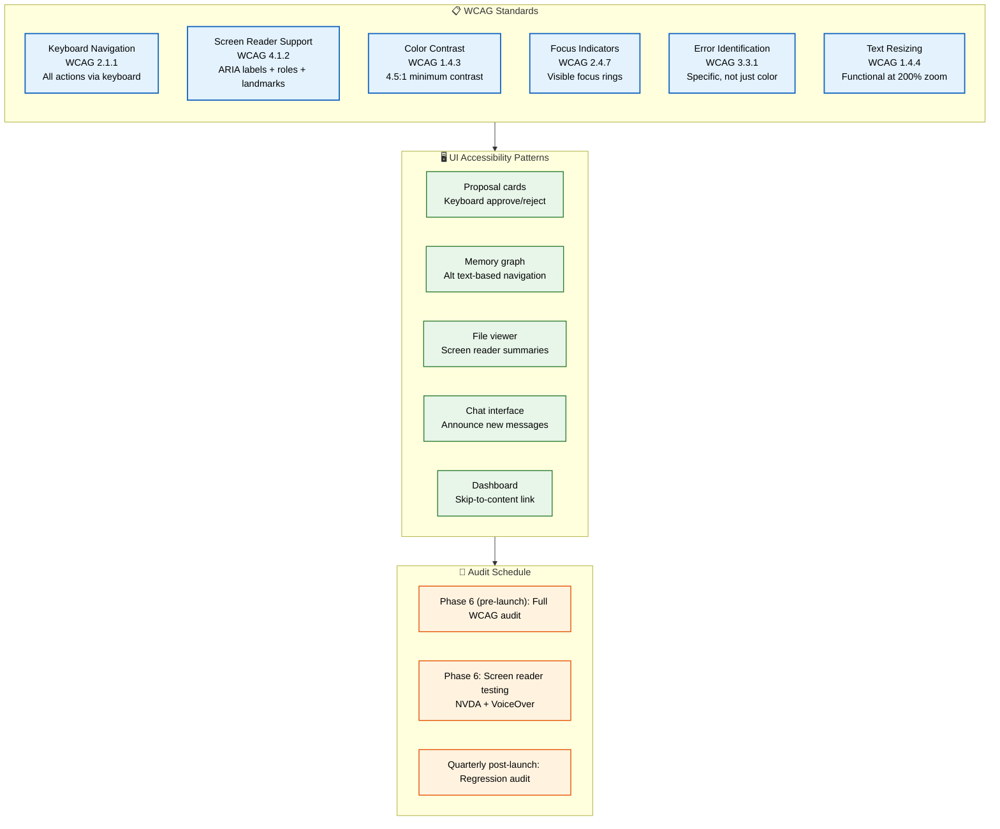
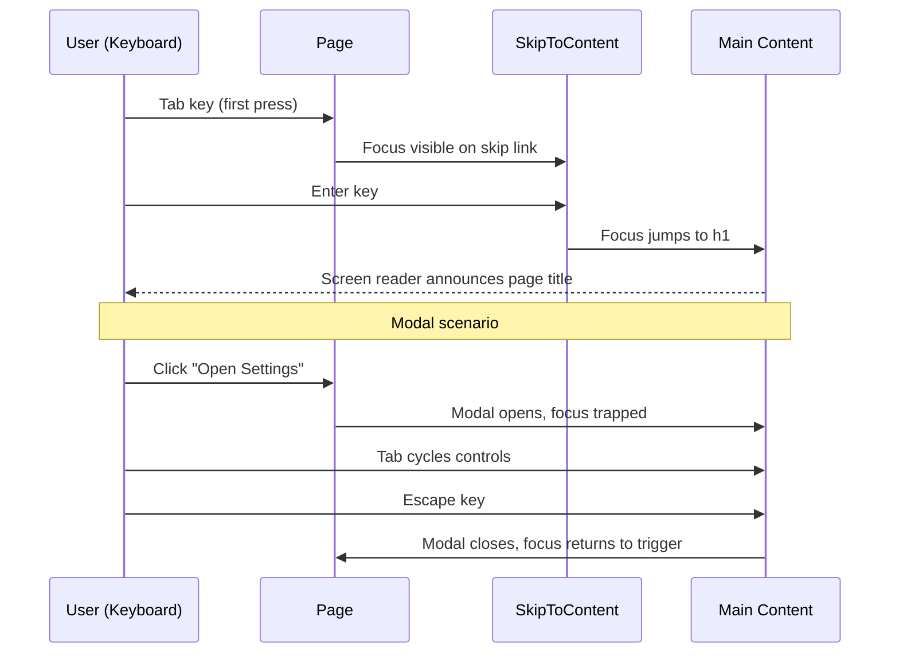

# Accessibility

> **Purpose:** Define accessibility standards for Meridian
> **Status:** 🆕 New — audit planned before launch

## Overview

Meridian's accessibility framework ensures the platform is usable by all users, including those with disabilities. This document defines the accessibility standards, audit procedures, and remediation workflows that guarantee WCAG 2.2 AA compliance across all user interfaces.

The accessibility strategy covers the web application, mobile companion, and agent interaction surfaces — including screen reader compatibility, keyboard navigation, color contrast, focus management, and reduced motion support. Every UI component in the Meridian design system is required to pass automated and manual accessibility checks before release.

Accessibility is a core quality attribute for Meridian, not an afterthought. As an education and career platform, Meridian serves diverse users with varying abilities who rely on assistive technologies. Meeting WCAG 2.2 AA standards is a product requirement for public launch.

## Accessibility Architecture



> **Diagram:** Accessibility strategy follows **6 WCAG 2.2 AA standards** → **5 UI-specific accessibility patterns** → **audit schedule** (pre-launch full audit + quarterly regression). Target is AA minimum with AAA where practical.

---

## Standards

Meridian targets **WCAG 2.2 AA** compliance as the minimum bar, with AAA where practical.

## Key Requirements

| Requirement | Standard | Implementation |
|-------------|----------|---------------|
| Keyboard navigation | WCAG 2.1.1 | All actions accessible via keyboard |
| Screen reader support | WCAG 4.1.2 | ARIA labels, roles, landmarks |
| Color contrast | WCAG 1.4.3 | 4.5:1 minimum contrast ratio |
| Focus indicators | WCAG 2.4.7 | Visible focus rings on all interactive elements |
| Error identification | WCAG 3.3.1 | Clear error messages, not just color changes |
| Text resizing | WCAG 1.4.4 | No loss of functionality at 200% zoom |

## Specific UI Patterns

| Component | Accessibility Notes |
|-----------|-------------------|
| Agent proposal cards | Keyboard-accessible approve/reject buttons |
| Memory graph | Alternative text-based navigation mode |
| File viewer | Screen reader support with document summaries |
| Chat interface | Announce new messages, support voice input |
| Dashboard | Logical tab order, skip-to-content link |

## Audit Schedule

| Milestone | Action |
|-----------|--------|
| Phase 6 (pre-launch) | Full WCAG audit |
| Phase 6 (pre-launch) | Screen reader testing (NVDA, VoiceOver) |
| Quarterly post-launch | Regression audit |

## Common Mistakes

| Mistake | Why It's a Problem |
|---------|-------------------|
| Relying only on color to convey state | Colorblind users cannot distinguish states; always pair with icons or text labels |
| Missing alt text on interactive elements | Screen readers cannot navigate or understand the purpose of unlabeled controls |
| No visible focus indicators | Keyboard-only users lose their place; WCAG 2.4.7 requires visible focus |
| Skipping heading hierarchy | Screen reader navigation depends on proper h1→h2→h3 structure; skipping levels causes confusion |

## Best Practices

| Practice | Rationale |
|----------|-----------|
| Use semantic HTML elements | Native `<button>`, `<nav>`, `<main>` provide built-in accessibility; avoid `<div>`-based controls |
| Test with real assistive technology | Automated tools catch ~30% of issues; NVDA + VoiceOver testing catches the rest |
| Maintain 4.5:1 contrast ratio minimum | WCAG AA requires this for normal text; use theme tokens that guarantee compliance |
| Provide skip-to-content links | Power users and screen reader users should never tab through 20 nav items to reach content |

## Security

| Concern | Mitigation |
|---------|------------|
| Focus management in modal dialogs | Trap focus within open modals; return focus to trigger element on close — prevents keyboard-based UI confusion |
| Dynamic content announcements | Use `aria-live` regions with appropriate politeness settings — avoid flooding screen readers with sensitive information |
| Accessible error disclosure | Error messages should guide resolution without revealing internal system details (stack traces, query structures) |

## Performance

| Concern | Guideline |
|---------|-----------|
| Screen reader overhead | Minimize DOM size — large DOM trees increase accessibility tree computation time, especially on low-end devices |
| Animation impact on assistive tech | `prefers-reduced-motion` animations still compute in the accessibility tree; use `display: none` rather than opacity:0 for truly hidden elements |
| Audit tool runtime | Run accessibility audits as part of CI, not just at build time — automated axe-core scans add ~200ms per page but catch regressions early |

## Security Considerations

| Concern | Mitigation |
|---------|------------|
| Focus management in modal dialogs | Trap focus within open modals; return focus to trigger element on close — prevents keyboard-based UI confusion |
| Dynamic content announcements | Use `aria-live` regions with appropriate politeness settings — avoid flooding screen readers with sensitive information |
| Accessible error disclosure | Error messages should guide resolution without revealing internal system details (stack traces, query structures) |

## Performance Considerations

| Concern | Approach |
|---------|----------|
| Screen reader overhead | Minimize DOM size — large DOM trees increase accessibility tree computation time, especially on low-end devices |
| Animation impact on assistive tech | `prefers-reduced-motion` animations still compute in the accessibility tree; use `display: none` rather than opacity:0 for truly hidden elements |
| Audit tool runtime | Run accessibility audits as part of CI, not just at build time — automated axe-core scans add ~200ms per page but catch regressions early |

## Components

| Component | Responsibility | Technology | Scale Strategy |
|-----------|---------------|------------|----------------|
| SkipToContent | Provide keyboard bypass of navigation blocks | React + CSS | Static — one instance per page |
| FocusTrapModal | Trap keyboard focus within open dialogs | React + useCallback | Instance per modal; portals for overlay stacking |
| AriaAnnouncer | Broadcast dynamic content changes to screen readers | React + aria-live region | Singleton via Context; debounced to avoid flooding |
| ColorContrastValidator | Verify all theme tokens meet WCAG 4.5:1 | CSS custom properties + CI check | Build-time scan of all token pairs; runs per PR |

## Workflows

1. **User navigates via keyboard**: Focus lands on skip-to-content link → Enter activates skip → Focus moves to `<main>` landmark
2. **Modal dialog opens**: Focus is trapped inside modal → Tab cycles through modal controls → Escape closes modal → Focus returns to trigger element
3. **Screen reader encounters dynamic content**: Agent proposal accepted → AriaAnnouncer broadcasts "Proposal approved" via polite live region → User hears update without interruption
4. **Color contrast audit in CI**: Push to PR triggers axe-core scan → Contrast checker verifies all token pairs against 4.5:1 → Failing PR is blocked with detailed report

## Sequence Diagrams



## Data Flow

1. **Ingestion**: Content uploaded by user or fetched by connectors → stored in encrypted blob storage → metadata written to PostgreSQL
2. **Processing**: AI agents analyze content → extract entities, classifications, and relationships → golden dataset validates extraction accuracy → results written to memory graph
3. **Storage**: Accessibility metadata (ARIA labels, alt text, focus order) stored alongside document metadata in PostgreSQL → theme contrast values defined in CSS custom properties
4. **Retrieval**: Page components query accessibility data via TanStack Query → AriaAnnouncer receives content updates through WebSocket → screen reader interprets live regions
5. **Deletion**: User deletes document → all associated accessibility metadata purged → aria-live region broadcasts confirmation → focus moved to appropriate location

## Scalability

| Dimension | Current Limit | 10x Strategy | 100x Strategy |
|-----------|---------------|--------------|---------------|
| DOM nodes per page | ~3,000 nodes | Virtual scrolling for lists + lazy rendering of off-screen sections | Streaming SSR with progressive hydration |
| aria-live announcements | 10 events/second | Debounce queue with priority levels | Dedicated a11y worker thread |
| Color contrast token pairs | 400+ pairs | Build-time static analysis only | AI-assisted contrast recommendation engine |
| Screen reader test coverage | 5 critical flows | Automated QA with axe-core on every route | Visual regression + a11y snapshot comparison |

## Error Handling

| Scenario | Detection | Mitigation | Recovery |
|----------|-----------|------------|----------|
| Focus trap fails to engage | Modal opens but Tab exits modal | `IntersectionObserver` on modal mount verifies focus; polyfill for non-standard browsers | Log to Sentry, enable keyboard ESC as emergency exit |
| Color contrast ratio drops below 4.5:1 | CI check fails on PR | Block merge until contrast is resolved; automated suggestion of compliant color | Fix token value in theme system, re-run CI |
| Screen reader announces stale content | User reports outdated announcement | aria-live region cleared on navigation; max timer of 5s per announcement | Invalidate announcer queue, replay latest event |
| Skip-to-content link missing | axe-core scan detects no bypass block | Inline `<SkipToContent>` as first child of `<body>` with SSR render check | Prevent render until skip link is mounted |

## Monitoring

| Metric | Alert Threshold | Severity | Dashboard |
|--------|----------------|----------|-----------|
| axe-core violation count in CI | > 0 new violations | Critical | GitHub Checks — a11y report |
| Lighthouse accessibility score | < 90 | Warning | Grafana — Frontend Performance |
| Screen reader regression reports | Any manually filed bug | High | Sentry — a11y tag |
| Color contrast compliance ratio | < 100% of token pairs | Warning | CI pipeline — contrast check step |

## Risks

| Risk | Likelihood | Impact | Mitigation |
|------|------------|--------|------------|
| Third-party components introduce inaccessible UI patterns | Medium | High | Vet all dependencies for a11y compliance; wrap in accessible containers |
| Screen reader compatibility breaks on browser update | Low | High | Quartery manual testing with NVDA + VoiceOver; pin known-good browser versions |
| Automated scans miss contextual accessibility issues | High | Medium | Supplement automated scans with quarterly manual audits |
| Accessibility debt accumulates during rapid feature development | Medium | High | Enforce a11y as CI quality gate; allocate 20% of sprint capacity to a11y fixes |

## Limitations

| Limitation | Impact | Workaround | Future Resolution |
|------------|--------|------------|-------------------|
| Automated axe-core scans only catch ~30% of WCAG issues | Contextual and workflow-level issues go undetected | Manual quarterly audits with screen reader + keyboard-only testing | AI-driven a11y evaluation that simulates user workflows |
| VoiceOver and NVDA behave differently | Testing must cover both platforms | Maintain separate test scripts for each; run both before release | Unified test framework that abstracts platform differences |
| No automated focus-order verification for dynamic content | Single-page app focus management is fragile | Manual keyboard walkthrough for every new route added | Static analysis of tabindex and focus-sequence props |

## Examples

### Accessible Button with ARIA Labels

```tsx
function ApproveButton({ onClick, disabled }: { onClick: () => void; disabled: boolean }) {
  return (
    <button
      onClick={onClick}
      disabled={disabled}
      aria-label="Approve agent proposal"
      aria-describedby="approve-hint"
      className="btn btn-primary"
    >
      <CheckIcon aria-hidden="true" />
      <span id="approve-hint" hidden>Approves the suggested file organization action</span>
    </button>
  );
}
```

### Skip-to-Content Link

```tsx
function SkipToContent() {
  return (
    <a
      href="#main-content"
      className="skip-link"
      onFocus={(e) => e.currentTarget.classList.add('visible')}
      onBlur={(e) => e.currentTarget.classList.remove('visible')}
    >
      Skip to main content
    </a>
  );
}
```

### Focus Trap in Modal

```tsx
function FocusTrapModal({ isOpen, onClose, children }: FocusTrapModalProps) {
  const containerRef = useRef<HTMLDivElement>(null);

  useEffect(() => {
    if (!isOpen || !containerRef.current) return;
    const firstFocusable = containerRef.current.querySelector<HTMLElement>(
      'button, [href], input, select, textarea, [tabindex]:not([tabindex="-1"])'
    );
    firstFocusable?.focus();
  }, [isOpen]);

  if (!isOpen) return null;
  return (
    <div role="dialog" aria-modal="true" aria-label="Modal dialog" ref={containerRef}>
      {children}
    </div>
  );
}
```

---

## Goals

- Achieve WCAG 2.2 AA compliance across all user-facing interfaces before Phase 6 launch
- Ensure 100% of interactive elements are keyboard-accessible and operable
- Maintain 4.5:1 minimum color contrast ratio for all text across both light and dark themes
- Achieve zero accessibility regressions per PR through automated axe-core CI scanning
- Support screen reader compatibility for all core workflows (proposal review, file navigation, chat)

## Scope

### In Scope
- WCAG 2.2 AA compliance for all user-facing screens (Dashboard, Workspace, Memory Graph, Chat, Settings)
- Keyboard navigation for every interactive component (buttons, links, forms, custom controls)
- Screen reader support via semantic HTML, ARIA labels, roles, and landmarks
- Color contrast validation for all design tokens across light and dark themes
- Focus management for modal dialogs, dynamic content, and route transitions
- Automated accessibility scanning in CI with axe-core on every pull request

### Out of Scope
- WCAG AAA compliance (targeted where practical but not guaranteed)
- Third-party widget accessibility (assessed per vendor but not retrofitted)
- Native mobile application accessibility (covered in Mobile Architecture)
- Accessibility of user-uploaded content (documents, images, resumes)

---

## Future Improvements

| Improvement | Priority | Complexity | Timeline |
|-------------|----------|------------|----------|
| AI-powered alt text generation for uploaded documents | High | Medium | Q1 2027 |
| Automated focus-order verification in CI pipeline | Medium | High | Q2 2027 |
| Voice navigation support for core workflows | Medium | High | Q3 2027 |
| Accessibility heatmap showing user-reported pain points | Low | Medium | Q4 2027 |

## Related Documents

- [UX Guidelines.md](./UX-Guidelines.md)
- [Frontend Architecture.md](./Frontend-Architecture.md)
- [`/Docs/Meridian-Complete-Documentation.md#15-gap-analysis`](../../Docs/Meridian-Complete-Documentation.md#15-gap-analysis)
