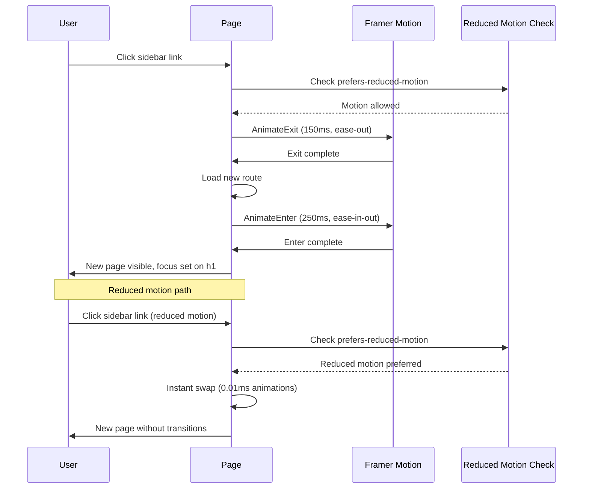

# Animation System

> **Purpose:** Define the animation and transition system for Vaeloom
> **Status:** 🆕 New

## Animation Architecture

```mermaid
graph TD
    classDef principle fill:#e3f2fd,stroke:#1565c0,color:#000,stroke-width:2px
    classDef type fill:#e8f5e9,stroke:#2e7d32,color:#000,stroke-width:1.5px
    classDef element fill:#fff3e0,stroke:#e65100,color:#000,stroke-width:1.5px
    classDef a11y fill:#f3e5f5,stroke:#6a1b9a,color:#000,stroke-width:1px

    subgraph Principles["🎯 Animation Principles"]
        direction TB
        R1["Purposeful<br/>Every animation serves a function"]
        R2["Performant<br/>Only transform + opacity"]
        R3["Subtle<br/>Under 300ms, no gratuitous motion"]
        R4["Accessible<br/>Respect prefers-reduced-motion"]
    end

    subgraph Types["⏱️ Animation Types"]
        T1["Micro-interactions<br/>100-150ms · ease-out<br/>Button hover, card select"]
        T2["State Transitions<br/>200-300ms · ease-in-out<br/>Modal, sidebar toggle"]
        T3["Page Transitions<br/>250-400ms · ease-in-out<br/>Route changes"]
        T4["Loading Sequences<br/>500-1000ms · linear<br/>Skeleton screens, progress"]
    end

    subgraph Elements["✨ Specific Animations"]
        E1["Proposal cards: Slide in + fade<br/>transform: translateY + opacity"]
        E2["Toast: Slide from top<br/>transform: translateY"]
        E3["Modal: Scale + fade overlay<br/>transform: scale + opacity"]
        E4["Sidebar: Slide from left<br/>transform: translateX"]
        E5["Memory graph: Physics layout<br/>D3 force simulation"]
    end

    subgraph Accessibility["♿ Reduced Motion"]
        A1["@media (prefers-reduced-motion: reduce)<br/>animation-duration: 0.01ms !important"]
    end

    Principles --> Types --> Elements
    Types & Elements -.-> Accessibility

    class R1,R2,R3,R4 principle
    class T1,T2,T3,T4 type
    class E1,E2,E3,E4,E5 element
    class A1 a11y
```



> **Diagram:** Animation system built on **4 principles** (purposeful, performant, subtle, accessible) → **4 timing categories** (micro-interactions 100ms → loading 1000ms) → **5 element-specific animations** (all using transform + opacity only). **Reduced motion** respects system preferences by setting durations to near-zero.

---

## Animation Principles

| Principle | Application |
|-----------|-------------|
| Purposeful | Every animation serves a function (state change, feedback, navigation) |
| Performant | Only animate `transform` and `opacity` — avoid layout-triggering properties |
| Subtle | Animations under 300ms, no gratuitous motion |
| Accessible | Respect `prefers-reduced-motion` |

## Animation Types

| Type | Duration | Easing | Example |
|------|----------|--------|---------|
| Micro-interactions | 100-150ms | ease-out | Button hover, card selection |
| State transitions | 200-300ms | ease-in-out | Modal open/close, sidebar toggle |
| Page transitions | 250-400ms | ease-in-out | Route changes |
| Loading sequences | 500-1000ms | linear | Skeleton screens, progress bars |

## Animation Tokens

```css
:root {
  --animation-fast: 100ms;
  --animation-normal: 200ms;
  --animation-slow: 400ms;
  --easing-standard: cubic-bezier(0.4, 0, 0.2, 1);
  --easing-enter: cubic-bezier(0, 0, 0.2, 1);
  --easing-exit: cubic-bezier(0.4, 0, 1, 1);
}
```

## Specific Animations

| Element | Animation | Implementation |
|---------|-----------|---------------|
| Agent proposal cards | Slide in + fade | `transform: translateY + opacity` |
| Notification toast | Slide from top | `transform: translateY` |
| Modal | Scale + fade overlay | `transform: scale + opacity` |
| Sidebar | Slide from left | `transform: translateX` |
| Memory graph | Physics-based layout | D3 force simulation |

## Accessibility

```css
@media (prefers-reduced-motion: reduce) {
  *, *::before, *::after {
    animation-duration: 0.01ms !important;
    transition-duration: 0.01ms !important;
  }
}
```

## Common Mistakes

| Mistake | Why It's a Problem |
|---------|-------------------|
| Animating layout properties (width, height, top) | Triggers forced reflows and repaints — causes stutter, dropped frames, and poor battery life |
| Ignoring `prefers-reduced-motion` | Users with vestibular disorders experience nausea from unnecessary motion; always respect the OS preference |
| Gratuitous or purely decorative animation | Every animation should communicate a state change or direct attention — decorative motion adds cognitive load |
| Inconsistent easing and duration | Mixing ease-in, ease-out, and linear across components feels disjointed and unprofessional |

## Best Practices

| Practice | Rationale |
|----------|-----------|
| Only animate `transform` and `opacity` | These properties are GPU-composited and never trigger layout or paint — guarantees 60fps |
| Keep animations under 300ms | Users perceive sub-300ms animations as instant feedback; longer animations feel slow and frustrating |
| Use a consistent easing curve per type | Enter animations ease-out (decelerate), exit animations ease-in (accelerate), transitions ease-in-out |
| Test on low-end devices | A silky 120fps animation on an M-series Mac may stutter on a budget Android — test on the lowest target device |

## Security

| Concern | Mitigation |
|---------|------------|
| Animation-based DOS/UI stress | Limit animation count and duration — hundreds of simultaneous CSS animations can freeze browser tabs on low-end devices |
| `prefers-reduced-motion` spoofing | Treat reduced-motion preference as a user-controlled setting, not a security boundary; never rely on it for access control |
| Motion-triggered data leakage through callbacks | Ensure animation callbacks (e.g., `animationend`) do not expose internal state or timing side-channels |

## Performance

| Concern | Guideline |
|---------|-----------|
| GPU compositing vs CPU painting | Use `will-change: transform` sparingly — it promotes elements to their own compositor layer, consuming GPU memory |
| Animation frame budgeting | Profile animation performance with Chrome DevTools FPS meter; keep frame budget under 10ms for non-interactive animations |
| Off-screen animation culling | Use `content-visibility: auto` on off-screen animated elements — browsers skip rendering for elements outside the viewport |

## Security Considerations

| Concern | Mitigation |
|---------|------------|
| Animation-based DOS/UI stress | Limit animation count and duration — hundreds of simultaneous CSS animations can freeze browser tabs on low-end devices |
| `prefers-reduced-motion` spoofing | Treat reduced-motion preference as a user-controlled setting, not a security boundary; never rely on it for access control |
| Motion-triggered data leakage through callbacks | Ensure animation callbacks (e.g., `animationend`) do not expose internal state or timing side-channels |

## Performance Considerations

| Concern | Approach |
|---------|----------|
| GPU compositing vs CPU painting | Use `will-change: transform` sparingly — it promotes elements to their own compositor layer, consuming GPU memory |
| Animation frame budgeting | Profile animation performance with Chrome DevTools FPS meter; keep frame budget under 10ms for non-interactive animations |
| Off-screen animation culling | Use `content-visibility: auto` on off-screen animated elements — browsers skip rendering for elements outside the viewport |

## Components

| Component | Responsibility | Technology | Scale Strategy |
|-----------|---------------|------------|----------------|
| MotionProvider | Root-level reduced-motion context detection | React Context + matchMedia | Singleton — wraps app root; subscribes to OS preference changes |
| FadeIn | Generic fade + translateY entrance animation | Framer Motion | Instance per animated element; configurable via props (duration, delay, distance) |
| SlidePanel | Sidebar/drawer slide animation | CSS transform + transition | Instance per drawer; dynamic width from theme tokens |
| SkeletonScreen | Loading placeholder animation | CSS keyframes + Tailwind | Scoped per component; matches component shape via props |

## Workflows

1. **Page transition**: User clicks sidebar link → route changes → old content fades out (150ms ease-out) → new content fades in (250ms ease-in-out) → focus is moved to page h1
2. **Toast notification appears**: Agent action completes → toast slides from top (translateY -100% → 0, 200ms ease-out) → auto-dismisses after 4s → slides back up (150ms ease-in)
3. **Modal opens with reduced motion**: User clicks "Edit" → modal overlay fades (opacity 0→1, 1ms if reduced motion) → content scales (if motion allowed) → focus trapped inside
4. **Knowledge graph layout update**: New entity added → D3 force simulation re-heats (300ms) → nodes settle in new positions → transitions smoothed with CSS `transition: transform`

## Sequence Diagrams



## Data Flow

1. **Ingestion**: Animation tokens defined as CSS custom properties (`--animation-fast`, `--easing-standard`) → consumed by Tailwind config and component CSS
2. **Processing**: Framer Motion reads animation props (duration, easing, delay) → computes optimal animation path (transform/opacity only) → applies to element via animate prop
3. **Storage**: Animation preferences stored in localStorage (`Vaeloom-reduced-motion`) → OS preference monitored via matchMedia listener
4. **Retrieval**: MotionProvider reads stored preference on mount → exposes via React Context → all animation components consume context to decide whether to animate
5. **Deletion**: Component unmount triggers exit animation if allowed → animation completes → element removed from DOM after `onAnimationComplete`

## Scalability

| Dimension | Current Limit | 10x Strategy | 100x Strategy |
|-----------|---------------|--------------|---------------|
| Simultaneous animated elements | 50 per page | Use `content-visibility: auto` to skip off-screen animations | GPU-backed animation worker with pooled compositor layers |
| Knowledge graph physics frames | 60fps on 500 nodes | Canvas-based rendering instead of SVG | WebGL force simulation (D3-force-3d with GPU) |
| CSS animation keyframes | 20 unique keyframe sets | Generate keyframes from tokens at build time | Runtime animation compiler that caches frequently-used sequences |
| Reduced-motion override detection | Single media query | Server-detect preference via `Sec-CH-Prefers-Reduced-Motion` client hint | Adaptive animation budget per device capability |

## Error Handling

| Scenario | Detection | Mitigation | Recovery |
|----------|-----------|------------|----------|
| Animation frame drops below 30fps | Chrome DevTools FPS meter or `requestAnimationFrame` delta monitoring | Disable complex animations; fall back to instant transitions | Log to metrics; re-enable when load decreases |
| CSS animation not supported | `@supports not (animation: ...)` | Provide instant (un-animated) fallback | Polyfill with JS-based animation via Web Animations API |
| D3 force simulation diverges | Physics engine detects unstable state | Clamp force values; pause and re-initialize layout | Snap nodes to grid positions, then restart simulation |
| prefers-reduced-motion mid-session | User changes OS preference while app is open | matchMedia change handler re-evaluates all active animations | Ongoing animations stopped; subsequent animations respect new preference |

## Monitoring

| Metric | Alert Threshold | Severity | Dashboard |
|--------|----------------|----------|-----------|
| FPS during page transitions | < 50fps sustained | Warning | Grafana — Web Vitals (interaction-to-next-paint) |
| Animation frame drop count | > 3% of frames dropped | Warning | Chrome DevTools performance trace |
| Reduced-motion users percentage | N/A (tracked trend) | Info | Analytics dashboard — accessibility segment |
| Long animation tasks (>50ms) | > 2 tasks per navigation | Warning | Lighthouse — Total Blocking Time |

## Risks

| Risk | Likelihood | Impact | Mitigation |
|------|------------|--------|------------|
| Browser compositor bug causes animation flicker | Low | Medium | Use `will-change: transform` as opt-in, not global; test across Chrome, Firefox, Safari |
| Animations trigger nausea in users with vestibular disorders | Medium | High | Respect prefers-reduced-motion at system level; provide explicit toggle in Settings |
| Performance regression from excessive GPU layer promotion | Medium | Medium | Audit `will-change` usage quarterly; limit animated elements per viewport |
| Third-party library update breaks animation contract | Low | High | Pin Framer Motion version; run visual regression tests on animation library updates |

## Limitations

| Limitation | Impact | Workaround | Future Resolution |
|------------|--------|------------|-------------------|
| CSS animations cannot be paused mid-sequence from JS | Complex choreography impossible with CSS alone | Use Framer Motion for multi-step animations; CSS only for simple transitions | Web Animations API Level 2 provides pause/resume for CSS animations |
| D3 force simulation performance degrades above 1000 nodes | Knowledge graph becomes sluggish | Cluster nodes at high zoom levels; show only top-N entities by default | Migrate to WebGL-based rendering for memory graph |
| Reduced-motion detection not available on initial server render | First paint may flash animation before JS applies preference | Set `animation-duration: 0` in base CSS; override in client Effect | Use `Sec-CH-Prefers-Reduced-Motion` client hint for server-rendered preferences |

## Overview

Vaeloom's animation system is designed to enhance user experience through purposeful, performant motion that communicates state changes and directs attention without overwhelming the user. Every animation in the application serves a functional purpose — whether indicating a button press, signaling a page transition, or drawing focus to a new proposal card.

The system is built on four core principles: purposeful (every animation communicates something), performant (only `transform` and `opacity` are animated to guarantee GPU compositing), subtle (durations stay under 300ms for micro-interactions), and accessible (all motion respects the user's `prefers-reduced-motion` system preference).

Animations are defined as CSS custom property tokens (`--animation-fast`, `--easing-standard`) consumed by both Tailwind CSS utility classes and Framer Motion components. This token-driven approach ensures consistent timing and easing across all components — a button hover in the sidebar uses the same easing curve as a button hover in the chat interface.

For Vaeloom's AI-driven workflows, animations play a critical role in maintaining user trust and orientation. Proposal cards slide in to indicate new agent suggestions, the knowledge graph uses physics-based D3 force simulations to reveal entity relationships, and toast notifications slide from the top to confirm actions without blocking the user's workflow.

## Goals

- Ensure all animations complete under 300ms to feel instantaneous and responsive to user action
- Maintain 60fps frame rate during all animations by restricting to `transform` and `opacity` only
- Respect `prefers-reduced-motion` at the system level with a user-toggle override in Settings
- Achieve consistent easing and duration across all components through a shared token system
- Support smooth page transitions between all 11 routes with sub-400ms enter/exit animations

## Scope

### In Scope

- CSS custom property tokens for animation durations, easing curves, and delay values
- Framer Motion integration for complex choreographed animations (page transitions, modals, sidebars)
- Reduced-motion detection via `matchMedia` and `prefers-reduced-motion` media query
- Component-scoped animations for ProposalCard (slide-in), Toast (slide-from-top), Modal (scale+fade), Sidebar (slide-from-left), and Knowledge Graph (D3 force simulation)
- Animation performance monitoring via Interaction to Next Paint (INP) metric

### Out of Scope

- Animation of layout properties (`width`, `height`, `top`, `left`) — only `transform` and `opacity` are permitted
- Decorative or purely ornamental animations without functional purpose
- Third-party animation libraries beyond Framer Motion and CSS transitions
- Canvas-based animations beyond the D3.js knowledge graph

---

| Improvement | Priority | Complexity | Timeline |
|-------------|----------|------------|----------|
| GPU-backed animation worker for knowledge graph | High | High | Q3 2027 |
| Adaptive animation budget per device capability | Medium | Medium | Q2 2027 |
| `prefers-reduced-motion` client hint for SSR | Low | Low | Q1 2027 |
| WebGL force simulation for memory graph | High | High | Q4 2027 |

## Examples

### Fade-in with Framer Motion

```tsx
import { motion } from 'framer-motion';

function ProposalCard({ children }: { children: React.ReactNode }) {
  return (
    <motion.div
      initial={{ opacity: 0, y: 20 }}
      animate={{ opacity: 1, y: 0 }}
      exit={{ opacity: 0, y: -20 }}
      transition={{ duration: 0.2, ease: 'easeOut' }}
    >
      {children}
    </motion.div>
  );
}
```

### Sidebar slide animation

```tsx
import { motion, AnimatePresence } from 'framer-motion';

function Sidebar({ open }: { open: boolean }) {
  return (
    <AnimatePresence>
      {open && (
        <motion.aside
          initial={{ x: '-100%' }}
          animate={{ x: 0 }}
          exit={{ x: '-100%' }}
          transition={{ duration: 0.25, ease: 'easeInOut' }}
        >
          <nav>...</nav>
        </motion.aside>
      )}
    </AnimatePresence>
  );
}
```

### Reduced-motion hook

```typescript
function useReducedMotion(): boolean {
  const [prefersReduced, setPrefersReduced] = useState(
    () => window.matchMedia('(prefers-reduced-motion: reduce)').matches
  );
  useEffect(() => {
    const mq = window.matchMedia('(prefers-reduced-motion: reduce)');
    const handler = (e: MediaQueryListEvent) => setPrefersReduced(e.matches);
    mq.addEventListener('change', handler);
    return () => mq.removeEventListener('change', handler);
  }, []);
  return prefersReduced;
}
```

### Toast notification CSS

```css
@keyframes slideIn {
  from { transform: translateY(-100%); opacity: 0; }
  to   { transform: translateY(0); opacity: 1; }
}
.toast {
  animation: slideIn 200ms ease-out;
}
```

---

## Related Documents

- [Theme System.md](./Theme-System.md)
- [UI Architecture.md](./UI-Architecture.md)
- [Accessibility.md](./Accessibility.md)
