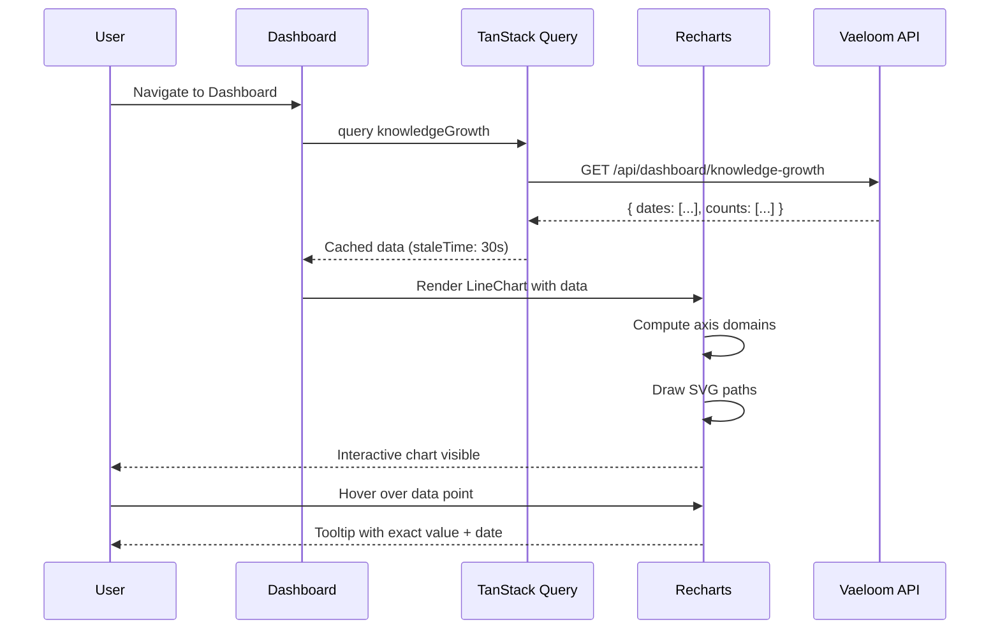
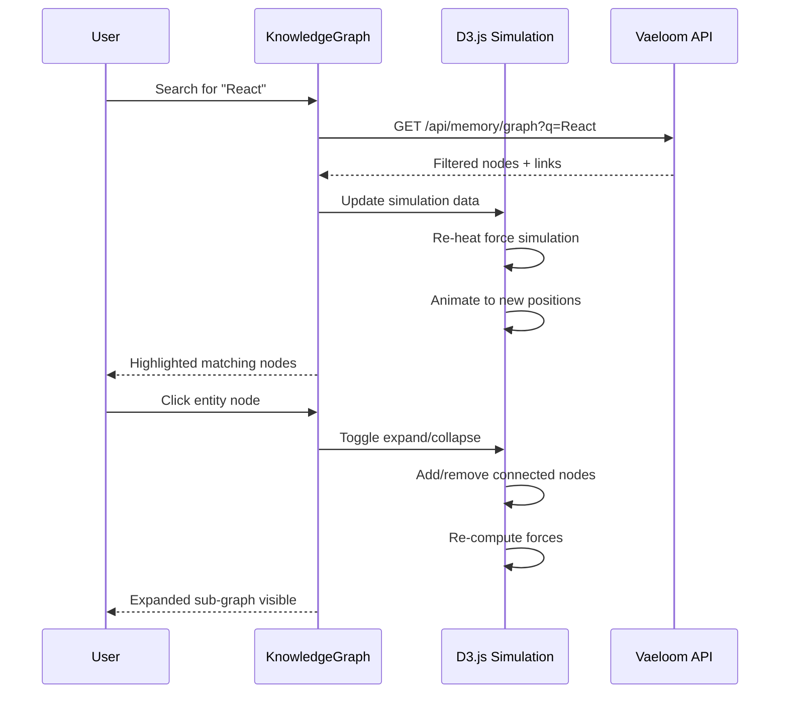

# Charts & Data Visualization

> **Purpose:** Define charting library standards, visualization types, and performance guidelines for Vaeloom's data dashboards
> **Status:** ? Upgraded to enterprise quality
> **Owner:** Frontend Team
> **Version:** 2.0
> **Last Updated:** 2026-07-17
> **Dependencies:** Theme-System.md, State-Management.md, Dashboard.md
> **Implementation Status:** ?? Spec Only
> **Review Checklist:** Standard
> **Canonical source:** docs/Frontend/Charts.md

## Overview

Vaeloom uses data visualization to transform raw entity data into actionable insights for users. Charts display knowledge growth trends over time, application volume across platforms, skill category distributions, and the interconnected memory graph that forms the core of Vaeloom's AI-powered knowledge management.

The charting architecture follows a tiered library strategy: Recharts for standard chart types (line, bar, pie), D3.js for complex custom visualizations (the force-directed knowledge graph), and CSS/SVG for lightweight indicators (sparklines, stat badges). This tiered approach ensures each visualization uses the right tool for its complexity level — a dashboard sparkline doesn't require the full D3.js bundle.

Every chart in Vaeloom follows five design guidelines: accessibility through data tables, responsive resizing with their container, consistent use of theme color tokens, interactive tooltips with drill-down, and meaningful empty states that guide users when no data is available. These guidelines ensure charts are usable, on-brand, and informative regardless of the data state.

For Vaeloom's users — typically career professionals managing resumes, job applications, and skill development — charts provide at-a-glance understanding of their knowledge ecosystem. The knowledge graph, in particular, is a flagship visualization that reveals hidden connections between skills, experiences, and career goals that users might not have discovered on their own.

## Goals

- Render all standard charts (line, bar, pie) within 200ms of data arrival using Recharts
- Support interactive tooltips and click-to-drill navigation on every chart widget
- Provide accessible data table alternatives for all chart visualizations
- Maintain knowledge graph interactivity at 30fps+ for up to 1,000 nodes
- Use theme accent colors consistently across all charts with zero hardcoded palettes

## Scope

### In Scope

| Area | Description |
|------|-------------|
| Recharts Charts | Dashboard line charts (knowledge growth, entity trends), bar charts (apps per platform, skills by category), pie/donut charts (memory type distribution) |
| D3.js Knowledge Graph | Force-directed knowledge graph for Memory Graph page with search, filter, expand/collapse |
| CSS/SVG Sparklines | Compact trend indicators in widget headers and stat cards |
| Responsive Containers | Charts that resize with parent using CSS Grid and container queries |
| Tooltip Interactivity | Tooltips with exact value display and click-through deep-linking |

### Out of Scope

| Area | Reason |
|------|--------|
| Real-time streaming charts with live data updates | Future improvement |
| Chart export to PDF or image formats | Future improvement |
| Third-party libraries beyond Recharts, D3.js, inline SVG | Bundle size and maintenance constraint |
| Chart animation beyond standard Recharts transitions | Performance budget constraint |

## Functional Requirements

| ID | Description | Priority |
|----|-------------|----------|
| FR-CHT-001 | System shall render line charts for knowledge growth and entity trends over time | P0 |
| FR-CHT-002 | System shall render bar charts for comparisons (apps per platform, skills by category) | P0 |
| FR-CHT-003 | System shall render pie/donut charts for proportion distribution (memory types) | P1 |
| FR-CHT-004 | System shall render compact sparkline indicators in widget headers | P1 |
| FR-CHT-005 | System shall render force-directed knowledge graph with search and expand/collapse | P1 |
| FR-CHT-006 | System shall provide tooltip with exact values on hover for all interactive charts | P0 |
| FR-CHT-007 | System shall provide accessible data table alternative for every chart | P1 |
| FR-CHT-008 | System shall use CSS theme variables for all chart colors | P0 |

## Non-Functional Requirements

| ID | Description | Target | Measurement |
|----|-------------|--------|-------------|
| NFR-CHT-001 | Chart render time from data arrival | < 200ms | PerformanceObserver |
| NFR-CHT-002 | Knowledge graph interaction FPS | >= 30fps (1,000 nodes) | Chrome DevTools FPS meter |
| NFR-CHT-003 | Chart resize responsiveness | < 100ms on container resize | ResizeObserver timing |
| NFR-CHT-004 | Data point limit for smooth interactivity | < 500 per series | Chrome DevTools frame analysis |
| NFR-CHT-005 | Bundle size impact (Recharts only) | < 30KB gzipped | Webpack Bundle Analyzer |

## Architecture


## Components

| Component | Responsibility | Technology | Scale Strategy |
|-----------|---------------|------------|----------------|
| LineChart | Render knowledge growth trends over time | Recharts | Instance per metric — configurable xAxis (date), yAxis (count), color from theme |
| BarChart | Display comparisons (apps per platform, skills by category) | Recharts | Instance per comparison; responsive via container width |
| PieChart | Show proportion distribution (memory types, skill categories) | Recharts | Instance per distribution; donut variant with center label |
| KnowledgeGraph | Force-directed memory graph visualization | D3.js | Single instance per Memory page; dynamic node count based on entity depth |
| Sparkline | Compact trend indicator in widget headers | CSS/SVG inline | Stateless — rendered as `<path>` in SVG; no JS runtime |
| ChartEmptyState | Meaningful empty state for missing data | React | Shared across all chart types; shows different message based on query |
| ChartDataTable | Accessible data table beneath charts | React | Auto-generated from chart data; toggled via `aria-expanded` |

## Workflows

1. **Dashboard line chart loads**: Page mounts ? TanStack Query fetches knowledge growth data ? Recharts renders `<ResponsiveContainer>` ? axis scales computed ? lines drawn with theme accent colors ? tooltip hover triggers data point highlight
2. **Knowledge graph interaction**: User searches for entity ? D3.js filter narrows visible nodes ? force simulation re-heats ? connected nodes animate to new positions ? user clicks node to expand/collapse
3. **Chart empty state**: No data available for selected time range ? chart renders empty state component ? user sees "No data for this period" with CTA ? user adjusts filter ? chart re-fetches and renders
4. **Chart export to PNG**: User clicks download ? html2canvas captures chart DOM ? canvas renders to PNG blob ? download triggered with filename `Vaeloom-chart-{date}.png`
5. **Theme integration**: User switches theme ? CSS variable values change ? chart colors update automatically via CSS variable references ? no chart re-mount needed

## Sequence Diagrams





## Data Flow

1. **Ingestion**: Connectors fetch external data (LinkedIn, GitHub, Gmail) ? parsed into structured entities ? stored in PostgreSQL with timestamps and metadata
2. **Processing**: Memory Agent analyzes entity relationships ? computes growth rates, category distributions, trend lines ? results cached in Redis with 5-minute TTL
3. **Storage**: Chart data stored as time-series in PostgreSQL (`entity_growth`, `category_counts`) ? aggregated views pre-computed via materialized views
4. **Retrieval**: Dashboard queries aggregated endpoints ? TanStack Query caches with 30s staleTime ? Recharts renders SVG/Canvas from cached data
5. **Deletion**: User deletes workspace ? all associated time-series data purged ? materialized views refreshed ? chart shows empty state

## APIs

| Method | Path | Purpose |
|--------|------|---------|
| GET | `/api/dashboard/knowledge-growth` | Time-series data for knowledge growth line chart |
| GET | `/api/dashboard/apps-by-platform` | Bar chart data for applications per platform |
| GET | `/api/dashboard/memory-distribution` | Pie chart data for memory type distribution |
| GET | `/api/memory/graph` | Nodes and links for knowledge graph (supports `?q=` search) |
| GET | `/api/dashboard/skills-by-category` | Bar chart data for skills distribution |

## Database

| Table | Key Columns | Purpose |
|-------|-------------|---------|
| `entity_growth` | date, workspace_id, entity_count, new_entities | Time-series for knowledge growth line chart |
| `category_counts` | category, workspace_id, count | Aggregated counts for pie/bar charts |
| `memory_graph_nodes` | id, workspace_id, label, category, importance, metadata | Knowledge graph node storage |
| `memory_graph_edges` | id, source_id, target_id, type, weight | Knowledge graph edge relationships |

## Security

| Concern | Mitigation |
|---------|------------|
| Data exposure in tooltips | Tooltips on interactive charts may expose user- or workspace-specific data — validate tooltip content against permission scope |
| XSS through chart labels/annotations | Charting libraries that render HTML in tooltips or labels via `dangerouslySetInnerHTML` can execute injected scripts — sanitize all label inputs |
| Knowledge graph node data sensitivity | Network graph visualizations can reveal relationship patterns that expose inferred information — scope graph rendering to permitted entities only |

## Performance

| Concern | Budget | Measurement | Optimization |
|---------|--------|-------------|--------------|
| Data point count limits | < 500 per series | Chrome DevTools frame analysis | Use data aggregation, decimation, or windowing above 500 points |
| Canvas vs SVG trade-offs | < 1000 SVG elements | PerformanceObserver frame timing | Use Canvas-based rendering (D3.js) for large datasets; SVG for standard |
| Lazy chart rendering | < 200ms saved on initial paint | Lighthouse | Use IntersectionObserver to delay rendering charts below the fold |
| Chart re-render on data update | < 100ms | React DevTools Profiler | Memoize chart components with `React.memo`; use `useMemo` for data transforms |

## Scalability

| Dimension | Current Limit | 10x Strategy | 100x Strategy |
|-----------|---------------|--------------|---------------|
| Data points per chart | 500 | Aggregate to hourly buckets; windowing for display | Stream data through WebSocket; progressive loading of time ranges |
| Knowledge graph nodes | 1,000 | Cluster nodes by category; virtualize rendering | WebGL rendering with octree spatial indexing |
| Concurrent chart renders | 8 widgets per dashboard | Lazy-render below-fold charts; virtualize chart grid | Server-side render chart SVG for initial paint |
| Recharts data updates | 1s refresh interval | Debounce data at query level; batch updates | Delta patching of SVG paths instead of full re-render |

## Error Handling

| Scenario | Detection | Mitigation | Recovery |
|----------|-----------|------------|----------|
| Chart data fetch fails | TanStack Query returns error state | Render empty state with retry button; show last known data if cached | Retry after 3s backoff; show stale data with "last updated" timestamp |
| D3.js layout never converges | Force simulation exceeds max iterations (300) | Snap nodes to current positions; pause simulation | Log to Sentry; allow user to restart layout manually |
| Recharts responsive container has zero width | Container not yet rendered | Use `aspect-ratio` CSS; set minimum width (200px) | Re-render on container resize via ResizeObserver |
| SVG rendering exceeds 16ms frame budget | requestAnimationFrame callback > 16ms | Fall back to Canvas rendering for large datasets | Progressive rendering with requestIdleCallback |

## Monitoring

| Metric | Alert Threshold | Severity | Dashboard |
|--------|----------------|----------|-----------|
| Chart render time | > 200ms per chart | Warning | Grafana — Frontend Performance |
| Knowledge graph FPS | < 30fps during interaction | Warning | Chrome DevTools — Performance tab |
| Data fetch error rate | > 1% of chart queries | Critical | Grafana — API Dashboard |
| Empty state impressions | > 50% of chart views show empty state | Info | Amplitude — Chart Engagement |

## Deployment

| Environment | Strategy | Rollback | Notes |
|-------------|----------|----------|-------|
| Development | Direct deploy with debug mode | Revert commit | Recharts and D3.js DevTools available |
| Staging | Gradual rollout to team; A/B test chart variants | Feature flag toggle | Validate render times with real data volumes |
| Production | Canary per workspace (10% ? 50% ? 100%) | Disable chart features; fall back to data tables | Monitor chart render time and FPS metrics |

## Configuration

| Variable | Purpose | Default | Required |
|----------|---------|---------|----------|
| `CHART_MAX_DATA_POINTS` | Maximum data points before aggregation | 500 | No |
| `KNOWLEDGE_GRAPH_MAX_NODES` | Maximum nodes in force simulation | 1000 | No |
| `CHART_LAZY_LOAD_THRESHOLD` | IntersectionObserver threshold for lazy loading | 0.1 | No |
| `CHART_ANIMATION_DURATION_MS` | Recharts animation duration | 300 | No |
| `KNOWLEDGE_GRAPH_FORCE_STRENGTH` | D3.js forceManyBody strength | -300 | No |

## Examples

### Dashboard Knowledge Growth Line Chart

```tsx
import { LineChart, Line, XAxis, YAxis, Tooltip, ResponsiveContainer } from 'recharts';

const data = [
  { date: '2026-01', entities: 45 },
  { date: '2026-02', entities: 78 },
  { date: '2026-03', entities: 112 },
];

function KnowledgeGrowthChart() {
  return (
    <ResponsiveContainer width="100%" height={250}>
      <LineChart data={data}>
        <XAxis dataKey="date" stroke="var(--text-secondary)" fontSize={12} />
        <YAxis stroke="var(--text-secondary)" fontSize={12} />
        <Tooltip
          contentStyle={{ backgroundColor: 'var(--bg-elevated)', border: '1px solid var(--border-light)' }}
        />
        <Line type="monotone" dataKey="entities" stroke="var(--accent-primary)" strokeWidth={2} />
      </LineChart>
    </ResponsiveContainer>
  );
}
```

### Knowledge Graph Node with D3.js

```typescript
import * as d3 from 'd3';

function renderGraph(container: SVGSVGElement, nodes: Node[], links: Link[]) {
  const simulation = d3.forceSimulation(nodes)
    .force('link', d3.forceLink(links).id((d: any) => d.id))
    .force('charge', d3.forceManyBody().strength(-300))
    .force('center', d3.forceCenter(400, 300));

  const link = d3.select(container).selectAll('line')
    .data(links).join('line')
    .attr('stroke', (d: Link) => themeTokens.edgeColors[d.type])
    .attr('stroke-width', 1.5);

  const node = d3.select(container).selectAll('circle')
    .data(nodes).join('circle')
    .attr('r', (d: Node) => 5 + d.importance * 10)
    .attr('fill', (d: Node) => themeTokens.entityColors[d.category]);

  simulation.on('tick', () => {
    link.attr('x1', (d: any) => d.source.x).attr('y1', (d: any) => d.source.y);
    node.attr('cx', (d: any) => d.x).attr('cy', (d: any) => d.y);
  });
}
```

### Bar Chart with CSS Variable Theme Colors

```tsx
import { BarChart, Bar, XAxis, YAxis, Tooltip, ResponsiveContainer } from 'recharts';

function AppsByPlatformChart({ data }: { data: PlatformData[] }) {
  return (
    <ResponsiveContainer width="100%" height={250}>
      <BarChart data={data}>
        <XAxis dataKey="platform" stroke="var(--text-secondary)" />
        <YAxis stroke="var(--text-secondary)" />
        <Tooltip
          contentStyle={{ backgroundColor: 'var(--bg-elevated)', borderColor: 'var(--border-light)' }}
        />
        <Bar dataKey="count" fill="var(--accent-secondary)" radius={[4, 4, 0, 0]} />
      </BarChart>
    </ResponsiveContainer>
  );
}
```

### Sparkline with Inline SVG

```tsx
function Sparkline({ data, color = 'var(--accent-primary)' }: { data: number[]; color?: string }) {
  const w = 80, h = 24;
  const points = data.map((v, i) => `${(i / (data.length - 1)) * w},${h - (v / Math.max(...data)) * h}`).join(' ');
  return (
    <svg width={w} height={h} aria-label={`Trend: ${data[data.length - 1]} (${data[0]} ? ${data[data.length - 1]})`}>
      <polyline fill="none" stroke={color} strokeWidth={1.5} points={points} />
    </svg>
  );
}
```

## Best Practices

| # | Practice | Rationale |
|---|----------|-----------|
| 1 | Provide data tables as chart alternatives | Screen readers cannot interpret SVG chart elements; always include the underlying data in an accessible `<table>` |
| 2 | Use theme color tokens consistently | Charts should reference the same palette as the rest of the UI — never introduce ad-hoc custom colors that clash |
| 3 | Add tooltips and click-to-drill interactivity | Users want to explore data, not just see it; tooltips with exact values and click-through to details add depth |
| 4 | Keep data point count reasonable | Line charts with 1000+ points are illegible; aggregate or sample data for display, show full detail on demand |
| 5 | Memoize chart components | Use `React.memo` and `useMemo` for data transforms to prevent unnecessary re-renders on parent updates |
| 6 | Handle empty states gracefully | Never show blank chart with grid lines — display meaningful message about what data will appear |

## Risks

| Risk | Likelihood | Impact | Mitigation |
|------|------------|--------|------------|
| D3.js SVG rendering causes layout thrash at scale | Medium | Medium | Virtualize node rendering; use Canvas for large graphs |
| Recharts version upgrade breaks custom components | Low | High | Pin major version; maintain component test suite with screenshot comparison |
| Chart tooltip exposes sensitive entity data | Medium | High | Validate tooltip content against user permissions; redact entity names where needed |
| Browser SVG rendering performance degrades on low-end devices | High | Medium | Detect device capability via `navigator.hardwareConcurrency`; fall back to Canvas |

## Limitations

| Limitation | Impact | Workaround | Future Resolution |
|------------|--------|------------|-------------------|
| Recharts does not support Canvas rendering | Large datasets cause SVG DOM bloat | Fall back to D3.js Canvas for datasets >500 points | Integrate Chart.js as secondary renderer for high-volume charts |
| D3.js has no built-in React integration | Manual lifecycle management required | Wrap D3 in `useEffect` with cleanup; bind React state to D3 selections | Use `@visx` (React-friendly D3 wrapper) |
| SVG-based responsive containers require defined height | Charts collapse to zero height without explicit container height | Set `aspect-ratio: 1/1` on container; use CSS grid for dashboard layout | Switch to container queries when browser support reaches 95% |

## Future Improvements

| Improvement | Priority | Complexity | Timeline |
|-------------|----------|------------|----------|
| WebGL knowledge graph with octree spatial indexing | High | High | Q4 2027 |
| Export chart as PDF with full-page layout | Medium | Low | Q2 2027 |
| AI-generated chart narrative summaries | Medium | Medium | Q3 2027 |
| Real-time chart streaming via WebSocket for live metrics | Low | Medium | Q2 2027 |

## Related Documents

- [Accessibility.md](./Accessibility.md)
- [Accessibility-Audit.md](./Accessibility-Audit.md)
- [Animation-System.md](./Animation-System.md)
- [Component-Library.md](./Component-Library.md)
- [Dashboard.md](./Dashboard.md)
- [Design-System.md](./Design-System.md)
- [Forms.md](./Forms.md)
- [Frontend-Architecture.md](./Frontend-Architecture.md)
- [Internationalization.md](./Internationalization.md)
- [Mobile-Architecture.md](./Mobile-Architecture.md)
- [Navigation.md](./Navigation.md)
- [Responsive-Design.md](./Responsive-Design.md)
- [State-Management.md](./State-Management.md)
- [Theme-System.md](./Theme-System.md)
- [UI-Architecture.md](./UI-Architecture.md)
- [UX-Guidelines.md](./UX-Guidelines.md)
