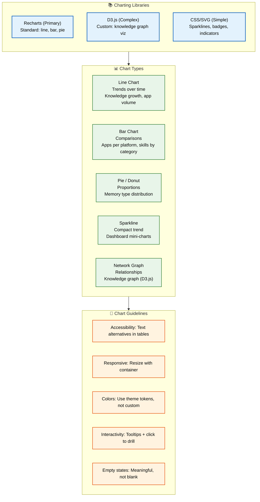
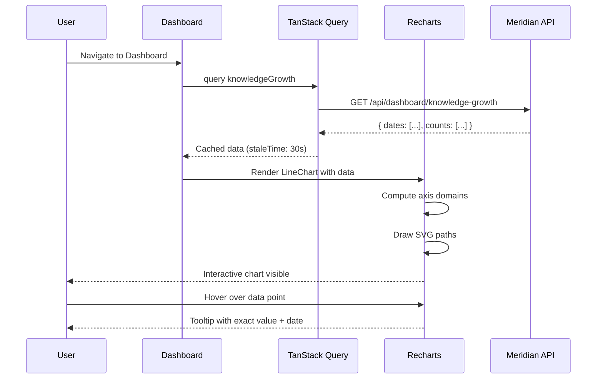

# Charts & Data Visualization

> **Purpose:** Define chart and visualization standards for Meridian
> **Status:** 🆕 New

## Chart Architecture



> **Diagram:** Charting architecture — **3 libraries** with priority (Recharts primary, D3.js for complex, CSS/SVG for simple) → **5 chart types** (line, bar, pie, sparkline, network graph) → **5 guidelines** (accessibility, responsive, colors, interactivity, empty states).

---

## Charting Library

| Library | Use Case | Priority |
|---------|----------|----------|
| Recharts (React-native) | Standard charts (line, bar, pie) | Primary |
| D3.js | Custom visualizations (knowledge graph) | Complex cases |
| CSS/SVG | Simple indicators (sparklines, badges) | Simple cases |

## Chart Types

| Chart | Usage | Example |
|-------|-------|---------|
| Line chart | Trends over time | Knowledge growth, application volume |
| Bar chart | Comparisons | Applications per platform, skills by category |
| Pie / Donut | Proportions | Memory type distribution |
| Sparkline | Compact trend | Dashboard mini-charts |
| Network graph | Relationships | Knowledge graph visualization |

## Chart Guidelines

| Guideline | Standard |
|-----------|----------|
| Accessibility | All charts need text alternatives (tables) |
| Responsive | Charts resize with container |
| Color | Use theme accent colors, not custom palettes |
| Interactivity | Tooltips on hover, click to drill down |
| Empty states | Show meaningful empty state, not blank chart |

## Knowledge Graph Visualization

The memory graph uses a force-directed layout:

- Nodes sized by entity importance
- Edges colored by relationship type
- Click to expand/collapse connected nodes
- Search to highlight matching entities
- Physics simulation for natural layout

## Common Mistakes

| Mistake | Why It's a Problem |
|---------|-------------------|
| Misleading axis scales (truncated Y-axis, uneven intervals) | Distorts the visual story and misleads users — a 5% change can look like 50% with a truncated axis |
| Too many colors without semantic meaning | Users cannot visually track more than 5-7 distinct colors; excessive palette creates confusion, not clarity |
| No meaningful empty state | An empty chart with grid lines suggests data is broken or missing — show a clear message about what the chart will display |
| Non-responsive chart sizing | Charts that overflow on mobile or shrink to illegibility frustrate users; always set width: 100% + aspect-ratio |

## Best Practices

| Practice | Rationale |
|----------|-----------|
| Provide data tables as chart alternatives | Screen readers cannot interpret SVG chart elements; always include the underlying data in an accessible `<table>` |
| Use theme color tokens consistently | Charts should reference the same palette as the rest of the UI — never introduce ad-hoc custom colors that clash |
| Add tooltips and click-to-drill interactivity | Users want to explore data, not just see it; tooltips with exact values and click-through to details add depth |
| Keep data point count reasonable | Line charts with 1000+ points are illegible; aggregate or sample data for display, show full detail on demand |

## Security

| Concern | Mitigation |
|---------|------------|
| Data exposure in tooltips | Tooltips on interactive charts may inadvertently expose user- or workspace-specific data; validate tooltip content against permission scope |
| XSS through chart labels/annotations | Charting libraries that render HTML in tooltips or labels (e.g., via `dangerouslySetInnerHTML`) can execute injected scripts — sanitize all label inputs |
| Knowledge graph node data sensitivity | Network graph visualizations can reveal relationship patterns that expose inferred information; scope graph rendering to permitted entities only |

## Performance

| Concern | Guideline |
|---------|-----------|
| Data point count limits | Recharts and D3.js both recommend <500 data points for smooth interactivity; use data aggregation, decimation, or windowing above that threshold |
| Canvas vs SVG trade-offs | SVG (Recharts default) is crisp at any resolution but lags above ~1000 elements; use Canvas-based rendering (D3.js) for large datasets |
| Lazy chart rendering | Charts below the fold should use IntersectionObserver to delay rendering until visible — saves initial paint time by 200-500ms on dashboard pages |

## Security Considerations

| Concern | Mitigation |
|---------|------------|
| Data exposure in tooltips | Tooltips on interactive charts may inadvertently expose user- or workspace-specific data; validate tooltip content against permission scope |
| XSS through chart labels/annotations | Charting libraries that render HTML in tooltips or labels (e.g., via `dangerouslySetInnerHTML`) can execute injected scripts — sanitize all label inputs |
| Knowledge graph node data sensitivity | Network graph visualizations can reveal relationship patterns that expose inferred information; scope graph rendering to permitted entities only |

## Performance Considerations

| Concern | Approach |
|---------|----------|
| Data point count limits | Recharts and D3.js both recommend <500 data points for smooth interactivity; use data aggregation, decimation, or windowing above that threshold |
| Canvas vs SVG trade-offs | SVG (Recharts default) is crisp at any resolution but lags above ~1000 elements; use Canvas-based rendering (D3.js) for large datasets |
| Lazy chart rendering | Charts below the fold should use IntersectionObserver to delay rendering until visible — saves initial paint time by 200-500ms on dashboard pages |

## Components

| Component | Responsibility | Technology | Scale Strategy |
|-----------|---------------|------------|----------------|
| LineChart | Render knowledge growth trends over time | Recharts (React Native) | Instance per metric — configurable xAxis (date), yAxis (count), color from theme |
| BarChart | Display comparisons (apps per platform, skills by category) | Recharts | Instance per comparison; responsive via container width |
| KnowledgeGraph | Force-directed memory graph visualization | D3.js | Single instance per Memory page; dynamic node count based on entity depth |
| Sparkline | Compact trend indicator in widget headers | CSS/SVG inline | Stateless — rendered as `<path>` in SVG; no JS runtime |

## Workflows

1. **Dashboard line chart loads**: Page mounts → TanStack Query fetches knowledge growth data → Recharts renders `<ResponsiveContainer>` → axis scales computed → lines drawn with theme accent colors → tooltip hover triggers data point highlight
2. **Knowledge graph interaction**: User searches for entity → D3.js filter narrows visible nodes → force simulation re-heats → connected nodes animate to new positions → user clicks node to expand/collapse
3. **Chart empty state**: No data available for selected time range → chart renders empty state component → user sees "No data for this period" with CTA → user adjusts filter → chart re-fetches and renders
4. **Chart export to PNG**: User clicks download → html2canvas captures chart DOM → canvas renders to PNG blob → download triggered with filename `meridian-chart-{date}.png`

## Sequence Diagrams



## Data Flow

1. **Ingestion**: Connectors fetch external data (LinkedIn, GitHub, Gmail) → parsed into structured entities → stored in PostgreSQL with timestamps and metadata
2. **Processing**: Memory Agent analyzes entity relationships → computes growth rates, category distributions, trend lines → results cached in Redis with 5-minute TTL
3. **Storage**: Chart data stored as time-series in PostgreSQL (`entity_growth`, `category_counts`) → aggregated views pre-computed via materialized views
4. **Retrieval**: Dashboard queries aggregated endpoints → TanStack Query caches with 30s staleTime → Recharts renders SVG/Canvas from cached data
5. **Deletion**: User deletes workspace → all associated time-series data purged → materialized views refreshed → chart shows empty state

## Scalability

| Dimension | Current Limit | 10x Strategy | 100x Strategy |
|-----------|---------------|--------------|---------------|
| Data points per chart | 500 | Aggregate to hourly buckets; use windowing for display | Stream data through WebSocket; progressive loading of time ranges |
| Knowledge graph nodes | 1,000 | Cluster nodes by category; virtualize rendering | WebGL rendering with octree spatial indexing |
| Concurrent chart renders | 8 widgets per dashboard | Lazy-render below-fold charts; virtualize chart grid | Server-side render chart SVG for initial paint |
| Recharts data updates | 1s refresh interval | Debounce data at query level; batch updates | Delta patching of SVG paths instead of full re-render |

## Error Handling

| Scenario | Detection | Mitigation | Recovery |
|----------|-----------|------------|----------|
| Chart data fetch fails | TanStack Query returns error state | Render empty state with retry button; show last known data if cached | Retry after 3s backoff; show stale data with "last updated" timestamp |
| D3.js layout never converges | Force simulation exceeds max iterations (300) | Snap nodes to current positions; pause simulation | Log to Sentry; allow user to restart layout manually |
| Recharts responsive container has zero width | Container not yet rendered | Use `aspect-ratio` CSS; set minimum width (200px) | Re-render on container resize via ResizeObserver |
| SVG rendering exceeds 16ms frame budget | requestAnimationFrame callback duration > 16ms | Fall back to Canvas rendering for large datasets | Add progressive rendering with requestIdleCallback |

## Monitoring

| Metric | Alert Threshold | Severity | Dashboard |
|--------|----------------|----------|-----------|
| Chart render time | > 200ms per chart | Warning | Grafana — Frontend Performance |
| Knowledge graph FPS | < 30fps during interaction | Warning | Chrome DevTools — Performance tab |
| Data fetch error rate | > 1% of chart queries | Critical | Grafana — API Dashboard |
| Empty state impressions | > 50% of chart views show empty state | Info | Amplitude — Chart Engagement |

## Risks

| Risk | Likelihood | Impact | Mitigation |
|------|------------|--------|------------|
| D3.js SVG rendering causes layout thrash at scale | Medium | Medium | Virtualize node rendering; use Canvas for large graphs |
| Recharts version upgrade breaks custom components | Low | High | Pin major version; maintain component test suite with screenshot comparison |
| Chart tooltip exposes sensitive entity data | Medium | High | Validate tooltip content against user permissions; redact entity names where needed |
| Browser SVG rendering performance degrades on low-end devices | High | Medium | Detect device capability via `navigator.hardwareConcurrency`; fall back to Canvas |

## Limitations

| Limitation | Impact | Workaround | Future Resolution |
|------------|--------|------------|-------------------|
| Recharts does not support Canvas rendering | Large datasets cause SVG DOM bloat | Fall back to D3.js Canvas for datasets >500 points | Integrate Chart.js as secondary renderer for high-volume charts |
| D3.js has no built-in React integration | Manual lifecycle management required | Wrap D3 in `useEffect` with cleanup; bind React state to D3 selections | Use `@react-hook/d3` or migrate to visx (React-friendly D3 wrapper) |
| SVG-based responsive containers require defined height | Charts collapse to zero height without explicit container height | Set `aspect-ratio: 1/1` on container; use CSS grid for dashboard layout | Switch to container queries when browser support reaches 95% |

## Overview

Meridian uses data visualization to transform raw entity data into actionable insights for users. Charts display knowledge growth trends over time, application volume across platforms, skill category distributions, and the interconnected memory graph that forms the core of Meridian's AI-powered knowledge management.

The charting architecture follows a tiered library strategy: Recharts for standard chart types (line, bar, pie), D3.js for complex custom visualizations (the force-directed knowledge graph), and CSS/SVG for lightweight indicators (sparklines, stat badges). This tiered approach ensures each visualization uses the right tool for its complexity level — a dashboard sparkline doesn't require the full D3.js bundle.

Every chart in Meridian follows five design guidelines: accessibility through data tables, responsive resizing with their container, consistent use of theme color tokens, interactive tooltips with drill-down, and meaningful empty states that guide users when no data is available. These guidelines ensure charts are usable, on-brand, and informative regardless of the data state.

For Meridian's users — typically career professionals managing resumes, job applications, and skill development — charts provide at-a-glance understanding of their knowledge ecosystem. The knowledge graph, in particular, is a flagship visualization that reveals hidden connections between skills, experiences, and career goals that users might not have discovered on their own.

## Goals

- Render all standard charts (line, bar, pie) within 200ms of data arrival using Recharts
- Support interactive tooltips and click-to-drill navigation on every chart widget
- Provide accessible data table alternatives for all chart visualizations
- Maintain knowledge graph interactivity at 30fps+ for up to 1,000 nodes
- Use theme accent colors consistently across all charts with zero hardcoded palettes

## Scope

### In Scope
- Recharts implementation for Dashboard line charts (knowledge growth, entity trends), bar charts (applications per platform, skills by category), and pie/donut charts (memory type distribution)
- D3.js force-directed knowledge graph for the Memory Graph page with search, filter, and expand/collapse interactions
- CSS/SVG sparklines for compact trend indicators in widget headers and stat cards
- Responsive chart containers that resize with their parent using CSS Grid and container queries
- Tooltip interactivity with exact value display and click-through deep-linking

### Out of Scope
- Real-time streaming charts with live data updates (future improvement)
- Chart export to PDF or image formats (future improvement)
- Third-party charting libraries beyond Recharts, D3.js, and inline SVG
- Chart animation beyond standard Recharts enter/exit transitions

## Examples

### Dashboard Knowledge Growth Line Chart

```tsx
import { LineChart, Line, XAxis, YAxis, Tooltip, ResponsiveContainer } from 'recharts';

const data = [
  { date: '2026-01', entities: 45 },
  { date: '2026-02', entities: 78 },
  { date: '2026-03', entities: 112 },
];

function KnowledgeGrowthChart() {
  return (
    <ResponsiveContainer width="100%" height={250}>
      <LineChart data={data}>
        <XAxis dataKey="date" stroke="var(--text-secondary)" fontSize={12} />
        <YAxis stroke="var(--text-secondary)" fontSize={12} />
        <Tooltip
          contentStyle={{ backgroundColor: 'var(--bg-elevated)', border: '1px solid var(--border-light)' }}
        />
        <Line type="monotone" dataKey="entities" stroke="var(--accent-primary)" strokeWidth={2} />
      </LineChart>
    </ResponsiveContainer>
  );
}
```

### Knowledge Graph Node with D3.js

```typescript
import * as d3 from 'd3';

function renderGraph(container: SVGSVGElement, nodes: Node[], links: Link[]) {
  const simulation = d3.forceSimulation(nodes)
    .force('link', d3.forceLink(links).id((d: any) => d.id))
    .force('charge', d3.forceManyBody().strength(-300))
    .force('center', d3.forceCenter(400, 300));

  const link = d3.select(container).selectAll('line')
    .data(links).join('line')
    .attr('stroke', (d: Link) => themeTokens.edgeColors[d.type])
    .attr('stroke-width', 1.5);

  const node = d3.select(container).selectAll('circle')
    .data(nodes).join('circle')
    .attr('r', (d: Node) => 5 + d.importance * 10)
    .attr('fill', (d: Node) => themeTokens.entityColors[d.category]);

  simulation.on('tick', () => {
    link.attr('x1', (d: any) => d.source.x).attr('y1', (d: any) => d.source.y);
    node.attr('cx', (d: any) => d.x).attr('cy', (d: any) => d.y);
  });
}
```

---

| Improvement | Priority | Complexity | Timeline |
|-------------|----------|------------|----------|
| WebGL knowledge graph with octree spatial indexing | High | High | Q4 2027 |
| Export chart as PDF with full-page layout | Medium | Low | Q2 2027 |
| AI-generated chart narrative summaries | Medium | Medium | Q3 2027 |
| Real-time chart streaming via WebSocket for live metrics | Low | Medium | Q2 2027 |

## Related Documents

- [Dashboard.md](./Dashboard.md)
- [Design System.md](./Design-System.md)
- [Component Library.md](./Component-Library.md)
