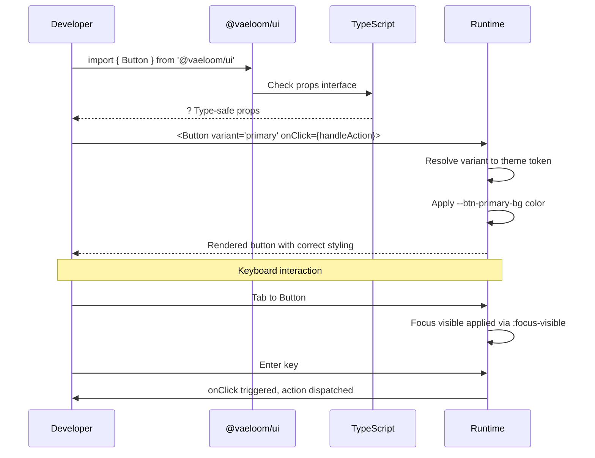

# Component Library

> **Purpose:** Define the component library and usage conventions for Vaeloom
> **Status:** ? Upgraded to enterprise quality
> **Owner:** Frontend Team
> **Version:** 2.0
> **Last Updated:** 2026-07-17
> **Dependencies:** Design-System.md, Theme-System.md, Frontend-Architecture.md
> **Implementation Status:** ?? Spec Only
> **Review Checklist:** Standard
> **Canonical source:** docs/Frontend/Component-Library.md

## Overview

The Vaeloom component library is an atomic-design-based collection of reusable UI elements organized into five layers: primitives (atoms like Button, Input, Icon), molecules (compositions like Card, Table, Form), layout components (Page, Grid, Stack), feature components (ProposalCard, MemoryNode, AgentStatus), and pages (WorkspacePage, MemoryPage). This hierarchy ensures that every piece of UI has a clear place in the design system and can be composed predictably.

Components are built with TypeScript strict mode and follow consistent conventions: all accept a `className` prop for styling overrides, support keyboard navigation, provide skeleton loading states instead of spinners, and surface actionable error messages rather than generic failures. The library is published as `@vaeloom/ui` and consumed by both the web frontend and mobile companion app.

The component library directly supports Vaeloom's AI-first workflows. Feature components like `ProposalCard` encapsulate the approve/reject interaction pattern that users engage with dozens of times per session. `AgentStatus` provides real-time health monitoring for each AI agent. `MemoryNode` renders entities in the knowledge graph with expand/collapse and drill-down capabilities.

By enforcing a strict component hierarchy and shared conventions, the library ensures visual consistency across all 11 routes, reduces duplication, and enables parallel development — a team building the Dashboard doesn't need to coordinate with the team building Settings as long as both use the same primitive components.

## Goals

- Maintain 100% TypeScript strict mode compliance across all 64+ library components
- Achieve zero prop-drilling beyond 2 component layers through composition and Context
- Ensure every interactive component supports keyboard navigation and screen reader announcements
- Keep individual component bundle size under 5KB gzipped
- Support skeleton loading states for all data-dependent components

## Scope

### In Scope

- Five-layer atomic component hierarchy (primitives, molecules, layout, features, pages)
- TypeScript strict mode with generic compound components (`Table<T>`, `List<T>`)
- Consistent prop patterns (`className`, `variant`, `children`, event handlers)
- Loading (skeleton), empty, error, and edge case states for every data-fetching component
- Keyboard navigation, focus management, and ARIA attributes on all interactive elements

### Out of Scope

- Server components requiring hooks or Context (marked with `use client` boundary)
- Visual regression test suite (covered in E2E Testing)
- Storybook documentation site (planned for future improvement)
- Third-party component wrappers (evaluated per integration)

## Functional Requirements

| ID | Requirement | Priority |
|----|-------------|----------|
| FR-001 | All components must accept a `className` prop for external styling overrides | P0 |
| FR-002 | All interactive components must support keyboard navigation and screen reader announcements | P0 |
| FR-003 | Data-dependent components must render distinct loading (skeleton), empty, and error states | P0 |
| FR-004 | Compound components must expose sub-components (e.g., `Card.Header`, `Card.Body`, `Card.Footer`) | P1 |
| FR-005 | Feature components must encapsulate domain logic with clearly typed props and no internal side effects | P1 |

## Non-Functional Requirements

| ID | Requirement | Target | Measurement |
|----|-------------|--------|-------------|
| NFR-001 | TypeScript strict mode compliance across all components | 100% | `tsc --strict` compilation passes with zero errors |
| NFR-002 | Individual component bundle size (gzipped) | < 5KB | `bundlesize` CI check per component export |
| NFR-003 | Maximum prop-drilling depth | 2 layers max | ESLint `no-prop-drilling` rule enforced in CI |
| NFR-004 | Render-to-interaction latency for interactive components | < 50ms p95 | React Profiler flame graph in CI pipeline |
| NFR-005 | Unnecessary re-render rate for memoized components | 0 | React DevTools Profiler + `why-did-you-render` check |

## Architecture

```mermaid
graph TD
    %% ——— Class Definitions ———
    classDef primitive fill:#e3f2fd,stroke:#1565c0,color:#000,stroke-width:1.5px
    classDef molecule fill:#e8f5e9,stroke:#2e7d32,color:#000,stroke-width:1.5px
    classDef layout fill:#fff3e0,stroke:#e65100,color:#000,stroke-width:1.5px
    classDef feature fill:#f3e5f5,stroke:#6a1b9a,color:#000,stroke-width:1.5px
    classDef page fill:#ffebee,stroke:#c62828,color:#000,stroke-width:2px
    classDef shared fill:#e0f7fa,stroke:#00838f,color:#000,stroke-width:1px,stroke-dasharray: 5 3

    %% ——— Layer 1: Primitives ———
    subgraph Primitives["?? 1. Primitives (Atoms)"]
        direction TB
        P1["Button"] --- P2["Input"] --- P3["Text"] --- P4["Icon"]
        P5["Avatar"] --- P6["Badge"] --- P7["Tooltip"] --- P8["Spinner"]
        P9["Checkbox"] --- P10["Radio"] --- P11["Select"] --- P12["Toggle"]
    end

    %% ——— Layer 2: Molecules ———
    subgraph Molecules["?? 2. Molecules (Compositions)"]
        direction TB
        M1["Card<br/>Header + Body + Footer"] --- M2["Table<br/>Sort + Filter + Paginate"]
        M3["Form<br/>Input + Validation + Submit"] --- M4["Modal<br/>Overlay + Title + Content"]
        M5["Toast<br/>Message + Type + Timer"] --- M6["Alert<br/>Type + Message + Action"]
        M7["List<br/>Virtualized Items"] --- M8["Breadcrumb<br/>Path + Separator"]
    end

    %% ——— Layer 3: Layout ———
    subgraph Layout["?? 3. Layout Components"]
        direction TB
        L1["Page<br/>Wrapper + Header + Actions"] --- L2["Grid<br/>Responsive Cols + Gap"]
        L3["Stack<br/>Direction + Spacing"] --- L4["Sidebar<br/>Nav Items + Collapse"]
        L5["Navbar<br/>Logo + Nav + Profile"] --- L6["Tabs<br/>Tab List + Panel"]
    end

    %% ——— Layer 4: Feature Components ———
    subgraph Features["? 4. Feature Components (Templates)"]
        direction TB
        F1["ProposalCard<br/>Agent suggestions + Approve/Reject"] --- F2["AgentStatus<br/>Health + Metrics + Controls"]
        F3["MemoryNode<br/>Entity + Depth + Expand"] --- F4["Citation<br/>Source + Text + Tooltip"]
        F5["ConnectorCard<br/>Status + Sync + Auth"] --- F6["Timeline<br/>Events + Date + Actions"]
    end

    %% ——— Layer 5: Pages ———
    subgraph Pages["?? 5. Pages"]
        direction TB
        PG1["WorkspacePage<br/>Dashboard + Activity"] --- PG2["MemoryPage<br/>Graph + Search + Filter"]
        PG3["ConnectorsPage<br/>List + Status + Setup"] --- PG4["SettingsPage<br/>Profile + Preferences + Billing"]
        PG5["LoginPage<br/>OAuth + Consent"] --- PG6["OnboardingPage<br/>Wizard + Connect"]
    end

    %% ——— Component composition arrows ———
    P1 & P2 & P3 & P4 & P5 & P6 & P7 & P8 & P9 & P10 & P11 & P12 -.->|compose| M1 & M2 & M3 & M4 & M5 & M6 & M7 & M8
    M1 & M2 & M3 & M4 & M5 & M6 & M7 & M8 -.->|arrange into| L1 & L2 & L3 & L4 & L5 & L6
    L1 & L2 & L3 & L4 & L5 & L6 -.->|build| F1 & F2 & F3 & F4 & F5 & F6
    F1 & F2 & F3 & F4 & F5 & F6 -.->|render in| PG1 & PG2 & PG3 & PG4 & PG5 & PG6

    %% ——— Shared / cross-cutting ———
    subgraph Shared["?? Shared Utilities"]
        S1["Theme Tokens<br/>Colors + Typography + Spacing"] --- S2["Hooks<br/>useAuth + useQuery + useSync"]
        S3["Icons<br/>Lucide / Custom"] --- S4["Styles<br/>Tailwind + CSS Modules"]
    end

    S1 -.-> P1 & M1 & L1 & F1 & PG1
    S2 -.-> P2 & M2 & L2 & F2 & PG2
    S3 -.-> P3 & M3 & L3 & F3 & PG3
    S4 -.-> P4 & M4 & L4 & F4 & PG4

    %% ——— Apply styles ———
    class P1,P2,P3,P4,P5,P6,P7,P8,P9,P10,P11,P12 primitive
    class M1,M2,M3,M4,M5,M6,M7,M8 molecule
    class L1,L2,L3,L4,L5,L6 layout
    class F1,F2,F3,F4,F5,F6 feature
    class PG1,PG2,PG3,PG4,PG5,PG6 page
    class S1,S2,S3,S4 shared
```



> **Diagram:** Component hierarchy follows atomic design principles across five layers. **Primitives** (??) are the smallest UI atoms. **Molecules** (??) compose primitives into functional units. **Layout** (??) components arrange molecules into page structures. **Feature Components** (?) build domain-specific templates. **Pages** (??) assemble features into full views. **Shared Utilities** (??) provide theme tokens, hooks, and styles consumed by every layer.

## Components

| Component | Responsibility | Technology | Scale Strategy |
|-----------|---------------|------------|----------------|
| Button, Input, Text, Icon, Avatar, Badge, Tooltip, Spinner, Checkbox, Radio, Select, Toggle | Smallest UI atoms — single-purpose interactive elements | React + TypeScript + Tailwind CSS | Tree-shake unused primitives per route; lazy-load rarely used ones |
| Card, Table, Form, Modal, Toast, Alert, List, Breadcrumb | Compose primitives into functional UI patterns | React compound components + TypeScript generics | Modularize into `@vaeloom/ui/composites` sub-package at 10x scale |
| Page, Grid, Stack, Sidebar, Navbar, Tabs | Arrange molecules into page structures | React + CSS Grid / Flexbox | Responsive via Tailwind breakpoints; container queries at 100x scale |
| ProposalCard, AgentStatus, MemoryNode, Citation, ConnectorCard, Timeline | Domain-specific templates encapsulating AI workflows | React + TanStack Query + feature-flag gating | Split into `@vaeloom/features` package with per-route tree-shaking |
| WorkspacePage, MemoryPage, ConnectorsPage, SettingsPage, LoginPage, OnboardingPage | Full-page assemblies composing features | Next.js App Router + React Server Components | Route-based code splitting via Next.js dynamic imports |

## Workflows

1. **Developer consumes component from library**: Import component from `@vaeloom/ui` ? check props via TypeScript types ? render with required props ? optional `className` for styling overrides ? verify keyboard navigation and loading states
2. **Component variant selection**: Choose primitive (Button, Input) with variant prop ? semantic variant maps to theme token ? CSS variable resolves to correct light/dark value ? component renders with contextual styling
3. **Feature component assembly**: Compose `Card` + `List` + `Badge` into `ProposalCard` ? add `useMutation` for approve/reject ? export as feature component in `@vaeloom/features` ? import in page layer
4. **Component deprecation lifecycle**: Mark component `@deprecated` in TypeScript JSDoc ? add migration guide in CHANGELOG ? keep backward-compatible wrapper for 2 releases ? remove in v3 with codemod

## Sequence Diagrams



## Data Flow

1. **Ingestion**: Component props received from parent ? TypeScript validates prop types at build time ? React reconciliation compares with previous props ? memoized components skip re-render if props unchanged
2. **Processing**: Component renders JSX ? Tailwind classes mapped to CSS custom properties ? CSS variables resolve theme-appropriate values ? browser paints composited layers
3. **Storage**: Component state managed locally via `useState` or via TanStack Query for server data ? no global state for UI-only concerns ? URL search params persist filter/page state
4. **Retrieval**: Page imports feature components ? feature components compose primitives ? primitives reference design tokens ? tokens resolve to platform-specific values (web vs mobile)
5. **Deletion**: Component unmounts ? `useEffect` cleanup runs ? event listeners removed ? subscriptions cancelled ? DOM removed via React reconciliation

## APIs

| Endpoint | Consumer | Method | Purpose |
|----------|----------|--------|---------|
| `@vaeloom/ui` (npm package) | Feature components, Pages | `import` | Exports all primitives, molecules, and layout components with TypeScript types |
| `@vaeloom/features` (npm package) | Pages | `import` | Exports domain-specific feature components with internal data-fetching logic |
| N/A | N/A | N/A | Component library exposes no HTTP or REST APIs — all data flows through props and React Context |

## Database

| Concern | Details |
|---------|---------|
| Component state | No direct database access — components receive server data via TanStack Query hooks |
| UI preferences | Sidebar collapse, table column visibility, theme selection stored in `localStorage` |
| Form draft recovery | Form state serializable to `sessionStorage` via `useFormPersist` hook; no server-side persistence |
| Analytics events | Component interaction events emitted via analytics hook; stored in application database |

## Security

| Concern | Mitigation |
|---------|------------|
| `dangerouslySetInnerHTML` in rich text components | Any component that renders user-provided HTML (e.g., Markdown renderer, rich text editor) must sanitize input via DOMPurify or similar |
| Prop injection through spread operators | `{...props}` on DOM elements can allow malicious prop injection (e.g., `onLoad=alert(1)`); spread only known, validated props |
| File type validation in upload components | Never trust the file extension or MIME type from the client — validate file signature bytes server-side before rendering previews |

## Performance

| Concern | Budget | Measurement | Optimization |
|---------|--------|-------------|--------------|
| Initial bundle size per route | < 120KB gzipped | Webpack Bundle Analyzer / `next build` stats | Lazy-load heavy components (MemoryGraph, FileViewer) using `React.lazy()` + `Suspense` |
| Unnecessary re-renders per interaction | 0 | React DevTools Profiler / `why-did-you-render` | Use `React.memo` for stable-prop components + `useCallback` for event handlers |
| Bundle size per component | < 5KB gzipped | `bundlesize` CI check per component | Tree-shake unused variants; extract shared logic into utility modules |
| Image loading impact | LCP < 2.5s | Lighthouse CI | Native lazy loading for below-fold images; responsive `srcset` |

## Scalability

| Dimension | Current Limit | 10x Strategy | 100x Strategy |
|-----------|---------------|--------------|---------------|
| Unique components in library | 64 | Modularize into sub-packages (`@vaeloom/ui/primitives`, `@vaeloom/ui/composites`) | Auto-generated from design tokens with AI-assisted composition |
| Re-renders per interaction | 1 re-render per state change | Use `React.memo` + `useMemo` for expensive subtrees | Fine-grained reactivity with Signals (Preact signals or Solid.js pattern) |
| Bundle size per route | 120KB (gzipped) | Tree-shake unused components per route via manual chunking | Automatic code-splitting based on page-level usage analysis |
| Props per component | 12 max | Compound component pattern to reduce prop surface | Server components for data-fetching; client components for interactivity only |

## Error Handling

| Scenario | Detection | Mitigation | Recovery |
|----------|-----------|------------|----------|
| Missing required prop | TypeScript compilation error | Show clear error message at build time with prop name and expected type | Fix prop in source file |
| Component crashes during render | React Error Boundary catches | Show fallback UI with "Something went wrong" + retry button | Log to Sentry; reset error boundary on retry |
| Invalid variant prop | TypeScript union type violation | Fall back to default variant; log warning | Document valid variants in component JSDoc |
| Context not provided | Error Boundary + console error | Show "ContextProvider missing" fallback with setup instructions | Verify parent component wraps with required provider |

## Monitoring

| Metric | Alert Threshold | Severity | Dashboard |
|--------|----------------|----------|-----------|
| Component render time (p95) | > 50ms | Warning | Grafana — React Profiler |
| Error Boundary activations | > 0 per deploy | Critical | Sentry — Component Errors |
| PropType violations in dev | Any | Warning | ESLint + TypeScript build output |
| Bundle size per component | > 5KB gzipped | Warning | bundlesize CI check |

## Deployment

| Environment | Strategy | Rollback | Notes |
|-------------|----------|----------|-------|
| Development | `npm link` / local Storybook build | `git checkout` previous version | Isolated component development with hot reload |
| Staging | PR preview via Vercel deployment | Revert PR + redeploy previous preview | Visual regression tests run on every PR |
| Production | npm publish `@vaeloom/ui` + `@vaeloom/features` | `npm unpublish` version + pin previous in lockfile | Follow semver strictly; breaking changes require codemod |
| Package registry | npm registry with `--access public` | Previous version cached in lockfile | All packages scoped under `@vaeloom/` |

## Configuration

| Variable | Purpose | Default | Required |
|----------|---------|---------|----------|
| `NEXT_PUBLIC_VAELOOM_UI_THEME` | Force component theme at build time | `system` | No |
| `VAELOOM_UI_STRICT_MODE` | Enable dev warnings for prop violations | `true` | No |
| `VAELOOM_UI_DEBUG` | Enable component-level debug logging | `false` | No |

## Examples

### Button with Skeleton Loading State

```tsx
interface ButtonProps {
  variant?: 'primary' | 'secondary' | 'danger';
  loading?: boolean;
  disabled?: boolean;
  children: React.ReactNode;
  onClick?: () => void;
}

function Button({ variant = 'primary', loading, disabled, children, onClick }: ButtonProps) {
  return (
    <button
      className={`btn btn-${variant} ${loading ? 'btn-loading' : ''}`}
      disabled={disabled || loading}
      onClick={onClick}
      aria-busy={loading}
    >
      {loading ? <Spinner size="sm" /> : children}
    </button>
  );
}
```

### Compound Card Component

```tsx
function Card({ children, className }: { children: React.ReactNode; className?: string }) {
  return <div className={`card ${className ?? ''}`}>{children}</div>;
}

Card.Header = function CardHeader({ children }: { children: React.ReactNode }) {
  return <div className="card-header">{children}</div>;
};

Card.Body = function CardBody({ children }: { children: React.ReactNode }) {
  return <div className="card-body">{children}</div>;
};

// Usage:
<Card>
  <Card.Header><h2>Agent Proposal</h2></Card.Header>
  <Card.Body><ProposalCard proposal={proposal} /></Card.Body>
</Card>
```

### Feature Component with TanStack Query

```tsx
function ProposalCard({ proposal, onApprove, onReject }: ProposalCardProps) {
  const approveMutation = useMutation({
    mutationFn: () => fetch(`/api/proposals/${proposal.id}/approve`, { method: 'POST' }),
    onMutate: () => onApprove(proposal.id),
    onSettled: () => queryClient.invalidateQueries({ queryKey: ['proposals'] }),
  });

  if (approveMutation.isPending) return <Skeleton variant="proposal" />;

  return (
    <Card>
      <Card.Body>
        <p>{proposal.description}</p>
        <DiffView original={proposal.original} proposed={proposal.proposed} />
      </Card.Body>
      <Card.Footer>
        <Button variant="primary" onClick={() => approveMutation.mutate()}>Approve</Button>
        <Button variant="secondary" onClick={() => onReject(proposal.id)}>Reject</Button>
      </Card.Footer>
    </Card>
  );
}
```

## Best Practices

| # | Practice | Rationale |
|---|----------|----------|
| 1 | Use TypeScript generics for typed children and render props | Enables type-safe compound components (e.g., `Table<T>`) without sacrificing flexibility or requiring type assertions |
| 2 | Always provide skeleton loading states | Spinners are a poor loading UX for content-heavy pages; skeleton screens that match the final layout feel significantly faster |
| 3 | Support keyboard navigation on all interactive components | Every Button, Input, Select, and custom interactive element must be reachable and operable via keyboard alone |
| 4 | Expose `className` for styling overrides | Consumers should never need to use `!important` or CSS hacks to adjust a component's appearance in edge cases |

## Risks

| Risk | Likelihood | Impact | Mitigation |
|------|------------|--------|------------|
| Component API surface grows unmaintainable | Medium | Medium | Enforce prop limits via ESLint; deprecate and remove unused variants quarterly |
| Breaking changes in primitive components cascade | High | High | Follow semver strictly; use codemods for breaking changes |
| Design token changes break component rendering | Medium | Medium | Visual regression tests on all components per token change |
| Third-party React version upgrade breaks components | Low | High | Pin React version; test component suite before upgrade |

## Limitations

| Limitation | Impact | Workaround | Future Resolution |
|------------|--------|------------|-------------------|
| Server components cannot use hooks or Context | Server-rendered parts of pages cannot access client-side state | Pass data from server component to client child via props | React Server Components with async data patterns; use `use client` boundary |
| Compound components increase learning curve | New developers struggle with sub-component pattern | Clear documentation with interactive examples per compound component | AI-powered component playground with auto-generated examples |
| CSS custom properties cannot be used in media queries | Responsive variants must be hardcoded in component CSS | Use Tailwind breakpoint classes in component files | Container queries (widely supported by late 2026) |

## Future Improvements

| Improvement | Priority | Complexity | Timeline |
|-------------|----------|------------|----------|
| AI-powered component playground with live prop editing | High | Medium | Q2 2027 |
| Automatic bundle analysis reports per PR | Medium | Low | Q1 2027 |
| Server component migration for data-only pages | High | High | Q3 2027 |
| Fine-grained reactivity migration (Signals) | Low | High | Q4 2027 |

## Related Documents

- [Design-System.md](./Design-System.md) — Design token architecture, color palette, typography scale, spacing
- [Theme-System.md](./Theme-System.md) — Three-layer token architecture, light/dark theme switching, CSS custom properties
- [Frontend-Architecture.md](./Frontend-Architecture.md) — Overall frontend stack, routing, page structure
- [UI-Architecture.md](./UI-Architecture.md) — UI layout patterns, component orchestration, rendering strategies
- [Animation-System.md](./Animation-System.md) — Motion tokens, transitions, animation patterns for components
- [Responsive-Design.md](./Responsive-Design.md) — Breakpoint tokens, responsive component patterns
- [Accessibility.md](./Accessibility.md) — WCAG compliance, ARIA patterns, keyboard navigation
- [Accessibility-Audit.md](./Accessibility-Audit.md) — Accessibility audit findings and remediation
- [State-Management.md](./State-Management.md) — TanStack Query, Zustand, component state patterns
- [Forms.md](./Forms.md) — Form components, validation patterns, field designs
- [Charts.md](./Charts.md) — Chart components, data visualization patterns
- [Navigation.md](./Navigation.md) — Routing, sidebar navigation, breadcrumb integration
- [Dashboard.md](./Dashboard.md) — Dashboard page structure, widget components
- [Internationalization.md](./Internationalization.md) — i18n support in components, locale tokens
- [Mobile-Architecture.md](./Mobile-Architecture.md) — Mobile-specific component considerations
- [UX-Guidelines.md](./UX-Guidelines.md) — User experience patterns and interaction design
