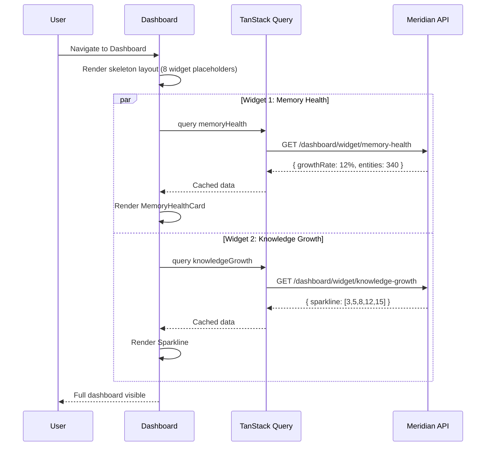

# Dashboard

> **Purpose:** Define the Dashboard page and its widgets
> **Status:** ✅ Upgraded to enterprise quality
> **Owner:** Frontend Team
> **Last Updated:** 2026-07-13
> **Canonical source:** [`/Docs/Meridian-Complete-Documentation.md#8-screens`](../../Docs/Meridian-Complete-Documentation.md#8-screens)

## Overview

```mermaid
graph TD
    classDef widget fill:#e3f2fd,stroke:#1565c0,color:#000,stroke-width:2px
    classDef source fill:#e8f5e9,stroke:#2e7d32,color:#000,stroke-width:1.5px
    classDef layoutClass fill:#fff3e0,stroke:#e65100,color:#000,stroke-width:1.5px

    subgraph Sources["📡 Data Sources"]
        S1["Memory Agent<br/>Entity growth, consolidation"]
        S2["Career Memory<br/>Applications, goals"]
        S3["Scheduler<br/>Deadlines, calendar"]
        S4["Audit Log<br/>Recent agent actions"]
        S5["Recommendation Agent<br/>Proactive suggestions"]
    end

    subgraph Widgets["📊 Dashboard Widgets"]
        W1["Memory Health<br/>Growth rate, consolidation"]
        W2["Knowledge Growth<br/>Sparkline of entities"]
        W3["Active Applications<br/>Count + status"]
        W4["Upcoming Deadlines<br/>Next 7 days"]
        W5["Goal Progress<br/>Progress toward goals"]
        W6["Recent Activity<br/>Last 10 agent actions"]
        W7["AI Suggestions<br/>Proactive suggestions"]
        W8["Per-Agent Status<br/>Health check per agent"]
    end

    subgraph Layout["🔲 Dashboard Layout"]
        L1["Row 1: Memory Health | Knowledge Growth"]
        L2["Row 2: Active Apps | Upcoming Deadlines"]
        L3["Row 3: Recent Activity (full width)"]
        L4["Row 4: AI Suggestions (full width)"]
        L5["Row 5: Agent Status | Goal Progress"]
    end

    S1 & S2 & S3 & S4 & S5 --> W1 & W2 & W3 & W4 & W5 & W6 & W7 & W8
    W1 & W2 & W3 & W4 & W5 & W6 & W7 & W8 --> L1 & L2 & L3 & L4 & L5

    class W1,W2,W3,W4,W5,W6,W7,W8 widget
    class S1,S2,S3,S4,S5 source
    class L1,L2,L3,L4,L5 layoutClass
```



> **Diagram:** Dashboard is composed entirely from other modules — **5 data sources** feed **8 widgets** into a **5-row layout**. The dashboard holds no unique logic of its own; it's an aggregation view. Widgets include Memory Health, Knowledge Growth, Active Applications, Upcoming Deadlines, Goal Progress, Recent Activity, AI Suggestions, and Per-Agent Status.

---

The Dashboard is the primary landing page, composed entirely from other modules — it holds no unique logic of its own.

## Widgets

| Widget | Source | Description |
|--------|--------|-------------|
| Memory Health | Memory Agent | Growth rate, consolidation status |
| Knowledge Growth | Memory Agent | Sparkline of entities over time |
| Active Applications | Career Memory | Count and status of active applications |
| Upcoming Deadlines | Scheduler | Next 7 days of deadlines |
| Goal Progress | Career Memory | Progress toward stated goals |
| Recent Activity | Audit Log | Last 10 agent actions |
| AI Suggestions | Recommendation Agent | Proactive suggestions |
| Per-Agent Status | All agents | Health check per agent |

## Layout

```text
┌─────────────────────────────────────────────┐
│  Memory Health  │  Knowledge Growth          │
├────────────────┼────────────────────────────┤
│  Active Apps   │  Upcoming Deadlines         │
├────────────────┴────────────────────────────┤
│  Recent Activity                             │
├─────────────────────────────────────────────┤
│  AI Suggestions                              │
├────────────────┬────────────────────────────┤
│  Agent Status  │  Goal Progress              │
└────────────────┴────────────────────────────┘
```

## API Endpoints

| Endpoint | Purpose |
|----------|---------|
| `GET /dashboard/summary` | Aggregated read across all modules |
| `POST /suggestions/{id}/respond` | Approve/dismiss a suggestion |

## Common Mistakes

| Mistake | Why It's a Problem |
|---------|-------------------|
| Displaying too many widgets on one screen | Information overload causes users to ignore the dashboard entirely — focus on the 5-7 most actionable metrics |
| Stale data without refresh indicators | Users lose trust when they see yesterday's data without knowing it's stale; always show "last updated" timestamps |
| Empty widgets with no guidance | A blank memory health widget should explain what it will show once data is available, not just display a grey box |
| Widgets that aren't clickable | If a user sees a metric they want to explore, every widget should deep-link to its full screen — no dead-end information |

## Best Practices

| Practice | Rationale |
|----------|-----------|
| Personalize widget layout based on user behavior | Power users may want Agent Status first; new users benefit from Recent Activity — let users rearrange widgets |
| Cache dashboard aggregates with explicit invalidation | The dashboard is the most-fetched page; cache its aggregated response and invalidate on relevant memory writes, not on a timer |
| Show meaningful empty states with call-to-action | An empty Applications list should prompt "Connect a job platform to start" — never just "No applications found" |
| Surface actionable insights, not raw data | Instead of "14 documents organized," show "14 documents organized — review 3 proposals pending approval" |

## Security

| Concern | Mitigation |
|---------|------------|
| Aggregated data leaking individual record details | Dashboard aggregates (totals, averages) could allow inference of individual records if the user has limited data; ensure thresholds require minimum data points before display |
| Per-agent status revealing system topology | Agent health indicators could expose internal infrastructure to users; scope status visibility to agents the user has permission to interact with |
| Suggestion content containing sensitive references | AI-generated suggestions may reference documents or events the user should not have visibility into; scope suggestion generation to the user's permission level |

## Performance

| Concern | Guideline |
|---------|-----------|
| Lazy-load individual dashboard widgets | Load and render widgets independently — a slow memory health query should not block the entire dashboard from rendering |
| Stale-while-revalidate for aggregate data | Return the last cached dashboard state immediately, then refresh in the background; the dashboard loads instantly even if data is a few seconds stale |
| Widget-level caching with independent TTLs | Memory health can cache for 5 minutes; recent activity needs 30-second freshness — use different staleTime values per widget query |

## Security Considerations

| Concern | Mitigation |
|---------|------------|
| Aggregated data leaking individual record details | Dashboard aggregates (totals, averages) could allow inference of individual records if the user has limited data; ensure thresholds require minimum data points before display |
| Per-agent status revealing system topology | Agent health indicators could expose internal infrastructure to users; scope status visibility to agents the user has permission to interact with |
| Suggestion content containing sensitive references | AI-generated suggestions may reference documents or events the user should not have visibility into; scope suggestion generation to the user's permission level |

## Performance Considerations

| Concern | Approach |
|---------|----------|
| Lazy-load individual dashboard widgets | Load and render widgets independently — a slow memory health query should not block the entire dashboard from rendering |
| Stale-while-revalidate for aggregate data | Return the last cached dashboard state immediately, then refresh in the background; the dashboard loads instantly even if data is a few seconds stale |
| Widget-level caching with independent TTLs | Memory health can cache for 5 minutes; recent activity needs 30-second freshness — use different staleTime values per widget query |

## Components

| Component | Responsibility | Technology | Scale Strategy |
|-----------|---------------|------------|----------------|
| WidgetGrid | Responsive dashboard layout (1→2→3 columns) | CSS Grid + Tailwind | Adaptive per viewport; 1 col mobile, 2 tablet, 3 desktop |
| MemoryHealthCard | Growth rate + consolidation status | Recharts Sparkline + Badge | Instance per widget; SSR skeleton then client hydrate |
| RecentActivityFeed | Last 10 agent actions timeline | Virtualized List | Lazy-loads beyond 10 items; cursor-based pagination |
| AISuggestionsPanel | Proactive agent recommendations | Card list + approve/dismiss | Singleton per dashboard; polls every 30s via refetchInterval |

## Workflows

1. **Dashboard initial load**: User navigates to `/` → server renders skeleton layout → client hydrates widgets in parallel → TanStack Query fires 8 independent queries → each widget renders independently as data arrives → stale-while-revalidate shows cached data immediately
2. **Widget interaction**: User clicks memory health widget → deep-links to `/memory` → Memory Agent context pre-loaded via prefetch → transition with shared element animation
3. **AI suggestion response**: User clicks "Approve" on AI suggestion → optimistic UI updates (proposal disappears) → POST to API confirms → on error, suggestion reappears with toast notification
4. **Custom layout**: User drags widget to new position → layout config saved to localStorage → persisted across sessions → layout state synced to account settings via debounced POST

## Sequence Diagrams



## Data Flow

1. **Ingestion**: Data pushed to dashboard via connector syncs (Gmail, LinkedIn, GitHub) → stored in PostgreSQL event tables → aggregation layer computes widget metrics
2. **Processing**: Server-side aggregation endpoint (`GET /dashboard/summary`) queries 8 materialized views in parallel → merges into single response (200ms p95) → response cached in Redis with 30s TTL
3. **Storage**: Widget layout preferences stored in `user_preferences` JSONB column → individual widget cache keys per user ID → shared data cached in Redis
4. **Retrieval**: Client requests via TanStack Query with `staleTime: 30s` → individual widget endpoints for progressive loading → stale-while-revalidate pattern for instant paint
5. **Deletion**: User disconnects connector → associated widget data invalidated → widget shows empty state with "Connect [service] to see data here" prompt

## Scalability

| Dimension | Current Limit | 10x Strategy | 100x Strategy |
|-----------|---------------|--------------|---------------|
| Widgets per dashboard | 8 | Configurable widget limit with pagination | User-customizable dashboard with marketplace widgets |
| Concurrent dashboard queries | 8 per page load | Batch into single aggregated endpoint | Server-side streaming of widget data via SSE |
| Layout configurations | 1 per user | Store in user_profile JSONB; indexed by user_id | Tiered storage — hot layout in Redis, cold layout in PostgreSQL |
| Widget data refresh | 30s polling | Push-based updates via WebSocket on data change | Real-time streaming with differential updates |

## Error Handling

| Scenario | Detection | Mitigation | Recovery |
|----------|-----------|------------|----------|
| One widget fails to load | TanStack Query error state for that query | Render widget in error state; other widgets unaffected | Retry button on failed widget; auto-retry with exponential backoff |
| Dashboard aggregation API times out | 5s timeout on `/dashboard/summary` | Fall back to individual widget queries | Cache last successful response; show with "stale data" banner |
| Widget layout corrupted | JSON parse fails on stored config | Reset to default layout; log error | User repositions widgets; new config saved |
| Connector sync delay causes empty widget | Widget shows no data | Render targeted CTA: "Connect Gmail to see upcoming deadlines" | Background sync completes; widget re-renders with data |

## Monitoring

| Metric | Alert Threshold | Severity | Dashboard |
|--------|----------------|----------|-----------|
| Dashboard time-to-interactive | > 2s | Critical | Grafana — Web Vitals (LCP) |
| Widget query failure rate | > 1% | Warning | Grafana — API Dashboard |
| Stale data display frequency | > 10% of loads | Warning | Amplitude — Dashboard Engagement |
| Widget layout reset events | > 1 per 1000 users | Info | Sentry — Log-level |

## Risks

| Risk | Likelihood | Impact | Mitigation |
|------|------------|--------|------------|
| Third-party connector outage leaves widgets empty | Medium | High | Show last cached data with "last updated" timestamp; CTA to reconnect |
| Widget performance degradation as data grows | Medium | Medium | Paginate recent activity at 10 items; aggregate time-series data |
| User customizes layout into unusable state | Low | Low | Provide "Reset to default" button; validate layout before save |
| AI suggestion content irrelevant or inappropriate | Medium | High | Human-in-the-loop approval; user feedback mechanism for bad suggestions |

## Limitations

| Limitation | Impact | Workaround | Future Resolution |
|------------|--------|------------|-------------------|
| Widgets cannot be shared or embedded externally | Users cannot share dashboard views with team members | Manual screenshot export (html2canvas) | Embeddable widget SDK with auth token support |
| Mobile dashboard limited to 4 widgets | Information density too high on small screens | Priority-based widget display; "show all" link to desktop view | Adaptive dashboard with progressive disclosure per viewport |
| No real-time widget updates without polling | Data freshness depends on 30s poll interval | Shorten poll interval for time-sensitive widgets (15s) | WebSocket-backed push model per widget subscription |

## Goals

- Render the full dashboard with all 8 widgets within 2 seconds of page navigation (Time to Interactive)
- Maintain 100% widget independence — a slow or failed widget should never block other widgets from rendering
- Achieve stale-while-revalidate on all widget data so users always see cached content instantly
- Enable user-customizable widget layout with drag-and-drop reordering saved across sessions
- Surface actionable AI suggestions that achieve 40%+ user approval rate

## Scope

### In Scope
- Eight dashboard widgets: Memory Health, Knowledge Growth, Active Applications, Upcoming Deadlines, Goal Progress, Recent Activity, AI Suggestions, Per-Agent Status
- Aggregated data endpoint (`GET /dashboard/summary`) with 30-second Redis cache TTL
- Individual widget-level endpoints for progressive loading and independent error handling
- Widget layout customization via localStorage persistence
- Deep-link navigation from each widget to its full-page view

### Out of Scope
- Real-time streaming widget updates (future improvement with WebSocket push)
- Widget sharing or embedding across users (future improvement)
- Third-party widget marketplace (planned for post-MVP)
- Dashboard export to PDF or screenshot (future improvement)

## Examples

### Aggregated Dashboard Query with TanStack Query

```typescript
function useDashboardSummary() {
  return useQuery({
    queryKey: ['dashboard', 'summary'],
    queryFn: () => fetch('/api/dashboard/summary').then(res => res.json()),
    staleTime: 30_000,
  });
}
```

### Widget with Error Boundary Isolation

```tsx
function DashboardPage() {
  return (
    <WidgetGrid>
      <ErrorBoundary fallback={<WidgetError name="Memory Health" />}>
        <MemoryHealthWidget />
      </ErrorBoundary>
      <ErrorBoundary fallback={<WidgetError name="Knowledge Growth" />}>
        <KnowledgeGrowthWidget />
      </ErrorBoundary>
      <ErrorBoundary fallback={<WidgetError name="Active Applications" />}>
        <ActiveApplicationsWidget />
      </ErrorBoundary>
    </WidgetGrid>
  );
}
```

### AI Suggestion with Optimistic Update

```typescript
function useSuggestionResponse() {
  const queryClient = useQueryClient();

  return useMutation({
    mutationFn: (suggestionId: string) =>
      fetch(`/api/suggestions/${suggestionId}/respond`, { method: 'POST' }),
    onMutate: async (suggestionId) => {
      await queryClient.cancelQueries({ queryKey: ['dashboard', 'suggestions'] });
      const previous = queryClient.getQueryData(['dashboard', 'suggestions']);
      queryClient.setQueryData(['dashboard', 'suggestions'], (old: any[]) =>
        old.filter(s => s.id !== suggestionId)
      );
      return { previous };
    },
    onError: (err, suggestionId, context) => {
      queryClient.setQueryData(['dashboard', 'suggestions'], context?.previous);
    },
  });
}
```

---

| Improvement | Priority | Complexity | Timeline |
|-------------|----------|------------|----------|
| Custom dashboard builder with drag-and-drop | High | High | Q3 2027 |
| Shareable dashboard views for team workspaces | Medium | Medium | Q4 2027 |
| Widget recommendations based on usage patterns | Medium | Medium | Q2 2027 |
| Real-time streaming dashboard updates | Low | High | Q4 2027 |

## Related Documents

- [Frontend Architecture.md](./Frontend-Architecture.md)
- [`/Docs/Meridian-Complete-Documentation.md#8-screens`](../../Docs/Meridian-Complete-Documentation.md#8-screens)
