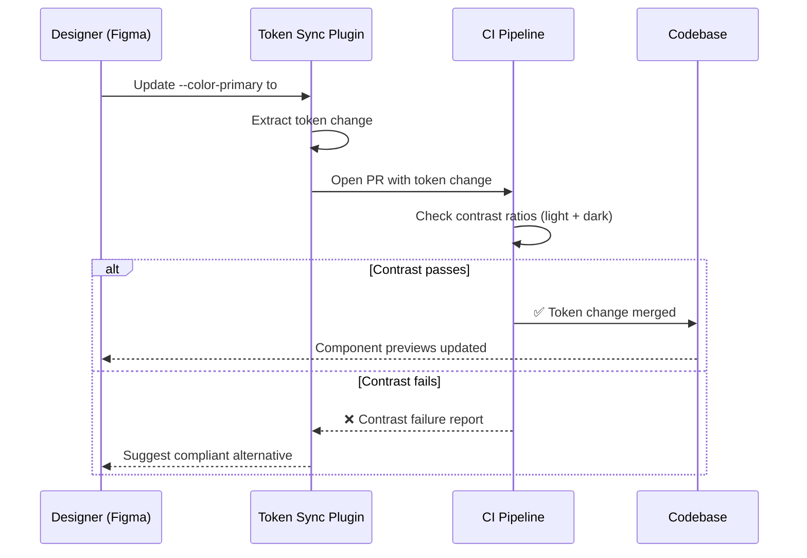

# Design System

> **Purpose:** Define the design system for Vaeloom
> **Status:** ✅ Upgraded to enterprise quality
> **Version:** 2.0
> **Owner:** Frontend Team
> **Last Updated:** 2026-07-17

## Architecture

```mermaid
graph TD
    classDef prim fill:#e3f2fd,stroke:#1565c0,color:#000,stroke-width:2px
    classDef sem fill:#e8f5e9,stroke:#2e7d32,color:#000,stroke-width:2px
    classDef comp fill:#fff3e0,stroke:#e65100,color:#000,stroke-width:2px
    classDef theme fill:#f3e5f5,stroke:#6a1b9a,color:#000,stroke-width:1.5px

    subgraph Primitive[" Primitive Tokens"]
        P1["--color-blue-500: #3B82F6"]
        P2["--color-green-500: #10B981"]
        P3["--color-amber-500: #F59E0B"]
        P4["--font-inter: 'Inter', system-ui"]
        P5["--size-4: 1rem"]
        P6["--size-6: 1.5rem"]
    end

    subgraph Semantic[" Semantic Tokens"]
        S1["--accent-primary: var(--color-blue-500)"]
        S2["--accent-success: var(--color-green-500)"]
        S3["--accent-warning: var(--color-amber-500)"]
        S4["--text-body: var(--color-gray-900)"]
        S5["--bg-surface: var(--color-white)"]
        S6["--border-default: var(--color-gray-200)"]
    end

    subgraph Component[" Component Tokens"]
        C1["--card-bg: var(--bg-surface)"]
        C2["--card-border: var(--border-default)"]
        C3["--card-radius: var(--radius-lg)"]
        C4["--btn-primary-bg: var(--accent-primary)"]
        C5["--input-border: var(--border-default)"]
        C6["--modal-shadow: var(--shadow-xl)"]
    end

    subgraph Themes[" Theme Output"]
        T1["Light Theme<br/>[data-theme='light']"]
        T2["Dark Theme<br/>[data-theme='dark']"]
    end

    Primitive --> Semantic --> Component
    Component --> Themes

    class P1,P2,P3,P4,P5,P6 prim
    class S1,S2,S3,S4,S5,S6 sem
    class C1,C2,C3,C4,C5,C6 comp
    class T1,T2 theme
```



> **Diagram:** Three-layer token architecture — **primitive tokens** hold raw values (hex colors, font stacks, pixel sizes), **semantic tokens** assign meaning by referencing primitives (--accent-primary, --text-body), and **component tokens** scope values to specific UI patterns (--card-bg, --btn-primary-bg). The semantic layer enables instant theme switching by remapping semantic values per `[data-theme]` without touching primitives or components.

---
## Design Tokens

### Colors

| Token | Value | Usage |
|-------|-------|-------|
| `--color-primary` | #3B82F6 | Primary actions, links |
| `--color-success` | #10B981 | Success states, approvals |
| `--color-warning` | #F59E0B | Warnings, attention-needed |
| `--color-error` | #EF4444 | Errors, destructive actions |
| `--color-bg` | #FFFFFF | Background |
| `--color-bg-secondary` | #F9FAFB | Card backgrounds |
| `--color-text` | #111827 | Primary text |
| `--color-text-secondary` | #6B7280 | Secondary text |

### Typography

| Token | Value | Usage |
|-------|-------|-------|
| `--font-sans` | Inter, system-ui | Body text |
| `--font-mono` | JetBrains Mono, monospace | Code, data display |
| `--text-xs` | 0.75rem | Captions |
| `--text-sm` | 0.875rem | Secondary text |
| `--text-base` | 1rem | Body |
| `--text-lg` | 1.125rem | Large body |
| `--text-xl` | 1.25rem | Section headers |
| `--text-2xl` | 1.5rem | Page titles |

### Spacing

| Token | Value |
|-------|-------|
| `--space-1` | 0.25rem |
| `--space-2` | 0.5rem |
| `--space-3` | 0.75rem |
| `--space-4` | 1rem |
| `--space-6` | 1.5rem |
| `--space-8` | 2rem |

## Component Categories

| Category | Components |
|----------|------------|
| Layout | Page, Section, Card, Grid, Stack |
| Navigation | Sidebar, TopNav, Tabs, Breadcrumbs |
| Data Display | Table, List, Tree, Graph, Chart |
| Feedback | Toast, Modal, Alert, Progress |
| Input | Button, Input, Select, FileUpload |
| AI-specific | ProposalCard, AgentStatus, MemoryNode |

## Common Mistakes

| Mistake | Why It's a Problem |
|---------|-------------------|
| Inconsistent spacing between components | Developers guessing spacing values leads to layout drift — every gap should come from the spacing scale, never from arbitrary values |
| Too many color tokens without clear semantic mapping | A palette with 50+ colors is unmaintainable; each color should have a specific, documented semantic role |
| Missing dark mode adjustments for shadows | Shadows that look fine on white backgrounds become invisible or muddy on dark backgrounds — dark theme shadows should be stronger and lower-opacity |
| No versioning or changelog for design tokens | Teams that don't version their tokens can't tell which components use which token values; breaks cascade on theme updates |

## Best Practices

| Practice | Rationale |
|----------|-----------|
| Define semantic tokens that reference primitives | Components should never reference `--color-blue-500` directly — they reference `--accent-primary`, which remaps per theme |
| Use a systematic spacing scale (4px base unit) | A 4px-based scale (4, 8, 12, 16, 24, 32…) ensures visual rhythm without forcing designers into a rigid grid |
| Choose accessible contrast from the start | Design tokens should be verified against WCAG AA (4.5:1) before components are built — retrofitting accessibility is expensive |
| Document both light and dark values for every semantic token | Never ship a semantic token that only defines its light value; developers will discover dark mode is broken at the worst moment |

## Security

| Concern | Mitigation |
|---------|------------|
| CSS injection via token variable override | If user-generated CSS or theme plugins can set CSS custom properties, validate that property values match expected patterns (color format, length units) |
| Token exposure in dev tools | Design tokens are not sensitive, but custom tokens derived from user preferences (e.g., user-set accent colors) should be sanitized to prevent CSS-based tracking |
| Component styling bypass | Ensure component tokens cannot be overridden via URL parameters or query strings that might enable visual spoofing of trusted UI elements |

## Performance

| Concern | Guideline |
|---------|-----------|
| CSS custom property access cost | Accessing `var(--custom-prop)` is marginally slower than a hardcoded value; the difference is negligible for most pages but measurable in hot loops like animations |
| Unused token bloat in CSS bundles | Purge unused CSS variables with a build-time tool — shipping 91 tokens to every page when only 40 are used adds ~2KB to the initial CSS bundle |
| Theme switching performance | Switching themes (redefining ~40+ CSS variables) triggers a repaint; batch theme variable changes in a single style recalculation via `document.documentElement.setAttribute` |

## Security Considerations

| Concern | Mitigation |
|---------|------------|
| CSS injection via token variable override | If user-generated CSS or theme plugins can set CSS custom properties, validate that property values match expected patterns (color format, length units) |
| Token exposure in dev tools | Design tokens are not sensitive, but custom tokens derived from user preferences (e.g., user-set accent colors) should be sanitized to prevent CSS-based tracking |
| Component styling bypass | Ensure component tokens cannot be overridden via URL parameters or query strings that might enable visual spoofing of trusted UI elements |

## Performance Considerations

| Concern | Approach |
|---------|----------|
| CSS custom property access cost | Accessing `var(--custom-prop)` is marginally slower than a hardcoded value; the difference is negligible for most pages but measurable in hot loops like animations |
| Unused token bloat in CSS bundles | Purge unused CSS variables with a build-time tool — shipping 91 tokens to every page when only 40 are used adds ~2KB to the initial CSS bundle |
| Theme switching performance | Switching themes (redefining ~40+ CSS variables) triggers a repaint; batch theme variable changes in a single style recalculation via `document.documentElement.setAttribute` |

## Components

| Component Category | Key Components | Technology | Scale Strategy |
|-------------------|----------------|------------|----------------|
| Color tokens | 6 semantic primitives + 20 derived tokens | CSS Custom Properties | Defined once at :root; overridden per theme via [data-theme] |
| Typography tokens | 6 font sizes + 4 weights + 2 font families | CSS Variables + Tailwind | Extended via Tailwind config; new sizes added to scale |
| Spacing tokens | 8-step scale (4px base) + border radii + shadows | CSS Variables | Generate from single --space-1 value via calc() in future |
| Component tokens | 50+ component-scoped values | CSS Variables referencing semantic tokens | Added per component as needed; audited quarterly |

## Workflows

1. **Design token update**: Designer updates token in Figma → token sync plugin creates PR → CI validates contrast ratios for all themes → PR merged → design tokens reference updated → components inherit new values automatically
2. **New component token creation**: Developer identifies need for component-specific variable → checks existing component tokens for coverage → adds new token referencing semantic layer → documents in token table → visual regression test verifies
3. **Dark theme override**: Developer adds new semantic token → defines both light and dark values → CI checks dark mode contrast → builds passes → component renders correctly in both themes
4. **Deprecated token removal**: Token marked `@deprecated` in source comments → all references migrated to replacement → token removed in next major release → codemod provided for consumer migration

## Sequence Diagrams



## Data Flow

1. **Ingestion**: Token values defined in CSS files and TypeScript config → synced from Figma via plugin → validated by CI → merged into main
2. **Processing**: CSS parser extracts all `--token` definitions → generates documentation page → validates no missing dark mode values → builds production CSS bundle
3. **Storage**: Tokens stored in `:root` and `[data-theme="dark"]` CSS blocks → also exported as TypeScript constants for inline usage → Tailwind config references CSS variables
4. **Retrieval**: Component renders → references component token → token resolves to semantic token → semantic token resolves to primitive value → browser paints correct themed value
5. **Deletion**: Deprecated token removed from all source files → CSS bundle size reduces → no runtime impact as no component references it

## APIs

The Design System is a purely client-side concern � it defines CSS custom properties, Tailwind configuration, and component tokens. There are no server-side API endpoints associated with the design system. Token values are compiled at build time into CSS bundles served as static assets.

| Method | Path | Purpose |
|--------|------|---------|
| N/A | N/A | No API endpoints � design tokens are compiled into static CSS at build time |

## Database

The Design System has no dedicated database. Token definitions are stored in CSS files (`:root` and `[data-theme="dark"]` blocks) and TypeScript constants. Theme preferences are persisted in `localStorage` on the client side, not in a database.

| Entity | Key Fields | Purpose |
|--------|------------|---------|
| N/A | N/A | No database entities � tokens are compile-time artifacts, not runtime data |

## Scalability

| Dimension | Current Limit | 10x Strategy | 100x Strategy |
|-----------|---------------|--------------|---------------|
| Total design tokens | 91 | Modular token sets per component domain (200 tokens) | Automated token generation from brand guidelines via AI |
| Themes maintained | 2 (light + dark) | Theme extension system with user-customizable accent colors | Multi-brand theming with full token isolation |
| Token reference depth | 3 layers (primitive→semantic→component) | Auto-flatten at build time for performance | Dynamic token graph with lazy resolution |
| CSS bundle size from tokens | ~15KB | Purge unused tokens per page | Tree-shake CSS variables at component level |

## Error Handling

| Scenario | Detection | Mitigation | Recovery |
|----------|-----------|------------|----------|
| Token variable undefined in dark mode | CSS `var(--token)` falls back to `initial` | CI check enforces all semantic tokens have both light and dark values | Add missing dark value; styles normalized on next render |
| Token name typo | CSS linting rule catches undefined variable references | Build fails with error message listing undefined tokens | Fix token name in CSS file |
| Contrast ratio below WCAG AA | CI contrast check fails | Block merge; suggest alternative hex values that meet 4.5:1 | Update token value and re-run CI |
| Circular token reference | Stack overflow during CSS resolution | Detect cycles during token extraction; error in CI | Break circular dependency by adding new primitive token |

## Monitoring

| Metric | Alert Threshold | Severity | Dashboard |
|--------|----------------|----------|-----------|
| Token contrast compliance | < 100% of semantic pairs | Critical | CI — Contrast Check step |
| Unused token count | > 10 | Info | Code Quality dashboard |
| Theme switch render time | > 50ms | Warning | Grafana — Interaction to Next Paint |
| Token reference depth violations | > 3 layers | Warning | Build-time lint report |

## Deployment

| Environment | Strategy | Rollback | Notes |
|-------------|----------|----------|-------|
| Development | CSS hot-reload via Vite/Turbopack | `git revert` + rebuild | Token changes reflect immediately in dev server |
| Staging | Build-time CSS bundle with PR preview | Automatic rollback on contrast check failure | CI validates all token pairs for WCAG AA |
| Production | CSS bundle deployed via Vercel static assets | Instant rollback via Vercel dashboard | Tokens immutable at runtime � redeploy to update |
| CDN | Global edge cache (Vercel Edge Network) | Cache purge on deploy | CSS bundle served with immutable cache headers |

## Configuration

| Variable | Purpose | Default | Required |
|----------|---------|---------|----------|
| `NEXT_PUBLIC_THEME_STORAGE_KEY` | localStorage key for theme preference | `vaeloom-theme` | No |
| `DESIGN_TOKEN_BUILD_MODE` | Token processing mode (full/purged) | `purged` | No |
| `THEME_DEFAULT` | Initial theme on first visit | `system` | No |
| `CONTRAST_CHECK_ENABLED` | Enable CI contrast validation | `true` | No |
| `TOKEN_DEPRECATION_GRACE_PERIOD` | Days before deprecated tokens are removed | `90` | No |
| `CSS_VARIABLE_PREFIX` | Prefix for all CSS custom properties | `--` | No |

## Risks

| Risk | Likelihood | Impact | Mitigation |
|------|------------|--------|------------|
| Token naming inconsistencies lead to confusion | Medium | Medium | Enforce naming convention via ESLint rule (`/--(bg\|text\|accent\|border\|shadow)-[a-z]+/`) |
| Build-time token validation slows CI | Low | Medium | Cache token graph; run validation only on changed token files |
| Designer-developer token sync breaks | Medium | High | Figma plugin validates against CI-passing token schema; manual sync as backup |
| Component token explosion makes maintenance hard | High | Medium | Quarterly token audit; merge duplicate tokens; remove unused ones |

## Limitations

| Limitation | Impact | Workaround | Future Resolution |
|------------|--------|------------|-------------------|
| CSS custom properties not supported in media queries | Cannot create responsive token variants | Use Tailwind breakpoint utilities directly in component CSS | Container queries support in all major browsers |
| No type safety for CSS variable names | Typos in `var(--token)` not caught at compile time | ESLint `css/no-unknown-custom-properties` rule; build-time validation | Type-safe CSS variables via TypeScript CSS modules (in progress) |
| Token inheritance struggles with shadow DOM isolated contexts | Web components cannot inherit global CSS variables | Pass tokens via CSS custom properties on host element | Constructable Stylesheets for Shadow DOM token sharing |

## Overview

The Vaeloom design system is the single source of truth for all visual styling decisions across the application. It defines a three-layer token architecture — primitive tokens hold raw values (hex colors, pixel spacing, font families), semantic tokens assign meaning to those values (--bg-primary, --text-body, --accent-success), and component tokens scope values to specific UI patterns (--card-bg, --btn-primary-bg). This layered approach ensures that changing a brand color propagates automatically through every component without touching a single CSS selector.

The design system supports two themes — light and dark — with every semantic token defining both. Theme switching is instant via a `data-theme` attribute on the `<html>` element, with smooth CSS transitions on background, color, border, and shadow properties. The system defaults to the user's OS preference via `prefers-color-scheme` and persists manual overrides in `localStorage`.

For Vaeloom's AI-powered workflows, the design system provides consistent visual language across every interaction — from the approval buttons on ProposalCards to the entity nodes in the knowledge graph. The color palette is optimized for semantic meaning over decoration: blue for primary actions, green for success states (approvals, completions), amber for warnings, red for destructive actions. This semantic mapping helps users intuitively understand the weight and meaning of AI agent outputs.

The system includes 91 CSS custom properties across 7 categories (backgrounds, text, accents, borders, shadows, typography, spacing), all verified against WCAG AA 4.5:1 contrast ratios in both light and dark modes. Every component is built against these tokens — no raw colors, no hardcoded values, no theme drift.

## Goals

- Maintain 100% token coverage — every color, shadow, font, and spacing value in production UI references a design token
- Achieve zero hardcoded colors in component CSS through ESLint enforcement (`no-raw-colors`)
- Ensure all 91 tokens have verified light and dark values with WCAG AA contrast compliance
- Support seamless theme switching in under 50ms render time
- Keep design token CSS bundle under 15KB gzipped through build-time purging of unused tokens

## Scope

### In Scope

- Three-layer token architecture: primitive (raw values), semantic (meaning), component (scoped overrides)
- 91 CSS custom properties across backgrounds, text, accents, borders, shadows, typography, and spacing
- Full light and dark theme definitions with WCAG AA contrast validation
- Theme switching via `data-theme` attribute with CSS transitions and localStorage persistence
- Tailwind CSS configuration extending design tokens for utility-first usage
- Token documentation with usage guidelines for each semantic token
- Build-time contrast checking and unused token purging in CI

### Out of Scope

- User-customizable accent colors beyond the defined palette (future improvement)
- Multi-brand theming with separate token sets (future improvement)
- Runtime token editing or live preview tools (future improvement)
- Figma-to-code token synchronization plugin (future improvement)

## Functional Requirements

| ID | Requirement | Priority |
|----|-------------|----------|
| FR-DS-001 | All visual styling in production UI shall reference design tokens — zero hardcoded colors or values | High |
| FR-DS-002 | Every semantic token shall define both light and dark theme values | High |
| FR-DS-003 | Token values shall pass WCAG AA contrast ratio (4.5:1) in all themes | High |
| FR-DS-004 | Token names shall follow a strict naming convention enforced by ESLint | Medium |
| FR-DS-005 | Theme switching shall be instant via `data-theme` attribute on `<html>` | High |
| FR-DS-006 | Token documentation shall auto-generate from CSS variable definitions | Medium |
| FR-DS-007 | Deprecated tokens shall follow a documented lifecycle with codemod migration | Low |

## Non-Functional Requirements

| ID | Requirement | Target | Measurement |
|----|-------------|--------|-------------|
| NFR-DS-001 | Theme switch shall complete under 50ms render time | ≤ 50ms | Interaction to Next Paint |
| NFR-DS-002 | Design token CSS bundle shall stay under 15KB gzipped | ≤ 15KB | Build size report |
| NFR-DS-003 | Unused token purge shall run at build time — zero unused tokens in production | 100% | Build-time lint |
| NFR-DS-004 | Token reference depth shall not exceed 3 layers (primitive → semantic → component) | ≤ 3 layers | CI validation |
| NFR-DS-005 | All 91 tokens shall have verified light and dark values | 100% coverage | CI check |
| NFR-DS-006 | Token changes shall be reviewed via PR with automated contrast validation | Blocked on fail | CI pipeline |

## Future Improvements

| Improvement | Priority | Complexity | Timeline |
|-------------|----------|------------|----------|
| Multi-brand theming with full token isolation | High | High | Q3 2027 |
| User-customizable accent colors with contrast validation | Medium | Medium | Q2 2027 |
| Type-safe CSS variable reference generation | Medium | Medium | Q1 2027 |
| Design token drift detection between Figma and code | High | Medium | Q2 2027 |

## Examples

### Using semantic tokens in CSS

```css
.card {
  background-color: var(--bg-secondary);
  border: 1px solid var(--border-light);
  border-radius: var(--radius-lg);
  box-shadow: var(--shadow-card);
  padding: var(--space-6);
}
.card-title {
  color: var(--text-primary);
  font-size: var(--font-size-lg);
  font-weight: var(--font-weight-semibold);
}
```

### Token usage in Tailwind

```tsx
function ThemedCard({ title, children }: { title: string; children: React.ReactNode }) {
  return (
    <div className="bg-bg-secondary text-text-primary rounded-lg shadow-card p-6 border border-border-light">
      <h3 className="text-text-primary font-semibold">{title}</h3>
      <p className="text-text-secondary text-sm mt-2">{children}</p>
    </div>
  );
}
```

### Inline styles with CSS variables

```tsx
<div style={{ backgroundColor: 'var(--bg-secondary)', color: 'var(--text-primary)' }}>
  Themed content
</div>
```

### Component token definition

```css
:root {
  --card-bg: var(--bg-secondary);
  --card-border: var(--border-light);
  --card-radius: var(--radius-lg);
  --card-shadow: var(--shadow-card);
  --card-padding: var(--space-6);
}
```

---

## Related Documents

- [Frontend Architecture.md](./Frontend-Architecture.md)
- [UI Architecture.md](./UI-Architecture.md)
- [Component Library.md](./Component-Library.md)
- [Theme System.md](./Theme-System.md)
- [Dashboard.md](./Dashboard.md)
- [State Management.md](./State-Management.md)
- [Navigation.md](./Navigation.md)
- [Forms.md](./Forms.md)
- [Charts.md](./Charts.md)
- [Animation System.md](./Animation-System.md)
- [Responsive Design.md](./Responsive-Design.md)
- [Mobile Architecture.md](./Mobile-Architecture.md)
- [Accessibility.md](./Accessibility.md)
- [Accessibility Audit.md](./Accessibility-Audit.md)
- [Internationalization.md](./Internationalization.md)
- [UX Guidelines.md](./UX-Guidelines.md)
