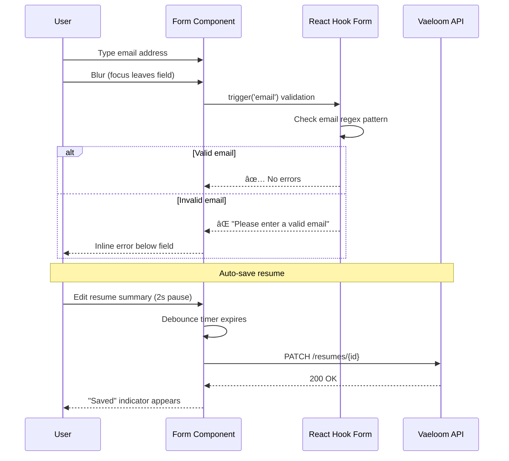

# Forms

> **Purpose:** Define form standards and patterns for Vaeloom
> **Status:** 🆕 New

## Form Architecture

```mermaid
graph TD
    classDef tool fill:#e3f2fd,stroke:#1565c0,color:#000,stroke-width:2px
    classDef pattern fill:#e8f5e9,stroke:#2e7d32,color:#000,stroke-width:1.5px
    classDef state fill:#fff3e0,stroke:#e65100,color:#000,stroke-width:1.5px

    subgraph Tools["🔧 Form Libraries"]
        T1["React Hook Form<br/>Complex forms (resume, settings)"]
        T2["Native HTML forms<br/>Simple forms (search, filters)"]
    end

    subgraph Patterns["🔄 Form Patterns"]
        P1["Inline Validation<br/>Validate on blur + submit"]
        P2["Debounced Save<br/>Auto-save with 2s debounce"]
        P3["Multi-step Wizard<br/>Onboarding flow"]
        P4["Batch Actions<br/>Approve/reject multiple"]
    end

    subgraph StateMachine["📊 Form State Flow"]
        S1["Idle"] --> S2["Typing"]
        S2 --> S3["Validating"]
        S3 --> S4["Valid / Error"]
        S4 --> S5["Submitting"]
        S5 --> S6["Success / Error"]
    end

    subgraph Validation["✅ Validation Rules"]
        V1["Email: Format + uniqueness (async)"]
        V2["URL: Format + reachability"]
        V3["Date: Valid + not in past"]
        V4["File: Type + size < 10MB"]
        V5["Text: Length limits + required"]
    end

    Tools --> Patterns --> StateMachine
    Patterns -.-> Validation

    class T1,T2 tool
    class P1,P2,P3,P4 pattern
    class S1,S2,S3,S4,S5,S6 state
    class V1,V2,V3,V4,V5 validation
```



> **Diagram:** Form architecture — **2 libraries** (React Hook Form for complex, native for simple) → **4 patterns** (inline validation, debounced save, multi-step, batch actions) → **state flow** (Idle → Typing → Validating → Submit → Success/Error). **Validation rules** per field type ensure data quality.

---

## Form Library

| Tool | Use Case |
|------|----------|
| React Hook Form | Complex forms (resume editor, settings) |
| Native HTML forms | Simple forms (search, filters) |

| Pattern | Description | Example |
|---------|-------------|---------|
| Inline validation | Validate on blur and submit | Settings forms |
| Debounced save | Auto-save with 2s debounce | Resume editor |
| Multi-step | Wizard pattern with progress | Onboarding flow |
| Batch actions | Approve/reject multiple items | Organization proposals |

## Validation Rules

| Field Type | Validation |
|------------|------------|
| Email | Format check, uniqueness check (async) |
| URL | Format check, reachability check |
| Date | Valid date, not in past (for deadlines) |
| File upload | Type, size (< 10MB), virus scan |
| Text | Length limits, required fields |

## Form States

```text
Idle → Typing → Validating → Valid / Error → Submitting → Success / Error
```

## Error Display

- Inline error below the field
- Summary error at top of form
- Error must be specific and actionable:
  - ❌ "Invalid input"
  - ✅ "Please enter a valid email address"

## Common Mistakes

| Mistake | Why It's a Problem |
|---------|-------------------|
| No inline validation until form submission | Users fill out an entire form only to discover errors on submit — validate each field on blur so issues are caught early |
| Too many required fields in a single form | Cognitive load increases with every field; break long forms into multi-step wizards with progress indicators |
| No auto-save or draft recovery | Losing form content due to a navigation or browser crash without recovery is one of the most frustrating UX failures |
| Generic or unhelpful error messages | "Invalid input" doesn't tell the user what to fix; messages should be specific and prescriptive, e.g., "Email must include @domain.com" |

## Best Practices

| Practice | Rationale |
|----------|-----------|
| Validate on blur + debounced async checks | Inline validation on blur catches typos early; async checks (e.g., email uniqueness) should debounce to 300ms to avoid overwhelming the server |
| Auto-save drafts with 2-second debounce | For multi-field forms like the resume editor, auto-save every 2 seconds of inactivity — users never lose work even if they close the tab |
| Progressive disclosure for complex forms | Start with essential fields; reveal optional or advanced fields as the user progresses — reduces intimidation and abandonment |
| Support full keyboard navigation | Tab order should follow visual order; enter should submit; escape should close — no mouse-dependent interactions in form flows |

## Security

| Concern | Mitigation |
|---------|------------|
| CSRF on form submissions | Every state-changing form (settings, applications, resume edits) must include a CSRF token validated server-side — particularly important for OAuth-based auth flows |
| Input sanitization on all text fields | Sanitize all user input before rendering it anywhere in the UI (chart labels, document summaries, proposal previews) — prevent stored XSS |
| Rate limiting on form submissions | Application forms, connection requests, and bulk actions should be rate-limited per user to prevent automated abuse or accidental mass submissions |

## Performance

| Concern | Guideline |
|---------|-----------|
| Field-level async validation | Debounce async validators (email uniqueness, URL reachability) to 300ms — avoid firing a network request on every keystroke |
| Form-level debounced auto-save | Use a 2-second debounce on form state changes before triggering auto-save; frequent updates (character-by-character) waste server resources and degrade UX |
| Lazy-load complex form sections | Multi-step forms should load each step's validation schemas and dependencies only when the user reaches that step — saves initial bundle size |

## Security Considerations

| Concern | Mitigation |
|---------|------------|
| CSRF on form submissions | Every state-changing form (settings, applications, resume edits) must include a CSRF token validated server-side — particularly important for OAuth-based auth flows |
| Input sanitization on all text fields | Sanitize all user input before rendering it anywhere in the UI (chart labels, document summaries, proposal previews) — prevent stored XSS |
| Rate limiting on form submissions | Application forms, connection requests, and bulk actions should be rate-limited per user to prevent automated abuse or accidental mass submissions |

## Performance Considerations

| Concern | Approach |
|---------|----------|
| Field-level async validation | Debounce async validators (email uniqueness, URL reachability) to 300ms — avoid firing a network request on every keystroke |
| Form-level debounced auto-save | Use a 2-second debounce on form state changes before triggering auto-save; frequent updates (character-by-character) waste server resources and degrade UX |
| Lazy-load complex form sections | Multi-step forms should load each step's validation schemas and dependencies only when the user reaches that step — saves initial bundle size |

## Components

| Component | Responsibility | Technology | Scale Strategy |
|-----------|---------------|------------|----------------|
| FormField | Base input with label, validation, error display | React Hook Form + Controller | Generic — wraps any input type; configurable via props |
| ResumeEditor | Multi-section resume form with auto-save | React Hook Form + debounce | Instance per resume; sections lazy-loaded |
| MultiStepWizard | Onboarding flow with progress tracker | React Context + RHF | Singleton per wizard; step state managed in URL params |
| ProposalBatchActions | Bulk approve/reject interface | TanStack Mutation + optimistic UI | Instance per batch; paginated at 20 proposals per page |

## Workflows

1. **Form validation on blur**: User types in email field → focus leaves field (blur) → inline validation fires → email format regex test runs → if invalid, error message appears below field → if valid, no feedback shown
2. **Debounced auto-save**: User edits resume section → 2 seconds of inactivity → debounce timer fires → changed fields serialized → PATCH request sent → save indicator shows "Saved" → on error, "Save failed — retrying" shown
3. **Multi-step form submission**: User completes step 1 → "Next" validates step 1 → if valid, step 2 renders from lazy-loaded chunk → progress bar advances → user completes final step → all steps submitted as single POST
4. **Batch proposal approval**: User selects 5 proposals → clicks "Approve All" → optimistic UI marks all as approved → API processes batch → on success, toast confirms → on partial failure, failed items highlighted for retry

## Sequence Diagrams



## Data Flow

1. **Ingestion**: User types into form fields → React Hook Form manages uncontrolled inputs via refs → value changes trigger validation rules → on blur, field-level validation runs
2. **Processing**: Debounce timer (2s) collects form state → serializes to JSON → PATCH request sent to API → server validates and persists → response updates form state
3. **Storage**: Form state held in React Hook Form's internal store → auto-save drafts persisted to PostgreSQL (`resume_drafts` table) → draft recovery on page reload via `GET /resumes/{id}/draft`
4. **Retrieval**: Page mounts → API fetches existing data → React Hook Form `reset()` populates form fields → auto-save drafts restored from server on load
5. **Deletion**: Form discard → confirmation dialog → API deletes draft if exists → form state reset → redirected away

## Scalability

| Dimension | Current Limit | 10x Strategy | 100x Strategy |
|-----------|---------------|--------------|---------------|
| Fields per form | 20 | Virtual scroll for long forms; section lazy-loading | AI-adaptive form that shows only relevant fields based on user profile |
| Concurrent auto-save requests | 1 per form | Queue with debounce (discards intermediate states) | Delta-patch — send only changed fields instead of full form |
| Multi-step wizard steps | 5 | Lazy-load step components; preload next step on current completion | Server-driven wizard flow based on user responses |
| Batch action items | 50 | Process in chunks of 10 with progress indicator | Streaming batch processing via SSE |

## Error Handling

| Scenario | Detection | Mitigation | Recovery |
|----------|-----------|------------|----------|
| Auto-save fails (network error) | PATCH returns 4xx/5xx | Show "Save failed — retrying" indicator; retry with exponential backoff | On success, update indicator to "Saved"; on permanent failure, show manual save prompt |
| File upload exceeds 10MB | Client-side validation catches before upload | Show "File too large — max 10MB" with file size displayed | User selects smaller file; upload resets |
| Multi-step validation error on final submit | Server-side validation fails | Show summary of all errors with links to each step | User clicks error link → auto-scrolls to field → fixes and resubmits |
| CSRF token expired | POST returns 403 | Automatically refresh token via dedicated endpoint | Retry submission with new token |

## Monitoring

| Metric | Alert Threshold | Severity | Dashboard |
|--------|----------------|----------|-----------|
| Form submission error rate | > 2% | Critical | Grafana — API Errors |
| Auto-save latency (p95) | > 1s | Warning | Grafana — Performance Dashboard |
| Abandonment rate on multi-step forms | > 40% | Warning | Amplitude — Form Analytics |
| CSRF token refresh rate | > 5% of submissions | Warning | Sentry — Security Events |
| File upload failure rate | > 1% | Warning | Grafana — Upload Dashboard |

## Risks

| Risk | Likelihood | Impact | Mitigation |
|------|------------|--------|------------|
| Users lose form data on browser crash | Medium | High | Auto-save every 2s; store draft in sessionStorage as backup |
| Multi-step wizard abandonment due to complexity | Medium | Medium | Show progress indicator; allow save-and-exit with draft recovery |
| Form validation inconsistency between client and server | High | Medium | Centralize validation schemas in shared package; run both client and server validation from same schema |
| File upload vulnerability (malicious file) | Low | High | Client-side type check + server-side MIME validation + virus scan |

## Limitations

| Limitation | Impact | Workaround | Future Resolution |
|------------|--------|------------|-------------------|
| React Hook Form uncontrolled inputs cannot be programmatically controlled | Dynamic field updates require `reset()` or `setValue()` | Use `watch()` for reactive updates to dependent fields | RHF v8 field arrays with improved API |
| Auto-save does not work offline | Users on unreliable connections lose work | Debounce extends automatically on network failure; retry queue | Service Worker + IndexedDB for offline form persistence |
| Batch action confirmation is all-or-nothing | Partial batch failures require full audit | UI shows per-item status after batch completes | Transactional batch with per-item rollback |

## Overview

Vaeloom's form system handles data entry across the application — from simple search filters to the complex multi-section resume editor with 50+ fields. Forms are built with React Hook Form for complex cases (providing uncontrolled inputs, schema validation, and field-level error management) and native HTML forms for simple cases (search, filters, quick actions).

The form architecture follows four core patterns: inline validation on blur and submit for immediate user feedback, debounced auto-save for multi-field forms to prevent data loss, multi-step wizards with progress tracking for complex onboarding flows, and batch action interfaces for approving or rejecting multiple proposals simultaneously. Each pattern is mapped to specific user workflows.

For Vaeloom's resume editor — one of the most form-intensive features — the debounced auto-save pattern is critical. As users edit their professional summaries, work experiences, and skill lists, every 2 seconds of inactivity triggers a background save. If the user closes the tab or navigates away, their changes are recovered on return. This pattern eliminates the anxiety of losing hours of resume editing work.

Validation is a first-class concern, not an afterthought. Every field type has specific validation rules: email format + async uniqueness, URL format + reachability, valid dates that aren't in the past, file type + size limits under 10MB, and text length limits with required-field enforcement. Error messages are specific and actionable — never "Invalid input" but always "Please enter a valid email address."

## Goals

- Achieve zero data loss through debounced auto-save on all multi-field forms (resume editor, settings)
- Validate every form field on blur within 50ms for synchronous rules and within 300ms for async checks
- Support full keyboard navigation through all forms with logical tab order and Enter-to-submit
- Maintain form state recovery after browser crash or accidental navigation for all editor forms
- Keep multi-step form abandonment rate below 40% through progress indicators and save-and-exit

## Scope

### In Scope
- React Hook Form for complex forms (resume editor, settings, connector configuration)
- Native HTML forms for simple forms (search, filters, quick actions)
- Inline validation on blur and on submit for all form fields
- Debounced auto-save with 2-second debounce for multi-field editor forms
- Multi-step wizard with progress indicator for onboarding flow
- Batch action patterns for bulk approve/reject of agent proposals
- Field-level validation rules: email, URL, date, file upload, text

### Out of Scope
- Offline form persistence with Service Worker (future improvement)
- AI-assisted form filling and auto-population (future improvement)
- Drag-and-drop form builder for admin configurations (future improvement)
- Voice input for form fields (future improvement)

---

| Improvement | Priority | Complexity | Timeline |
|-------------|----------|------------|----------|
| Offline form persistence with Service Worker | High | High | Q3 2027 |
| AI-assisted form filling (auto-populate from uploaded resume) | High | Medium | Q2 2027 |
| Drag-and-drop form builder for admin configurations | Medium | High | Q4 2027 |
| Voice input for form fields | Low | Medium | Q3 2027 |

## Examples

### Form validation with React Hook Form

```tsx
import { useForm } from 'react-hook-form';

interface ResumeFormData {
  name: string;
  email: string;
}

function ResumeEditor() {
  const { register, handleSubmit, formState: { errors } } = useForm<ResumeFormData>();
  const onSubmit = (data: ResumeFormData) => console.log(data);

  return (
    <form onSubmit={handleSubmit(onSubmit)}>
      <input {...register('name', { required: true })} />
      {errors.name && <span role="alert">Name is required</span>}
      <input {...register('email', { pattern: /^\S+@\S+$/i })} />
      {errors.email && <span role="alert">Invalid email</span>}
      <button type="submit">Submit</button>
    </form>
  );
}
```

### Debounced auto-save

```typescript
import { useCallback, useRef } from 'react';

function useAutoSave(saveFn: () => Promise<void>, delay = 2000) {
  const timer = useRef<ReturnType<typeof setTimeout>>();
  return useCallback(() => {
    clearTimeout(timer.current);
    timer.current = setTimeout(saveFn, delay);
  }, [saveFn, delay]);
}
```

### Multi-step wizard progress

```tsx
function OnboardingWizard() {
  const [step, setStep] = useState(1);
  return (
    <div>
      <progress value={step} max={5} />
      {step === 1 && <AccountStep onNext={() => setStep(2)} />}
      {step === 2 && <ProfileStep onNext={() => setStep(3)} />}
      {step === 3 && <ResumeStep onSubmit={() => setStep(4)} />}
    </div>
  );
}
```

### Batch action approval

```typescript
const batchApprove = useMutation({
  mutationFn: (ids: string[]) =>
    fetch('/api/proposals/batch-approve', { method: 'POST', body: JSON.stringify({ ids }) }),
  onMutate: (ids) => {
    queryClient.setQueryData(['proposals'], (old: Proposal[]) =>
      old.map(p => ids.includes(p.id) ? { ...p, status: 'approved' } : p)
    );
  },
});
```

---

## Related Documents

- [State Management.md](./State-Management.md)
- [UX Guidelines.md](./UX-Guidelines.md)
- [Accessibility.md](./Accessibility.md)
