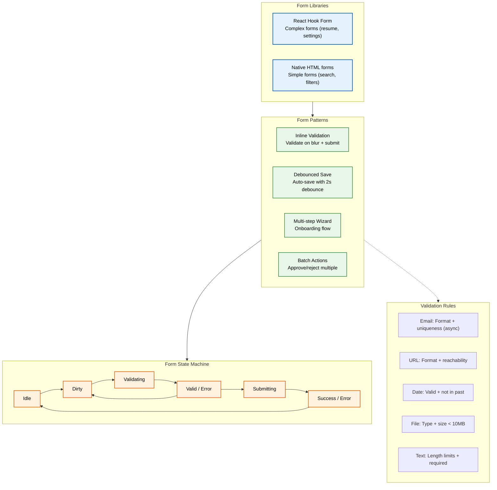
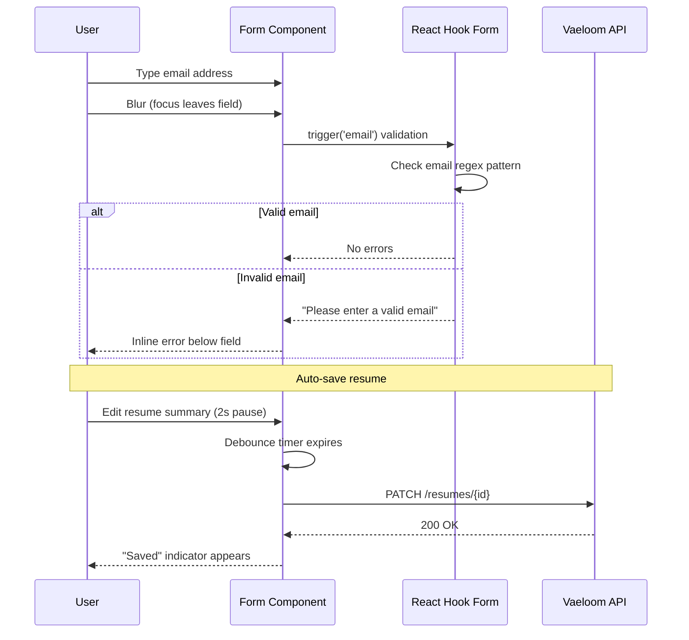
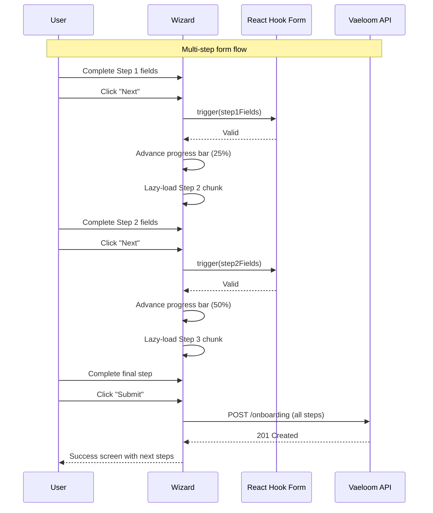

# Forms

> **Purpose:** Define form standards, validation patterns, and data entry workflows for Vaeloom frontend
> **Status:** ? Upgraded to enterprise quality
> **Owner:** Frontend Team
> **Version:** 2.0
> **Last Updated:** 2026-07-17
> **Dependencies:** State-Management.md, UX-Guidelines.md, Accessibility.md
> **Implementation Status:** ?? Spec Only
> **Review Checklist:** Standard
> **Canonical source:** docs/Frontend/Forms.md

## Overview

Vaeloom's form system handles data entry across the application — from simple search filters to the complex multi-section resume editor with 50+ fields. Forms are built with React Hook Form for complex cases (providing uncontrolled inputs, schema validation, and field-level error management) and native HTML forms for simple cases (search, filters, quick actions).

The form architecture follows four core patterns: inline validation on blur and submit for immediate user feedback, debounced auto-save for multi-field forms to prevent data loss, multi-step wizards with progress tracking for complex onboarding flows, and batch action interfaces for approving or rejecting multiple proposals simultaneously. Each pattern is mapped to specific user workflows.

For Vaeloom's resume editor — one of the most form-intensive features — the debounced auto-save pattern is critical. As users edit their professional summaries, work experiences, and skill lists, every 2 seconds of inactivity triggers a background save. If the user closes the tab or navigates away, their changes are recovered on return. This pattern eliminates the anxiety of losing hours of resume editing work.

Validation is a first-class concern, not an afterthought. Every field type has specific validation rules: email format + async uniqueness, URL format + reachability, valid dates that aren't in the past, file type + size limits under 10MB, and text length limits with required-field enforcement. Error messages are specific and actionable — never "Invalid input" but always "Please enter a valid email address."

## Goals

- Achieve zero data loss through debounced auto-save on all multi-field forms (resume editor, settings)
- Validate every form field on blur within 50ms for synchronous rules and within 300ms for async checks
- Support full keyboard navigation through all forms with logical tab order and Enter-to-submit
- Maintain form state recovery after browser crash or accidental navigation for all editor forms
- Keep multi-step form abandonment rate below 40% through progress indicators and save-and-exit

## Scope

### In Scope

| Area | Description |
|------|-------------|
| RHF Complex Forms | React Hook Form for resume editor, settings, connector configuration |
| Native HTML Forms | Native forms for search, filters, quick actions |
| Inline Validation | Validate on blur and on submit for all form fields |
| Debounced Auto-Save | 2-second debounce for multi-field editor forms |
| Multi-Step Wizard | Wizard with progress indicator for onboarding flow |
| Batch Actions | Bulk approve/reject patterns for agent proposals |
| Field Validation | Rules for email, URL, date, file upload, text |

### Out of Scope

| Area | Reason |
|------|--------|
| Offline form persistence with Service Worker | Future improvement — see State-Management.md offline queue |
| AI-assisted form filling and auto-population | Future improvement |
| Drag-and-drop form builder for admin configurations | Future improvement |
| Voice input for form fields | Future improvement |

## Functional Requirements

| ID | Description | Priority |
|----|-------------|----------|
| FR-FRM-001 | System shall provide inline validation on blur for all form fields | P0 |
| FR-FRM-002 | System shall auto-save multi-field forms with 2-second debounce | P0 |
| FR-FRM-003 | System shall support multi-step wizard with progress indicator | P1 |
| FR-FRM-004 | System shall support batch approve/reject actions with optimistic UI | P1 |
| FR-FRM-005 | System shall validate email format and check uniqueness asynchronously | P1 |
| FR-FRM-006 | System shall validate file uploads by type and size (< 10MB) | P1 |
| FR-FRM-007 | System shall recover form draft after browser crash or navigation | P2 |
| FR-FRM-008 | System shall display specific, actionable error messages per field | P1 |

## Non-Functional Requirements

| ID | Description | Target | Measurement |
|----|-------------|--------|-------------|
| NFR-FRM-001 | Inline validation response time (sync rules) | < 50ms | PerformanceObserver |
| NFR-FRM-002 | Async validation response time (email uniqueness) | < 300ms | Grafana APM |
| NFR-FRM-003 | Auto-save debounce interval | 2000ms ± 100ms | Timer precision test |
| NFR-FRM-004 | Form data loss rate | 0% | Analytics / bug reports |
| NFR-FRM-005 | Multi-step form abandonment rate | < 40% | Amplitude funnel |

## Architecture



## Components

| Component | Responsibility | Technology | Scale Strategy |
|-----------|---------------|------------|----------------|
| FormField | Base input with label, validation, error display | React Hook Form + Controller | Generic — wraps any input type; configurable via props |
| ResumeEditor | Multi-section resume form with auto-save | React Hook Form + debounce | Instance per resume; sections lazy-loaded |
| MultiStepWizard | Onboarding flow with progress tracker | React Context + RHF | Singleton per wizard; step state in URL params |
| ProposalBatchActions | Bulk approve/reject interface | TanStack Mutation + optimistic UI | Instance per batch; paginated at 20 proposals per page |
| DraftRecovery | Auto-save draft restoration on page load | React Hook Form `reset()` | Inline — runs on mount for all editor forms |

## Workflows

1. **Form validation on blur**: User types in email field ? focus leaves field (blur) ? inline validation fires ? email format regex test runs ? if invalid, error message appears below field ? if valid, no feedback shown
2. **Debounced auto-save**: User edits resume section ? 2 seconds of inactivity ? debounce timer fires ? changed fields serialized ? PATCH request sent ? save indicator shows "Saved" ? on error, "Save failed — retrying" shown
3. **Multi-step form submission**: User completes step 1 ? "Next" validates step 1 ? if valid, step 2 renders from lazy-loaded chunk ? progress bar advances ? user completes final step ? all steps submitted as single POST
4. **Batch proposal approval**: User selects 5 proposals ? clicks "Approve All" ? optimistic UI marks all as approved ? API processes batch ? on success, toast confirms ? on partial failure, failed items highlighted for retry
5. **Draft recovery on page load**: Form mounts ? checks for existing draft via API ? if draft exists, `reset(draftData)` populates fields ? user continues editing ? auto-save overwrites draft

## Sequence Diagrams





## Data Flow

1. **Ingestion**: User types into form fields ? React Hook Form manages uncontrolled inputs via refs ? value changes trigger validation rules ? on blur, field-level validation runs
2. **Processing**: Debounce timer (2s) collects form state ? serializes to JSON ? PATCH request sent to API ? server validates and persists ? response updates form state
3. **Storage**: Form state held in React Hook Form's internal store ? auto-save drafts persisted to PostgreSQL (`resume_drafts` table) ? draft recovery on page reload via `GET /resumes/{id}/draft`
4. **Retrieval**: Page mounts ? API fetches existing data ? React Hook Form `reset()` populates form fields ? auto-save drafts restored from server on load
5. **Deletion**: Form discard ? confirmation dialog ? API deletes draft if exists ? form state reset ? redirected away

## APIs

| Method | Path | Purpose |
|--------|------|---------|
| PATCH | `/api/resumes/{id}` | Auto-save resume changes (debounced) |
| GET | `/api/resumes/{id}/draft` | Retrieve latest auto-saved draft |
| DELETE | `/api/resumes/{id}/draft` | Delete saved draft after successful submit |
| POST | `/api/proposals/batch-approve` | Batch approve multiple proposals |
| POST | `/api/onboarding` | Submit complete multi-step onboarding form |
| POST | `/api/validate/email` | Async email uniqueness check |

## Database

| Table | Key Columns | Purpose |
|-------|-------------|---------|
| `resume_drafts` | id, user_id, resume_id, draft_data (JSONB), updated_at | Stores auto-save drafts for resume editor |
| `onboarding_state` | id, user_id, current_step, step_data (JSONB) | Tracks multi-step wizard progress per user |

## Security

| Concern | Mitigation |
|---------|------------|
| CSRF on form submissions | Every state-changing form must include a CSRF token validated server-side — critical for OAuth-based auth flows |
| Input sanitization on all text fields | Sanitize all user input before rendering it in the UI (chart labels, document summaries, proposal previews) — prevent stored XSS |
| Rate limiting on form submissions | Application forms, connection requests, and bulk actions should be rate-limited per user to prevent automated abuse |

## Performance

| Concern | Budget | Measurement | Optimization |
|---------|--------|-------------|--------------|
| Field-level async validation | < 300ms | Grafana APM | Debounce async validators to 300ms — avoid network request on every keystroke |
| Form-level debounced auto-save | < 2s debounce | Timer measurement | 2-second debounce on form state changes before triggering auto-save |
| Lazy-load complex form sections | < 50ms load per step | Chrome Performance tab | Multi-step forms load each step's schemas only when user reaches that step |

## Scalability

| Dimension | Current Limit | 10x Strategy | 100x Strategy |
|-----------|---------------|--------------|---------------|
| Fields per form | 20 | Virtual scroll for long forms; section lazy-loading | AI-adaptive form showing only relevant fields based on user profile |
| Concurrent auto-save requests | 1 per form | Queue with debounce (discards intermediate states) | Delta-patch — send only changed fields instead of full form |
| Multi-step wizard steps | 5 | Lazy-load step components; preload next step on current completion | Server-driven wizard flow based on user responses |
| Batch action items | 50 | Process in chunks of 10 with progress indicator | Streaming batch processing via SSE |

## Error Handling

| Scenario | Detection | Mitigation | Recovery |
|----------|-----------|------------|----------|
| Auto-save fails (network error) | PATCH returns 4xx/5xx | Show "Save failed — retrying" indicator; retry with exponential backoff | On success, update indicator to "Saved"; on permanent failure, show manual save prompt |
| File upload exceeds 10MB | Client-side validation catches before upload | Show "File too large — max 10MB" with file size displayed | User selects smaller file; upload resets |
| Multi-step validation error on final submit | Server-side validation fails | Show summary of all errors with links to each step | User clicks error link ? auto-scrolls to field ? fixes and resubmits |
| CSRF token expired | POST returns 403 | Automatically refresh token via dedicated endpoint | Retry submission with new token |
| Draft recovery data is corrupted | JSON parse fails on draft retrieval | Show "Draft could not be recovered — starting fresh" | Log to Sentry; user re-enters data |

## Monitoring

| Metric | Alert Threshold | Severity | Dashboard |
|--------|----------------|----------|-----------|
| Form submission error rate | > 2% | Critical | Grafana — API Errors |
| Auto-save latency (p95) | > 1s | Warning | Grafana — Performance Dashboard |
| Abandonment rate on multi-step forms | > 40% | Warning | Amplitude — Form Analytics |
| CSRF token refresh rate | > 5% of submissions | Warning | Sentry — Security Events |
| File upload failure rate | > 1% | Warning | Grafana — Upload Dashboard |

## Deployment

| Environment | Strategy | Rollback | Notes |
|-------------|----------|----------|-------|
| Development | Direct deploy | Revert commit | Form validation debug mode enabled |
| Staging | Gradual rollout to internal team | Feature flag toggle | Validate auto-save timing with realistic resume data |
| Production | Canary per workspace (10% ? 50% ? 100%) | Disable auto-save feature; fall back to manual save | Monitor abandonment rate and error rate |

## Configuration

| Variable | Purpose | Default | Required |
|----------|---------|---------|----------|
| `AUTO_SAVE_DEBOUNCE_MS` | Debounce delay for auto-save | 2000 | No |
| `ASYNC_VALIDATION_DEBOUNCE_MS` | Debounce delay for async validation | 300 | No |
| `MAX_FILE_UPLOAD_BYTES` | Maximum file upload size | 10485760 | No |
| `MAX_FORM_FIELDS` | Maximum fields per form before virtualization | 20 | No |
| `WIZARD_MAX_STEPS` | Maximum steps in multi-step wizard | 5 | No |

## Examples

### Form validation with React Hook Form

```tsx
import { useForm } from 'react-hook-form';

interface ResumeFormData {
  name: string;
  email: string;
}

function ResumeEditor() {
  const { register, handleSubmit, formState: { errors } } = useForm<ResumeFormData>();
  const onSubmit = (data: ResumeFormData) => console.log(data);

  return (
    <form onSubmit={handleSubmit(onSubmit)}>
      <input {...register('name', { required: true })} />
      {errors.name && <span role="alert">Name is required</span>}
      <input {...register('email', { pattern: /^\S+@\S+$/i })} />
      {errors.email && <span role="alert">Invalid email</span>}
      <button type="submit">Submit</button>
    </form>
  );
}
```

### Debounced auto-save

```typescript
import { useCallback, useRef } from 'react';

function useAutoSave(saveFn: () => Promise<void>, delay = 2000) {
  const timer = useRef<ReturnType<typeof setTimeout>>();
  return useCallback(() => {
    clearTimeout(timer.current);
    timer.current = setTimeout(saveFn, delay);
  }, [saveFn, delay]);
}
```

### Multi-step wizard progress

```tsx
function OnboardingWizard() {
  const [step, setStep] = useState(1);
  return (
    <div>
      <progress value={step} max={5} />
      {step === 1 && <AccountStep onNext={() => setStep(2)} />}
      {step === 2 && <ProfileStep onNext={() => setStep(3)} />}
      {step === 3 && <ResumeStep onSubmit={() => setStep(4)} />}
    </div>
  );
}
```

### Batch action approval with error handling

```typescript
const batchApprove = useMutation({
  mutationFn: (ids: string[]) =>
    fetch('/api/proposals/batch-approve', { method: 'POST', body: JSON.stringify({ ids }) }),
  onMutate: (ids) => {
    queryClient.setQueryData(['proposals'], (old: Proposal[]) =>
      old.map(p => ids.includes(p.id) ? { ...p, status: 'approved' } : p)
    );
  },
  onError: () => {
    toast.error('Some approvals failed. Check results below.');
  },
});
```

## Best Practices

| # | Practice | Rationale |
|---|----------|-----------|
| 1 | Validate on blur + debounced async checks | Inline validation on blur catches typos early; async checks (e.g., email uniqueness) should debounce to 300ms |
| 2 | Auto-save drafts with 2-second debounce | For multi-field forms like the resume editor, auto-save every 2 seconds of inactivity — users never lose work |
| 3 | Progressive disclosure for complex forms | Start with essential fields; reveal optional or advanced fields as the user progresses — reduces intimidation |
| 4 | Support full keyboard navigation | Tab order should follow visual order; Enter to submit; Escape to close — no mouse-dependent interactions |
| 5 | Show specific, actionable error messages | Never "Invalid input" — always "Please enter a valid email address" with the specific rule explained |
| 6 | Use form state machine for clear transitions | Track Idle ? Dirty ? Validating ? Valid/Error ? Submitting ? Success/Error to provide appropriate UI at each state |

## Risks

| Risk | Likelihood | Impact | Mitigation |
|------|------------|--------|------------|
| Users lose form data on browser crash | Medium | High | Auto-save every 2s; store draft in sessionStorage as backup |
| Multi-step wizard abandonment due to complexity | Medium | Medium | Show progress indicator; allow save-and-exit with draft recovery |
| Form validation inconsistency between client and server | High | Medium | Centralize validation schemas in shared package; run both client and server validation from same schema |
| File upload vulnerability (malicious file) | Low | High | Client-side type check + server-side MIME validation + virus scan |

## Limitations

| Limitation | Impact | Workaround | Future Resolution |
|------------|--------|------------|-------------------|
| React Hook Form uncontrolled inputs cannot be programmatically controlled | Dynamic field updates require `reset()` or `setValue()` | Use `watch()` for reactive updates to dependent fields | RHF v8 field arrays with improved API |
| Auto-save does not work offline | Users on unreliable connections lose work | Debounce extends automatically on network failure; retry queue | Service Worker + IndexedDB for offline form persistence |
| Batch action confirmation is all-or-nothing | Partial batch failures require full audit | UI shows per-item status after batch completes | Transactional batch with per-item rollback |

## Future Improvements

| Improvement | Priority | Complexity | Timeline |
|-------------|----------|------------|----------|
| Offline form persistence with Service Worker | High | High | Q3 2027 |
| AI-assisted form filling (auto-populate from uploaded resume) | High | Medium | Q2 2027 |
| Drag-and-drop form builder for admin configurations | Medium | High | Q4 2027 |
| Voice input for form fields | Low | Medium | Q3 2027 |

## Related Documents

- [Accessibility.md](./Accessibility.md)
- [Accessibility-Audit.md](./Accessibility-Audit.md)
- [Animation-System.md](./Animation-System.md)
- [Charts.md](./Charts.md)
- [Component-Library.md](./Component-Library.md)
- [Dashboard.md](./Dashboard.md)
- [Design-System.md](./Design-System.md)
- [Frontend-Architecture.md](./Frontend-Architecture.md)
- [Internationalization.md](./Internationalization.md)
- [Mobile-Architecture.md](./Mobile-Architecture.md)
- [Navigation.md](./Navigation.md)
- [Responsive-Design.md](./Responsive-Design.md)
- [State-Management.md](./State-Management.md)
- [Theme-System.md](./Theme-System.md)
- [UI-Architecture.md](./UI-Architecture.md)
- [UX-Guidelines.md](./UX-Guidelines.md)
