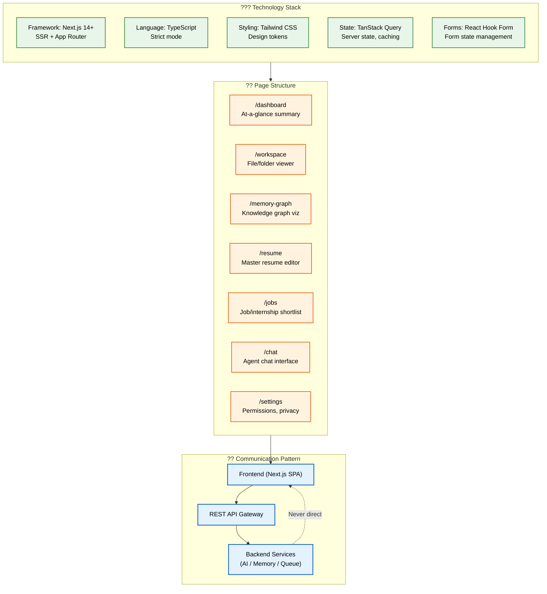
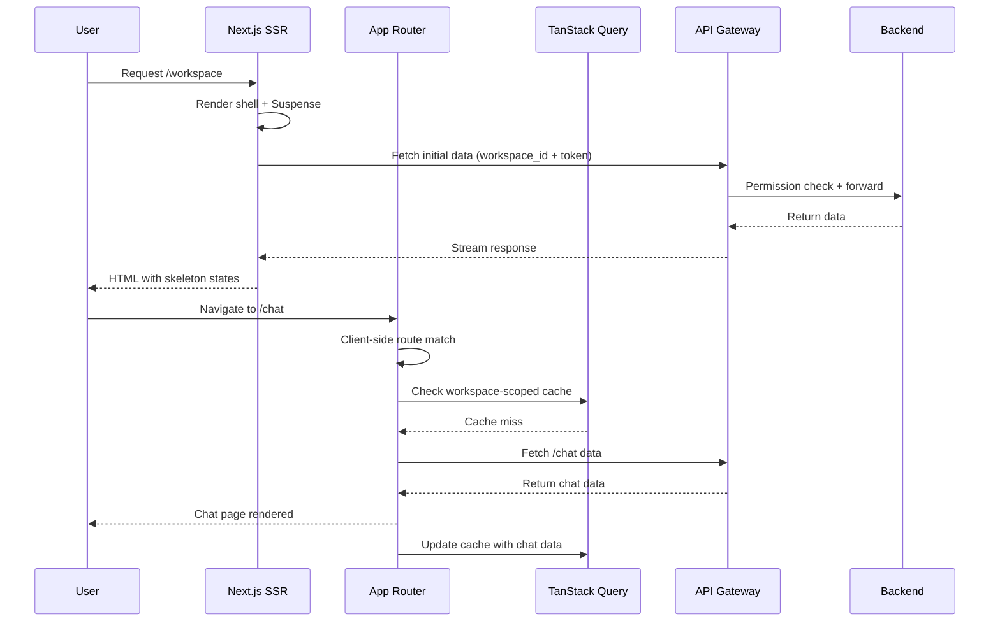

# Frontend Architecture

> **Purpose:** Define the frontend architecture, technology stack, and communication patterns for Vaeloom
> **Status:** ? Upgraded to enterprise quality
> **Owner:** Frontend Team
> **Version:** 2.0
> **Last Updated:** 2026-07-17
> **Dependencies:** UI-Architecture.md, Design-System.md, State-Management.md, Navigation.md
> **Implementation Status:** ?? Spec Only
> **Review Checklist:** Standard
> **Canonical source:** [`/docs/Vaeloom-Complete-Documentation.md#42-frontend`](../../docs/Vaeloom-Complete-Documentation.md#42-frontend)

## Overview

The Vaeloom frontend is a component-driven single-page application built with Next.js 14+ (App Router), TypeScript (strict mode), Tailwind CSS, TanStack Query, and React Hook Form. It serves 11 page routes including Dashboard, Workspace, Memory Graph, Resume, Jobs, Applications, Chat, Schedule, Connectors, History, and Settings — each with an SSR or CSR rendering strategy chosen for its interaction model.

The architecture enforces a strict communication boundary: the frontend communicates exclusively through the REST API gateway, never directly accessing databases, memory stores, or agent systems. Every data request passes through the API layer where the permission engine enforces workspace-scoped access control. This one-way data flow prevents data leaks, ensures consistent authorization, and keeps the frontend stateless with respect to backend concerns.

**Audience:** Frontend engineers, backend engineers integrating with the frontend, DevOps engineers managing deployment, and architects reviewing system design. **System fit:** The frontend is the user-facing layer of Vaeloom's AI-powered career management platform, consuming backend APIs to render dashboards, knowledge graphs, document editors, and chat interfaces. **Why it matters:** A well-architected frontend ensures fast page loads, secure data isolation between workspaces, and a resilient UX where a crash in one feature cannot take down unrelated features.

## Goals

- Achieve Lighthouse performance score of 90+ on all page routes
- Maintain bundle size under 250KB (gzipped) per route through code splitting
- Ensure zero client-side access to backend services (API-only communication)
- Achieve 100% TypeScript strict mode compliance across the entire frontend codebase
- Reduce time-to-interactive to under 3s on all SSR pages for first-time visitors

## Scope

| In Scope | Out of Scope |
|----------|--------------|
| Next.js App Router configuration and SSR strategy | Mobile native application development |
| Component architecture and state management | Server-side rendering infrastructure |
| TypeScript strict mode enforcement | Backend API development |
| Route-based code splitting and bundle optimization | Third-party widget integration |
| Error boundary and loading state patterns | End-to-end testing framework |

## Functional Requirements

| ID | Requirement | Priority |
|----|-------------|----------|
| FR-001 | Frontend shall communicate exclusively through REST API gateway | P0 |
| FR-002 | Every route segment shall be wrapped in an error boundary | P0 |
| FR-003 | All data-dependent views shall display skeleton loading states | P1 |
| FR-004 | Frontend shall use server-side rendering for all content routes | P0 |
| FR-005 | TanStack Query caches shall be scoped per workspace to prevent data leakage | P0 |

## Non-Functional Requirements

| ID | Requirement | Target | Measurement |
|----|-------------|--------|-------------|
| NFR-001 | Lighthouse performance score | > 90 | Lighthouse CI |
| NFR-002 | Bundle size per route (gzipped) | < 250KB | @next/bundle-analyzer |
| NFR-003 | Time-to-interactive on SSR pages | < 3s | Web Vitals |
| NFR-004 | TypeScript strict mode compliance | 100% | tsc --strict |
| NFR-005 | Error boundary coverage | 100% of route segments | Code coverage scan |

## Architecture



> **Diagram:** Frontend architecture showing the **technology stack** (Next.js + TypeScript + Tailwind + TanStack Query), **page structure** (11 routes), and **communication pattern** — frontend communicates exclusively through the REST API gateway, never directly accessing memory or agent systems.

## Components

| Component | Responsibility | Technology | Scale Strategy |
|-----------|---------------|------------|---------------|
| Next.js SSR Renderer | Server-side page rendering with streaming | Next.js 14+ App Router | Auto-scaling with container orchestration |
| API Client | Type-safe HTTP client with caching and retry | TanStack Query + fetch | No scaling needed (stateless) |
| State Manager | Server state caching and workspace scoping | TanStack Query | Per-workspace query key prefixing |
| Form Manager | Form state, validation, and submission | React Hook Form | No scaling needed (client-side only) |
| Error Boundary Tree | Catch and isolate render errors per route segment | React Error Boundary | Component-level granularity |

## Workflows

1. **Initial Page Load**: User navigates to Vaeloom URL ? DNS resolves to CDN ? Next.js server renders page shell with Suspense boundaries ? HTML streamed to client progressively ? React hydrates on client ? TanStack Query initializes workspace-scoped caches ? Page becomes fully interactive. Target: < 3s TTI for SSR pages.

2. **Subsequent Client Navigation**: User clicks sidebar link ? Next.js App Router matches route ? Prefetched chunk loads from browser cache if available ? Layout shell (Sidebar + TopNav) preserved — only content area re-renders ? Page component renders with appropriate SSR/CSR strategy ? TanStack Query serves cached data or fetches fresh data through API gateway ? Transition completes. Target: < 300ms navigation.

3. **Data Mutation (Form Submit)**: User fills form and submits ? React Hook Form validates client-side rules ? API client sends POST/PUT/PATCH through gateway with workspace_id and auth token ? Gateway forwards request after permission check ? Backend processes mutation and returns response ? TanStack Query cache invalidated for affected keys ? UI updates reflect new state ? User sees success confirmation or error.

4. **Error Recovery**: API request fails ? TanStack Query retries with exponential backoff (default: 3 retries) ? If all retries exhausted ? Error state set at component level ? User sees contextual error message with retry action ? Error logged to monitoring system with stack trace and request context ? User can retry or navigate away.

## Sequence Diagrams



## Data Flow

1. **Ingestion**: User action triggers a data request (page navigation, form submit, search query). Next.js server component or client-side hook initiates fetch through the API client.

2. **Processing**: API client constructs request with workspace_id and auth token. TanStack Query checks its cache — returns cached data if fresh (staleTime: 30s default), otherwise sends HTTP request to the REST API gateway.

3. **Storage**: API gateway receives request, validates authentication, checks permissions against the workspace context, then routes to the appropriate backend service. Backend reads/writes to its data store. Response flows back through the gateway.

4. **Retrieval**: Response arrives at the frontend. TanStack Query caches the data with workspace-scoped query keys (`['workspace', workspaceId, key]`). UI components re-render with new data. Skeleton loaders shown during fetch, replaced by content on success or error state on failure.

5. **Deletion**: User triggers a delete action ? API client sends DELETE request with resource ID ? Backend deletes resource ? TanStack Query invalidates related cache keys ? UI updates to reflect removal. On workspace switch, all workspace-scoped caches are cleared to prevent cross-tenant data leakage.

## APIs

N/A — This document defines the frontend architecture and communication pattern. Specific API endpoints, methods, request/response schemas, and authentication flows are documented in the backend API specification and the Vaeloom Complete Documentation.

## Database

N/A — The frontend does not directly access any database. All data flows through the REST API gateway where authentication, authorization, and workspace-scoped permissions are enforced at the backend level.

## Security

| Concern | Mitigation |
|---------|------------|
| API key or token exposure in client-side code | Environment variables prefixed with `NEXT_PUBLIC_` are visible in the browser bundle — never expose secrets, only public configuration values |
| Route protection bypass via client-side navigation | Protected routes must verify authentication server-side (Next.js middleware or server components); client-side auth checks can be bypassed |
| Cross-tenant data exposure through shared state | Ensure TanStack Query caches are scoped per workspace — switching workspaces should not serve cached data from the previous workspace |

## Performance

| Concern | Budget | Measurement | Optimization |
|---------|--------|-------------|--------------|
| Route-level code splitting | 250KB gzipped per route | @next/bundle-analyzer | Next.js App Router auto-splits; verify dynamic imports for heavy components |
| Image optimization | 100KB per page | Lighthouse | Use `next/image` for WebP conversion, lazy loading, responsive srcset — saves 30-50% on image transfer |
| Bundle size regression | Main bundle +50KB triggers review | CI bundle size gate | Add `@next/bundle-analyzer` to CI with size thresholds |
| SSR page time-to-interactive | < 3s | Web Vitals (TTI) | Streaming SSR with Suspense boundaries; defer non-critical JavaScript |

## Scalability

| Dimension | Current Limit | 10x Strategy | 100x Strategy |
|-----------|--------------|--------------|---------------|
| Concurrent SSR requests | 100 per instance | Horizontal scaling with auto-scaling groups | Global CDN with edge rendering |
| Client bundle size | 250KB per route | Dynamic imports for heavy components | Module federation for micro-frontends |
| TanStack Query cache | 50MB client-side | LRU eviction with per-workspace keys | IndexedDB for offline support |
| Page routes | 11 routes | Parallel routes and intercepting routes | Nested layouts with route groups |

## Error Handling

| Scenario | Detection | Mitigation | Recovery |
|----------|-----------|------------|----------|
| API gateway timeout | TanStack Query retry detects failure | Show cached data with stale indicator | Auto-retry with exponential backoff |
| React render crash in a route segment | Error boundary catches the error | Show fallback UI for that segment only | Log to error tracking, user can retry |
| SSR page fetch failure | Next.js error during server render | Show static fallback page | Retry on client navigation |
| Cross-workspace cache contamination | Stale data from previous workspace displayed | Clear TanStack Query cache on workspace switch | Scoped query keys prevent recurrence |

## Monitoring

| Metric | Alert Threshold | Severity | Dashboard |
|--------|----------------|----------|-----------|
| Lighthouse performance score | < 85 | Warning | Frontend Performance |
| Bundle size per route | > 300KB (gzipped) | Warning | Bundle Analysis |
| Time-to-interactive | > 4s for any route | Critical | Web Vitals |
| Error boundary activation rate | > 1% of page views | Warning | Error Tracking |
| API client failure rate | > 5% of requests | Critical | API Client Health |

## Deployment

| Environment | Strategy | Rollback | Notes |
|-------------|----------|----------|-------|
| Development | Vercel preview per PR branch | Automatic rollback on CI failure | Each PR gets unique preview URL; connected to staging API |
| Staging | Auto-deploy from `develop` branch | Manual rollback via Vercel dashboard | Uses staging backend; test data only |
| Production | Auto-deploy from `main` branch | Instant rollback to previous stable version | CDN cache purged on deploy; feature flags control rollout; canary deployments via Vercel |

## Configuration

| Variable | Purpose | Default | Required |
|----------|---------|---------|----------|
| NEXT_PUBLIC_API_URL | Public API gateway URL | /api/v1 | Yes |
| NEXT_PUBLIC_WS_URL | WebSocket URL for real-time features | wss://api.vaeloom.dev/ws | No |
| TANSTACK_STALE_TIME_MS | TanStack Query stale time | 30000 | No |
| TANSTACK_RETRY_COUNT | API client retry count on failure | 3 | No |
| ERROR_BOUNDARY_FALLBACK | Custom fallback UI for error boundaries | default-fallback | No |

## Examples

### API Client with TanStack Query

```typescript
function useDocuments(workspaceId: string) {
  return useQuery({
    queryKey: ['documents', workspaceId],
    queryFn: () => fetch(`/api/v1/workspaces/${workspaceId}/documents`).then(r => r.json()),
    staleTime: 30_000,
    gcTime: 5 * 60_000,
  });
}
```

### Error Boundary Wrapping a Route Segment

```tsx
function WorkspaceLayout({ children }: { children: React.ReactNode }) {
  return (
    <ErrorBoundary fallback={<WorkspaceError />}>
      <Suspense fallback={<WorkspaceSkeleton />}>
        {children}
      </Suspense>
    </ErrorBoundary>
  );
}
```

### Workspace-Scoped Query Key Pattern

```typescript
function useWorkspaceQuery<T>(key: string, workspaceId: string, fetcher: () => Promise<T>) {
  return useQuery({
    queryKey: ['workspace', workspaceId, key],
    queryFn: fetcher,
    staleTime: 30_000,
  });
}
```

## Best Practices

| # | Practice | Rationale |
|---|----------|----------|
| 1 | Communicate exclusively through the REST API gateway | The frontend must never access database, memory, or agent systems directly — all data flows through the API where permissions are enforced |
| 2 | Wrap every route segment in an error boundary | A crash in the Memory Graph page should not affect the Dashboard or Workspace; error boundaries at the route level isolate failures |
| 3 | Use skeleton loading states for every data-dependent view | Skeleton screens that match the final layout feel instant; generic spinners tell the user nothing about what's loading |
| 4 | Keep shared components independent of page-specific logic | Components should receive data via props, not fetch it themselves — this keeps them reusable and testable across different page contexts |
| 5 | Prefix TanStack Query keys with workspace ID | Prevents cross-tenant cache contamination when switching workspaces |

## Risks

| Risk | Likelihood | Impact | Mitigation |
|------|------------|--------|------------|
| Client bundle growing beyond budget with new features | Medium | Medium | CI bundle size gate, code review threshold |
| SSR rendering becoming bottleneck during traffic spikes | Medium | High | CDN caching of static pages, ISR for dynamic content |
| TanStack Query cache leaking data between workspaces | Low | Critical | workspace_id-prefixed query keys, clear on workspace switch |
| Third-party dependency introducing breaking changes | Medium | Medium | Lock dependencies, Dependabot with automated testing |

## Limitations

| Limitation | Impact | Workaround | Future Resolution |
|------------|--------|------------|-------------------|
| Next.js SSR has higher server cost than fully static sites | Increased hosting costs for dynamic pages | Cache with ISR, use CDN for static assets | Edge rendering for dynamic SSR at lower latency |
| No offline support in MVP | User cannot use app without internet | Service worker for basic navigation | PWA with IndexedDB for offline data access |
| Client-side hydration limits for canvas-heavy pages | Memory Graph needs full client JS before rendering | Dynamic import with loading indicator | WebAssembly for heavy computation |
| No module federation across feature teams | All frontend code lives in one repo | Shared component library with clear boundaries | Micro-frontends with Next.js Module Federation |

## Future Improvements

| Improvement | Priority | Complexity | Timeline |
|-------------|----------|------------|----------|
| Progressive Web App with offline support | Medium | Medium | Q4 2026 |
| Edge rendering for reduced SSR latency | High | Medium | Q3 2026 |
| Micro-frontend architecture with module federation | Low | High | Q2 2027 |
| Real-time collaboration via WebSockets | Medium | High | Q1 2027 |
| Automated visual regression testing in CI | Medium | Low | Q3 2026 |

## Related Documents

- [UI Architecture.md](./UI-Architecture.md)
- [Navigation.md](./Navigation.md)
- [Design System.md](./Design-System.md)
- [State Management.md](./State-Management.md)
- [Component Library.md](./Component-Library.md)
- [UX Guidelines.md](./UX-Guidelines.md)
- [Theme System.md](./Theme-System.md)
- [Responsive Design.md](./Responsive-Design.md)
- [Mobile Architecture.md](./Mobile-Architecture.md)
- [Internationalization.md](./Internationalization.md)
- [Forms.md](./Forms.md)
- [Dashboard.md](./Dashboard.md)
- [Charts.md](./Charts.md)
- [Animation System.md](./Animation-System.md)
- [Accessibility.md](./Accessibility.md)
- [Accessibility Audit.md](./Accessibility-Audit.md)
- [`/docs/Vaeloom-Complete-Documentation.md#42-frontend`](../../docs/Vaeloom-Complete-Documentation.md#42-frontend)
