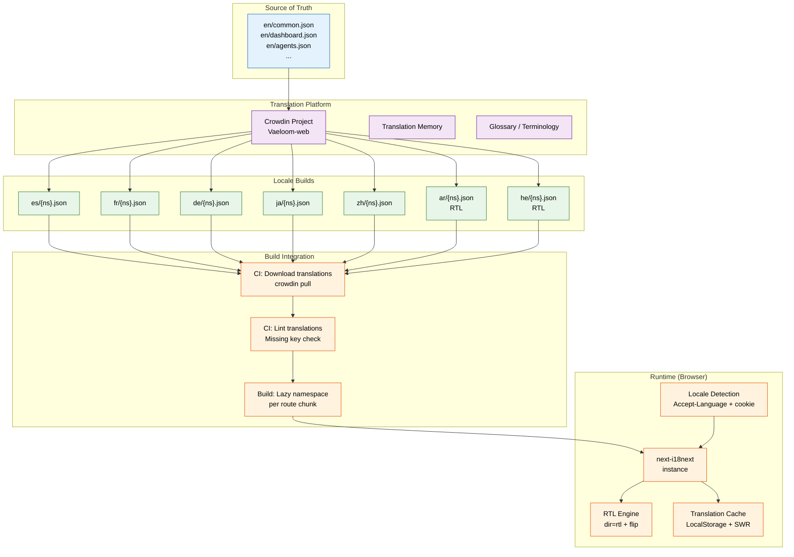
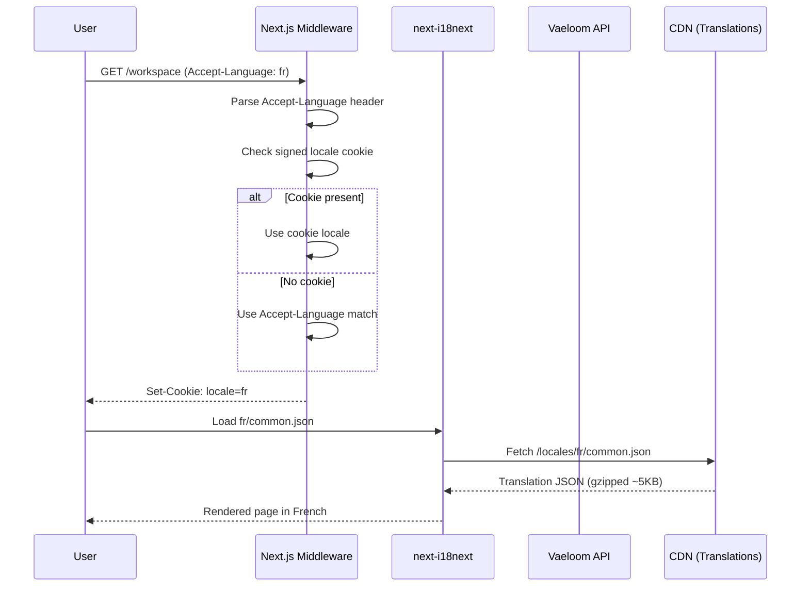

# Internationalization

> **Purpose:** Define the i18n strategy, locale management, and translation workflow for Vaeloom
> **Status:** 🆕 New
> **Owner:** Frontend Team
> **Last Updated:** 2026-07-13

## Overview

Vaeloom serves a global user base with a focus on international students and job markets. The frontend uses **next-i18next** for React/Next.js internationalization, supporting six initial locales: English, Spanish, French, German, Japanese, and Chinese. Arabic and Hebrew support includes full RTL layout mirroring.

Translations are managed through **Crowdin** for collaborative translation workflows, lazy-loaded per route to minimize bundle size, and versioned alongside the codebase to ensure translation drift is detected in CI.

## i18n Architecture



## Locale System

| Locale | Code | Direction | Launch Order | Notes |
|--------|------|-----------|-------------|-------|
| English | `en` | LTR | v1 | Default; source locale for all translations |
| Spanish | `es` | LTR | v1 | Major LATAM + EU market |
| French | `fr` | LTR | v1 | Francophone Africa + EU |
| German | `de` | LTR | v1.1 | EU Tier 2 |
| Japanese | `ja` | LTR | v1.1 | APAC priority |
| Chinese | `zh` | LTR | v1.1 | Simplified only; APAC priority |
| Arabic | `ar` | **RTL** | v1.2 | MENA market; full RTL support |
| Hebrew | `he` | **RTL** | v1.2 | Full RTL support |

## Translation Workflow

```mermaid
flowchart LR
    A["Developer: Add new key<br/>in en/{ns}.json"] --> B["PR Review: i18n lint<br/>checks for missing keys"]
    B --> C["Merge to main<br/>triggers CI sync"]
    C --> D["Crowdin Sync<br/>Upload source to Crowdin"]
    D --> E["Translators<br/>(Community + Pro)"]
    E --> F["Translation Review<br/>Proofread + approve"]
    F --> G["CI: crowdin pull<br/>Download translations"]
    G --> H["Build: Lazy-loaded<br/>namespace chunks"]
    H --> I["Deploy<br/>New translations live"]
```



### Key Configurations

```typescript
// next-i18next.config.ts
export const i18nConfig = {
  defaultLocale: 'en',
  locales: ['en', 'es', 'fr', 'de', 'ja', 'zh', 'ar', 'he'],
  localeDetection: true,
  // RTL locales
  rtlLocales: ['ar', 'he'],
  // Namespaces (lazy-loaded)
  defaultNS: 'common',
  ns: ['common', 'dashboard', 'agents', 'documents', 'settings', 'auth', 'pricing'],
}
```

### RTL Support

For RTL locales, the application applies CSS logical properties and a layout flip transform:

```css
/* Use logical properties instead of physical ones */
.element {
  margin-inline-start: 1rem;
  padding-inline-end: 0.5rem;
  border-inline-start: 2px solid var(--color-primary);
}

/* Auto-flipped by the RTL engine */
[dir="rtl"] .nav-chevron {
  transform: scaleX(-1);
}

[dir="rtl"] .text-align-auto {
  text-align: start;
}
```

## Best Practices

| Practice | Rationale |
|----------|----------|
| Namespace translations by route | Enables lazy-loading per page — dashboard loads only `dashboard.json`, not the entire translation corpus |
| Use interpolation, not concatenation | `t('welcome', { name })` avoids word-order issues in languages where adjective placement differs |
| Keep source keys in English | English keys serve as self-documenting identifiers; translators always have a reference context |
| Version lock translations to releases | Translation PRs pinned to app version tags prevent drift when source strings change mid-release cycle |
| Always use `t()` function | Never embed raw strings in JSX — every user-facing string must pass through the i18n function |

## Common Mistakes

| Mistake | Consequence | Fix |
|---------|-------------|-----|
| Concatenating translated strings | `t('hello') + ' ' + name` breaks in languages where word order differs or spaces are not used | Use template interpolation: `t('hello_name', { name })` |
| Forgetting RTL layout testing | Arabic users see broken layouts with overlapping text or reversed icons | Add RTL to the CI visual regression suite; test all RTL locales before release |
| Embedding HTML in translation strings | Translators can inject malformed HTML; XSS risk if not sanitized | Use `t()` with components: `<Trans i18nKey="welcome"><Bold>component</Bold></Trans>` |
| No fallback for missing translations | Empty UI elements or raw key names displayed in production | Configure `returnNull: false` in i18next; always fall back to English or the key itself |
| One giant namespace file | Entire translation bundle loaded on every page; defeats lazy-loading | Split into route-based namespaces; common/shared keys in `common.json` |

## Security Considerations

| Concern | Mitigation |
|---------|-----------|
| XSS via translation strings | All translation output is escaped by default; rich text must use `<Trans>` component with explicit allowed tags |
| RTL override injection | `dir` attribute set server-side based on validated locale list; never derived from user input |
| Locale detection spoofing | Accept-Language header used only as hint; locale preference stored in signed cookie |
| Translation file tampering | Translation JSON files served from immutable CDN storage with integrity hashes (SRI) |
| Crowdin API token exposure | Crowdin tokens stored in CI secrets; never exposed in client bundles or environment variables |

## Performance Considerations

| Concern | Mitigation |
|---------|-----------|
| Translation bundle size | Lazy-loaded namespaces per route; typical page loads ~5KB of translated JSON (gzipped) |
| Locale detection latency | Locale resolved server-side via cookie; no client-side redirect needed |
| RTL CSS overhead | RTL styles applied via CSS logical properties (zero runtime cost); no JS-based DOM flipping |
| Translation cache misses | Prerender top 5 locales in static pages; remaining locales rendered on demand with caching headers |
| Crowdin sync speed | Differential sync uploads only changed keys; full download takes <30s in CI pipeline |

## Components

| Component | Responsibility | Technology | Scale Strategy |
|-----------|---------------|------------|----------------|
| LanguageSwitcher | Locale selection and persistence | next-i18next + cookie | Singleton in navbar; shows only locales relevant to user region |
| RTLProvider | Bidirectional layout engine for Arabic/Hebrew | CSS logical properties + dir=rtl | Wraps app root; applies CSS flip transforms per locale |
| TransComponent | Rich text translation with embedded HTML | next-i18next `<Trans>` | Instance per rich text block; parses i18n keys with component interpolation |
| LocaleDetector | Server-side locale resolution | Accept-Language + signed cookie | Runs per request in Next.js middleware; no client-side redirect needed |

## Workflows

1. **User changes language**: Clicks LanguageSwitcher → selects "Français" → locale cookie updated → page re-renders with French translations → if RTL locale (Arabic, Hebrew), `dir=rtl` applied → layout flips via CSS logical properties
2. **New translation key added**: Developer adds key to `en/common.json` → PR merge triggers CI → Crowdin sync uploads source keys → translators receive notification → translations submitted → proofread approved → `crowdin pull` downloads updated files → build includes new locale chunks
3. **Missing translation fallback**: User with German locale encounters untranslated key → i18next falls back to English value → console warning logged → Sentry captures missing key → translation ticket auto-filed in Crowdin
4. **RTL layout verification**: Developer tests Arabic locale → CSS logical properties auto-flip margins, padding, borders → icons reverse via `transform: scaleX(-1)` → visual regression test compares LTR vs RTL screenshots → CI passes only if both match baseline

## Sequence Diagrams



## Data Flow

1. **Ingestion**: Source translations authored in English `en/{namespace}.json` → pushed to Crowdin via CI → translators submit target locale translations → proofread and approved
2. **Processing**: `crowdin pull` downloads approved translations → CI lints for missing keys → webpack chunks splits by locale + namespace → JSON gzipped and uploaded to CDN
3. **Storage**: Translation files versioned in Git alongside code → CDN serves immutable locale chunks with SRI hashes → browser caches via localStorage + SWR
4. **Retrieval**: Next.js middleware detects locale → i18next loads namespace JSON on demand → `<Trans>` components render rich translations → RTLProvider flips layout if needed
5. **Deletion**: Deprecated translation keys removed from source → Crowdin sync removes from all locales → stale keys purged from CDN cache → old locale chunks removed from build

## Scalability

| Dimension | Current Limit | 10x Strategy | 100x Strategy |
|-----------|---------------|--------------|---------------|
| Supported locales | 8 | 20 locales (add Hindi, Korean, Portuguese, Italian, etc.) | 50+ locales with regional variants (en-GB, pt-BR, zh-Hans) |
| Translation keys | 2,000 | 10,000 keys with namespace granularity | 50,000+ with AI-assisted translation verification |
| RTL locales | 2 (ar, he) | 5 RTL locales (add Urdu, Farsi, Kurdish) | Full Unicode bidirectional algorithm support with per-script fonts |
| Crowdin sync frequency | On merge to main | Differential sync per PR | Real-time sync via webhook on key change |

## Error Handling

| Scenario | Detection | Mitigation | Recovery |
|----------|-----------|------------|----------|
| Translation file fails to load | i18next `failedLoading` event | Fall back to English (source locale); show console warning | Retry fetch from CDN; if persistent, log to Sentry |
| Missing translation key | `returnNull: false` returns key name | Display key name in dev; log missing key to Sentry | Auto-create Crowdin task for missing key |
| RTL layout broken for specific component | Visual regression test fails | Exclude component from RTL flip; apply selective CSS overrides | Fix CSS logical property usage in component |
| Crowdin sync fails | CI step exits with non-zero | Retry sync with exponential backoff (max 3 attempts) | Manual crowdin pull if CI sync fails persistently |

## Monitoring

| Metric | Alert Threshold | Severity | Dashboard |
|--------|----------------|----------|-----------|
| Missing translation key rate | > 0 in production | Warning | Sentry — i18n Issues |
| Translation bundle size per locale | > 50KB gzipped | Warning | Grafana — Bundle Size Dashboard |
| RTL locale visual regression failures | > 0 per release | Critical | Chromatic — Visual Regression |
| Crowdin sync duration | > 5 minutes | Warning | CI Pipeline — i18n Sync step |
| Locale detection redirect rate | > 1% of requests redirect | Info | Grafana — Performance Dashboard |

## Risks

| Risk | Likelihood | Impact | Mitigation |
|------|------------|--------|------------|
| Translator introduces malformed HTML in translation string | Low | High | Sanitize all translation output; escape HTML by default; require `<Trans>` for rich text |
| New locale inflates bundle size significantly | Medium | Medium | Lazy-load per locale; prerender top 5 locales; on-demand for remaining |
| Cultural sensitivity issue in translated content | Low | High | Maintain glossary; translations approved by native speakers; community review process |
| RTL layout breaks after UI component update | Medium | Medium | Visual regression tests for all RTL locales per release |

## Limitations

| Limitation | Impact | Workaround | Future Resolution |
|------------|--------|------------|-------------------|
| Machine translations require human review | Slows down initial locale launches | Use professional translation services for launch; community-sourced for ongoing | AI-assisted translation with human-in-the-loop confidence scoring |
| Dynamic content (dates, numbers, plurals) not auto-translated | Must manually format per locale | Use `Intl.DateTimeFormat` and `Intl.NumberFormat` with locale-aware components | `<Trans>` with ICU messageformat for all dynamic content |
| RTL support must be built per-component | New components may not adapt to RTL | CSS logical properties handle most cases; manual review for complex layouts | RTL testing as CI gate with automated layout checks |

## Goals

- Launch with 6 initial locales (en, es, fr, de, ja, zh) covering 80%+ of target user base
- Achieve under 5KB gzipped translation payload per route through namespace-based lazy loading
- Support full RTL layout mirroring for Arabic and Hebrew locales with zero JS runtime cost
- Maintain zero production missing-key incidents through CI linting and Sentry monitoring
- Complete Crowdin translation sync in under 30 seconds per CI pipeline run

## Scope

### In Scope

- next-i18next integration with Next.js App Router and server-side locale detection
- Six initial locales: English, Spanish, French, German, Japanese, Chinese (Simplified)
- RTL layout support for Arabic and Hebrew via CSS logical properties
- Route-based namespace splitting for lazy-loading translations per page
- Crowdin collaborative translation platform with translation memory and glossary
- CI pipeline integration: lint missing keys, sync with Crowdin, version-lock translations to releases

### Out of Scope

- Real-time translation preview for translators (future improvement)
- Community translation contribution portal (future improvement)
- Regional locale variants (en-GB, pt-BR, fr-CA) (future improvement)
- Machine-only translations without human review (quality gate requirement)

---

| Improvement | Priority | Complexity | Timeline |
|-------------|----------|------------|----------|
| AI-powered translation quality scoring | High | Medium | Q3 2027 |
| Real-time translation preview for translators | Medium | Medium | Q2 2027 |
| Community translation contribution portal | Medium | High | Q4 2027 |
| Regional locale variants (en-GB, pt-BR, fr-CA) | Low | Low | Q1 2027 |

## Examples

### Translation with `t()` function

```tsx
import { useTranslation } from 'next-i18next';

function WelcomeMessage({ name }: { name: string }) {
  const { t } = useTranslation('dashboard');
  return <h1>{t('welcome', { name })}</h1>;
}
```

### Rich text translation with `<Trans>`

```tsx
import { Trans } from 'next-i18next';

function TermsNotice() {
  return (
    <p>
      <Trans i18nKey="terms_agreement" ns="auth">
        By continuing, you agree to our <a href="/terms">Terms of Service</a>
      </Trans>
    </p>
  );
}
```

### RTL layout using logical properties

```css
.sidebar {
  margin-inline-end: var(--space-4);
  padding-inline-start: var(--space-6);
  border-inline-end: 1px solid var(--border-light);
}

[dir="rtl"] .chevron-icon {
  transform: scaleX(-1);
}
```

### Language switcher component

```tsx
import { useRouter } from 'next/router';

function LanguageSwitcher() {
  const { locale, locales, push, asPath } = useRouter();
  return (
    <select value={locale} onChange={e => push(asPath, asPath, { locale: e.target.value })}>
      {locales?.map(l => <option key={l} value={l}>{l.toUpperCase()}</option>)}
    </select>
  );
}
```

---

## Related Documents

- [Frontend Architecture.md](./Frontend-Architecture.md)
- [UI Architecture.md](./UI-Architecture.md)
- [Accessibility Audit.md](./Accessibility-Audit.md)
- [Design System.md](./Design-System.md)
- [UX Guidelines.md](./UX-Guidelines.md)
