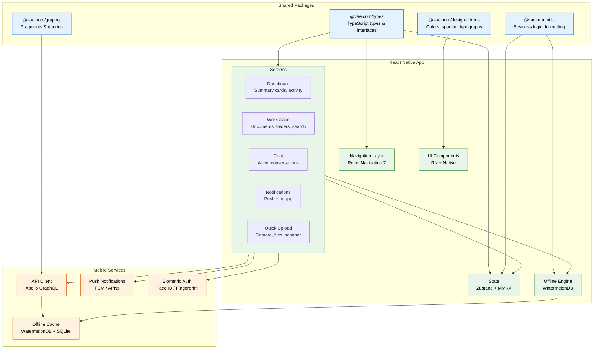
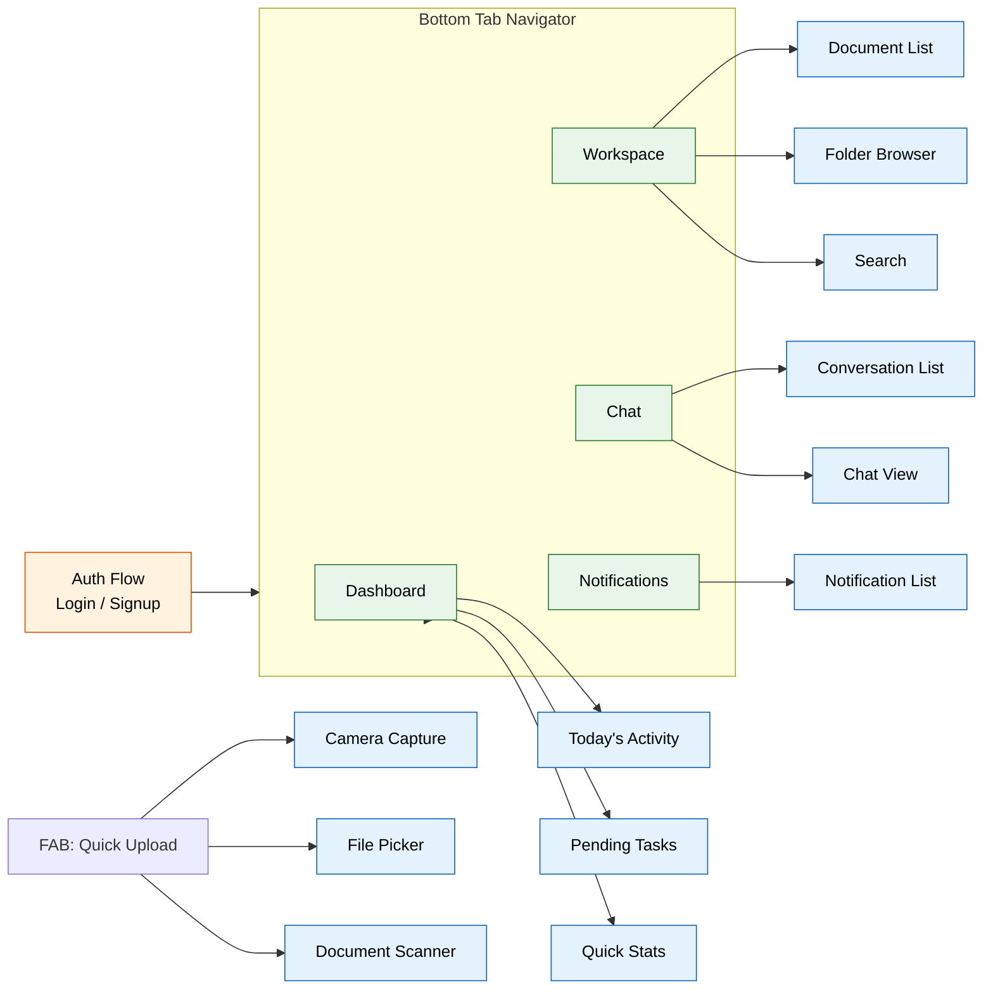
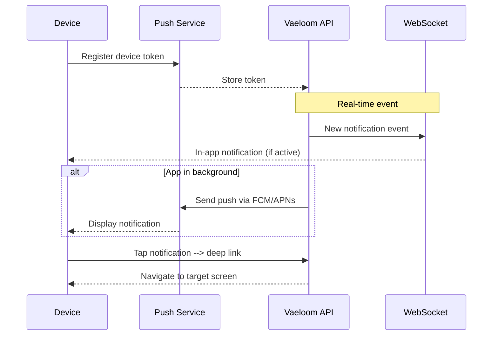
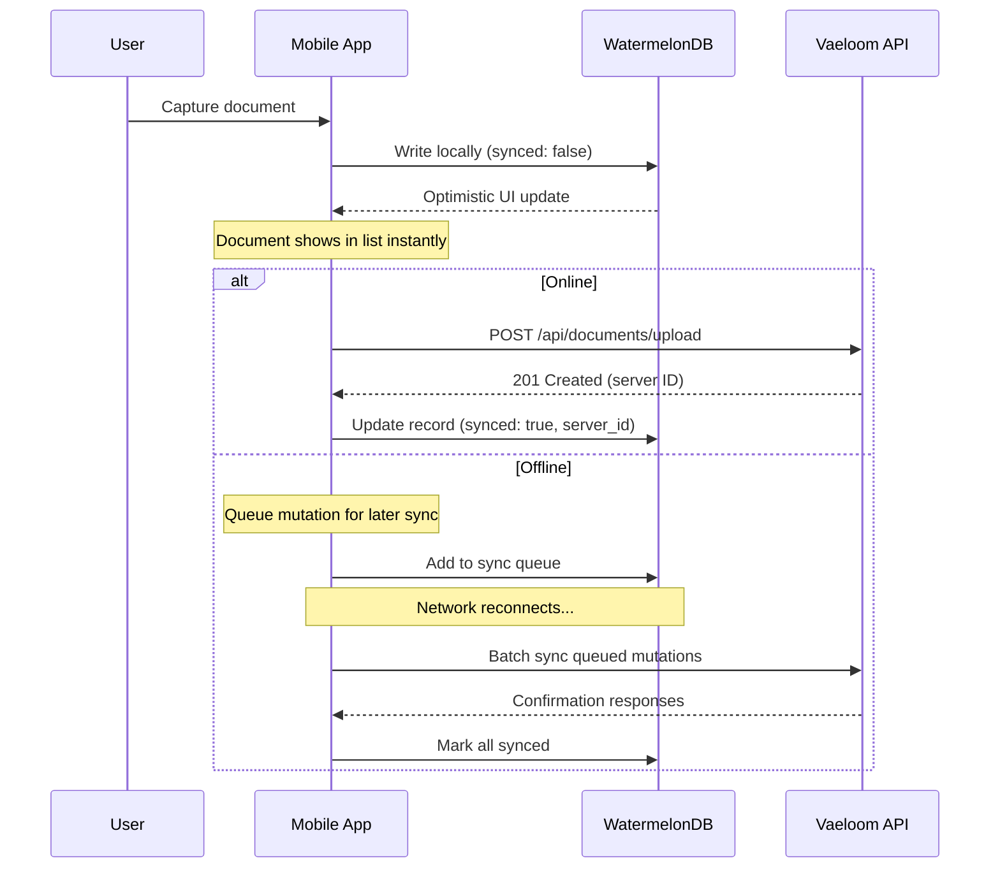
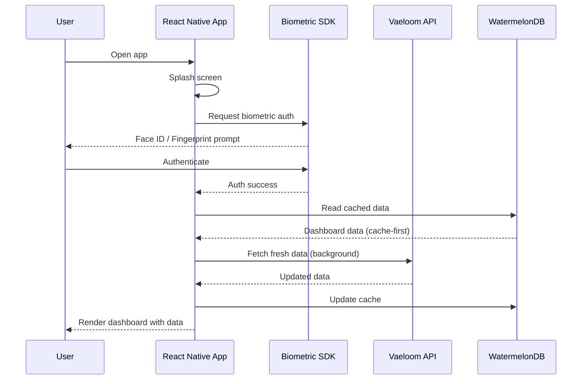

# Mobile Architecture

> **Purpose:** Define the React Native mobile companion app architecture for Vaeloom
> **Status:** ✅ Upgraded to enterprise quality
> **Version:** 2.0
> **Last Updated:** 2026-07-17

## Overview

Vaeloom provides a React Native companion app for iOS and Android that serves as a mobile extension of the web application — not a full parity client. The companion is designed for on-the-go access to the most critical workflows: reviewing dashboards, managing workspaces, chatting with agents, receiving notifications, and quick document uploads.

The mobile app shares TypeScript types, GraphQL fragments, and core business logic with the web frontend through a shared monorepo package (`packages/shared`). Platform-specific UI is built using React Native components while reusing design tokens from the web design system.

## Architecture



## Screen Architecture



## Offline Mode

The companion app supports offline-first reads and optimistic updates:

```typescript
interface OfflineStrategy {
  reads: 'cache-first'     // WatermelonDB local DB queried first
  writes: 'optimistic'     // Local update immediately, sync when online
  sync: 'background'       // Background sync on connectivity change
  conflict: 'last-write-wins' // Simple LWW for document content
}
```

## Push Notification Flow



## Best Practices

| Practice | Rationale |
|----------|----------|
| Share types and fragments from monorepo | Prevents drift between web and mobile API contracts; single source of truth for all GraphQL operations |
| WatermelonDB for offline cache | SQLite-based local database supports lazy loading, relations, and sync primitives out of the box |
| Biometric auth as secondary factor | Primary auth via Clerk session token; biometrics unlock the local session, not replace server auth |
| Optimistic updates with conflict resolution | Users see instant feedback on mutations; LWW strategy handles conflicts when reconnecting |

## Common Mistakes

| Mistake | Consequence | Fix |
|---------|-------------|-----|
| Building full web parity | Doubles feature maintenance cost; mobile becomes a bottleneck for web releases | Strictly scope mobile to companion use cases; each feature must pass "can it wait until desktop?" test |
| Ignoring offline error states | Users see stale data or cryptic errors when connectivity drops | Implement explicit offline banners + retry logic; cache timestamps show data freshness |
| Overfetching GraphQL on mobile | Slow screen loads on cellular connections | Use persisted queries + fragment masking; prefetch key screens on app launch |
| No biometric session lock | Unencrypted local data accessible if device is unlocked | Bind local cache encryption to biometric key; re-prompt on app background/resume |

## Security

| Concern | Mitigation |
|---------|-----------|
| Local data exposure | WatermelonDB encrypted at rest via SQLCipher; encryption key derived from biometric + device keychain |
| API token storage | Clerk session tokens stored in iOS Keychain / Android EncryptedSharedPreferences; never in AsyncStorage |
| Deep link hijacking | Verified app links (Android App Links / iOS Universal Links); reject unregistered URL schemes |
| Push notification data leakage | Push payloads contain only message IDs; full content fetched via authenticated API call |
| Screenshot protection | Enable FLAG_SECURE on sensitive screens (chat, documents) for enterprise-managed devices |

## Performance

| Concern | Mitigation |
|---------|-----------|
| App cold start time | Lazy-load screen modules via React Native lazy imports; skeleton screens during initial data fetch |
| Offline sync bandwidth | Differential sync transmits only changed records; binary diff for document content |
| Image loading on cellular | Progressive JPEG loading; configurable image quality per connection type (WiFi vs cellular) |
| Navigation jank | Pre-warm tab screens on app launch; use react-native-screens native stack for gesture-backed transitions |
| Large document lists | FlatList with windowed rendering + memoization; batch size 20 items per page |

## Components

| Component | Responsibility | Technology | Scale Strategy |
|-----------|---------------|------------|----------------|
| DashboardScreen | Mobile summary cards and activity feed | React Native + Recharts | Lazy-loaded on tab focus; skeleton while fetching |
| ChatView | Agent conversation interface | React Native Gifted Chat | Singleton; message list virtualized with FlatList |
| QuickUploadFAB | Floating action button for camera/files/scanner | React Native + CameraKit | Floating across all screens; modal on press |
| OfflineSyncEngine | Background data synchronization | WatermelonDB + NetInfo | Singleton; differential sync on connectivity change |

## Workflows

1. **App cold start**: User opens app → splash screen displays → biometric auth prompt appears → Face ID / Fingerprint authenticates → tab navigator renders → active tab (Dashboard) fires data queries → skeleton screens show while loading → data renders
2. **Offline document upload**: User taps FAB → selects camera → captures document → WatermelonDB stores locally with `synced: false` → optimistic UI shows document in list → network reconnects → background sync pushes to server → conflict resolved (LWW) → sync badge updates
3. **Push notification → deep link**: User receives notification → taps it → app opens → deep link parsed → target screen resolved in navigator → screen loads with context from notification payload → WebSocket connects for real-time updates
4. **Biometric session lock**: App backgrounds → timer starts (5 min default) → user returns within timer → no re-auth → user returns after timer → biometric prompt shown → success → continue session → failure → logout with data preserved

## Sequence Diagrams

### Offline Document Sync



### App Cold Start & Biometric Auth



## Data Flow

1. **Ingestion**: User actions on mobile → optimistic update to WatermelonDB local store → queued for sync → when online, differential sync transmits only changed records → server processes and returns confirmation
2. **Processing**: Apollo GraphQL client fragments shared with web → persisted queries reduce payload → normalized cache merged with WatermelonDB local data → conflict resolution via LWW
3. **Storage**: WatermelonDB SQLite database encrypted via SQLCipher → encryption key bound to biometric keychain → Clerk session tokens in iOS Keychain / Android EncryptedSharedPreferences
4. **Retrieval**: Reads use cache-first strategy → WatermelonDB queried first → stale data returned instantly → background sync updates cache → UI re-renders with fresh data
5. **Deletion**: User deletes document locally → optimistic removal from FlatList → sync sends DELETE to server → server confirms → record purged from WatermelonDB

## Scalability

| Dimension | Current Limit | 10x Strategy | 100x Strategy |
|-----------|---------------|--------------|---------------|
| Offline documents stored | 500 | WatermelonDB lazy-load with pagination (50 per page) | SQLite FTS5 full-text search indexing |
| Chat messages in FlatList | 1,000 | Windowed rendering with `getItemLayout` + `initialNumToRender: 20` | WASM-backed SQLite for 100k+ message histories |
| Push notification throughput | 100/min | Token grouping by locale/timezone for batched delivery | Segmented push with priority queue + silent fallback |
| Biometric re-auth frequency | Per app background > 5min | Adaptive timeouts based on user behavior patterns | Risk-based authentication (location, network, time) |

## Error Handling

| Scenario | Detection | Mitigation | Recovery |
|----------|-----------|------------|----------|
| Offline queue stalls on permanent conflict | Sync engine detects 3 consecutive failures | Flag item as "sync failed" with retry banner; surface to user | User taps retry; force re-upload with new revision ID |
| Biometric auth fails repeatedly | `LAContext` returns error > 3 times | Fall back to passcode-based app unlock | After 10 failures, logout with password re-auth required |
| Push notification token expires | FCM/APNs returns `Unregistered` error | Request new token on next app foreground | Update stored token via API; retry failed notification |
| Deep link URL malformed | Navigator cannot resolve route | Fall back to home screen; log error to Sentry | User navigates manually from home screen |

## Monitoring

| Metric | Alert Threshold | Severity | Dashboard |
|--------|----------------|----------|-----------|
| Offline sync failure rate | > 2% | Warning | Grafana — Mobile Sync Dashboard |
| App cold start time (p95) | > 3s | Critical | Grafana — Mobile Performance |
| Biometric auth failure rate | > 5% | Warning | Sentry — Mobile Auth |
| Push notification delivery rate | < 95% | Critical | FCM/APNs Console |
| Navigation jank (dropped frames) | > 5% of navigations | Warning | Grafana — Mobile Web Vitals |

## Risks

| Risk | Likelihood | Impact | Mitigation |
|------|------------|--------|------------|
| iOS App Store review rejects update | Low | Critical | Follow App Store guidelines; allocate 2-week buffer for review |
| Android fragmentation causes device-specific bugs | High | Medium | Test on top 10 Android devices by user base; use feature detection |
| Offline sync conflicts cause data loss | Medium | High | LWW with version vectors; user notification on conflict resolution |
| Biometric API changes break auth on OS update | Low | High | Use platform biometric libraries (react-native-biometrics); test on beta OS versions |

## Limitations

| Limitation | Impact | Workaround | Future Resolution |
|------------|--------|------------|-------------------|
| Not a full web parity client | Some advanced features (memory graph editing, complex dashboards) unavailable | Clear feature parity documentation; deep-link to web for unsupported features | V3 full mobile app with all features |
| WatermelonDB sync is pull-based only | No real-time collaboration on mobile | Poll sync every 30s when app is foregrounded | WebSocket-based real-time sync with CRDTs |
| Biometric auth requires network on first setup | New device setup fails offline | Cache session token from web login during initial device pairing | Pre-generate device-specific offline tokens |

## Goals

- Achieve sub-3-second cold start time on iOS and Android devices (p95)
- Support full offline-read capability for Dashboard, Workspace, and Chat screens
- Maintain bi-directional sync with under 2% conflict rate through Last-Write-Wins resolution
- Encrypt all locally stored data with biometric-bound encryption keys
- Reduce mobile bundle size to under 10MB for over-the-air distribution

## Scope

### In Scope

- React Native companion app with 5 screens: Dashboard, Workspace, Chat, Notifications, Quick Upload
- Shared TypeScript types, GraphQL fragments, design tokens, and business logic with web monorepo
- Offline-first reads via WatermelonDB with SQLCipher encryption and background sync
- Push notifications via FCM/APNs with deep-link navigation to target screens
- Biometric authentication (Face ID / Fingerprint) as secondary factor for local session unlock

### Out of Scope

- Full web parity — mobile is a companion app for on-the-go access, not a complete replacement
- Real-time collaborative editing on mobile (future improvement)
- Apple Watch companion app (future improvement)
- Android Widget/iOS Shortcut support (future improvement)

## Functional Requirements

| ID | Requirement | Priority |
|----|------------|----------|
| FR-01 | The mobile app must support offline-first reads for Dashboard, Workspace, and Chat screens | High |
| FR-02 | Biometric authentication (Face ID / Fingerprint) must unlock the local session as a secondary factor | High |
| FR-03 | Push notifications via FCM/APNs must deep-link to the target screen on tap | High |
| FR-04 | The app must share TypeScript types, GraphQL fragments, and design tokens with the web monorepo | High |
| FR-05 | Quick Upload must support camera capture, file picker, and document scanner | Medium |

## Non-Functional Requirements

| ID | Requirement | Target | Measurement |
|----|------------|--------|-------------|
| NFR-01 | App cold start time must be fast across devices | < 3 seconds (p95) | Grafana Mobile Performance dashboard |
| NFR-02 | Offline sync conflict rate must remain low | < 2% conflict rate | WatermelonDB sync audit logs |
| NFR-03 | All locally stored data must be encrypted | 100% coverage | Security audit |
| NFR-04 | Mobile bundle size must be optimized for OTA distribution | < 10 MB | Metro bundler output |
| NFR-05 | Navigation must be smooth with minimal dropped frames | < 5% dropped frames | Grafana Mobile Web Vitals |

## APIs

The mobile app shares API endpoints with the web frontend through the monorepo `packages/shared` package. All API communication uses Apollo GraphQL with persisted queries.

| Method | Path | Purpose | Auth |
|--------|------|---------|------|
| GraphQL | `POST /api/graphql` | All data queries and mutations (dashboard, workspace, documents, chat) | Clerk session token (Bearer) |
| WebSocket | `wss://api.vaeloom.com/ws` | Real-time notifications and chat updates | Clerk session token (handshake) |
| REST | `POST /api/documents/upload` | Document file upload (multipart) | Clerk session token (Bearer) |
| REST | `POST /api/push/register` | Register FCM/APNs device token for push notifications | Clerk session token (Bearer) |
| REST | `DELETE /api/push/register` | Unregister device token on logout | Clerk session token (Bearer) |

## Database

The mobile app uses **WatermelonDB** (SQLite-based) for offline-first local storage. All records are encrypted at rest via SQLCipher.

| Entity | Key Fields | Purpose |
|--------|-----------|---------|
| `documents` | `id`, `workspace_id`, `title`, `file_url`, `synced`, `updated_at`, `server_id` | Local cache of user documents with sync status |
| `workspaces` | `id`, `name`, `icon`, `member_count`, `last_accessed`, `synced` | Workspace metadata for offline browsing |
| `conversations` | `id`, `agent_id`, `title`, `last_message_at`, `message_count`, `synced` | Chat conversation list with unread counts |
| `messages` | `id`, `conversation_id`, `role`, `content`, `created_at`, `synced` | Individual chat messages (last 1000 cached) |
| `notifications` | `id`, `type`, `title`, `body`, `target_screen`, `deep_link`, `read`, `received_at` | Push notification history |
| `sync_queue` | `id`, `record_id`, `table`, `operation`, `payload`, `retry_count`, `status` | Outgoing mutation queue for offline-to-online sync |

## Deployment

| Environment | Strategy | Rollback | Notes |
|-------------|----------|----------|-------|
| iOS App Store | Manual release via TestFlight → App Store Connect | Halt rollout; submit hotfix update | 1-2 day review window; allocate buffer for rejection |
| Android Play Store | Staged rollout (10% → 50% → 100%) via Play Console | Halt staged rollout; publish previous APK | No review gate for existing apps; instant rollback |
| Beta (TestFlight) | Internal testing via TestFlight (up to 100 testers) | Remove build from TestFlight | Fast feedback cycle before production submission |
| Beta (Firebase) | Open testing via Firebase App Distribution | Disable distribution link | Android beta distributed alongside iOS beta |
| OTA Updates | CodePush / Expo Updates for JS bundle patches | Roll back to previous bundle version | Only JS bundle changes; native code requires store submission |

## Configuration

| Variable | Purpose | Default | Required |
|----------|---------|---------|----------|
| `API_URL` | Vaeloom GraphQL API endpoint | `https://api.vaeloom.com/graphql` | Yes |
| `WS_URL` | WebSocket endpoint for real-time features | `wss://api.vaeloom.com/ws` | Yes |
| `WATERMELONDB_ENCRYPTION_KEY` | Encryption key derived from biometric keychain | — (runtime derived) | Yes |
| `PUSH_ENABLED` | Enable push notification registration | `true` | No |
| `BIOMETRIC_TIMEOUT_MINUTES` | Minutes before biometric re-auth is required | `5` | No |
| `MAX_OFFLINE_DOCUMENTS` | Maximum documents cached offline | `500` | No |
| `LOG_LEVEL` | Logging verbosity for debug builds | `debug` (dev), `error` (prod) | No |

## Examples

### Offline-First WatermelonDB Query

```typescript
import { database } from './database';
import { Q } from '@nozbe/watermelondb';

async function getDocuments(workspaceId: string) {
  const documents = await database.get('documents')
    .query(Q.where('workspace_id', workspaceId))
    .fetch();

  if (documents.length === 0) {
    // Fetch from API and sync
    const fresh = await fetch(`/api/workspaces/${workspaceId}/documents`).then(r => r.json());
    await database.write(async writer => {
      for (const doc of fresh) {
        await writer.create('documents', record => {
          record._raw = doc;
        });
      }
    });
    return fresh;
  }
  return documents;
}
```

### Biometric Auth Hook

```typescript
import * as LocalAuthentication from 'expo-local-authentication';

async function authenticateUser(): Promise<boolean> {
  const hasHardware = await LocalAuthentication.hasHardwareAsync();
  const isEnrolled = await LocalAuthentication.isEnrolledAsync();

  if (!hasHardware || !isEnrolled) {
    // Fall back to PIN/password
    return authenticateWithPin();
  }

  const result = await LocalAuthentication.authenticateAsync({
    promptMessage: 'Unlock Vaeloom',
    fallbackLabel: 'Use Passcode',
    disableDeviceFallback: false,
  });

  return result.success;
}
```

---

## Future Improvements

| Improvement | Priority | Complexity | Timeline |
|-------------|----------|------------|----------|
| Full offline mode with complete data access | High | High | Q3 2027 |
| Widget/shortcut iOS support for glanceable dashboard | Medium | Medium | Q2 2027 |
| Apple Watch companion for notification triage | Low | High | Q4 2027 |
| Real-time collaborative features via WebSocket | High | High | Q4 2027 |

## Related Documents

- [Frontend Architecture.md](./Frontend-Architecture.md)
- [UI Architecture.md](./UI-Architecture.md)
- [Design System.md](./Design-System.md)
- [API Architecture.md](../Backend/API-Architecture.md)
- [Responsive Design.md](./Responsive-Design.md)
