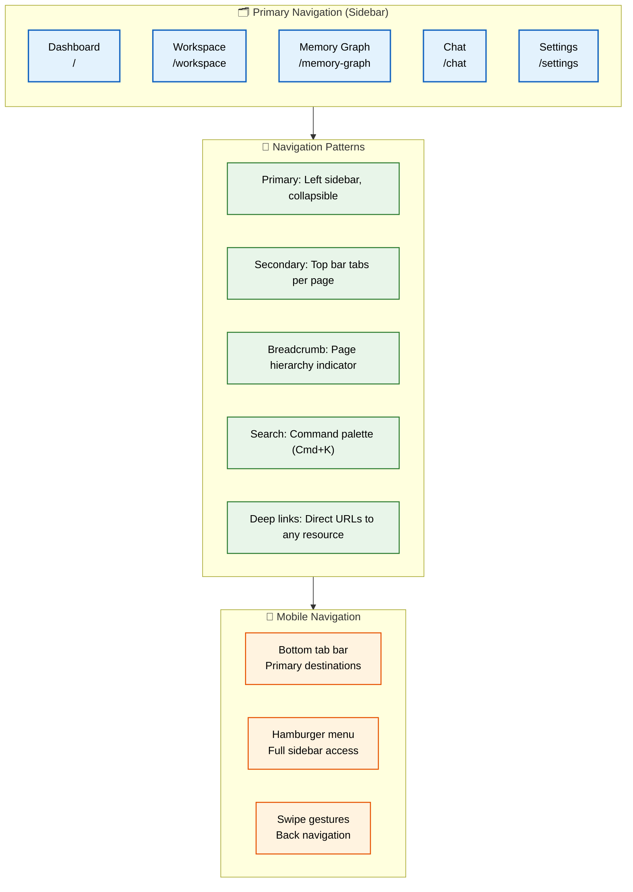
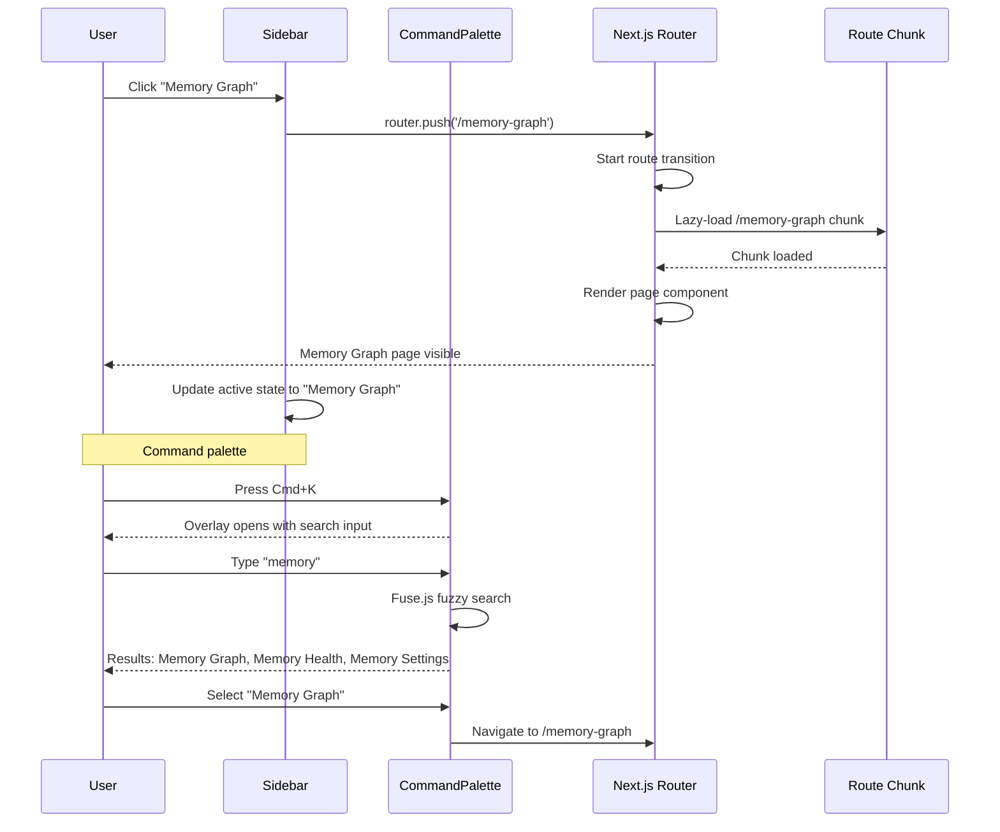

# Navigation

> **Purpose:** Define the navigation architecture for Meridian
> **Status:** ✅ Upgraded to enterprise quality
> **Owner:** Frontend Team
> **Last Updated:** 2026-07-13

## Navigation Architecture



> **Diagram:** Navigation architecture — **primary sidebar** (5 core routes) → **5 navigation patterns** (sidebar, tabs, breadcrumbs, command palette, deep links) → **mobile adaptation** (bottom tab bar, hamburger menu, swipe gestures).

---

## Navigation Structure

```text
Sidebar (persistent across all pages)
├── Dashboard
├── Workspace
├── Memory Graph
├── Resume & Career
├── Jobs & Internships
├── Applications
├── Chat
├── Schedule
├── Connectors
├── History
└── Settings
```

## Navigation Patterns

| Pattern | Implementation |
|---------|---------------|
| Primary navigation | Left sidebar, collapsible |
| Secondary navigation | Top bar tabs within pages |
| Breadcrumb | Page hierarchy indicator |
| Search | Command palette (Cmd+K) |
| Deep links | Direct URLs to any resource |

## Breadcrumb Convention

```text
Dashboard > Resume > Variant: Google SDE
Workspace > Career > Resume
Chat > Memory Agent
```

## Mobile Navigation

- Bottom tab bar for primary destinations
- Hamburger menu for full sidebar
- Swipe gestures for back navigation

## Common Mistakes

| Mistake | Why It's a Problem |
|---------|-------------------|
| Too many items in the primary navigation | A sidebar with 15 links overwhelms users; group related pages (Jobs, Applications, Resume) under section headers |
| Broken or missing deep-link support | Users should be able to bookmark any page and return to it — deep links are essential for sharing and returning to a specific view |
| No active state indication | Users who don't know which page they're on get lost; the active nav item must be visually distinct from inactive items |
| Missing breadcrumb navigation on content-heavy pages | Breadcrumbs provide context for how the current page fits into the overall structure — particularly important in multi-level pages like Workspace |

## Best Practices

| Practice | Rationale |
|----------|-----------|
| Keep the sidebar persistent and collapsible | A persistent sidebar gives users constant orientation; collapsible mode frees screen space for content when needed |
| Support keyboard shortcuts for common navigation | Cmd+K for command palette, Cmd+B for sidebar toggle — power users navigate faster and appreciate keyboard-first design |
| Encode page state in URL search params | Filter selections, active tabs, and sidebar state should be reflected in the URL — users can share links with their exact view |
| Use responsive navigation patterns per device | Mobile gets a bottom tab bar (thumb zone), tablet gets a hamburger, desktop gets a full sidebar — each form factor has different ergonomics |

## Security

| Concern | Mitigation |
|---------|------------|
| Role-based nav item visibility | Navigation items for admin or enterprise features must be conditionally rendered based on user role — never just hidden with CSS |
| Protected routes with server-side checks | Client-side route guards are insufficient; every protected route must verify permissions server-side (Next.js middleware or API layer) |
| Breadcrumb path information leakage | Breadcrumbs that reveal internal folder structures or system architecture should be validated against user permissions before display |

## Performance

| Concern | Guideline |
|---------|-----------|
| Lazy-load route chunks with Next.js App Router | Each route should load independently — navigating from Dashboard to Memory Graph should only download the Memory Graph bundle, not the entire application |
| Prefetch likely navigation targets | Use Next.js `prefetch={true}` on primary navigation items (workspace, dashboard) — the browser preloads these routes when the link enters the viewport |
| Sidebar data as static props | Navigation items rarely change — fetch them server-side and pass as static props rather than triggering a client-side query on every page load |

## Security Considerations

| Concern | Mitigation |
|---------|------------|
| Role-based nav item visibility | Navigation items for admin or enterprise features must be conditionally rendered based on user role — never just hidden with CSS |
| Protected routes with server-side checks | Client-side route guards are insufficient; every protected route must verify permissions server-side (Next.js middleware or API layer) |
| Breadcrumb path information leakage | Breadcrumbs that reveal internal folder structures or system architecture should be validated against user permissions before display |

## Performance Considerations

| Concern | Approach |
|---------|----------|
| Lazy-load route chunks with Next.js App Router | Each route should load independently — navigating from Dashboard to Memory Graph should only download the Memory Graph bundle |
| Prefetch likely navigation targets | Use Next.js `prefetch={true}` on primary navigation items (workspace, dashboard) — the browser preloads these routes when the link enters the viewport |
| Sidebar data as static props | Navigation items rarely change — fetch them server-side and pass as static props rather than triggering a client-side query on every page load |

## Components

| Component | Responsibility | Technology | Scale Strategy |
|-----------|---------------|------------|----------------|
| Sidebar | Primary navigation with collapsible sections | Next.js App Router + React Context | Singleton; section items loaded via server component, user role filtered |
| CommandPalette | Cmd+K search and quick navigation | CMDK + Fuse.js fuzzy search | Singleton; searches across pages, documents, agents, and recent items |
| BreadcrumbTrail | Hierarchical page context indicator | React + URL path parsing | Instance per content page; depth from URL segments |
| BottomTabBar | Mobile primary destinations | React Navigation (mobile) | Mobile-only; 4 tabs + FAB for quick actions |

## Workflows

1. **User navigates via sidebar**: User clicks "Memory Graph" in sidebar → Next.js prefetches `/memory-graph` route → router.push triggers transition → new page code-split chunk loads → page content appears (250ms transition) → sidebar active state updates
2. **Command palette search**: User presses Cmd+K → overlay opens with search input → focus auto-placed in input → user types query → Fuse.js filters across pages, documents, agents, recent items → top 5 results shown → Enter navigates to selected result
3. **Breadcrumb navigation**: User navigates to Workspace > Career > Resume > "Google SDE" → BreadcrumbTrail parses URL `/workspace/career/resume/variant-google-sde` → renders each segment as clickable link → user clicks "Career" → navigates to parent route
4. **Mobile bottom tab switch**: User taps "Dashboard" tab → tab navigator switches to dashboard stack → previous tab state preserved (keepAlive) → dashboard content loaded from cache → active tab indicator updates

## Sequence Diagrams



## Data Flow

1. **Ingestion**: Navigation structure defined in server component → fetched from `user_preferences` for custom sidebar order → role-based filtering applied server-side
2. **Processing**: URL parsed by Next.js App Router → route segment matched to navigation tree → active state computed from current path → breadcrumb segments extracted from URL params
3. **Storage**: Sidebar collapse state in localStorage → custom navigation preferences in user profile → route prefetch cache in Next.js client cache
4. **Retrieval**: Sidebar items rendered as server components → navigation data passed via props → no client-side queries for nav data
5. **Deletion**: User removes custom sidebar item → preference saved → sidebar re-renders without item

## Scalability

| Dimension | Current Limit | 10x Strategy | 100x Strategy |
|-----------|---------------|--------------|---------------|
| Sidebar navigation items | 12 | Grouped sections with collapse/expand; search within sidebar | AI-suggested navigation based on user role and usage patterns |
| Command palette search index | 500 items | Client-side index with 50ms search time; 5000 items with Web Workers | Server-side search with instant results via edge function |
| Breadcrumb depth | 5 levels | Truncate with ellipsis for deep paths; show full path on hover | Dynamic breadcrumb that adapts to user's navigation history |
| Route prefetch concurrency | 3 (Next.js default) | Prefetch top-5 most-visited routes per user based on analytics | Predictive prefetching based on user behavior ML model |

## Error Handling

| Scenario | Detection | Mitigation | Recovery |
|----------|-----------|------------|----------|
| Route chunk fails to load | Dynamic import throws error | Show error boundary with retry button; log chunk path to Sentry | Clear chunk cache; reload from server |
| Command palette search index creation fails | Fuse.js build throws | Fall back to simple string.includes search | Retry index build on next open; log failure |
| Breadcrumb path contains invalid segment | URL param doesn't match known route | Hide invalid segment; show nearest valid parent | Log to analytics for navigation structure audit |
| Mobile tab state lost on memory pressure | React Navigation drops inactive screens from cache | Re-render tab with stored scroll position from sessionStorage | User scrolls to previous position (last-remembered offset) |

## Monitoring

| Metric | Alert Threshold | Severity | Dashboard |
|--------|----------------|----------|-----------|
| Route transition time (p95) | > 500ms | Warning | Grafana — Web Vitals (INP) |
| Command palette search latency | > 100ms | Warning | Grafana — Performance Dashboard |
| Chunk load failure rate | > 0.1% | Critical | Sentry — Route Chunk Errors |
| Navigation click-to-paint (p95) | > 300ms | Warning | Grafana — Interaction to Next Paint |

## Risks

| Risk | Likelihood | Impact | Mitigation |
|------|------------|--------|------------|
| Deep link changes break existing bookmarks | Low | High | Implement redirects for old paths; maintain URL compatibility layer |
| Sidebar customization leads to confusion | Medium | Low | Default layout is always restorable; "Reset navigation" button in Settings |
| Mobile tab caching causes stale data | Medium | Medium | Stale-while-revalidate for tab content; pull-to-refresh gesture |
| Over-prefetching wastes user bandwidth | Medium | Low | Limit prefetch to 3 routes; respect data-saver mode via `navigator.connection` |

## Limitations

| Limitation | Impact | Workaround | Future Resolution |
|------------|--------|------------|-------------------|
| Next.js App Router only prefetches links in viewport | Deep sidebar items below fold not prefetched | Scroll-aware prefetch; prioritize top-5 items by visit frequency | Background prefetch worker that learns user patterns |
| Command palette requires client-side Fuse.js index | Larger index increases bundle size | Lazy-load search worker on first Cmd+K press | Server-side search endpoint with streaming results |
| Mobile tab caching is OS memory-dependent | iOS may drop tabs under memory pressure | Persist scroll position in sessionStorage; restore on remount | Automatic state serialization to MMKV for instant restore |

## Overview

Meridian's navigation architecture is built on a persistent left sidebar that provides constant orientation across all 11 page routes, supplemented by secondary navigation patterns (tabs, breadcrumbs, command palette, deep links) that adapt to content depth and user expertise. The sidebar is collapsible on desktop and transforms to a hamburger menu on mobile, ensuring consistent access regardless of viewport size.

The navigation system is designed for Meridian's information-dense workflows. Breadcrumbs provide context in the deeply nested Workspace page structure (Workspace > Career > Resume > Google SDE variant). The command palette (Cmd+K) enables power users to jump to any page, document, or agent without clicking through menus. Deep links allow users to bookmark any specific resource — a particular memory graph entity, a chat conversation with an agent, or a filtered job search.

Route transitions use Next.js App Router's automatic code splitting, ensuring that navigating from Dashboard to Memory Graph only loads the Memory Graph JavaScript bundle. Primary navigation items are prefetched when they enter the viewport, making navigation feel instant. Active state indicators in the sidebar and breadcrumbs always reflect the current route, preventing user disorientation.

For mobile users, navigation switches to a bottom tab bar with the four primary destinations (Dashboard, Workspace, Chat, Notifications) plus a floating action button for quick uploads. This thumb-zone-optimized pattern is standard for mobile apps and minimizes reach effort on larger phones.

## Goals

- Achieve sub-300ms route transition time (p95) through lazy-loaded code chunks and prefetching
- Enable full keyboard navigation with Cmd+K command palette for all 11 routes
- Support deep-link navigation to any resource — documents, entities, chats, or filtered views
- Maintain persistent sidebar state (collapse, scroll position) across sessions
- Adapt navigation to all form factors: sidebar on desktop, bottom tabs on mobile

## Scope

### In Scope
- Primary sidebar with 11 navigable routes, collapsible sections, and role-based item visibility
- Breadcrumb trail for multi-level content pages (Workspace, Settings)
- Command palette (Cmd+K) with Fuse.js fuzzy search across pages, documents, agents, and recent items
- Deep-link URLs for every resource type with Next.js App Router route matching
- Responsive navigation: persistent sidebar (desktop), hamburger menu (tablet), bottom tab bar (mobile)

### Out of Scope
- Predictive route prefetching based on ML user behavior model (future improvement)
- Customizable sidebar sections per workspace (future improvement)
- Voice navigation for hands-free agent interaction (future improvement)
- Visual sitemap or navigation overview page (future improvement)

## Examples

### Sidebar Configuration with Role-Based Filtering

```tsx
const NAV_ITEMS: NavItem[] = [
  { href: '/', label: 'Dashboard', icon: LayoutDashboard },
  { href: '/workspace', label: 'Workspace', icon: Files },
  { href: '/memory-graph', label: 'Memory Graph', icon: Network },
  { href: '/resume', label: 'Resume & Career', icon: FileText, roles: ['user', 'premium'] },
  { href: '/settings', label: 'Settings', icon: Settings, roles: ['user', 'admin'] },
  { href: '/admin', label: 'Admin Panel', icon: Shield, roles: ['admin'] },
];

function Sidebar({ userRole }: { userRole: string }) {
  const pathname = usePathname();

  return (
    <nav className="sidebar" aria-label="Primary navigation">
      {NAV_ITEMS.filter(item => !item.roles || item.roles.includes(userRole)).map(item => (
        <Link
          key={item.href}
          href={item.href}
          className={`nav-item ${pathname === item.href ? 'active' : ''}`}
          aria-current={pathname === item.href ? 'page' : undefined}
        >
          <item.icon aria-hidden="true" />
          <span>{item.label}</span>
        </Link>
      ))}
    </nav>
  );
}
```

### Command Palette Hook

```typescript
import { useCallback, useState } from 'react';
import Fuse from 'fuse.js';

interface SearchResult {
  label: string;
  href: string;
  category: 'page' | 'document' | 'agent' | 'recent';
}

const fuse = new Fuse(SEARCH_INDEX, { keys: ['label', 'keywords'], threshold: 0.4 });

function useCommandPalette() {
  const [isOpen, setIsOpen] = useState(false);
  const [results, setResults] = useState<SearchResult[]>([]);

  const search = useCallback((query: string) => {
    setResults(fuse.search(query).slice(0, 5).map(r => r.item));
  }, []);

  useEffect(() => {
    const handler = (e: KeyboardEvent) => {
      if ((e.metaKey || e.ctrlKey) && e.key === 'k') {
        e.preventDefault();
        setIsOpen(open => !open);
      }
    };
    window.addEventListener('keydown', handler);
    return () => window.removeEventListener('keydown', handler);
  }, []);

  return { isOpen, setIsOpen, results, search };
}
```

---

| Improvement | Priority | Complexity | Timeline |
|-------------|----------|------------|----------|
| Predictive route prefetching based on ML user model | High | High | Q3 2027 |
| Server-side command palette with instant edge search | Medium | Medium | Q2 2027 |
| Customizable sidebar sections per workspace | Medium | Low | Q1 2027 |
| Voice navigation for hands-free agent interaction | Low | High | Q4 2027 |

## Related Documents

- [UI Architecture.md](./UI-Architecture.md)
- [Frontend Architecture.md](./Frontend-Architecture.md)
- [`/Docs/Meridian-Complete-Documentation.md#8-screens`](../../Docs/Meridian-Complete-Documentation.md#8-screens)
