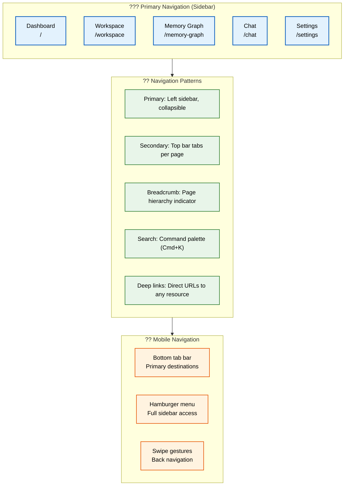
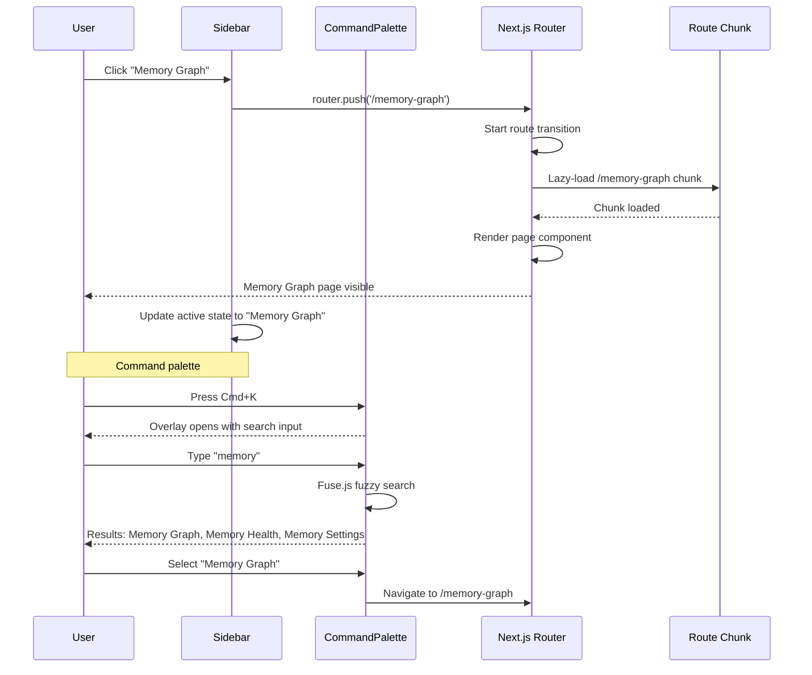

# Navigation

> **Purpose:** Define the navigation architecture, patterns, and responsive behavior for Vaeloom
> **Status:** ? Upgraded to enterprise quality
> **Owner:** Frontend Team
> **Version:** 2.0
> **Last Updated:** 2026-07-17
> **Dependencies:** UI-Architecture.md, Frontend-Architecture.md, Responsive-Design.md, Mobile-Architecture.md
> **Implementation Status:** ?? Spec Only
> **Review Checklist:** Standard
> **Canonical source:** [`/docs/Vaeloom-Complete-Documentation.md#8-screens`](../../docs/Vaeloom-Complete-Documentation.md#8-screens)

## Overview

Vaeloom's navigation architecture is built on a persistent left sidebar that provides constant orientation across all 11 page routes, supplemented by secondary navigation patterns (tabs, breadcrumbs, command palette, deep links) that adapt to content depth and user expertise. The sidebar is collapsible on desktop and transforms to a hamburger menu on mobile, ensuring consistent access regardless of viewport size.

The navigation system is designed for Vaeloom's information-dense workflows. Breadcrumbs provide context in the deeply nested Workspace page structure (Workspace > Career > Resume > Google SDE variant). The command palette (Cmd+K) enables power users to jump to any page, document, or agent without clicking through menus. Deep links allow users to bookmark any specific resource — a particular memory graph entity, a chat conversation with an agent, or a filtered job search.

**Audience:** Frontend engineers implementing navigation components, UX designers validating information architecture, QA engineers testing route transitions. **System fit:** Navigation is the primary user orientation mechanism, wrapping all page content and providing consistent access across form factors. **Why it matters:** Good navigation reduces user disorientation, enables power-user workflows through keyboard shortcuts, and ensures accessibility across desktop and mobile.

## Goals

- Achieve sub-300ms route transition time (p95) through lazy-loaded code chunks and prefetching
- Enable full keyboard navigation with Cmd+K command palette for all 11 routes
- Support deep-link navigation to any resource — documents, entities, chats, or filtered views
- Maintain persistent sidebar state (collapse, scroll position) across sessions
- Adapt navigation to all form factors: sidebar on desktop, bottom tabs on mobile

## Scope

| In Scope | Out of Scope |
|----------|--------------|
| Primary sidebar with 11 navigable routes, collapsible sections, and role-based item visibility | Predictive route prefetching based on ML user behavior model |
| Breadcrumb trail for multi-level content pages (Workspace, Settings) | Customizable sidebar sections per workspace |
| Command palette (Cmd+K) with Fuse.js fuzzy search across pages, documents, agents, and recent items | Voice navigation for hands-free agent interaction |
| Deep-link URLs for every resource type with Next.js App Router route matching | Visual sitemap or navigation overview page |
| Responsive navigation: persistent sidebar (desktop), hamburger menu (tablet), bottom tab bar (mobile) | Third-party navigation analytics integration |

## Functional Requirements

| ID | Requirement | Priority |
|----|-------------|----------|
| FR-001 | Sidebar shall be persistent and collapsible across all pages | P0 |
| FR-002 | Every route shall have a unique deep-link URL with Next.js App Router | P0 |
| FR-003 | Command palette (Cmd+K) shall search across pages, documents, agents, and recent items | P1 |
| FR-004 | Navigation items shall be conditionally rendered based on user role — never hidden with CSS | P0 |
| FR-005 | Active navigation state shall be visually distinct and reflect current route | P0 |
| FR-006 | Mobile navigation shall use bottom tab bar with thumb-zone-optimized placement | P1 |

## Non-Functional Requirements

| ID | Requirement | Target | Measurement |
|----|-------------|--------|-------------|
| NFR-001 | Route transition time (p95) | < 300ms | Interaction to Next Paint (INP) |
| NFR-002 | Command palette search latency | < 100ms | Performance API timing |
| NFR-003 | Chunk load failure rate | < 0.1% | Sentry route chunk error tracking |
| NFR-004 | Sidebar collapse state persistence across sessions | 100% | localStorage reads on mount |
| NFR-005 | Navigation click-to-paint (p95) | < 300ms | Web Vitals — INP |

## Architecture



> **Diagram:** Navigation architecture — **primary sidebar** (5 core routes) ? **5 navigation patterns** (sidebar, tabs, breadcrumbs, command palette, deep links) ? **mobile adaptation** (bottom tab bar, hamburger menu, swipe gestures).

## Components

| Component | Responsibility | Technology | Scale Strategy |
|-----------|---------------|------------|---------------|
| Sidebar | Primary navigation with collapsible sections | Next.js App Router + React Context | Singleton; section items loaded via server component, user role filtered |
| CommandPalette | Cmd+K search and quick navigation | CMDK + Fuse.js fuzzy search | Singleton; searches across pages, documents, agents, and recent items |
| BreadcrumbTrail | Hierarchical page context indicator | React + URL path parsing | Instance per content page; depth from URL segments |
| BottomTabBar | Mobile primary destinations | React Navigation (mobile) | Mobile-only; 4 tabs + FAB for quick actions |

## Workflows

1. **Sidebar Navigation**: User clicks "Memory Graph" in sidebar ? Next.js prefetches `/memory-graph` route ? `router.push` triggers transition ? New page code-split chunk loads ? Page content appears (~250ms transition) ? Sidebar active state updates to current route.

2. **Command Palette Search**: User presses Cmd+K ? Overlay opens with search input ? Focus auto-placed in input ? User types query ? Fuse.js filters across pages, documents, agents, recent items ? Top 5 results shown ? Enter navigates to selected result ? Overlay closes.

3. **Breadcrumb Navigation**: User navigates to Workspace > Career > Resume > "Google SDE" ? BreadcrumbTrail parses URL `/workspace/career/resume/variant-google-sde` ? Renders each segment as clickable link ? User clicks "Career" ? Navigates to parent route ? Breadcrumb updates.

4. **Mobile Bottom Tab Switch**: User taps "Dashboard" tab ? Tab navigator switches to dashboard stack ? Previous tab state preserved (keepAlive) ? Dashboard content loaded from cache ? Active tab indicator updates ? Scroll position restored from session storage.

## Sequence Diagrams



## Data Flow

1. **Ingestion**: Navigation structure defined in server component ? Fetched from `user_preferences` for custom sidebar order ? Role-based filtering applied server-side ? Final navigation tree passed to layout.

2. **Processing**: URL parsed by Next.js App Router ? Route segment matched to navigation tree ? Active state computed from current path ? Breadcrumb segments extracted from URL params ? Command palette index built from registered routes and user data.

3. **Storage**: Sidebar collapse state persisted in localStorage ? Custom navigation preferences stored in user profile ? Route prefetch cache managed by Next.js client cache ? Command palette index held in memory.

4. **Retrieval**: Sidebar items rendered as server components ? Navigation data passed via props ? Active state computed from `usePathname()` ? Breadcrumb segments rendered from URL segments ? No client-side queries for nav data.

5. **Deletion**: User removes custom sidebar item ? Preference saved ? Sidebar re-renders without item ? Command palette index rebuilt ? Old deep links return 404 with redirect guidance.

## APIs

N/A — Navigation is a client-side UI concern that operates within the Next.js App Router. Navigation data (sidebar items, preferences) is managed through server components and user preferences API, not dedicated navigation endpoints.

## Database

N/A — Navigation data is not persisted in a database. Sidebar state uses localStorage; user navigation preferences are stored in the user profile through the user management API. Route definitions are static code in the Next.js App Router.

## Security

| Concern | Mitigation |
|---------|------------|
| Role-based nav item visibility | Navigation items for admin or enterprise features must be conditionally rendered based on user role — never just hidden with CSS |
| Protected routes with server-side checks | Client-side route guards are insufficient; every protected route must verify permissions server-side (Next.js middleware or API layer) |
| Breadcrumb path information leakage | Breadcrumbs that reveal internal folder structures or system architecture should be validated against user permissions before display |

## Performance

| Concern | Budget | Measurement | Optimization |
|---------|--------|-------------|--------------|
| Route transition time | < 300ms p95 | Interaction to Next Paint (INP) | Lazy-load route chunks; prefetch links entering viewport |
| Command palette search latency | < 100ms | Performance API | Client-side Fuse.js index with 50ms search time; Web Workers for 5000+ items |
| Sidebar render time | < 100ms | React DevTools profiler | Fetch sidebar data as static props; avoid client-side nav queries |
| Chunk load failure | < 0.1% | Sentry chunk error tracking | Preload critical chunks; cache chunks with service worker |

## Scalability

| Dimension | Current Limit | 10x Strategy | 100x Strategy |
|-----------|--------------|--------------|---------------|
| Sidebar navigation items | 12 | Grouped sections with collapse/expand; search within sidebar | AI-suggested navigation based on user role and usage patterns |
| Command palette search index | 500 items | Client-side index with 50ms search time; 5000 items with Web Workers | Server-side search with instant results via edge function |
| Breadcrumb depth | 5 levels | Truncate with ellipsis for deep paths; show full path on hover | Dynamic breadcrumb that adapts to user's navigation history |
| Route prefetch concurrency | 3 (Next.js default) | Prefetch top-5 most-visited routes per user based on analytics | Predictive prefetching based on user behavior ML model |

## Error Handling

| Scenario | Detection | Mitigation | Recovery |
|----------|-----------|------------|----------|
| Route chunk fails to load | Dynamic import throws error | Show error boundary with retry button; log chunk path to Sentry | Clear chunk cache; reload from server |
| Command palette search index creation fails | Fuse.js build throws | Fall back to simple string.includes search | Retry index build on next open; log failure |
| Breadcrumb path contains invalid segment | URL param doesn't match known route | Hide invalid segment; show nearest valid parent | Log to analytics for navigation structure audit |
| Mobile tab state lost on memory pressure | React Navigation drops inactive screens from cache | Re-render tab with stored scroll position from sessionStorage | User scrolls to previous position (last-remembered offset) |

## Monitoring

| Metric | Alert Threshold | Severity | Dashboard |
|--------|----------------|----------|-----------|
| Route transition time (p95) | > 500ms | Warning | Grafana — Web Vitals (INP) |
| Command palette search latency | > 100ms | Warning | Grafana — Performance Dashboard |
| Chunk load failure rate | > 0.1% | Critical | Sentry — Route Chunk Errors |
| Navigation click-to-paint (p95) | > 300ms | Warning | Grafana — Interaction to Next Paint |

## Deployment

| Environment | Strategy | Rollback | Notes |
|-------------|----------|----------|-------|
| Development | Vercel preview per PR branch | Automatic on CI failure | Navigation changes validated with visual regression tests |
| Staging | Auto-deploy from `develop` branch | Manual rollback via Vercel | Route structure changes tested against staging API |
| Production | Auto-deploy from `main` branch | Instant rollback to previous version | URL changes require redirect map update; old deep links preserved |

## Configuration

| Variable | Purpose | Default | Required |
|----------|---------|---------|----------|
| NAV_SIDEBAR_DEFAULT_COLLAPSED | Initial sidebar state on first visit | false | No |
| NAV_COMMAND_PALETTE_ENABLED | Enable Cmd+K command palette feature | true | No |
| NAV_PREFETCH_COUNT | Number of routes to prefetch | 3 | No |
| NAV_BREADCRUMB_MAX_DEPTH | Maximum breadcrumb segments before truncation | 5 | No |
| NAV_MOBILE_TAB_KEEP_ALIVE | Preserve mobile tab state on switch | true | No |

## Examples

### Sidebar Configuration with Role-Based Filtering

```tsx
const NAV_ITEMS: NavItem[] = [
  { href: '/', label: 'Dashboard', icon: LayoutDashboard },
  { href: '/workspace', label: 'Workspace', icon: Files },
  { href: '/memory-graph', label: 'Memory Graph', icon: Network },
  { href: '/resume', label: 'Resume & Career', icon: FileText, roles: ['user', 'premium'] },
  { href: '/settings', label: 'Settings', icon: Settings, roles: ['user', 'admin'] },
  { href: '/admin', label: 'Admin Panel', icon: Shield, roles: ['admin'] },
];

function Sidebar({ userRole }: { userRole: string }) {
  const pathname = usePathname();

  return (
    <nav className="sidebar" aria-label="Primary navigation">
      {NAV_ITEMS.filter(item => !item.roles || item.roles.includes(userRole)).map(item => (
        <Link
          key={item.href}
          href={item.href}
          className={`nav-item ${pathname === item.href ? 'active' : ''}`}
          aria-current={pathname === item.href ? 'page' : undefined}
        >
          <item.icon aria-hidden="true" />
          <span>{item.label}</span>
        </Link>
      ))}
    </nav>
  );
}
```

### Command Palette Hook

```typescript
import { useCallback, useState } from 'react';
import Fuse from 'fuse.js';

interface SearchResult {
  label: string;
  href: string;
  category: 'page' | 'document' | 'agent' | 'recent';
}

const fuse = new Fuse(SEARCH_INDEX, { keys: ['label', 'keywords'], threshold: 0.4 });

function useCommandPalette() {
  const [isOpen, setIsOpen] = useState(false);
  const [results, setResults] = useState<SearchResult[]>([]);

  const search = useCallback((query: string) => {
    setResults(fuse.search(query).slice(0, 5).map(r => r.item));
  }, []);

  useEffect(() => {
    const handler = (e: KeyboardEvent) => {
      if ((e.metaKey || e.ctrlKey) && e.key === 'k') {
        e.preventDefault();
        setIsOpen(open => !open);
      }
    };
    window.addEventListener('keydown', handler);
    return () => window.removeEventListener('keydown', handler);
  }, []);

  return { isOpen, setIsOpen, results, search };
}
```

### Breadcrumb Trail Component

```tsx
function BreadcrumbTrail() {
  const pathname = usePathname();
  const segments = pathname.split('/').filter(Boolean);

  return (
    <nav aria-label="Breadcrumb" className="breadcrumb">
      <Link href="/">Home</Link>
      {segments.map((segment, index) => {
        const href = '/' + segments.slice(0, index + 1).join('/');
        const isLast = index === segments.length - 1;
        return (
          <span key={segment}>
            <span aria-hidden="true" className="separator">/</span>
            {isLast ? (
              <span aria-current="page">{formatLabel(segment)}</span>
            ) : (
              <Link href={href}>{formatLabel(segment)}</Link>
            )}
          </span>
        );
      })}
    </nav>
  );
}
```

## Best Practices

| # | Practice | Rationale |
|---|----------|----------|
| 1 | Keep the sidebar persistent and collapsible | A persistent sidebar gives users constant orientation; collapsible mode frees screen space for content when needed |
| 2 | Support keyboard shortcuts for common navigation | Cmd+K for command palette, Cmd+B for sidebar toggle — power users navigate faster and appreciate keyboard-first design |
| 3 | Encode page state in URL search params | Filter selections, active tabs, and sidebar state should be reflected in the URL — users can share links with their exact view |
| 4 | Use responsive navigation patterns per device | Mobile gets a bottom tab bar (thumb zone), tablet gets a hamburger, desktop gets a full sidebar — each form factor has different ergonomics |
| 5 | Validate breadcrumb segments against user permissions | Never show breadcrumb paths to resources the user cannot access — this prevents information leakage |

## Risks

| Risk | Likelihood | Impact | Mitigation |
|------|------------|--------|------------|
| Deep link changes break existing bookmarks | Low | High | Implement redirects for old paths; maintain URL compatibility layer |
| Sidebar customization leads to confusion | Medium | Low | Default layout is always restorable; "Reset navigation" button in Settings |
| Mobile tab caching causes stale data | Medium | Medium | Stale-while-revalidate for tab content; pull-to-refresh gesture |
| Over-prefetching wastes user bandwidth | Medium | Low | Limit prefetch to 3 routes; respect data-saver mode via `navigator.connection` |

## Limitations

| Limitation | Impact | Workaround | Future Resolution |
|------------|--------|------------|-------------------|
| Next.js App Router only prefetches links in viewport | Deep sidebar items below fold not prefetched | Scroll-aware prefetch; prioritize top-5 items by visit frequency | Background prefetch worker that learns user patterns |
| Command palette requires client-side Fuse.js index | Larger index increases bundle size | Lazy-load search worker on first Cmd+K press | Server-side search endpoint with streaming results |
| Mobile tab caching is OS memory-dependent | iOS may drop tabs under memory pressure | Persist scroll position in sessionStorage; restore on remount | Automatic state serialization to MMKV for instant restore |
| Breadcrumb truncation at max depth | Deeply nested routes lose context | Show full path on hover tooltip | Dynamic depth based on available viewport width |

## Future Improvements

| Improvement | Priority | Complexity | Timeline |
|-------------|----------|------------|----------|
| Predictive route prefetching based on ML user model | High | High | Q3 2027 |
| Server-side command palette with instant edge search | Medium | Medium | Q2 2027 |
| Customizable sidebar sections per workspace | Medium | Low | Q1 2027 |
| Voice navigation for hands-free agent interaction | Low | High | Q4 2027 |
| Visual sitemap and navigation overview page | Low | Low | Q4 2026 |

## Related Documents

- [Frontend Architecture.md](./Frontend-Architecture.md)
- [UI Architecture.md](./UI-Architecture.md)
- [Responsive Design.md](./Responsive-Design.md)
- [Mobile Architecture.md](./Mobile-Architecture.md)
- [UX Guidelines.md](./UX-Guidelines.md)
- [Design System.md](./Design-System.md)
- [Component Library.md](./Component-Library.md)
- [State Management.md](./State-Management.md)
- [Theme System.md](./Theme-System.md)
- [Internationalization.md](./Internationalization.md)
- [Forms.md](./Forms.md)
- [Dashboard.md](./Dashboard.md)
- [Charts.md](./Charts.md)
- [Animation System.md](./Animation-System.md)
- [Accessibility.md](./Accessibility.md)
- [Accessibility Audit.md](./Accessibility-Audit.md)
- [`/docs/Vaeloom-Complete-Documentation.md#8-screens`](../../docs/Vaeloom-Complete-Documentation.md#8-screens)
