# Responsive Design

> **Purpose:** Define the responsive design strategy for Vaeloom
> **Status:** 🆕 New

## Responsive Architecture

```mermaid
graph TD
    classDef bp fill:#e3f2fd,stroke:#1565c0,color:#000,stroke-width:2px
    classDef layout fill:#e8f5e9,stroke:#2e7d32,color:#000,stroke-width:1.5px
    classDef interaction fill:#fff3e0,stroke:#e65100,color:#000,stroke-width:1.5px

    subgraph Breakpoints["📐 Breakpoints"]
        B1["Mobile: 0px<br/>Phones (portrait)"]
        B2["Tablet: 640px<br/>Phones (landscape), small tablets"]
        B3["Desktop: 1024px<br/>Laptops, desktops"]
        B4["Wide: 1440px<br/>Large desktops"]
    end

    subgraph LayoutAdaptation["🔄 Layout Adaptation"]
        L1["Sidebar: Hidden→Collapsible→Visible"]
        L2["Dashboard: 1 col→2 col→3-4 col"]
        L3["Workspace: Full→40/60→30/70 split"]
        L4["Tables: Card list→Compact→Full"]
        L5["Chat: Full screen→Side panel"]
    end

    subgraph Interaction["✋ Touch vs Mouse"]
        I1["Mobile: Tap, Swipe, Long-press+drag"]
        I2["Desktop: Hover+focus, Click+drag"]
        I3["Tooltips: Tap to show → Hover to show"]
    end

    Breakpoints --> LayoutAdaptation --> Interaction

    class B1,B2,B3,B4 bp
    class L1,L2,L3,L4,L5 layout
    class I1,I2,I3 interaction
```



> **Diagram:** Responsive design strategy — **4 breakpoints** (mobile 0px → wide 1440px) → **layout adaptation** per component (sidebar collapse, column grid, workspace split, table density) → **interaction patterns** vary between touch (tap, swipe, long-press) and mouse (hover, click, drag).

---

## Breakpoints

| Name | Min Width | Target Devices |
|------|-----------|---------------|
| Mobile | 0px | Phones (portrait) |
| Tablet | 640px | Phones (landscape), small tablets |
| Desktop | 1024px | Laptops, desktops |
| Wide | 1440px | Large desktops |

## Layout Adaptation

| Element | Mobile | Tablet | Desktop |
|---------|--------|--------|---------|
| Sidebar | Hidden (hamburger) | Collapsible | Visible |
| Dashboard | Single column | 2 columns | 3-4 columns |
| Workspace | Full-width viewer | Split (40/60) | Split (30/70) |
| Tables | Card list | Compact table | Full table |
| Chat | Full screen | Side panel | Side panel |

## Responsive Utilities

```css
/* Hide on mobile */
.hide-mobile {
  @media (max-width: 639px) { display: none; }
}

/* Show only on desktop */
.show-desktop {
  @media (max-width: 1023px) { display: none; }
}
```

## Touch vs Mouse

| Interaction | Mobile | Desktop |
|-------------|--------|---------|
| Hover states | Tap equivalent | Hover + focus |
| Swipe gestures | Supported | N/A |
| Drag & drop | Long-press + drag | Click + drag |
| Tooltips | Tap to show | Hover to show |

## Common Mistakes

| Mistake | Why It's a Problem |
|---------|-------------------|
| Testing only on desktop during development | Responsive issues discovered late in the cycle are expensive to fix; always develop with mobile-first CSS and test on real mobile devices |
| Touch targets smaller than 44x44px | Small touch targets frustrate users on mobile; WCAG 2.5.5 requires minimum 44px touch targets for all interactive elements |
| Horizontal scroll on any viewport width | Anything that causes horizontal scrolling (fixed-width elements, overflow tables, large images without max-width) breaks the UX instantly |
| Hiding content instead of adapting it | `display: none` on mobile removes content from accessibility tree; progressive disclosure (accordions, tabs) is better than hiding |

## Best Practices

| Practice | Rationale |
|----------|-----------|
| Mobile-first CSS with `min-width` breakpoints | Starting with the mobile layout and adding complexity at larger viewports produces cleaner, smaller CSS than desktop-first with overrides |
| Use CSS Grid and Flexbox for fluid layouts | Modern layout methods adapt content naturally; avoid float-based layouts and fixed pixel widths for content containers |
| Progressive enhancement for interactive features | Complex interactions (drag-and-drop, multi-select) should have a fallback for touch or narrow viewports |
| Test breakpoints on real devices, not just browser DevTools | Device emulation in DevTools is close but not identical to real device rendering — test on actual phones and tablets |

## Security

| Concern | Mitigation |
|---------|------------|
| UI redressing via responsive iframes | Ensure `X-Frame-Options: DENY` or CSP `frame-ancestors` is set — responsive designs often allow embedding which can be exploited |
| Viewport-based content filtering | Never expose or hide security-sensitive UI elements based on viewport size alone; responsive visibility is a presentation concern, not an access control |
| Mobile gesture interception | Custom swipe gestures should not override browser-native gestures (pull-to-refresh, back swipe) in ways that could confuse or trap users |

## Performance

| Concern | Guideline |
|---------|-----------|
| Responsive image loading with `srcset` and `sizes` | Serve appropriately sized images per viewport — a 2400px hero image on a 375px phone wastes ~2MB of bandwidth and slows page load by 1-3s |
| Conditional JavaScript loading per viewport | Heavy interactive components (knowledge graph, file viewer) should use dynamic imports gated by viewport — desktop-only features should not block mobile rendering |
| Debounce resize handlers | Layout recalculations on window resize should be debounced to 150-200ms; avoid continuous layout thrashing from unbatched resize events |

## Security Considerations

| Concern | Mitigation |
|---------|------------|
| UI redressing via responsive iframes | Ensure `X-Frame-Options: DENY` or CSP `frame-ancestors` is set — responsive designs often allow embedding which can be exploited |
| Viewport-based content filtering | Never expose or hide security-sensitive UI elements based on viewport size alone; responsive visibility is a presentation concern, not an access control |
| Mobile gesture interception | Custom swipe gestures should not override browser-native gestures (pull-to-refresh, back swipe) in ways that could confuse or trap users |

## Performance Considerations

| Concern | Approach |
|---------|----------|
| Responsive image loading with `srcset` and `sizes` | Serve appropriately sized images per viewport — a 2400px hero image on a 375px phone wastes ~2MB of bandwidth and slows page load by 1-3s |
| Conditional JavaScript loading per viewport | Heavy interactive components (knowledge graph, file viewer) should use dynamic imports gated by viewport — desktop-only features should not block mobile rendering |
| Debounce resize handlers | Layout recalculations on window resize should be debounced to 150-200ms; avoid continuous layout thrashing from unbatched resize events |

## Components

| Component | Responsibility | Technology | Scale Strategy |
|-----------|---------------|------------|----------------|
| ResponsiveContainer | Fluid wrapper that adapts to viewport | CSS Grid + Tailwind breakpoints | Reusable; applies grid columns based on min-width breakpoints |
| AdaptiveSidebar | Collapsible sidebar per viewport | React + useMediaQuery | Instance per layout; mobile hidden, tablet collapsible, desktop always visible |
| TouchTooltip | Tooltip that adapts to touch vs mouse | React + pointer media query | Instance per tooltip anchor; tap-to-show on mobile, hover on desktop |
| CardGrid | Responsive card layout with auto-fill | CSS Grid auto-fill + minmax() | Generic; configurable min column width and gap via props |

## Workflows

1. **Viewport change triggers layout shift**: User resizes browser from 1200px to 800px → `matchMedia` listener fires → sidebar switches from visible to collapsible → dashboard grid goes from 3-col to 2-col → tables switch to card layout → all without page reload
2. **Mobile-first page load**: Phone loads dashboard → base CSS (mobile) renders single column → `min-width: 640px` media query activates for tablet → no elements hidden via `display:none` — content adapts progressively
3. **Touch vs mouse detection**: User taps tooltip on mobile → `hover: none` matches → tooltip shows on tap → user taps elsewhere → tooltip dismisses → on desktop, tooltip shows on hover over element
4. **Responsive image selection**: Browser loads page → `<picture>` element evaluates `min-width` media queries → 375px viewport gets `hero-mobile.jpg` (800px wide) → 1440px viewport gets `hero-desktop.jpg` (2400px wide)

## Sequence Diagrams

```mermaid
sequenceDiagram
    participant U as User
    participant B as Browser
    participant MQ as matchMedia Listener
    participant C as Component
    participant L as Layout Engine

    U->>B: Resize from 1200px to 800px
    B->>MQ: min-width: 1024px → no longer matches
    MQ->>C: Sidebar → collapsible mode
    MQ->>C: Dashboard grid → 2 columns
    MQ->>C: Tables → card list layout
    C->>L: Recalculate layout
    L-->>U: Updated responsive layout

    Note over U,B: Mobile touch interaction
    U->>B: Tap tooltip anchor
    B->>C: pointer: coarse (touch detected)
    C->>C: Show tooltip on tap
    U->>B: Tap elsewhere
    B->>C: Dismiss tooltip
```



## Data Flow

1. **Ingestion**: Viewport dimensions from `window.innerWidth` → `matchMedia` listeners evaluate breakpoint queries → responsive state computed once per change → React state updated via `useMediaQuery` hook
2. **Processing**: ResponsiveContainer reads grid column count from breakpoint → CSS Grid auto-fill computes column widths → images selected via `<picture>` element based on viewport width → conditional JS loads via dynamic imports
3. **Storage**: No persistent responsive state — all computed at runtime from viewport → last-known viewport cached in sessionStorage for orientation change recovery
4. **Retrieval**: CSS `@media` queries apply styles at render time → JS-based responsive hooks (useMediaQuery) trigger re-renders on breakpoint changes → layout engine recalculates
5. **Deletion**: Component unmount removes event listeners → ResizeObserver disconnected → media query listener cleanup

## Scalability

| Dimension | Current Limit | 10x Strategy | 100x Strategy |
|-----------|---------------|--------------|---------------|
| Breakpoints | 4 | 6 breakpoints (add 480px, 1280px) | Fluid typography and spacing without breakpoints |
| Viewport-dependent components | 8 per page | Dynamic component registry per viewport range | Singular responsive component with adaptive rendering |
| Image variants per asset | 2 (mobile + desktop) | 4 variants (mobile, tablet, desktop, wide) | Responsive images served via `image-set()` with AVIF/WebP |
| Touch vs mouse media query | `pointer: coarse` | Feature detection for stylus, trackpad, touch | Unified pointer abstraction layer |

## Error Handling

| Scenario | Detection | Mitigation | Recovery |
|----------|-----------|------------|----------|
| Viewport dimension not available (SSR) | `window` is undefined on server | Return default mobile layout; `matchMedia` not called | Client-side `useEffect` re-renders with correct layout |
| Image variant not found for current breakpoint | `<picture>` source fails | Fall back to default image; no broken image icon | Log missing image variant to analytics |
| Resize event flood causes layout thrash | Multiple resize events in 100ms | Debounce resize handler to 150ms | Cancel previous animation frame |
| Orientation change on mobile causes flash | Screen dimensions change abruptly | Smooth transitions via CSS `transition: grid-template-columns` | Use `orientationchange` event with 100ms debounce |

## Monitoring

| Metric | Alert Threshold | Severity | Dashboard |
|--------|----------------|----------|-----------|
| Layout shift (CLS) | > 0.1 | Critical | Grafana — Web Vitals |
| Responsive image bandwidth savings | < 30% reduction vs desktop images | Info | Grafana — Performance Budget |
| Layout recalculation time | > 10ms per resize | Warning | Chrome DevTools — Performance tab |
| Touch-to-show tooltip engagement | > 50% of users tap tooltip | Info | Amplitude — UX Analytics |

## Risks

| Risk | Likelihood | Impact | Mitigation |
|------|------------|--------|------------|
| New device form factor breaks layout assumptions | Medium | Medium | Test on real devices quarterly; use device lab |
| CSS Grid behavior differs across browsers | Low | Medium | Test in Chrome, Firefox, Safari; use @supports for fallbacks |
| Users with zoom > 200% encounter horizontal scroll | Medium | Low | Use `min-width: auto` on flex items; test at 200% zoom |
| Touch gesture conflicts with browser native gestures | Low | Medium | Use passive event listeners; test swipe vs scroll behavior |

## Limitations

| Limitation | Impact | Workaround | Future Resolution |
|------------|--------|------------|-------------------|
| Container queries not fully supported across all browsers | Responsive behavior tied to viewport, not container | Use CSS Grid `auto-fill` + `minmax()` for container-based adaptation | Container queries (shipped in Chrome/Firefox 2024, Safari 2025) |
| `useMediaQuery` causes client-side re-render | Layout flashes on hydration mismatch | Set initial state to match SSR guess (mobile-first) | Server-detect viewport via `Sec-CH-Viewport-Width` client hint |
| ResizeObserver loop limit exceeded | Complex layouts cause constant re-observation | Use `content-visibility: auto` to skip off-screen elements | ResizeObserver v2 with callback batching |

## Overview

Vaeloom's responsive design strategy ensures a consistent, functional experience across devices from 320px phones to 2560px ultrawide monitors. The system uses four breakpoints (mobile 0px, tablet 640px, desktop 1024px, wide 1440px) with mobile-first CSS using `min-width` media queries. Layout components adapt progressively — the sidebar collapses, dashboard grids reflow, tables convert to card lists, and chat shifts from full-screen to side panel.

The approach is mobile-first: the base CSS targets the smallest viewport, and additional complexity layers in at each breakpoint. This ensures users on any device get a functional experience without content hidden via `display: none`. Images use `srcset` and `sizes` attributes to serve appropriately sized files per viewport, preventing 2400px hero images from loading on 375px phones.

For Vaeloom's data-rich workflows, responsive adaptation is critical. The dashboard transitions from a 4-column grid on wide desktops to a single-column stack on phones, prioritizing the most important widgets. The workspace file viewer shifts from a side-by-side split on desktop to a full-width single-pane on mobile. Tables that show 10 columns on desktop become compact card lists showing only the 3 most important fields on mobile.

Touch interactions are handled separately from mouse interactions using pointer media queries. On touch devices, tooltips show on tap instead of hover, drag-and-drop requires long-press instead of click-drag, and swipe gestures enable back navigation. All interactive elements maintain minimum 44x44px touch targets as required by WCAG 2.5.5.

## Goals

- Achieve Cumulative Layout Shift (CLS) below 0.1 across all viewports
- Serve appropriately sized images per viewport with srcset, reducing mobile bandwidth by 50%+
- Maintain zero horizontal scroll on any viewport width for all page layouts
- Support full functionality at 200% browser zoom without layout breakage
- Ensure all touch targets meet minimum 44x44px size on mobile viewports

## Scope

### In Scope
- Four breakpoints: mobile (0px), tablet (640px), desktop (1024px), wide (1440px)
- Mobile-first CSS with `min-width` media queries for progressive enhancement
- Responsive components: sidebar (hidden→collapsible→visible), dashboard (1→2→3-4 columns), workspace (full→40/60→30/70 split), tables (card→compact→full), chat (full→side panel)
- Touch vs mouse interaction detection via `pointer: coarse` media query
- Responsive images with `<picture>`, `srcset`, and `sizes` attributes

### Out of Scope
- Container queries for component-level responsive design (future improvement when browser support reaches 95%)
- Device client hints for server-rendered responsive layouts (future improvement)
- AI-generated responsive image variants from master assets (future improvement)
- Adaptive density ML detection for touch vs mouse (future improvement)

## Examples

### Responsive Dashboard Grid

```tsx
function DashboardPage() {
  return (
    <div className="grid grid-cols-1 gap-4 tablet:grid-cols-2 desktop:grid-cols-3 wide:grid-cols-4">
      <WidgetGrid>
        <MemoryHealthWidget />
        <KnowledgeGrowthWidget />
        <ActiveApplicationsWidget />
        <UpcomingDeadlinesWidget />
      </WidgetGrid>
    </div>
  );
}
```

### Responsive Image with srcset

```tsx
function HeroImage({ src }: { src: string }) {
  return (
    <picture>
      <source
        media="(min-width: 1440px)"
        srcSet={`${src}-wide.webp 2400w, ${src}-wide@2x.webp 4800w`}
      />
      <source
        media="(min-width: 1024px)"
        srcSet={`${src}-desktop.webp 1600w, ${src}-desktop@2x.webp 3200w`}
      />
      <source
        media="(min-width: 640px)"
        srcSet={`${src}-tablet.webp 1024w`}
      />
      
    </picture>
  );
}
```

### Touch vs Mouse Tooltip

```tsx
function AdaptiveTooltip({ children, content }: { children: React.ReactNode; content: string }) {
  const isTouchDevice = window.matchMedia('(pointer: coarse)').matches;

  if (isTouchDevice) {
    return <TapTooltip content={content}>{children}</TapTooltip>;
  }

  return <HoverTooltip content={content}>{children}</HoverTooltip>;
}
```

---

| Improvement | Priority | Complexity | Timeline |
|-------------|----------|------------|----------|
| Container queries for component-level responsive design | High | Low | Q1 2027 |
| Device client hints for server-rendered responsive layouts | Medium | Medium | Q2 2027 |
| AI-generated responsive image variants from master asset | Medium | High | Q3 2027 |
| Adaptive density (touch vs mouse) ML detection | Low | High | Q4 2027 |

## Related Documents

- [UI Architecture.md](./UI-Architecture.md)
- [Frontend Architecture.md](./Frontend-Architecture.md)
- [Accessibility.md](./Accessibility.md)
