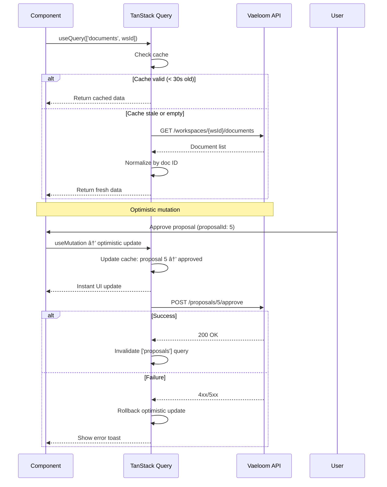

# State Management

> **Purpose:** Define state management strategy for Vaeloom frontend
> **Status:** 🆕 New

## State Architecture

```mermaid
graph TD
    classDef category fill:#e3f2fd,stroke:#1565c0,color:#000,stroke-width:2px
    classDef tech fill:#e8f5e9,stroke:#2e7d32,color:#000,stroke-width:1.5px
    classDef invalidate fill:#fff3e0,stroke:#e65100,color:#000,stroke-width:1.5px

    subgraph Categories["📦 State Categories"]
        C1["Server State<br/>Documents, agents, resumes<br/>TanStack Query"]
        C2["UI State<br/>Sidebar open, active tab<br/>React Context / useState"]
        C3["Form State<br/>Resume editor, settings<br/>React Hook Form"]
        C4["URL State<br/>Page, filter, search query<br/>Next.js search params"]
    end

    subgraph FetchPattern["📡 Data Fetching Pattern"]
        F1["useQuery({<br/>  queryKey: ['documents', workspaceId],<br/>  queryFn: () => fetch(...),<br/>  staleTime: 30s,<br/>  cacheTime: 5min<br/>})"]
    end

    subgraph Invalidation["🔄 Cache Invalidation Events"]
        I1["Document uploaded<br/>→ Invalidate 'documents'"]
        I2["Memory updated<br/>→ Invalidate 'memory' + 'dashboard'"]
        I3["Application submitted<br/>→ Invalidate 'applications'"]
        I4["Agent action approved<br/>→ Invalidate relevant queries"]
    end

    Categories --> FetchPattern --> Invalidation

    class C1,C2,C3,C4 category
    class F1 tech
    class I1,I2,I3,I4 invalidate
```



> **Diagram:** State management architecture — **4 state categories** (server → TanStack Query, UI → Context, form → React Hook Form, URL → Next.js params). **Data fetching pattern** uses TanStack Query with 30s stale time and 5min cache. **Cache invalidation** events trigger on document upload, memory update, application submission, and agent action approval.

---

## Strategy Overview

Vaeloom uses **TanStack Query** as the primary state management layer, with React Context for UI-level state only.

## State Categories

| Category | Technology | Examples |
|----------|------------|---------|
| Server state | TanStack Query | Documents, agents, resumes, jobs |
| UI state | React Context/useState | Sidebar open, active tab, modal state |
| Form state | React Hook Form | Resume editor, settings forms |
| URL state | Next.js search params | Page, filter, search query |

## Data Fetching Pattern

```typescript
// Example: Fetch documents with TanStack Query
function useDocuments(workspaceId: string) {
  return useQuery({
    queryKey: ['documents', workspaceId],
    queryFn: () => fetch(`/api/workspaces/${workspaceId}/documents`).then(r => r.json()),
    staleTime: 30_000, // 30 seconds
    cacheTime: 5 * 60_000, // 5 minutes
  })
}
```

## Cache Invalidation

| Event | Cache Invalidation |
|-------|-------------------|
| Document uploaded | Invalidate `documents` query |
| Memory updated | Invalidate `memory` + `dashboard` queries |
| Application submitted | Invalidate `applications` query |
| Agent action approved | Invalidate relevant queries |

## Common Mistakes

| Mistake | Why It's a Problem |
|---------|-------------------|
| Over-fetching data the component doesn't use | Every unused field returned by an API query adds payload size and parsing time; use GraphQL or field selectors to request only what's needed |
| Stale cache displaying outdated information | A cache that never invalidates shows users old data and erodes trust — always set appropriate `staleTime` and invalidate on mutations |
| No optimistic updates for common actions | Users expect instant feedback when approving a proposal or submitting a form; waiting for server confirmation feels sluggish |
| Putting UI state (sidebar open, modal visibility) in a global store | Global state stores become unmanageable when they hold transient UI concerns — keep UI state local with Context or component state |

## Best Practices

| Practice | Rationale |
|----------|-----------|
| Normalize cache data by entity ID | Storing `{ [workspaceId]: { [docId]: data } }` enables independent invalidation of single items without clearing entire collections |
| Tune `staleTime` per data type | Agent status (staleTime: 5s), documents (30s), settings (5min) — each data type has a different freshness requirement |
| Use mutation responses to update the cache | After a successful mutation, update the query cache with the response data rather than refetching — eliminates the refetch flash |
| Separate server state from UI state | TanStack Query owns server state; React Context owns UI state; React Hook Form owns form state — each has a single, clear owner |

## Security

| Concern | Mitigation |
|---------|------------|
| Sensitive data in URL search params | Avoid storing tokens, session IDs, or Personally Identifiable Information in URL query parameters — they are visible in browser history, referrer headers, and server logs |
| Client-side state exposing unauthorized data | Never load data from client-side cache without re-validating permissions — cached data may reflect a previous session with different access levels |
| Race conditions in optimistic updates | Optimistically updating state before server confirmation can temporarily display incorrect data; ensure rollback logic handles the case where the server rejects the mutation |

## Performance

| Concern | Guideline |
|---------|-----------|
| Cache-first strategy with background refetch | Return cached data immediately, then silently refresh in the background — users see instant UI while data stays fresh; use TanStack Query's `staleTime` + `refetchInterval` |
| Pagination and infinite scrolling | For lists larger than 50 items, use cursor-based pagination or virtual scrolling — loading 1000 items into the DOM at once causes significant layout and memory overhead |
| Query key structure for granular invalidation | Structured query keys (`['documents', workspaceId, { status: 'active' }]`) enable targeted invalidation — avoid broad `invalidateQueries()` calls that clear unrelated caches |

## Security Considerations

| Concern | Mitigation |
|---------|------------|
| Sensitive data in URL search params | Avoid storing tokens, session IDs, or PII in URL query parameters — they are visible in browser history, referrer headers, and server logs |
| Client-side state exposing unauthorized data | Never load data from client-side cache without re-validating permissions — cached data may reflect a previous session with different access levels |
| Race conditions in optimistic updates | Optimistically updating state before server confirmation can temporarily display incorrect data; ensure rollback logic handles server rejection |

## Performance Considerations

| Concern | Approach |
|---------|----------|
| Cache-first strategy with background refetch | Return cached data immediately, then silently refresh in the background — users see instant UI while data stays fresh |
| Pagination and infinite scrolling | For lists larger than 50 items, use cursor-based pagination or virtual scrolling — loading 1000 items into the DOM causes significant overhead |
| Query key structure for granular invalidation | Structured query keys (`['documents', workspaceId, { status: 'active' }]`) enable targeted invalidation — avoid broad `invalidateQueries()` calls |

## Components

| State Category | Technology | Scale Strategy | Key Example |
|---------------|------------|----------------|-------------|
| Server state | TanStack Query | Normalized cache by entity ID; paginated queries for lists | `useQuery(['documents', workspaceId], fn, { staleTime: 30s })` |
| UI state | React Context / useState | Kept local to component tree; never global | `useState` for sidebar open, active tab |
| Form state | React Hook Form | Scoped per form instance; `useFormContext` for nested forms | Resume editor with 50+ fields across 5 sections |
| URL state | Next.js searchParams | Single source of truth for page state; shareable URLs | `useSearchParams` for filters, page, search query |

## Workflows

1. **Server data fetch and cache**: Component mounts → `useQuery` checks cache → staleTime (30s) not exceeded → return cached data → if stale, background refetch → cache updated → UI re-renders
2. **Mutation with optimistic update**: User approves proposal → `useMutation` fires optimistic update → UI immediately shows approved state → `onSettled` invalidates related queries → on error, optimistic update rolled back → toast shows result
3. **Cache invalidation cascade**: Document uploaded → mutation `onSuccess` invalidates `['documents', workspaceId]` → also invalidates `['dashboard']` and `['memory', workspaceId]` → all dependent components refetch → UI refreshed
4. **Form state to server sync**: User edits resume → React Hook Form manages local state → 2s debounce → serializes changed fields → `useMutation` PATCH → server validates → response updates TanStack Query cache → form indicates "Saved"

## Sequence Diagrams



## Data Flow

1. **Ingestion**: User action triggers mutation → mutation function executes → optimistic update modifies cache → server receives request → server processes and responds
2. **Processing**: TanStack Query normalizes response data → merges with existing cache → deduplicates by entity ID → updates timestamps for staleTime tracking
3. **Storage**: Cache stored in memory as normalized JS object → persisted to sessionStorage for tab recovery → URL params stored in browser history
4. **Retrieval**: `useQuery` key matches cached data → if within staleTime, return cached → if stale, background refetch → stale data returned immediately, fresh data on next render
5. **Deletion**: Cache garbage collected after `cacheTime` (5 min default) → manual `invalidateQueries` clears specific keys → `resetQueries` clears + refetches

## Scalability

| Dimension | Current Limit | 10x Strategy | 100x Strategy |
|-----------|---------------|--------------|---------------|
| Cached query keys | 100 per user | Paginated cache eviction; LRU limit of 500 keys | IndexedDB-backed cache for unlimited storage |
| Optimistic update rollbacks | 1 at a time | Queue of pending mutations with ordered rollback | CRDT-based conflict resolution for concurrent mutations |
| Query key depth | 2 levels (`['entity', id]`) | 4 levels with granular invalidation (`['entity', id, 'relation', filter]`) | GraphQL normalized cache with automatic dependency tracking |
| Cache invalidation breadth | Manual per mutation | Automatic via query key pattern matching | Apollo-like cache policies with type policies |

## Error Handling

| Scenario | Detection | Mitigation | Recovery |
|----------|-----------|------------|----------|
| Query fetch fails (network error) | TanStack Query `isError` state | Return stale cached data if available; show error banner | Retry with exponential backoff (3 attempts) |
| Mutation request times out | `mutationFn` exceeds 10s timeout | Optimistic update rolled back; show timeout toast | Retry mutation on user click |
| Cache normalization collision | Two entities share same ID in cache | Merge with last-write-wins; log warning to Sentry | Use composite keys (`workspaceId_docId`) |
| Query key mismatch causes stale data | Data displayed doesn't match server state | Invalidate all queries on WebSocket reconnect | Checkpoint-based cache validation |

## Monitoring

| Metric | Alert Threshold | Severity | Dashboard |
|--------|----------------|----------|-----------|
| Query fetch latency (p95) | > 500ms | Warning | Grafana — API Dashboard |
| Mutation failure rate | > 1% | Critical | Grafana — API Errors |
| Cache hit ratio | < 70% | Info | Grafana — Cache Performance |
| Optimistic rollback rate | > 0.5% | Warning | Sentry — Mutation Errors |
| Stale data display incidents | > 1 reported per week | Warning | Product — Bug Tracker |

## Risks

| Risk | Likelihood | Impact | Mitigation |
|------|------------|--------|------------|
| StaleTime too short causes excessive refetching | High | Medium | Tune staleTime per data type; monitor query frequency |
| Cache invalidation misses cause stale data | Medium | High | Invalidate broader query keys on mutations; use query cancellation |
| Optimistic update shows incorrect state | Medium | Medium | Conflict detection via version field; rollback on server rejection |
| Memory leak from unremoved query observers | Low | Medium | Use `gcTime` to clean up unused queries; monitor memory usage |

## Limitations

| Limitation | Impact | Workaround | Future Resolution |
|------------|--------|------------|-------------------|
| TanStack Query cache is in-memory only | Cache lost on page refresh | Persist to sessionStorage for key queries | IndexedDB adapter for TanStack Query (community plugin in beta) |
| No built-in offline mutation queue | Mutations fail when offline | Redux Offline-like pattern with custom mutation queue | TanStack Query v6 offline mutations (planned) |
| URL searchParams doesn't support arrays well | Complex filter state hard to serialize | Use JSON.stringify/parse for complex filter values | URLSearchParams array support via custom serializer |

## Overview

Vaeloom's state management strategy separates application state into four distinct categories, each with its own technology and ownership model. Server state (documents, agents, resumes, jobs) is managed by TanStack Query, which provides caching, background refetching, optimistic updates, and granular cache invalidation. UI state (sidebar open, active tab, modal visibility) stays local with React Context or `useState`, never polluting a global store. Form state is owned by React Hook Form's uncontrolled input model. URL state (page, filter, search query) lives in Next.js search params for shareable, bookmarkable URLs.

This four-category separation is deliberate: it prevents the common anti-pattern of putting everything into a single global store. Server state is the most complex category — TanStack Query normalizes cached data by entity ID, supports workspace-scoped query keys for multi-tenant isolation, and provides stale-while-revalidate semantics so users always see cached data instantly while fresh data loads in the background.

For Vaeloom's AI-driven workflows, state management directly impacts user experience. When a user approves an agent proposal, an optimistic update immediately removes the proposal card from the UI while the server processes the request. If the server rejects the mutation, the optimistic update is rolled back and the card reappears with an error toast. This pattern makes the application feel responsive even when server operations take 500ms+.

Cache invalidation follows a cascade pattern: when a document is uploaded, the `documents` query is invalidated, which in turn invalidates the `dashboard` summary query (since the document count changed) and the `memory` query (since the document may contain new entities). This automatic cascade ensures data consistency without developers needing to manually track every dependency.

## Goals

- Maintain cache hit ratio above 70% across all TanStack Query operations
- Achieve sub-500ms query fetch latency (p95) for all server state requests
- Ensure zero cross-tenant data leakage through workspace-scoped query keys
- Support optimistic updates on all mutation operations with automatic rollback on failure
- Keep UI state out of global stores — zero global state for sidebar, modal, or tab visibility

## Scope

### In Scope

- TanStack Query for all server state with configurable staleTime per data type (5s for agent status, 30s for documents, 5min for settings)
- React Context for UI-only state that spans component trees (sidebar collapse, theme preference)
- React Hook Form for all form state with debounced auto-save
- URL search params for page-level state (filters, pagination, active tab)
- Optimistic updates with rollback for all mutation operations
- Cache invalidation cascade on mutation success

### Out of Scope

- IndexedDB-backed persistent cache (future improvement)
- Offline mutation queue with retry (future improvement)
- Real-time cache invalidation via WebSocket (future improvement)
- GraphQL normalized cache with type policies (future improvement — consider Apollo migration)

---

| Improvement | Priority | Complexity | Timeline |
|-------------|----------|------------|----------|
| IndexedDB-backed persistent cache | High | Medium | Q3 2027 |
| Offline mutation queue with retry | Medium | High | Q4 2027 |
| Real-time cache invalidation via WebSocket | High | Medium | Q2 2027 |
| GraphQL normalized cache with type policies | Low | High | Q4 2027 |

## Examples

### Fetching documents with TanStack Query

```typescript
import { useQuery } from '@tanstack/react-query';

function useDocuments(workspaceId: string) {
  return useQuery({
    queryKey: ['documents', workspaceId],
    queryFn: () => fetch(`/api/workspaces/${workspaceId}/documents`).then(r => r.json()),
    staleTime: 30_000,
    gcTime: 5 * 60_000,
  });
}
```

### Optimistic mutation with rollback

```typescript
const approveProposal = useMutation({
  mutationFn: (proposalId: string) =>
    fetch(`/api/proposals/${proposalId}/approve`, { method: 'POST' }),
  onMutate: async (proposalId) => {
    await queryClient.cancelQueries({ queryKey: ['proposals'] });
    const previous = queryClient.getQueryData(['proposals']);
    queryClient.setQueryData(['proposals'], (old: Proposal[]) =>
      old.map(p => p.id === proposalId ? { ...p, status: 'approved' } : p)
    );
    return { previous };
  },
  onError: (_err, _id, context) => {
    queryClient.setQueryData(['proposals'], context?.previous);
  },
});
```

### Cache invalidation cascade

```typescript
const uploadDocument = useMutation({
  mutationFn: (file: File) => {
    const form = new FormData();
    form.append('file', file);
    return fetch('/api/documents', { method: 'POST', body: form });
  },
  onSuccess: () => {
    queryClient.invalidateQueries({ queryKey: ['documents'] });
    queryClient.invalidateQueries({ queryKey: ['dashboard'] });
  },
});
```

### UI state with React Context

```tsx
const SidebarContext = createContext<{ open: boolean; toggle: () => void }>(undefined!);

function SidebarProvider({ children }: { children: React.ReactNode }) {
  const [open, setOpen] = useState(true);
  return (
    <SidebarContext.Provider value={{ open, toggle: () => setOpen(v => !v) }}>
      {children}
    </SidebarContext.Provider>
  );
}
```

---

## Related Documents

- [Frontend Architecture.md](./Frontend-Architecture.md)
- [`/Docs/Vaeloom-Complete-Documentation.md#10-tech-stack`](../../Docs/Vaeloom-Complete-Documentation.md#10-tech-stack)
