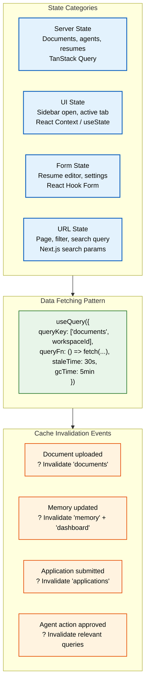
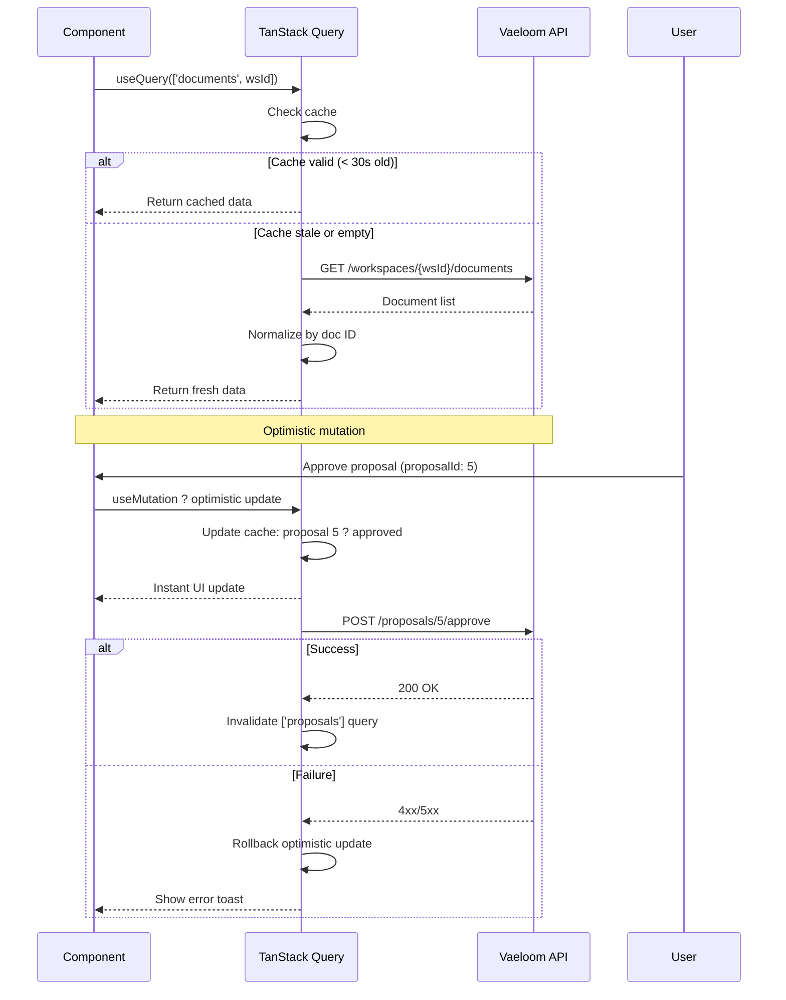
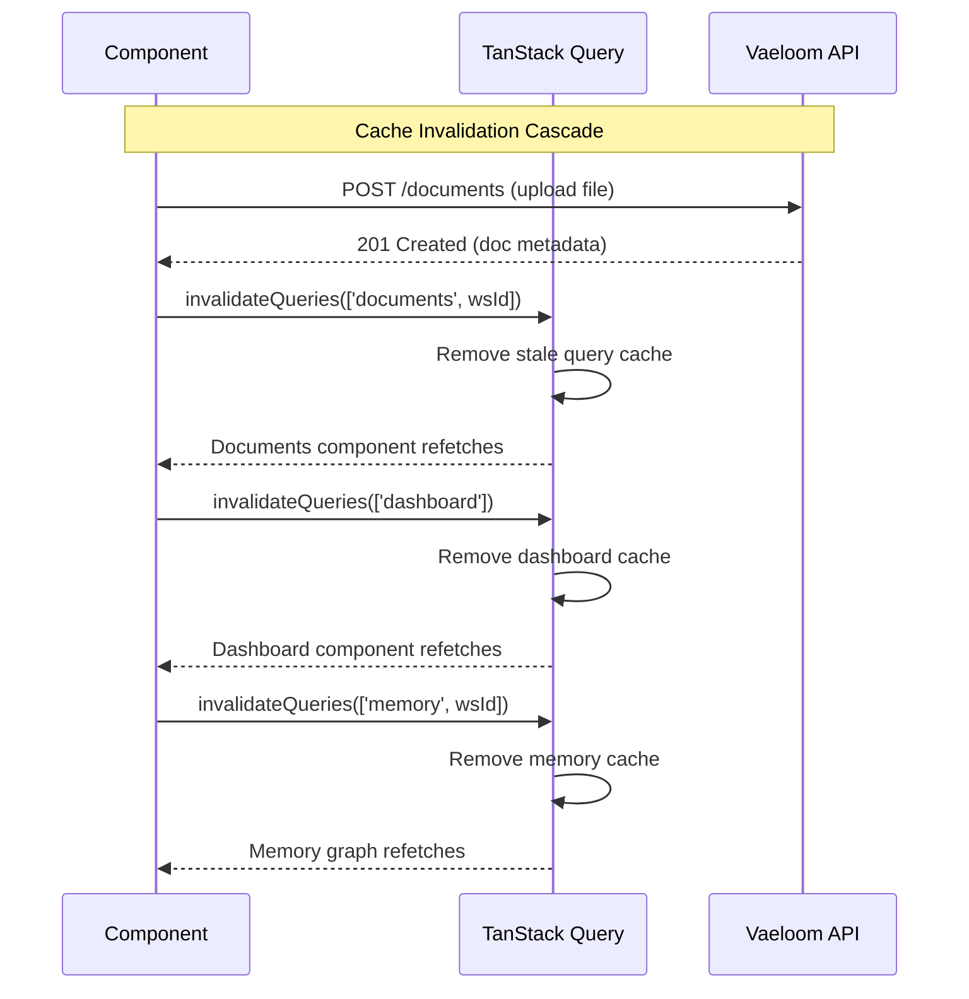

# State Management

> **Purpose:** Define state management strategy, cache invalidation patterns, and data fetching architecture for Vaeloom frontend
> **Status:** ? Upgraded to enterprise quality
> **Owner:** Frontend Team
> **Version:** 2.0
> **Last Updated:** 2026-07-17
> **Dependencies:** Frontend-Architecture.md, UX-Guidelines.md, Forms.md
> **Implementation Status:** ?? Spec Only
> **Review Checklist:** Standard
> **Canonical source:** docs/Frontend/State-Management.md

## Overview

Vaeloom's state management strategy separates application state into four distinct categories, each with its own technology and ownership model. Server state (documents, agents, resumes, jobs) is managed by TanStack Query, which provides caching, background refetching, optimistic updates, and granular cache invalidation. UI state (sidebar open, active tab, modal visibility) stays local with React Context or `useState`, never polluting a global store. Form state is owned by React Hook Form's uncontrolled input model. URL state (page, filter, search query) lives in Next.js search params for shareable, bookmarkable URLs.

This four-category separation is deliberate: it prevents the common anti-pattern of putting everything into a single global store. Server state is the most complex category — TanStack Query normalizes cached data by entity ID, supports workspace-scoped query keys for multi-tenant isolation, and provides stale-while-revalidate semantics so users always see cached data instantly while fresh data loads in the background.

For Vaeloom's AI-driven workflows, state management directly impacts user experience. When a user approves an agent proposal, an optimistic update immediately removes the proposal card from the UI while the server processes the request. If the server rejects the mutation, the optimistic update is rolled back and the card reappears with an error toast. This pattern makes the application feel responsive even when server operations take 500ms+.

Cache invalidation follows a cascade pattern: when a document is uploaded, the `documents` query is invalidated, which in turn invalidates the `dashboard` summary query (since the document count changed) and the `memory` query (since the document may contain new entities). This automatic cascade ensures data consistency without developers needing to manually track every dependency.

## Goals

- Maintain cache hit ratio above 70% across all TanStack Query operations
- Achieve sub-500ms query fetch latency (p95) for all server state requests
- Ensure zero cross-tenant data leakage through workspace-scoped query keys
- Support optimistic updates on all mutation operations with automatic rollback on failure
- Keep UI state out of global stores — zero global state for sidebar, modal, or tab visibility

## Scope

### In Scope

| Area | Description |
|------|-------------|
| TanStack Query | All server state with configurable staleTime per data type |
| React Context | UI-only state spanning component trees (sidebar, theme) |
| React Hook Form | All form state with debounced auto-save |
| URL Search Params | Page-level state (filters, pagination, active tab) |
| Optimistic Updates | All mutation operations with automatic rollback on failure |
| Cache Invalidation | Cascade pattern on mutation success |

### Out of Scope

| Area | Reason |
|------|--------|
| IndexedDB-backed persistent cache | Future improvement for offline support |
| Offline mutation queue with retry | Future improvement beyond MVP |
| Real-time cache invalidation via WebSocket | Future improvement for live collaboration |
| GraphQL normalized cache with type policies | Future improvement — consider Apollo migration |

## Functional Requirements

| ID | Description | Priority |
|----|-------------|----------|
| FR-SM-001 | System shall cache server state using TanStack Query with configurable staleTime per data type | P0 |
| FR-SM-002 | System shall provide optimistic updates for all mutation operations with rollback on error | P0 |
| FR-SM-003 | System shall support workspace-scoped query keys for multi-tenant isolation | P0 |
| FR-SM-004 | System shall invalidate related queries on mutation success following cascade pattern | P1 |
| FR-SM-005 | System shall manage UI-only state via React Context without global stores | P1 |
| FR-SM-006 | System shall expose pagination, filters, and active tab via URL search params | P1 |

## Non-Functional Requirements

| ID | Description | Target | Measurement |
|----|-------------|--------|-------------|
| NFR-SM-001 | Cache hit ratio | >= 70% | TanStack Query Devtools / Grafana |
| NFR-SM-002 | Query fetch latency (p95) | < 500ms | Grafana APM |
| NFR-SM-003 | Mutation rollback time | < 100ms | PerformanceObserver |
| NFR-SM-004 | Cache invalidation propagation | < 200ms | Custom metric |
| NFR-SM-005 | Cross-tenant data leakage | Zero incidents | Security audit / Sentry |

## Architecture



## Components

| Component | Responsibility | Technology | Scale Strategy |
|-----------|---------------|------------|----------------|
| QueryClientProvider | TanStack Query root provider with default options | TanStack Query v5 | Singleton per app; configured with default staleTime and gcTime |
| WorkspaceQueries | All server data queries scoped to workspace | TanStack Query | Workspace-scoped query keys (`['entity', workspaceId]`) |
| MutationHooks | Optimistic mutations with rollback logic | TanStack Query | Self-contained per feature; return rollback context |
| SidebarContext | UI state for sidebar collapse/expand | React Context | Scoped to layout component tree; never global |
| FormState | Form state managed by RHF | React Hook Form | Scoped per form instance; `useFormContext` for nested forms |

## Workflows

1. **Server data fetch and cache**: Component mounts ? `useQuery` checks cache ? staleTime (30s) not exceeded ? return cached data ? if stale, background refetch ? cache updated ? UI re-renders
2. **Mutation with optimistic update**: User approves proposal ? `useMutation` fires optimistic update ? UI immediately shows approved state ? `onSettled` invalidates related queries ? on error, optimistic update rolled back ? toast shows result
3. **Cache invalidation cascade**: Document uploaded ? mutation `onSuccess` invalidates `['documents', workspaceId]` ? also invalidates `['dashboard']` and `['memory', workspaceId]` ? all dependent components refetch ? UI refreshed
4. **Form state to server sync**: User edits resume ? React Hook Form manages local state ? 2s debounce ? serializes changed fields ? `useMutation` PATCH ? server validates ? response updates TanStack Query cache ? form indicates "Saved"
5. **URL state synchronization**: User sets filter ? `useSearchParams` updates URL ? downstream components react to search param changes ? page state is shareable via URL ? back/forward navigation restores filters

## Sequence Diagrams





## Data Flow

1. **Ingestion**: User action triggers mutation ? mutation function executes ? optimistic update modifies cache ? server receives request ? server processes and responds
2. **Processing**: TanStack Query normalizes response data ? merges with existing cache ? deduplicates by entity ID ? updates timestamps for staleTime tracking
3. **Storage**: Cache stored in memory as normalized JS object ? persisted to sessionStorage for tab recovery ? URL params stored in browser history
4. **Retrieval**: `useQuery` key matches cached data ? if within staleTime, return cached ? if stale, background refetch ? stale data returned immediately, fresh data on next render
5. **Deletion**: Cache garbage collected after `gcTime` (5 min default) ? manual `invalidateQueries` clears specific keys ? `resetQueries` clears + refetches ? workspace deletion purges all associated keys

## APIs

| Method | Path | Purpose |
|--------|------|---------|
| GET | `/api/workspaces/{wsId}/documents` | Fetch workspace documents (primary TanStack Query target) |
| GET | `/api/workspaces/{wsId}/agents` | Fetch workspace agents |
| GET | `/api/workspaces/{wsId}/proposals` | Fetch pending proposals |
| GET | `/api/dashboard/summary` | Fetch dashboard widget data |
| POST | `/api/proposals/{id}/approve` | Approve proposal (triggers invalidation cascade) |
| POST | `/api/proposals/{id}/reject` | Reject proposal |
| POST | `/api/documents` | Upload document (triggers invalidation cascade) |
| PATCH | `/api/resumes/{id}` | Update resume (debounced auto-save) |

## Database

N/A — State management is a client-side concern. Server data is persisted via API calls to PostgreSQL. TanStack Query acts as a client-side cache layer over server data. See API routes for persistence.

## Security

| Concern | Mitigation |
|---------|------------|
| Sensitive data in URL search params | Avoid storing tokens, session IDs, or PII in URL query parameters — visible in browser history, referrer headers, and server logs |
| Client-side state exposing unauthorized data | Never load data from client-side cache without re-validating permissions — cached data may reflect a previous session with different access levels |
| Race conditions in optimistic updates | Ensure rollback logic handles the case where the server rejects the mutation; use version fields for conflict detection |

## Performance

| Concern | Budget | Measurement | Optimization |
|---------|--------|-------------|--------------|
| Cache-first strategy with background refetch | < 50ms cache read | TanStack Query Devtools | Return cached data immediately, silently refresh in background |
| Pagination and infinite scrolling | < 200ms render | Chrome Performance tab | Cursor-based pagination; virtual scrolling for 50+ items |
| Query key structure for granular invalidation | < 100ms invalidation | Custom metric | Structured keys (`['entity', id, { filter }]`) avoid broad clears |
| Mutation optimistic update | < 50ms UI update | User Timing API | Immediate cache mutation before server round-trip |

## Scalability

| Dimension | Current Limit | 10x Strategy | 100x Strategy |
|-----------|---------------|--------------|---------------|
| Cached query keys | 100 per user | Paginated cache eviction; LRU limit of 500 keys | IndexedDB-backed cache for unlimited storage |
| Optimistic update rollbacks | 1 at a time | Queue of pending mutations with ordered rollback | CRDT-based conflict resolution for concurrent mutations |
| Query key depth | 2 levels (`['entity', id]`) | 4 levels with granular invalidation (`['entity', id, 'relation', filter]`) | GraphQL normalized cache with automatic dependency tracking |
| Cache invalidation breadth | Manual per mutation | Automatic via query key pattern matching | Apollo-like cache policies with type policies |

## Error Handling

| Scenario | Detection | Mitigation | Recovery |
|----------|-----------|------------|----------|
| Query fetch fails (network error) | TanStack Query `isError` state | Return stale cached data if available; show error banner | Retry with exponential backoff (3 attempts) |
| Mutation request times out | `mutationFn` exceeds 10s timeout | Optimistic update rolled back; show timeout toast | Retry mutation on user click |
| Cache normalization collision | Two entities share same ID in cache | Merge with last-write-wins; log warning to Sentry | Use composite keys (`workspaceId_docId`) |
| Query key mismatch causes stale data | Data displayed doesn't match server state | Invalidate all queries on WebSocket reconnect | Checkpoint-based cache validation |

## Monitoring

| Metric | Alert Threshold | Severity | Dashboard |
|--------|----------------|----------|-----------|
| Query fetch latency (p95) | > 500ms | Warning | Grafana — API Dashboard |
| Mutation failure rate | > 1% | Critical | Grafana — API Errors |
| Cache hit ratio | < 70% | Info | Grafana — Cache Performance |
| Optimistic rollback rate | > 0.5% | Warning | Sentry — Mutation Errors |
| Stale data display incidents | > 1 reported per week | Warning | Product — Bug Tracker |

## Deployment

| Environment | Strategy | Rollback | Notes |
|-------------|----------|----------|-------|
| Development | Direct deploy with debug devtools | Revert commit | TanStack Query Devtools enabled for debugging |
| Staging | Gradual rollout to team | Feature flag toggle | Validate cache invalidation patterns with realistic data |
| Production | Feature-flagged rollout per workspace | Disable flag; invalidate all caches | Monitor cache hit ratio and query latency during rollout |

## Configuration

| Variable | Purpose | Default | Required |
|----------|---------|---------|----------|
| `DEFAULT_STALE_TIME_MS` | Default staleTime for queries | 30000 | No |
| `DEFAULT_GC_TIME_MS` | Default garbage collection time | 300000 | No |
| `AGENT_STATUS_STALE_MS` | staleTime for agent status queries | 5000 | No |
| `SETTINGS_STALE_MS` | staleTime for settings queries | 300000 | No |
| `MUTATION_TIMEOUT_MS` | Mutation request timeout | 10000 | No |

## Examples

### Fetching documents with TanStack Query

```typescript
import { useQuery } from '@tanstack/react-query';

function useDocuments(workspaceId: string) {
  return useQuery({
    queryKey: ['documents', workspaceId],
    queryFn: () => fetch(`/api/workspaces/${workspaceId}/documents`).then(r => r.json()),
    staleTime: 30_000,
    gcTime: 5 * 60_000,
  });
}
```

### Optimistic mutation with rollback

```typescript
const approveProposal = useMutation({
  mutationFn: (proposalId: string) =>
    fetch(`/api/proposals/${proposalId}/approve`, { method: 'POST' }),
  onMutate: async (proposalId) => {
    await queryClient.cancelQueries({ queryKey: ['proposals'] });
    const previous = queryClient.getQueryData(['proposals']);
    queryClient.setQueryData(['proposals'], (old: Proposal[]) =>
      old.map(p => p.id === proposalId ? { ...p, status: 'approved' } : p)
    );
    return { previous };
  },
  onError: (_err, _id, context) => {
    queryClient.setQueryData(['proposals'], context?.previous);
  },
});
```

### Cache invalidation cascade

```typescript
const uploadDocument = useMutation({
  mutationFn: (file: File) => {
    const form = new FormData();
    form.append('file', file);
    return fetch('/api/documents', { method: 'POST', body: form });
  },
  onSuccess: () => {
    queryClient.invalidateQueries({ queryKey: ['documents'] });
    queryClient.invalidateQueries({ queryKey: ['dashboard'] });
  },
});
```

### UI state with React Context

```tsx
const SidebarContext = createContext<{ open: boolean; toggle: () => void }>(undefined!);

function SidebarProvider({ children }: { children: React.ReactNode }) {
  const [open, setOpen] = useState(true);
  return (
    <SidebarContext.Provider value={{ open, toggle: () => setOpen(v => !v) }}>
      {children}
    </SidebarContext.Provider>
  );
}
```

## Best Practices

| # | Practice | Rationale |
|---|----------|-----------|
| 1 | Normalize cache data by entity ID | Storing `{ [workspaceId]: { [docId]: data } }` enables independent invalidation of single items without clearing entire collections |
| 2 | Tune `staleTime` per data type | Agent status (staleTime: 5s), documents (30s), settings (5min) — each data type has a different freshness requirement |
| 3 | Use mutation responses to update the cache | After a successful mutation, update the query cache with the response data rather than refetching — eliminates the refetch flash |
| 4 | Separate server state from UI state | TanStack Query owns server state; React Context owns UI state; React Hook Form owns form state — each has a single, clear owner |
| 5 | Use workspace-scoped query keys | All multi-tenant queries must include `workspaceId` in the query key to prevent cross-tenant data leakage |
| 6 | Cancel in-flight queries before mutations | Call `queryClient.cancelQueries` before optimistic updates to prevent race conditions between refetch and mutation |

## Risks

| Risk | Likelihood | Impact | Mitigation |
|------|------------|--------|------------|
| staleTime too short causes excessive refetching | High | Medium | Tune staleTime per data type; monitor query frequency |
| Cache invalidation misses cause stale data | Medium | High | Invalidate broader query keys on mutations; use query cancellation |
| Optimistic update shows incorrect state | Medium | Medium | Conflict detection via version field; rollback on server rejection |
| Memory leak from unremoved query observers | Low | Medium | Use `gcTime` to clean up unused queries; monitor memory usage |

## Limitations

| Limitation | Impact | Workaround | Future Resolution |
|------------|--------|------------|-------------------|
| TanStack Query cache is in-memory only | Cache lost on page refresh | Persist to sessionStorage for key queries | IndexedDB adapter for TanStack Query (community plugin in beta) |
| No built-in offline mutation queue | Mutations fail when offline | Custom mutation queue with retry logic | TanStack Query v6 offline mutations (planned) |
| URL searchParams doesn't support arrays well | Complex filter state hard to serialize | Use JSON.stringify/parse for complex filter values | URLSearchParams array support via custom serializer |

## Future Improvements

| Improvement | Priority | Complexity | Timeline |
|-------------|----------|------------|----------|
| IndexedDB-backed persistent cache | High | Medium | Q3 2027 |
| Offline mutation queue with retry | Medium | High | Q4 2027 |
| Real-time cache invalidation via WebSocket | High | Medium | Q2 2027 |
| GraphQL normalized cache with type policies | Low | High | Q4 2027 |

## Related Documents

- [Accessibility.md](./Accessibility.md)
- [Accessibility-Audit.md](./Accessibility-Audit.md)
- [Animation-System.md](./Animation-System.md)
- [Charts.md](./Charts.md)
- [Component-Library.md](./Component-Library.md)
- [Dashboard.md](./Dashboard.md)
- [Design-System.md](./Design-System.md)
- [Forms.md](./Forms.md)
- [Frontend-Architecture.md](./Frontend-Architecture.md)
- [Internationalization.md](./Internationalization.md)
- [Mobile-Architecture.md](./Mobile-Architecture.md)
- [Navigation.md](./Navigation.md)
- [Responsive-Design.md](./Responsive-Design.md)
- [Theme-System.md](./Theme-System.md)
- [UI-Architecture.md](./UI-Architecture.md)
- [UX-Guidelines.md](./UX-Guidelines.md)
