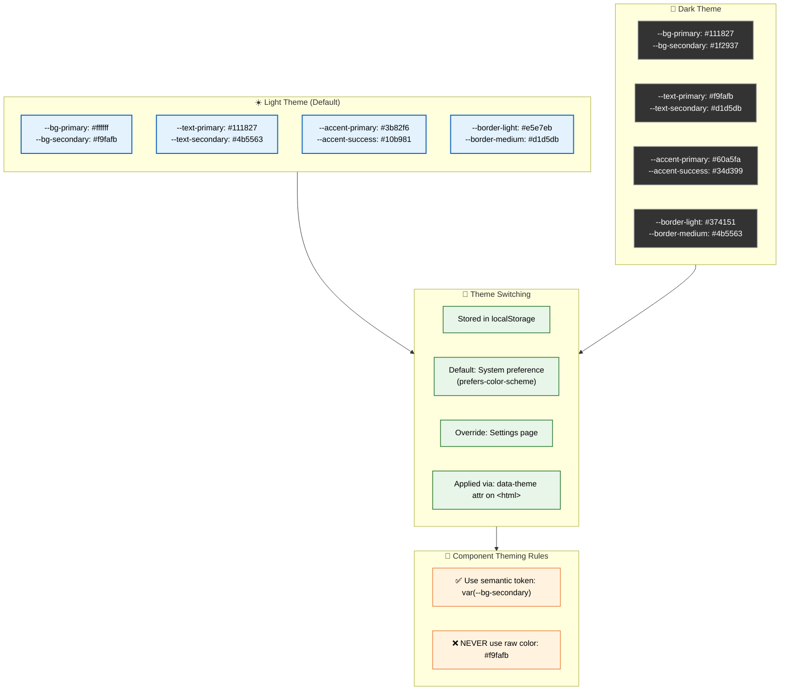
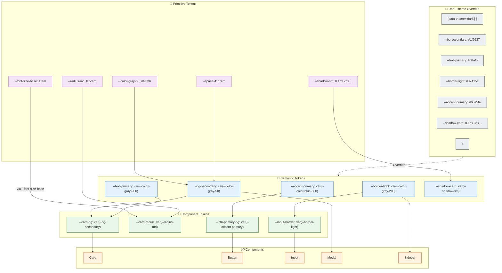
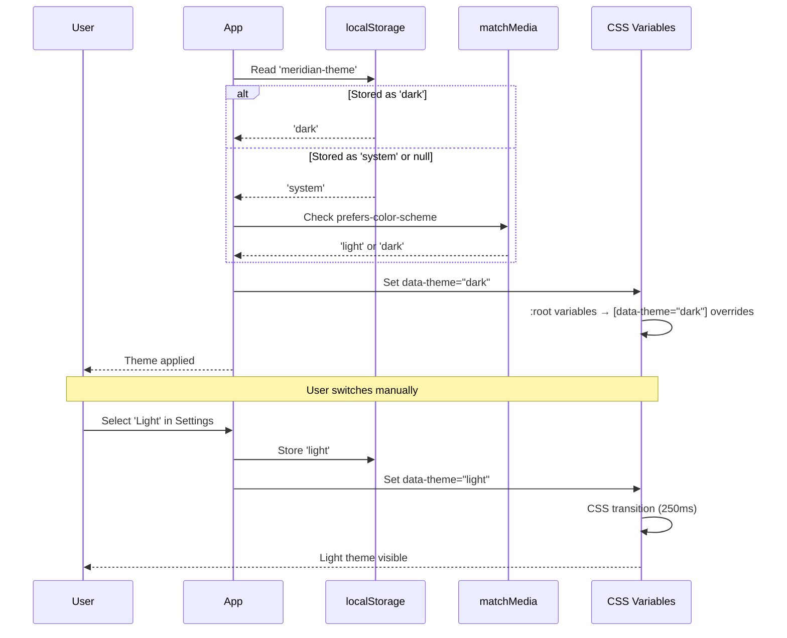

# Theme System

> **Purpose:** Define the complete theme system for Meridian's frontend — token architecture, CSS custom properties, practical component examples, and best practices
> **Status:** ✅ Upgraded to enterprise quality
> **Owner:** Frontend Team
> **Last Updated:** 2026-07-13
> **Interactive preview:** 🎨 See all 91 tokens in action with live light/dark mode at [Design-Tokens-Reference.html](./Design-Tokens-Reference.html)

---

## Theme Architecture



> **Diagram:** Theme system architecture. **Light** (default) and **Dark** themes use CSS custom properties. **Theme switching** is stored in localStorage, defaults to system `prefers-color-scheme`, overridable in Settings, applied via `data-theme` attribute on `<html>`. **Golden rule**: always use semantic tokens — never raw colors.

---

## Three-Layer Token Architecture

Design tokens are organized into three layers, each building on the one below:

```mermaid
graph LR
    subgraph Primitive["🔧 Layer 1 — Primitive Tokens"]
        direction TB
        P1["Raw color values<br/>#3b82f6, #10b981, #ef4444"]
        P2["Raw spacing values<br/>4px, 8px, 12px, 16px"]
        P3["Raw font values<br/>Inter, JetBrains Mono"]
        P4["Raw shadow values<br/>0 1px 3px rgba(0,0,0,0.12)"]
    end

    subgraph Semantic["🎯 Layer 2 — Semantic Tokens"]
        direction TB
        S1["--color-primary<br/>References a primitive blue"]
        S2["--bg-card<br/>References --color-gray-50"]
        S3["--text-body<br/>References --color-gray-900"]
        S4["--shadow-card<br/>References a shadow primitive"]
    end

    subgraph Component["🧩 Layer 3 — Component Tokens"]
        direction TB
        C1["--btn-primary-bg<br/>References --color-primary"]
        C2["--card-border-radius<br/>References --radius-md"]
        C3["--input-border-color<br/>References --border-medium"]
        C4["--sidebar-width<br/>Direct value: 260px"]
    end

    Primitive --> Semantic --> Component

    classDef primitive fill:#f3e5f5,stroke:#7b1fa2,stroke-width:2px
    classDef semantic fill:#e3f2fd,stroke:#1565c0,stroke-width:2px
    classDef component fill:#e8f5e9,stroke:#2e7d32,stroke-width:2px

    class P1,P2,P3,P4 primitive
    class S1,S2,S3,S4 semantic
    class C1,C2,C3,C4 component
```



> **Diagram:** **Primitive tokens** define raw values (colors, spacing, typography, shadows). **Semantic tokens** assign meaning (primary, danger, bg-card, text-body). **Component tokens** are component-scoped overrides (btn-bg, card-radius). Each layer references the one below — never skip layers.

### Layer 1 — Primitive Tokens

Primitive tokens hold the raw design values. They never change between themes — only semantic tokens remap them.

```css
:root {
  /* Gray scale — used by semantic tokens */
  --color-gray-50:  #f9fafb;
  --color-gray-100: #f3f4f6;
  --color-gray-200: #e5e7eb;
  --color-gray-300: #d1d5db;
  --color-gray-400: #9ca3af;
  --color-gray-500: #6b7280;
  --color-gray-600: #4b5563;
  --color-gray-700: #374151;
  --color-gray-800: #1f2937;
  --color-gray-900: #111827;

  /* Brand palette */
  --color-blue-500:  #3b82f6;
  --color-blue-600:  #2563eb;
  --color-green-500: #10b981;
  --color-green-600: #059669;
  --color-amber-500: #f59e0b;
  --color-red-500:   #ef4444;
  --color-red-600:   #dc2626;

  /* Typography primitives */
  --font-family-sans: 'Inter', system-ui, -apple-system, sans-serif;
  --font-family-mono: 'JetBrains Mono', monospace;

  /* Font size primitives */
  --font-size-xs:   0.75rem;   /* 12px */
  --font-size-sm:   0.875rem;  /* 14px */
  --font-size-base: 1rem;      /* 16px */
  --font-size-lg:   1.125rem;  /* 18px */
  --font-size-xl:   1.25rem;   /* 20px */
  --font-size-2xl:  1.5rem;    /* 24px */

  /* Font weight primitives */
  --font-weight-normal: 400;
  --font-weight-medium: 500;
  --font-weight-semibold: 600;
  --font-weight-bold: 700;

  /* Spacing primitives (4px base unit) */
  --space-1: 0.25rem;  /*  4px */
  --space-2: 0.5rem;   /*  8px */
  --space-3: 0.75rem;  /* 12px */
  --space-4: 1rem;     /* 16px */
  --space-6: 1.5rem;   /* 24px */
  --space-8: 2rem;     /* 32px */
  --space-12: 3rem;    /* 48px */
  --space-16: 4rem;    /* 64px */

  /* Border radius primitives */
  --radius-sm: 0.25rem;  /*  4px */
  --radius-md: 0.5rem;   /*  8px */
  --radius-lg: 0.75rem;  /* 12px */
  --radius-xl: 1rem;     /* 16px */
  --radius-full: 9999px;

  /* Shadow primitives */
  --shadow-sm:  0 1px 2px 0 rgb(0 0 0 / 0.05);
  --shadow-md:  0 4px 6px -1px rgb(0 0 0 / 0.1), 0 2px 4px -2px rgb(0 0 0 / 0.1);
  --shadow-lg:  0 10px 15px -3px rgb(0 0 0 / 0.1), 0 4px 6px -4px rgb(0 0 0 / 0.1);
  --shadow-xl:  0 20px 25px -5px rgb(0 0 0 / 0.1), 0 8px 10px -6px rgb(0 0 0 / 0.1);

  /* Transition primitives */
  --transition-fast: 150ms ease;
  --transition-base: 250ms ease;
  --transition-slow: 400ms ease;
}
```

### Layer 2 — Semantic Tokens

Semantic tokens assign meaning to primitives. These are what change between light and dark themes. **Components must only use semantic tokens**, never primitives or raw values.

#### Backgrounds

| Token | Light value | Dark value | Usage |
|-------|------------|------------|-------|
| `--bg-primary` | `#ffffff` | `#111827` | Page background |
| `--bg-secondary` | `#f9fafb` | `#1f2937` | Card, sidebar |
| `--bg-tertiary` | `#f3f4f6` | `#374151` | Hover, active |
| `--bg-elevated` | `#ffffff` | `#1f2937` | Modal, dropdown |
| `--bg-overlay` | `rgba(0,0,0,0.5)` | `rgba(0,0,0,0.7)` | Modal backdrop |
| `--bg-inset` | `#f3f4f6` | `#111827` | Input, code block |

#### Text

| Token | Light value | Dark value | Usage |
|-------|------------|------------|-------|
| `--text-primary` | `#111827` | `#f9fafb` | Body, headings |
| `--text-secondary` | `#4b5563` | `#d1d5db` | Labels, descriptions |
| `--text-muted` | `#9ca3af` | `#6b7280` | Placeholder, disabled |
| `--text-inverse` | `#ffffff` | `#111827` | Text on accent bg |
| `--text-link` | `#3b82f6` | `#60a5fa` | Hyperlinks |
| `--text-success` | `#059669` | `#34d399` | Success messages |
| `--text-warning` | `#d97706` | `#fbbf24` | Warning messages |
| `--text-error` | `#dc2626` | `#f87171` | Error messages |

#### Accent / Interactive

| Token | Light value | Dark value | Usage |
|-------|------------|------------|-------|
| `--accent-primary` | `#3b82f6` | `#60a5fa` | Primary buttons, active state |
| `--accent-primary-hover` | `#2563eb` | `#3b82f6` | Hover on primary |
| `--accent-success` | `#10b981` | `#34d399` | Success indicators |
| `--accent-warning` | `#f59e0b` | `#fbbf24` | Warning indicators |
| `--accent-error` | `#ef4444` | `#f87171` | Destructive actions |
| `--accent-error-hover` | `#dc2626` | `#ef4444` | Hover on destructive |

#### Borders

| Token | Light value | Dark value | Usage |
|-------|------------|------------|-------|
| `--border-light` | `#e5e7eb` | `#374151` | Subtle dividers, card borders |
| `--border-medium` | `#d1d5db` | `#4b5563` | Input borders, active dividers |
| `--border-focus` | `#3b82f6` | `#60a5fa` | Focus ring |
| `--border-error` | `#ef4444` | `#f87171` | Validation error state |

#### Shadows

| Token | Light value | Dark value | Usage |
|-------|------------|------------|-------|
| `--shadow-card` | `0 1px 3px rgba(0,0,0,0.1)` | `0 1px 3px rgba(0,0,0,0.4)` | Card elevation |
| `--shadow-dropdown` | `0 4px 12px rgba(0,0,0,0.15)` | `0 4px 12px rgba(0,0,0,0.5)` | Dropdown, popover |
| `--shadow-modal` | `0 8px 24px rgba(0,0,0,0.2)` | `0 8px 24px rgba(0,0,0,0.6)` | Modal/dialog |
| `--shadow-sticky` | `0 2px 8px rgba(0,0,0,0.08)` | `0 2px 8px rgba(0,0,0,0.3)` | Sticky nav/header |

### Layer 3 — Component Tokens

Component tokens are scoped overrides for specific UI patterns. They reference semantic tokens and add component-specific values (sizing, layout, etc.).

```css
:root {
  /* ── Layout ── */
  --sidebar-width: 260px;
  --sidebar-collapsed-width: 64px;
  --topnav-height: 64px;
  --content-max-width: 1200px;

  /* ── Card ── */
  --card-bg: var(--bg-secondary);
  --card-border: var(--border-light);
  --card-radius: var(--radius-lg);
  --card-shadow: var(--shadow-card);
  --card-padding: var(--space-6);

  /* ── Button (Primary) ── */
  --btn-primary-bg: var(--accent-primary);
  --btn-primary-text: var(--text-inverse);
  --btn-primary-hover-bg: var(--accent-primary-hover);
  --btn-primary-radius: var(--radius-md);
  --btn-primary-padding-x: var(--space-4);
  --btn-primary-padding-y: var(--space-2);

  /* ── Button (Secondary) ── */
  --btn-secondary-bg: var(--bg-secondary);
  --btn-secondary-text: var(--text-primary);
  --btn-secondary-border: var(--border-medium);
  --btn-secondary-hover-bg: var(--bg-tertiary);

  /* ── Input ── */
  --input-bg: var(--bg-primary);
  --input-text: var(--text-primary);
  --input-border: var(--border-medium);
  --input-focus-border: var(--border-focus);
  --input-focus-ring: 0 0 0 3px color-mix(in srgb, var(--accent-primary) 20%, transparent);
  --input-error-border: var(--border-error);
  --input-radius: var(--radius-md);
  --input-padding: var(--space-3);

  /* ── Modal ── */
  --modal-bg: var(--bg-elevated);
  --modal-radius: var(--radius-xl);
  --modal-shadow: var(--shadow-modal);
  --modal-overlay-bg: var(--bg-overlay);
  --modal-header-border: var(--border-light);
  --modal-padding: var(--space-6);

  /* ── Navigation ── */
  --nav-item-radius: var(--radius-md);
  --nav-item-padding: var(--space-2) var(--space-3);
  --nav-item-hover-bg: var(--bg-tertiary);
  --nav-item-active-bg: color-mix(in srgb, var(--accent-primary) 10%, var(--bg-secondary));
  --nav-item-active-text: var(--accent-primary);

  /* ── Badge / Status ── */
  --badge-success-bg: color-mix(in srgb, var(--accent-success) 15%, var(--bg-primary));
  --badge-success-text: var(--text-success);
  --badge-warning-bg: color-mix(in srgb, var(--accent-warning) 15%, var(--bg-primary));
  --badge-warning-text: var(--text-warning);
  --badge-error-bg: color-mix(in srgb, var(--accent-error) 15%, var(--bg-primary));
  --badge-error-text: var(--text-error);
  --badge-radius: var(--radius-full);
  --badge-padding: var(--space-1) var(--space-2);

  /* ── Table ── */
  --table-header-bg: var(--bg-secondary);
  --table-header-text: var(--text-secondary);
  --table-row-hover-bg: var(--bg-tertiary);
  --table-row-border: var(--border-light);
  --table-cell-padding: var(--space-3) var(--space-4);

  /* ── Toast / Alert ── */
  --toast-bg: var(--bg-elevated);
  --toast-radius: var(--radius-lg);
  --toast-shadow: var(--shadow-lg);
  --toast-padding: var(--space-4);

  /* ── Code Block ── */
  --code-bg: var(--bg-inset);
  --code-text: var(--text-primary);
  --code-font: var(--font-family-mono);
  --code-radius: var(--radius-md);
  --code-padding: var(--space-4);
}
```

---

## Theme Token Reference (Complete)

### Light Theme — Complete CSS

```css
:root,
[data-theme="light"] {
  /* ── Backgrounds ── */
  --bg-primary: #ffffff;
  --bg-secondary: #f9fafb;
  --bg-tertiary: #f3f4f6;
  --bg-elevated: #ffffff;
  --bg-overlay: rgba(0, 0, 0, 0.5);
  --bg-inset: #f3f4f6;

  /* ── Text ── */
  --text-primary: #111827;
  --text-secondary: #4b5563;
  --text-muted: #9ca3af;
  --text-inverse: #ffffff;
  --text-link: #3b82f6;
  --text-success: #059669;
  --text-warning: #d97706;
  --text-error: #dc2626;

  /* ── Accent / Interactive ── */
  --accent-primary: #3b82f6;
  --accent-primary-hover: #2563eb;
  --accent-success: #10b981;
  --accent-warning: #f59e0b;
  --accent-error: #ef4444;
  --accent-error-hover: #dc2626;

  /* ── Borders ── */
  --border-light: #e5e7eb;
  --border-medium: #d1d5db;
  --border-focus: #3b82f6;
  --border-error: #ef4444;

  /* ── Shadows ── */
  --shadow-card: 0 1px 3px 0 rgb(0 0 0 / 0.1), 0 1px 2px -1px rgb(0 0 0 / 0.1);
  --shadow-dropdown: 0 4px 6px -1px rgb(0 0 0 / 0.1), 0 2px 4px -2px rgb(0 0 0 / 0.1);
  --shadow-modal: 0 10px 15px -3px rgb(0 0 0 / 0.1), 0 4px 6px -4px rgb(0 0 0 / 0.1);
  --shadow-sticky: 0 1px 3px 0 rgb(0 0 0 / 0.05);
}
```

### Dark Theme — Complete CSS

```css
[data-theme="dark"] {
  /* ── Backgrounds ── */
  --bg-primary: #111827;
  --bg-secondary: #1f2937;
  --bg-tertiary: #374151;
  --bg-elevated: #1f2937;
  --bg-overlay: rgba(0, 0, 0, 0.7);
  --bg-inset: #111827;

  /* ── Text ── */
  --text-primary: #f9fafb;
  --text-secondary: #d1d5db;
  --text-muted: #6b7280;
  --text-inverse: #111827;
  --text-link: #60a5fa;
  --text-success: #34d399;
  --text-warning: #fbbf24;
  --text-error: #f87171;

  /* ── Accent / Interactive ── */
  --accent-primary: #60a5fa;
  --accent-primary-hover: #3b82f6;
  --accent-success: #34d399;
  --accent-warning: #fbbf24;
  --accent-error: #f87171;
  --accent-error-hover: #ef4444;

  /* ── Borders ── */
  --border-light: #374151;
  --border-medium: #4b5563;
  --border-focus: #60a5fa;
  --border-error: #f87171;

  /* ── Shadows ── */
  --shadow-card: 0 1px 3px 0 rgb(0 0 0 / 0.4), 0 1px 2px -1px rgb(0 0 0 / 0.3);
  --shadow-dropdown: 0 4px 6px -1px rgb(0 0 0 / 0.5), 0 2px 4px -2px rgb(0 0 0 / 0.4);
  --shadow-modal: 0 10px 15px -3px rgb(0 0 0 / 0.6), 0 4px 6px -4px rgb(0 0 0 / 0.5);
  --shadow-sticky: 0 1px 3px 0 rgb(0 0 0 / 0.3);
}
```

---

## Theme Switching Implementation

```css
/* Smooth theme transitions — applied to all themed elements */
@media (prefers-reduced-motion: no-preference) {
  *,
  *::before,
  *::after {
    transition:
      background-color var(--transition-base),
      color var(--transition-base),
      border-color var(--transition-base),
      box-shadow var(--transition-base);
  }
}

/* Exclude elements where transition would cause issues */
*[data-no-theme-transition],
*[data-no-theme-transition] * {
  transition: none !important;
}
```

```typescript
// Theme toggle utility
type Theme = 'light' | 'dark' | 'system';

function getSystemTheme(): 'light' | 'dark' {
  return window.matchMedia('(prefers-color-scheme: dark)').matches
    ? 'dark'
    : 'light';
}

function applyTheme(theme: Theme): void {
  const resolved = theme === 'system' ? getSystemTheme() : theme;
  document.documentElement.setAttribute('data-theme', resolved);
  localStorage.setItem('meridian-theme', theme);
}

function initTheme(): void {
  const stored = localStorage.getItem('meridian-theme') as Theme | null;
  const theme = stored ?? 'system';
  applyTheme(theme);

  // Listen for system preference changes
  window.matchMedia('(prefers-color-scheme: dark)')
    .addEventListener('change', () => {
      if (theme === 'system') applyTheme('system');
    });
}
```

---

## CSS Variable Usage Examples

### Button Component

```css
.btn {
  display: inline-flex;
  align-items: center;
  justify-content: center;
  gap: var(--space-2);
  padding: var(--btn-primary-padding-y) var(--btn-primary-padding-x);
  border-radius: var(--btn-primary-radius);
  font-family: var(--font-family-sans);
  font-weight: var(--font-weight-medium);
  font-size: var(--font-size-sm);
  cursor: pointer;
  border: 1px solid transparent;
  /* use semantic transition token */
  transition:
    background-color var(--transition-fast),
    border-color var(--transition-fast),
    box-shadow var(--transition-fast);
}

.btn-primary {
  background-color: var(--btn-primary-bg);
  color: var(--btn-primary-text);
}
.btn-primary:hover {
  background-color: var(--btn-primary-hover-bg);
}

.btn-secondary {
  background-color: var(--btn-secondary-bg);
  color: var(--btn-secondary-text);
  border-color: var(--btn-secondary-border);
}
.btn-secondary:hover {
  background-color: var(--btn-secondary-hover-bg);
}

.btn-danger {
  background-color: var(--accent-error);
  color: var(--text-inverse);
}
.btn-danger:hover {
  background-color: var(--accent-error-hover);
}
```

```tsx
// React component example
interface ButtonProps {
  variant?: 'primary' | 'secondary' | 'danger';
  children: React.ReactNode;
}

function Button({ variant = 'primary', children }: ButtonProps) {
  return (
    <button className={`btn btn-${variant}`}>
      {children}
    </button>
  );
}
```

### Card Component

```css
.card {
  background-color: var(--card-bg);
  border: 1px solid var(--card-border);
  border-radius: var(--card-radius);
  box-shadow: var(--card-shadow);
  padding: var(--card-padding);
}
.card-header {
  padding-bottom: var(--space-4);
  border-bottom: 1px solid var(--border-light);
  margin-bottom: var(--space-4);
}
.card-title {
  color: var(--text-primary);
  font-size: var(--font-size-lg);
  font-weight: var(--font-weight-semibold);
}
.card-description {
  color: var(--text-secondary);
  font-size: var(--font-size-sm);
  margin-top: var(--space-1);
}
```

### Form Elements

```css
.form-group {
  display: flex;
  flex-direction: column;
  gap: var(--space-2);
}
.form-label {
  color: var(--text-secondary);
  font-size: var(--font-size-sm);
  font-weight: var(--font-weight-medium);
}
.form-input {
  background-color: var(--input-bg);
  color: var(--input-text);
  border: 1px solid var(--input-border);
  border-radius: var(--input-radius);
  padding: var(--input-padding);
  font-size: var(--font-size-base);
  font-family: var(--font-family-sans);
  transition:
    border-color var(--transition-fast),
    box-shadow var(--transition-fast);
}
.form-input:focus {
  outline: none;
  border-color: var(--input-focus-border);
  box-shadow: var(--input-focus-ring);
}
.form-input.error {
  border-color: var(--input-error-border);
}
.form-input::placeholder {
  color: var(--text-muted);
}
.form-error {
  color: var(--text-error);
  font-size: var(--font-size-xs);
  margin-top: var(--space-1);
}
```

### Navigation / Sidebar

```css
.sidebar {
  width: var(--sidebar-width);
  background-color: var(--bg-secondary);
  border-right: 1px solid var(--border-light);
  height: 100vh;
  position: sticky;
  top: 0;
  overflow-y: auto;
  transition: width var(--transition-base);
}
.sidebar.collapsed {
  width: var(--sidebar-collapsed-width);
}

.nav-item {
  display: flex;
  align-items: center;
  gap: var(--space-3);
  padding: var(--nav-item-padding);
  border-radius: var(--nav-item-radius);
  color: var(--text-secondary);
  text-decoration: none;
  font-size: var(--font-size-sm);
  font-weight: var(--font-weight-medium);
  transition:
    background-color var(--transition-fast),
    color var(--transition-fast);
}
.nav-item:hover {
  background-color: var(--nav-item-hover-bg);
  color: var(--text-primary);
}
.nav-item.active {
  background-color: var(--nav-item-active-bg);
  color: var(--nav-item-active-text);
  font-weight: var(--font-weight-semibold);
}
```

### Modal / Dialog

```css
.modal-overlay {
  position: fixed;
  inset: 0;
  background-color: var(--modal-overlay-bg);
  display: flex;
  align-items: center;
  justify-content: center;
  z-index: 50;
}
.modal-content {
  background-color: var(--modal-bg);
  border-radius: var(--modal-radius);
  box-shadow: var(--modal-shadow);
  width: 100%;
  max-width: 480px;
  max-height: 85vh;
  overflow-y: auto;
}
.modal-header {
  display: flex;
  align-items: center;
  justify-content: space-between;
  padding: var(--modal-padding);
  border-bottom: 1px solid var(--modal-header-border);
}
.modal-body {
  padding: var(--modal-padding);
}
.modal-footer {
  display: flex;
  justify-content: flex-end;
  gap: var(--space-3);
  padding: var(--modal-padding);
  border-top: 1px solid var(--modal-header-border);
}
```

### Status Badge

```css
.badge {
  display: inline-flex;
  align-items: center;
  gap: var(--space-1);
  padding: var(--badge-padding);
  border-radius: var(--badge-radius);
  font-size: var(--font-size-xs);
  font-weight: var(--font-weight-medium);
  white-space: nowrap;
}
.badge-success {
  background-color: var(--badge-success-bg);
  color: var(--badge-success-text);
}
.badge-warning {
  background-color: var(--badge-warning-bg);
  color: var(--badge-warning-text);
}
.badge-error {
  background-color: var(--badge-error-bg);
  color: var(--badge-error-text);
}
```

### Table

```css
.table {
  width: 100%;
  border-collapse: collapse;
}
.table th {
  background-color: var(--table-header-bg);
  color: var(--table-header-text);
  font-size: var(--font-size-xs);
  font-weight: var(--font-weight-semibold);
  text-transform: uppercase;
  letter-spacing: 0.05em;
  text-align: left;
  padding: var(--table-cell-padding);
  border-bottom: 1px solid var(--table-row-border);
}
.table td {
  padding: var(--table-cell-padding);
  border-bottom: 1px solid var(--table-row-border);
  color: var(--text-primary);
  font-size: var(--font-size-sm);
}
.table tr:hover td {
  background-color: var(--table-row-hover-bg);
}
```

---

## Token Composition Patterns

### Semantic from Primitives (using `color-mix`)

Modern CSS `color-mix()` allows creating derived tokens without hardcoding:

```css
:root {
  /* Derived backgrounds from accent */
  --accent-primary-bg-subtle: color-mix(in srgb, var(--accent-primary) 10%, var(--bg-primary));
  --accent-primary-bg-hover:  color-mix(in srgb, var(--accent-primary) 20%, var(--bg-primary));

  /* Status backgrounds */
  --badge-success-bg: color-mix(in srgb, var(--accent-success) 15%, transparent);
  --badge-warning-bg: color-mix(in srgb, var(--accent-warning) 15%, transparent);
  --badge-error-bg:   color-mix(in srgb, var(--accent-error) 15%, transparent);
}
```

### Inline Style Usage (React)

When semantic tokens need to be applied via inline styles (e.g., dynamic values):

```tsx
// ✅ Good: use CSS variables
<div style={{ backgroundColor: 'var(--bg-secondary)', color: 'var(--text-primary)' }}>
  Themed content
</div>

// ❌ Bad: hardcoded values
<div style={{ backgroundColor: '#f9fafb', color: '#111827' }}>
  Broken in dark mode
</div>
```

### Tailwind CSS Integration

```js
// tailwind.config.js
module.exports = {
  theme: {
    extend: {
      colors: {
        'bg-primary': 'var(--bg-primary)',
        'bg-secondary': 'var(--bg-secondary)',
        'text-primary': 'var(--text-primary)',
        'text-secondary': 'var(--text-secondary)',
        accent: {
          primary: 'var(--accent-primary)',
          success: 'var(--accent-success)',
          warning: 'var(--accent-warning)',
          error: 'var(--accent-error)',
        },
        border: {
          light: 'var(--border-light)',
          medium: 'var(--border-medium)',
        },
      },
      fontFamily: {
        sans: ['Inter', 'system-ui', 'sans-serif'],
        mono: ['JetBrains Mono', 'monospace'],
      },
      boxShadow: {
        card: 'var(--shadow-card)',
        dropdown: 'var(--shadow-dropdown)',
        modal: 'var(--shadow-modal)',
      },
    },
  },
};
```

```tsx
// Usage with Tailwind classes
function ThemedCard({ title, children }) {
  return (
    <div className="bg-bg-secondary text-text-primary rounded-lg shadow-card p-6 border border-border-light">
      <h3 className="text-text-primary font-semibold">{title}</h3>
      <p className="text-text-secondary text-sm mt-2">{children}</p>
    </div>
  );
}
```

---

## Token Audit Checklist

Use this when reviewing components to ensure theme compliance:

| # | Check | Pass/Fail |
|---|-------|-----------|
| 1 | No raw color values (`#hex`, `rgb()`) in component CSS | |
| 2 | Every `color` / `background-color` uses a semantic variable | |
| 3 | Every `box-shadow` uses a shadow token | |
| 4 | Every `border-color` uses a border token | |
| 5 | Every `font-family` uses a font-family token | |
| 6 | Every `border-radius` uses a radius token | |
| 7 | Every `padding` / `margin` uses a spacing token | |
| 8 | Hover states use hover-specific tokens | |
| 9 | Dark mode tested with `data-theme="dark"` | |
| 10 | Focus states use `--border-focus` or `--input-focus-ring` | |

---

## Best Practices

### ✅ Do

- **Always use semantic tokens** (`var(--bg-secondary)`), never raw values
- **Reference component tokens** where they exist (`var(--card-bg)` instead of `var(--bg-secondary)`)
- **Test every component in both themes** during development
- **Use `color-mix()`** for derived colors to reduce hardcoded palette entries
- **Add transition tokens** (`var(--transition-fast)`) to interactive elements for smooth theme switching
- **Use the token audit checklist** during code review

### ❌ Don't

- **Don't hardcode colors** — no `#hex`, `rgb()`, or named colors in component CSS
- **Don't skip layers** — don't reference primitives directly from components (e.g., `var(--color-blue-500)` → use `var(--accent-primary)`)
- **Don't use `!important`** in theme tokens — it breaks cascading and makes dark mode overrides impossible
- **Don't forget hover/focus/active states** — each interactive state needs its own semantic token
- **Don't skip the overlay background** in dark mode — `rgba(0,0,0,0.7)` provides better contrast than the light mode value
- **Don't mix theme files** — all theme variables in one place, never scattered across component files

### Common Mistakes

```css
/* ❌ Mistake 1: Raw color */
.notification-error {
  background-color: #fef2f2;
  color: #dc2626;
}
/* ✅ Fix: Semantic tokens */
.notification-error {
  background-color: var(--badge-error-bg);
  color: var(--text-error);
}

/* ❌ Mistake 2: Skipping the semantic layer */
.btn {
  background-color: var(--color-blue-500); /* primitive, not semantic */
}
/* ✅ Fix: Use component or semantic token */
.btn {
  background-color: var(--btn-primary-bg);
}

/* ❌ Mistake 3: No dark mode shadow adjustment */
.card {
  box-shadow: 0 1px 3px rgba(0, 0, 0, 0.1);
}
/* ✅ Fix: Use shadow token (changes per theme) */
.card {
  box-shadow: var(--shadow-card);
}
```

---

## Theme System Flow Diagram



> **Diagram:** End-to-end token flow. **Primitive tokens** (gray scale, font sizes, spacing, radii, shadows) are referenced by **semantic tokens** (bg-secondary, text-primary, border-light, accent-primary). **Component tokens** (card-bg, btn-primary-bg, input-border) reference semantic tokens. **Components** use only component or semantic tokens. The **dark theme** overrides semantic token values by remapping them under `[data-theme="dark"]` — no CSS selectors change, only variable values.

---

## Common Mistakes

| Mistake | Consequence |
|---------|-------------|
| Referencing primitive tokens directly in components | A component that uses `--color-blue-500` instead of `--accent-primary` breaks when the theme changes — components should only reference semantic or component tokens |
| Adding new tokens without documenting their semantic role | A token named `--spacing-xl` without a clear definition of when to use it leads to inconsistent spacing — every token should have a documented usage guideline |
| Overriding component tokens at the page level instead of the theme level | Page-specific CSS that overrides component token values creates a maintenance nightmare — use semantic tokens for page-level theming, not component token overrides |
| Not verifying dark mode contrast for every new token | A token that passes WCAG AA in light mode may fail in dark mode — verify contrast for both themes before adding any new color token |

## Best Practices

| Practice | Why |
|----------|-----|
| Keep token chain depth at 3 levels max (primitive → semantic → component) | Deeper chains make theme debugging difficult and add marginal CSS resolution overhead — inspect which tokens reference other tokens and flatten where practical |
| Use build-time validation to catch missing dark mode values | Every semantic token should define both light and dark values — automate a CI check that flags any token missing a dark theme counterpart |
| Document each semantic token with its intended usage | A token named `--text-muted` should describe when to use it vs. `--text-secondary` — ambiguity leads to inconsistent application across components |
| Audit unused tokens quarterly | The token set grows with every feature — remove tokens that are no longer referenced by any component to keep the theme system maintainable |

## Security Considerations

| Concern | Mitigation |
|---------|------------|
| CSS variable injection via user-controlled input | If theme tokens are exposed to user customization (e.g., accent color picker), validate that user-provided values match expected formats (hex, rgb, CSS color names) before assigning to CSS custom properties |
| Theme preference cookie manipulation | Theme preference stored in `localStorage` is not sensitive but could be used for tracking; ensure theme settings are not transmitted to analytics or backend systems |
| Visual spoofing via malicious token overrides | Component tokens scoped to trusted UI patterns should not accept raw user values — a button's background should come from semantic tokens, never from unsanitized user input |

## Performance Considerations

| Concern | Guideline |
|---------|-----------|
| CSS custom property resolution cost | While `var(--token)` resolution is fast, deeply nested variable references (token → semantic → primitive) add marginal overhead; avoid chains deeper than 3 levels in hot animation paths |
| Theme switch repaint scope | Switching themes triggers repaints across the entire page — batch theme changes by setting the `data-theme` attribute once and ensuring all themed properties use CSS variables, not hardcoded values |
| Dead token elimination | Build-time tools like PurgeCSS can remove unused CSS variables from the production bundle — regularly audit component tokens and remove those no longer referenced by any component |

## Components

| Token Layer | Responsibility | Technology | Scale Strategy |
|-------------|---------------|------------|----------------|
| Primitive tokens | Raw design values (colors, spacing, typography) | CSS custom properties in `:root` | Once defined, never changes between themes |
| Semantic tokens | Meaningful abstractions referencing primitives | CSS custom properties; overridden in `[data-theme="dark"]` | Every component uses semantic tokens; each has light + dark value |
| Component tokens | Component-scoped values referencing semantic tokens | CSS custom properties per component pattern | Added per component need; max 3-layer chain depth |
| Theme switcher | Runtime theme toggling between light/dark/system | TypeScript + localStorage + matchMedia | Singleton; applied via `data-theme` attribute on `<html>` |

## Workflows

1. **Theme initialization**: App loads → `initTheme()` reads localStorage → if "system", check `prefers-color-scheme` → apply `data-theme="light|dark"` to `<html>` → all CSS variables resolve to correct values
2. **User switches theme manually**: User opens Settings → selects "Dark theme" → localStorage set to "dark" → `data-theme="dark"` applied → 250ms CSS transition smooths color changes → all components repaint with dark values
3. **System preference changes (auto)**: User changes OS theme from light to dark → matchMedia listener fires → if stored preference is "system", `applyTheme('system')` re-evaluates → `data-theme` updates → seamless transition
4. **New component token addition**: Developer identifies `--btn-primary-hover-bg` needed → adds to component token block → references existing semantic token → documents in token table → PR reviewed → merged

## Sequence Diagrams



## Data Flow

1. **Ingestion**: Token values written in CSS files and TypeScript constants → Figma plugin syncs designer changes → validated by CI for contrast and completeness
2. **Processing**: Build-time tool extracts all `--token` definitions → validates no missing dark mode pairs → generates documentation → produces production CSS bundle
3. **Storage**: Theme preference stored in `localStorage` (`meridian-theme`) → system preference monitored via `matchMedia` → no server-side persistence needed
4. **Retrieval**: `initTheme()` reads on every page load → if no stored preference, uses system default → CSS variable resolution is native browser behavior — zero JS cost
5. **Deletion**: User clears site data → localStorage cleared → theme resets to system default → CSS variables unaffected

## Scalability

| Dimension | Current Limit | 10x Strategy | 100x Strategy |
|-----------|---------------|--------------|---------------|
| Semantic tokens | 31 tokens | 100+ tokens with nested namespacing (--bg-card-hover, --bg-modal-header) | AI-generated token sets per component library |
| Theme variants | 2 (light + dark) | 5 themes (light, dark, high-contrast, sepia, blue-light) | User-customizable themes with token-level overrides |
| Token validation time | < 200ms (400 pairs) | Parallel validation with web workers | Real-time token validation in design tool plugin |
| CSS bundle size from tokens | ~15KB | Tree-shake unused tokens per route | Dynamic CSS generation per component via CSS modules |

## Error Handling

| Scenario | Detection | Mitigation | Recovery |
|----------|-----------|------------|----------|
| Token variable undefined | CSS `var(--token)` falls back to initial | Build-time ESLint rule catches undefined variable references | Fix token name in source; rebuild |
| Dark mode token missing | Visual regression test catches mismatch | CI enforces all semantic tokens have dark value | Add `[data-theme="dark"]` override for missing token |
| Theme preference parse failure | localStorage value is invalid JSON | Reset to "system" as default; log to Sentry | User re-selects theme; valid value saved |
| matchMedia not supported (SSR) | `window` is undefined | Skip theme initialization during SSR; default to "system" | Client-side effect runs post-hydration |

## Monitoring

| Metric | Alert Threshold | Severity | Dashboard |
|--------|----------------|----------|-----------|
| Dark mode token coverage | < 100% of semantic tokens | Critical | CI — Token Lint step |
| Theme switch render time | > 50ms | Warning | Grafana — Interaction to Next Paint |
| Token usage count by component | < 80% of tokens referenced | Info | Code Quality dashboard |
| Unused token count | > 10 | Warning | Build-time lint report |

## Risks

| Risk | Likelihood | Impact | Mitigation |
|------|------------|--------|------------|
| New developer adds raw color instead of token | High | Medium | ESLint rule prohibiting `#hex` and `rgb()` in component CSS; code review |
| Token naming inconsistency across components | Medium | Medium | Token naming convention enforced via linting (`/^(--bg|--text|--accent|--border|--shadow)/`) |
| High-contrast theme reveals contrast issues | Low | High | Test all components in high-contrast mode before release |
| Theme CSS bundle grows unbounded | Medium | Low | Quarterly token audit to remove unused variables |

## Limitations

| Limitation | Impact | Workaround | Future Resolution |
|------------|--------|------------|-------------------|
| CSS custom properties cannot animate between color spaces | Theme switch transition is single-step, not interpolated | Quick 250ms transition masks abruptness | `color-mix()` for smooth transitions (Chrome 2025+) |
| No runtime token scoping per component instance | Token changes affect all instances globally | Use component tokens that reference semantic tokens | CSS Shadow Parts for scoped theming |
| CSS variable support in `calc()` is limited | Complex token math is verbose | Pre-compute derived values at build time | `@property` for typed CSS custom properties |

## Overview

The Meridian theme system is the foundation of visual consistency across the entire application. Built on a three-layer token architecture, it starts with primitive tokens representing raw design values (hex colors, pixel spacing, font families, shadow definitions), layers semantic tokens that assign meaning to those primitives (--bg-primary, --text-body, --accent-success), and culminates in component tokens that scope values to specific UI patterns (--card-bg, --btn-primary-bg, --input-border). This layered approach ensures that updating a brand color in the primitive layer automatically propagates through every component in the application.

The system supports two themes — light and dark — with every semantic token defining values for both. Theme switching is instantaneous via a `data-theme` attribute on the `<html>` element, with smooth CSS transitions (250ms ease) on background, color, border, and shadow properties. The system respects the user's OS-level `prefers-color-scheme` by default, stores manual overrides in `localStorage`, and provides a settings-page toggle for explicit control.

For Meridian's AI-driven interfaces, the theme system ensures that ProposalCards, AgentStatus indicators, MemoryNodes, and Chat interfaces all render consistently regardless of user preference. The color palette is semantically mapped: blue for primary actions and links, green for success states and approvals, amber for warnings and attention-needed, red for destructive actions and errors. Status badges, progress bars, and notification indicators all use these semantic colors, creating an intuitive visual language that reduces cognitive load.

The theme system includes 91 CSS custom properties across 7 categories, all verified against WCAG AA 4.5:1 contrast ratios through build-time CI validation. Every component is audited against a token usage checklist that prevents raw color values, ensures hover-specific tokens are used for interactive states, and verifies dark mode rendering before merge.

## Goals

- Maintain 100% semantic token coverage — zero raw color values in any component CSS
- Ensure every semantic token defines verified light and dark values that pass WCAG AA contrast
- Achieve sub-50ms theme switch render time through batched `data-theme` attribute application
- Keep dark mode token coverage at 100% — no semantic token without a dark theme counterpart
- Eliminate unused tokens quarterly through automated usage scanning

## Scope

### In Scope
- Three-layer token architecture with 31 primitive, 31 semantic, and 29 component tokens
- Light and dark theme definitions for all semantic tokens with CI-verified contrast ratios
- Theme switching via `data-theme` attribute with localStorage persistence and system preference defaults
- Tailwind CSS config integration mapping all semantic tokens to utility classes
- Build-time token validation: missing dark values, contrast compliance, unused token purging
- Token usage audit checklist for code review (10-point verification per component)

### Out of Scope
- User-customizable accent colors beyond the defined palette (future improvement)
- High-contrast theme for WCAG AAA compliance (future improvement)
- Real-time Figma-to-code token sync (future improvement)
- Dynamic theme generation from brand guidelines via AI (future improvement)

---

| Improvement | Priority | Complexity | Timeline |
|-------------|----------|------------|----------|
| User-customizable accent colors with contrast validation | High | Medium | Q2 2027 |
| High-contrast theme for WCAG AAA compliance | Medium | Medium | Q3 2027 |
| Real-time token sync between Figma and code | High | High | Q2 2027 |
| Dynamic theme generation from brand guidelines via AI | Low | High | Q4 2027 |

## Examples

### Theme toggle component

```tsx
type Theme = 'light' | 'dark' | 'system';

function ThemeToggle() {
  const [theme, setTheme] = useState<Theme>('system');
  useEffect(() => {
    const stored = localStorage.getItem('meridian-theme') as Theme | null;
    if (stored) setTheme(stored);
  }, []);
  const apply = (t: Theme) => {
    const resolved = t === 'system'
      ? (window.matchMedia('(prefers-color-scheme: dark)').matches ? 'dark' : 'light')
      : t;
    document.documentElement.setAttribute('data-theme', resolved);
    localStorage.setItem('meridian-theme', t);
    setTheme(t);
  };
  return (
    <select value={theme} onChange={e => apply(e.target.value as Theme)}>
      <option value="system">System</option>
      <option value="light">Light</option>
      <option value="dark">Dark</option>
    </select>
  );
}
```

### Themed button component

```tsx
interface ButtonProps {
  variant?: 'primary' | 'secondary' | 'danger';
  children: React.ReactNode;
}
function Button({ variant = 'primary', children }: ButtonProps) {
  return <button className={`btn btn-${variant}`}>{children}</button>;
}
```

```css
.btn { display: inline-flex; align-items: center; gap: var(--space-2); padding: var(--space-2) var(--space-4); border-radius: var(--radius-md); font-weight: var(--font-weight-medium); cursor: pointer; border: 1px solid transparent; transition: background-color var(--transition-fast); }
.btn-primary { background-color: var(--btn-primary-bg); color: var(--btn-primary-text); }
.btn-primary:hover { background-color: var(--btn-primary-hover-bg); }
.btn-secondary { background-color: var(--btn-secondary-bg); color: var(--btn-secondary-text); border-color: var(--btn-secondary-border); }
.btn-danger { background-color: var(--accent-error); color: var(--text-inverse); }
```

### CSS variable usage in inline styles

```tsx
<div style={{ backgroundColor: 'var(--bg-secondary)', color: 'var(--text-primary)' }}>
  Themed content
</div>
```

### Tailwind integration

```tsx
function ThemedCard({ title }: { title: string }) {
  return (
    <div className="bg-bg-secondary text-text-primary rounded-lg shadow-card p-6">
      <h3 className="text-text-primary font-semibold">{title}</h3>
    </div>
  );
}
```

---

## Related Documents

- [Design System.md](./Design-System.md) — Design token architecture, color palette, typography scale
- [Component Library.md](./Component-Library.md) — Atomic design component hierarchy
- [Animation System.md](./Animation-System.md) — Motion tokens, transitions, timing functions
- [Responsive Design.md](./Responsive-Design.md) — Breakpoint tokens, responsive patterns
- [Accessibility.md](./Accessibility.md) — WCAG compliance, contrast ratios, focus indicators
- [Frontend Architecture.md](./Frontend-Architecture.md) — Overall frontend stack and page structure
- 🎨 **[Design-Tokens-Reference.html](./Design-Tokens-Reference.html)** — Interactive HTML preview with live light/dark theme toggle, all 91 tokens as click-to-copy cards, and 8 component previews
