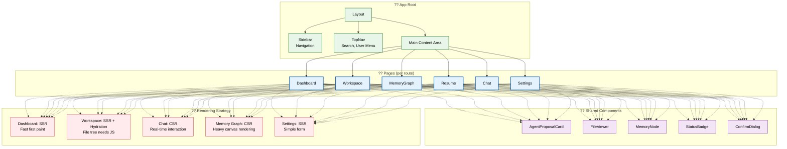
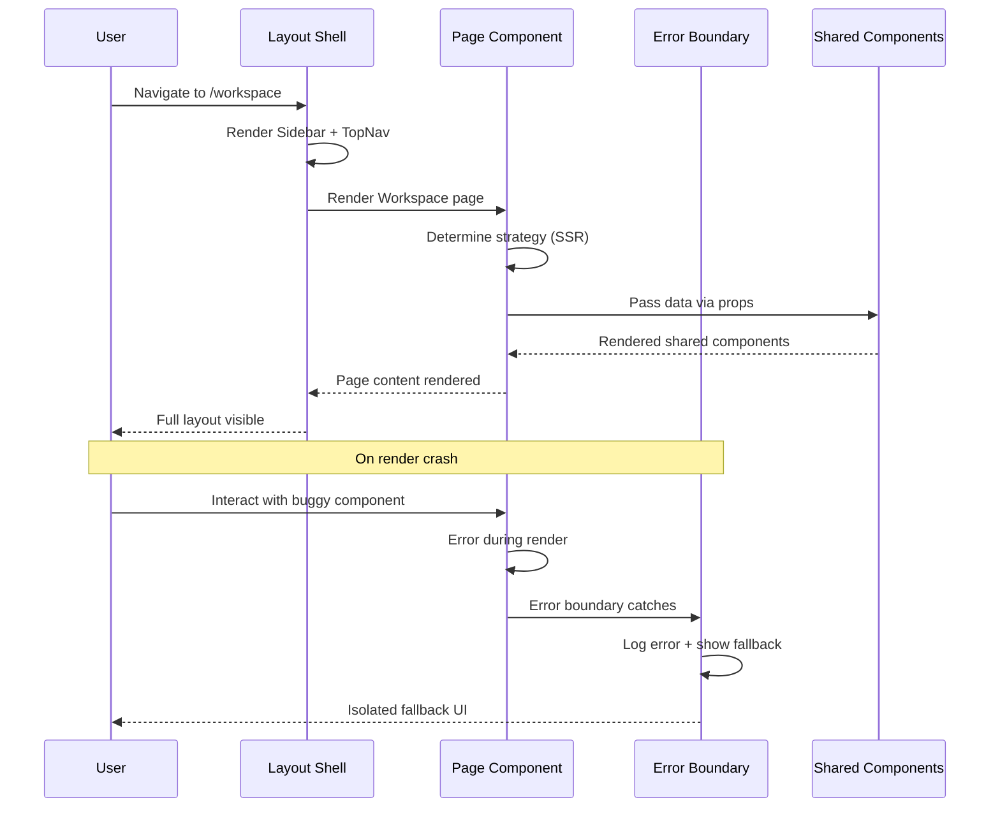

# UI Architecture

> **Purpose:** Define the UI architecture, component hierarchy, and rendering strategies for Vaeloom
> **Status:** ? Upgraded to enterprise quality
> **Owner:** Frontend Team
> **Version:** 2.0
> **Last Updated:** 2026-07-17
> **Dependencies:** Frontend-Architecture.md, Navigation.md, Design-System.md, Component-Library.md
> **Implementation Status:** ?? Spec Only
> **Review Checklist:** Standard
> **Canonical source:** [`/docs/Vaeloom-Complete-Documentation.md#42-frontend`](../../docs/Vaeloom-Complete-Documentation.md#42-frontend)

## Overview

The Vaeloom UI architecture defines how the application is structured from root layout to individual page components. Every page shares a consistent shell — Sidebar for primary navigation, TopNav for search and user context, and a Main Content Area that renders the matched route. This consistent layout means users build muscle memory on day one; the sidebar and TopNav remain stable while the content area swaps between Dashboard, Workspace, Memory Graph, Chat, and Settings.

The rendering strategy varies per page based on its primary interaction model. Content-focused pages (Dashboard, Settings, Resume) use SSR for fast first paint. Highly interactive pages (Chat with real-time messaging, Memory Graph with canvas rendering) use CSR since the bulk of their value comes from client-side JavaScript interaction. This hybrid approach ensures that every page gets the right balance of initial load speed and interactive capability.

**Audience:** Frontend engineers implementing UI components, designers translating mockups to code, and QA engineers verifying layout consistency. **System fit:** The UI architecture sits atop the frontend architecture, translating routing and data fetching into rendered components. **Why it matters:** A consistent layout shell reduces cognitive load, error boundaries at every level prevent cascading failures, and per-page rendering strategies optimize load time for each interaction model.

## Goals

- Establish a consistent layout shell across all 11 page routes with predictable navigation patterns
- Achieve 100% error boundary coverage at every layout nesting level
- Reduce unused JavaScript shipped per route through SSR/CSR strategy selection
- Maintain shared component library with zero page-specific dependencies
- Achieve Time-to-Interactive under 3s for SSR pages and under 5s for canvas-heavy CSR pages

## Scope

| In Scope | Out of Scope |
|----------|--------------|
| Component hierarchy and layout architecture | Backend API response format design |
| Page-specific rendering strategy (SSR vs CSR) | Third-party UI library integration |
| Error boundary placement at every nesting level | Animation and transition specifications |
| Shared component catalog and composition patterns | Accessibility compliance audit |
| Routing structure with Next.js App Router | Mobile responsive breakpoints |

## Functional Requirements

| ID | Requirement | Priority |
|----|-------------|----------|
| FR-001 | Every page shall share the same layout shell (Sidebar + TopNav + ContentArea) | P0 |
| FR-002 | Every route segment and layout level shall have its own error boundary | P0 |
| FR-003 | Pages shall use SSR or CSR based on their primary interaction model | P0 |
| FR-004 | Heavy, non-critical components shall use lazy loading with dynamic imports | P1 |
| FR-005 | Shared components shall not fetch data directly — data comes via props | P1 |

## Non-Functional Requirements

| ID | Requirement | Target | Measurement |
|----|-------------|--------|-------------|
| NFR-001 | Layout consistency across all pages | 100% pages share shell | Visual regression test |
| NFR-002 | Error boundary isolation — no single crash takes down > 1 segment | 100% isolation | Error propagation test |
| NFR-003 | Lazy-loaded component activation latency | < 200ms on interaction | Dynamic import timing |
| NFR-004 | SSR-to-CSR page ratio appropriate to interaction model | Audit passes per page | Architecture review |
| NFR-005 | Shared component reusability — zero duplicate implementations | 0 duplicates | Component usage scan |

## Architecture



> **Diagram:** Component hierarchy showing **Layout** (Sidebar + TopNav + Main Content) ? **Pages** (6 primary routes with SSR/CSR strategies) ? **Shared Components** reused across pages. **Rendering strategy** varies by page — SSR for content pages, CSR for interactive/canvas-heavy pages.

## Components

| Component | Responsibility | Technology | Scale Strategy |
|-----------|---------------|------------|---------------|
| Layout Shell | Sidebar, TopNav, Main Content Area | Next.js root layout | Single instance, no scaling needed |
| Page Components | Route-specific content and interaction | Next.js page components | Dynamic imports per route |
| Shared Component Library | Reusable UI primitives (cards, badges, dialogs) | React + Tailwind CSS | Versioned npm package |
| Error Boundary Container | Catch render errors per segment | React Error Boundary | Nested at every layout level |
| Skeleton Loader | Show loading state matching page layout | Tailwind + CSS animations | Route-specific skeleton components |

## Workflows

1. **Page Render Lifecycle**: Next.js App Router matches URL ? Root layout renders (Sidebar + TopNav) ? Content area renders matched page ? Page uses SSR (server component fetches data, renders HTML) or CSR (client component shows skeleton, fetches data, renders content) ? Shared components receive data via props ? Skeleton loaders replaced by live content.

2. **Error Boundary Activation**: Component throws during render ? Nearest error boundary catches the error ? Boundary logs error context to monitoring ? Boundary renders fallback UI for that segment ? Unaffected segments continue operating normally ? User sees contextual message with retry action.

3. **Lazy-Loaded Component Mount**: User interaction triggers condition (e.g., opening Memory Graph) ? `next/dynamic` imports the component chunk ? Browser downloads chunk asynchronously ? Loading skeleton shown during download ? Chunk arrives ? Component renders with props from parent ? Subsequent visits use cached chunk.

4. **Layout-Consistent Navigation**: User navigates between routes ? Next.js App Router performs client-side navigation ? Root layout shell persists (no re-render) ? Content area swaps to new page component ? Sidebar active state updates to reflect current route ? TopNav user context remains stable.

## Sequence Diagrams



## Data Flow

1. **Ingestion**: User navigates to a URL ? Next.js App Router matches the route and renders the root layout (Sidebar + TopNav + ContentArea). Layout shell renders immediately with cached or static data — Sidebar gets workspace info, TopNav gets user context.

2. **Processing**: Content area renders the matched page component. For SSR pages, server components fetch data and render HTML. For CSR pages, client components show skeleton loaders and initiate data fetches. The page determines which shared components to render and what data each needs.

3. **Storage**: Shared component data is held in component props — no shared state. Layout state (sidebar collapse, active nav) stored in React Context. Skeleton/animation state local to each component.

4. **Retrieval**: Shared components receive data via props from the page component, never fetching independently. The page component is the single source of truth for data distribution to its children.

5. **Deletion**: On route change, page component unmounts ? React clears component state ? Shared components unmount with parent ? Layout shell persists. On workspace switch, layout shell triggers re-render with new context.

## APIs

N/A — The UI architecture document defines component hierarchy, layout structure, and rendering strategies. API endpoints consumed by page components are documented in the backend API specification and Frontend Architecture document.

## Database

N/A — The UI layer does not directly access any database. All data consumed by UI components flows through the API gateway, fetched by server components or TanStack Query hooks defined in page components.

## Security

| Concern | Mitigation |
|---------|------------|
| Route-level access control bypass | Access control on client-side routes is a UX convenience, not a security boundary — every API endpoint behind a route must independently verify permissions |
| API endpoint exposure through client-side bundle | Route patterns and API endpoint paths are visible in the compiled Next.js bundle; never hardcode secrets, keys, or internal URLs |
| Layout-based privilege escalation | A shared layout component should not render admin-only UI elements and rely on CSS to hide them — conditional rendering based on user role is the only safe approach |

## Performance

| Concern | Budget | Measurement | Optimization |
|---------|--------|-------------|--------------|
| Bundle splitting per page via dynamic imports | 250KB per route | @next/bundle-analyzer | Use `next/dynamic` with `ssr: false` for heavy components (knowledge graph, file viewer) |
| SSR streaming with Suspense | Layout shell render < 200ms | Server timings | Use React 18 streaming SSR to send HTML progressively — Sidebar and TopNav render before slower content sections |
| Hydration overhead | TTI < 3s (SSR), < 5s (CSR) | Web Vitals | Track TTI per page; consider selective hydration or islands architecture for heavy CSR pages |
| Lazy-loaded component activation | < 200ms from interaction | Dynamic import timing | Preload chunks on hover; use IntersectionObserver for viewport-based loading |

## Scalability

| Dimension | Current Limit | 10x Strategy | 100x Strategy |
|-----------|--------------|--------------|---------------|
| Page routes | 11 routes | Parallel routes with route groups | Nested layouts with route interception |
| Shared components | 5 core components | Expand to 20+ with design system | Micro-frontend shared component library |
| Error boundary instances | 15 boundaries | 1 per layout level + 1 per page | Automatic boundary generation per component |
| Lazy-loaded components | 3 dynamically imported | All non-critical components lazy | Webpack module federation |

## Error Handling

| Scenario | Detection | Mitigation | Recovery |
|----------|-----------|------------|----------|
| Page component render crash | Error boundary at page level catches error | Show fallback for crashed page, nav unaffected | User can navigate away, error logged |
| Layout component crash (Sidebar) | Error boundary at layout level catches error | Show simplified layout without Sidebar | Auto-retry mount after 30s |
| Shared component crash | Error boundary wrapping that component | Component renders as fallback placeholder | Refresh that section via remount |
| Canvas/CSR component memory leak | Performance monitoring detects FPS drop | Show memory warning, offer tab reload | Component unmount on navigation away |

## Monitoring

| Metric | Alert Threshold | Severity | Dashboard |
|--------|----------------|----------|-----------|
| Error boundary activation rate | > 0.5% of sessions | Warning | UI Error Tracking |
| Layout shell render time | > 500ms | Warning | Layout Performance |
| Lazy-loaded component failure rate | > 1% of interactions | Warning | Dynamic Import Health |
| Canvas FPS for Memory Graph | < 30 FPS | Warning | Canvas Performance |
| SSR page TTI | > 4s | Critical | User Experience |

## Deployment

| Environment | Strategy | Rollback | Notes |
|-------------|----------|----------|-------|
| Development | Vercel preview per PR branch | Automatic on CI failure | UI architecture changes validated in preview |
| Staging | Auto-deploy from `develop` branch | Manual rollback via Vercel | Visual regression tests run against staging |
| Production | Auto-deploy from `main` branch | Instant rollback to previous version | Layout changes gated behind feature flags |

## Configuration

| Variable | Purpose | Default | Required |
|----------|---------|---------|----------|
| UI_LAYOUT_CACHE_ENABLED | Whether layout data is cached client-side | true | No |
| UI_ERROR_BOUNDARY_FALLBACK | Fallback component path for error boundary | default-segment-fallback | No |
| UI_SSR_TIMEOUT_MS | Timeout for SSR page render before fallback | 5000 | Yes |
| UI_LAZY_LOAD_THRESHOLD | Viewport distance to trigger lazy load (px) | 200 | No |
| UI_SKELETON_ANIMATION | Enable skeleton loading animations | true | No |

## Examples

### Layout Shell with Error Boundaries

```tsx
function RootLayout({ children }: { children: React.ReactNode }) {
  return (
    <ErrorBoundary fallback={<SidebarError />}>
      <Sidebar />
    </ErrorBoundary>
    <ErrorBoundary fallback={<TopNavError />}>
      <TopNav />
    </ErrorBoundary>
    <main id="main-content">
      <ErrorBoundary fallback={<PageError />}>
        {children}
      </ErrorBoundary>
    </main>
  );
}
```

### SSR vs CSR Rendering Strategy

```tsx
// Dashboard — SSR for fast first paint (server component)
async function DashboardPage() {
  const summary = await fetchDashboardSummary();
  return <DashboardContent summary={summary} />;
}

// Chat — CSR for real-time interaction (client component)
'use client';
function ChatPage() {
  const ws = useWebSocket();
  const [messages, setMessages] = useState<Message[]>([]);
  return <ChatInterface messages={messages} ws={ws} />;
}

// Memory Graph — CSR with lazy loading (client component, dynamically imported)
const MemoryGraph = dynamic(() => import('@/features/memory/MemoryGraph'), {
  ssr: false,
  loading: () => <MemoryGraphSkeleton />,
});
```

### Shared Component with Props-Based Data

```tsx
interface StatusBadgeProps {
  status: 'active' | 'inactive' | 'error' | 'pending';
  label: string;
}

function StatusBadge({ status, label }: StatusBadgeProps) {
  const colorMap = {
    active: 'var(--accent-success)',
    inactive: 'var(--text-muted)',
    error: 'var(--accent-error)',
    pending: 'var(--accent-warning)',
  };

  return (
    <span
      className="badge"
      style={{ backgroundColor: colorMap[status] }}
      aria-label={`Status: ${label}`}
    >
      {label}
    </span>
  );
}
```

## Best Practices

| # | Practice | Rationale |
|---|----------|----------|
| 1 | Choose SSR or CSR per page based on interactivity needs | Dashboard (SSR for fast first paint), Chat (CSR for real-time updates), Memory Graph (CSR for canvas rendering) — each page gets the right strategy |
| 2 | Error boundaries at every layout nesting level | Wrap the Sidebar, TopNav, main content area, and each page in separate error boundaries — no single failure takes down unrelated parts |
| 3 | Use component composition over inheritance | Build complex UIs by composing smaller, focused components — prefer `Page > Card > List > Item` over large monolithic components |
| 4 | Maintain a consistent page layout structure across routes | Every page should share the same shell (Sidebar + TopNav + ContentArea) so users navigate with muscle memory, not conscious thought |
| 5 | Shared components must never fetch data independently | Components receive data exclusively via props from their parent page — this keeps them reusable, testable, and free of side effects |

## Risks

| Risk | Likelihood | Impact | Mitigation |
|------|------------|--------|------------|
| Layout inconsistency when new pages are added | Medium | Medium | Shared layout template, code review checklist |
| Error boundary nesting causing silent failures | Low | Medium | Monitor boundary activation, log full error context |
| Over-use of CSR causing poor initial load experience | Medium | High | SSR audit per page in code review process |
| Component duplication across feature teams | Medium | Medium | Shared component catalog with usage lint rules |

## Limitations

| Limitation | Impact | Workaround | Future Resolution |
|------------|--------|------------|-------------------|
| No component-level hot reload for shared library | Developer iteration speed reduced | Use Next.js Fast Refresh | Separate component library with Storybook |
| Canvas (Memory Graph) requires full JS bundle before rendering | Delayed interactivity for graph-heavy pages | SSR wrapper with loading skeleton | WebAssembly for canvas rendering |
| Error boundary cannot catch async errors in event handlers | Async failures may go uncaught | Wrap async operations in try/catch with error state | React error boundaries for async in React 19 |
| No mobile-specific layout variant in MVP | Mobile users get desktop layout | Basic responsive CSS | Dedicated mobile layout shell |

## Future Improvements

| Improvement | Priority | Complexity | Timeline |
|-------------|----------|------------|----------|
| Storybook component library with visual regression tests | Medium | Medium | Q3 2026 |
| Mobile-specific layout shell with responsive breakpoints | Medium | Medium | Q4 2026 |
| WebAssembly memory graph renderer for 60 FPS | Low | High | Q2 2027 |
| Component-level error boundaries for async failures (React 19) | High | Low | Q3 2026 (React 19 upgrade) |
| Drag-and-drop layout customization per user | Low | High | Q1 2027 |

## Related Documents

- [Frontend Architecture.md](./Frontend-Architecture.md)
- [Navigation.md](./Navigation.md)
- [Design System.md](./Design-System.md)
- [Component Library.md](./Component-Library.md)
- [State Management.md](./State-Management.md)
- [UX Guidelines.md](./UX-Guidelines.md)
- [Theme System.md](./Theme-System.md)
- [Responsive Design.md](./Responsive-Design.md)
- [Mobile Architecture.md](./Mobile-Architecture.md)
- [Internationalization.md](./Internationalization.md)
- [Forms.md](./Forms.md)
- [Dashboard.md](./Dashboard.md)
- [Charts.md](./Charts.md)
- [Animation System.md](./Animation-System.md)
- [Accessibility.md](./Accessibility.md)
- [Accessibility Audit.md](./Accessibility-Audit.md)
- [`/docs/Vaeloom-Complete-Documentation.md#42-frontend`](../../docs/Vaeloom-Complete-Documentation.md#42-frontend)
