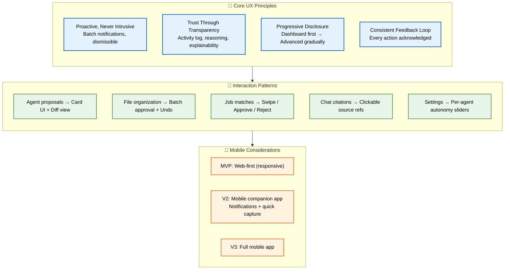
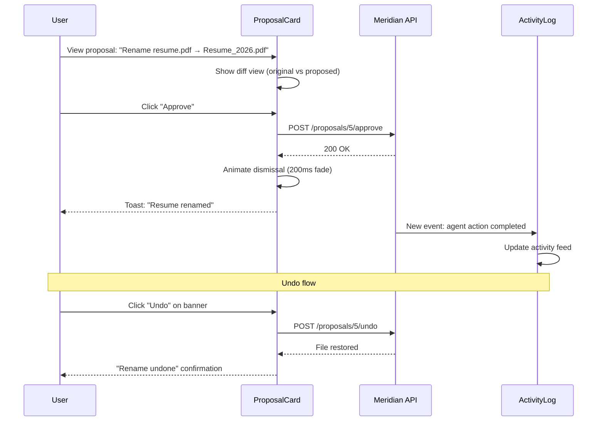

# UX Guidelines

> **Purpose:** Define UX principles and guidelines for Meridian
> **Status:** 🆕 New

## UX Architecture



> **Diagram:** UX foundations — **4 core principles** (proactive, transparent, progressive, consistent) drive **5 interaction patterns** (proposal cards, batch approval, swipe jobs, chat citations, autonomy sliders). **Mobile strategy** follows a phased approach: responsive web → companion app → full mobile app.

---

## Core UX Principles

### 1. Proactive, Never Intrusive

The system suggests and notifies, but never demands attention. Notifications are batched, prioritized, and dismissible.

### 2. Trust Through Transparency

Every agent action is visible in the activity log. Every suggestion shows its reasoning. Every autonomous action is explainable.

### 3. Progressive Disclosure

Show the dashboard first. Reveal agent details, memory graph, and advanced settings as the user's engagement deepens.

### 4. Consistent Feedback Loop

Every user action — approve, reject, correct, edit — has visible feedback. The system acknowledges and adapts.

## Interaction Patterns

| Pattern | Implementation |
|---------|---------------|
| Agent proposals | Card-based approval UI with diff view |
| File organization | Batch approval with undo |
| Job matches | Swipe or approve/reject |
| Chat citations | Clickable source references |
| Settings | Per-agent autonomy sliders |

## Mobile Considerations

- MVP is web-first with responsive design
- Mobile companion for notifications and quick capture
- Full mobile app post-MVP

## Common Mistakes

| Mistake | Why It's a Problem |
|---------|-------------------|
| Too many notifications competing for attention | Users habituate to constant alerts and ignore all of them — batch notifications by priority and let users configure frequency |
| No undo for consequential actions | Agent proposals for file moves, renames, or job applications without a recovery path destroy user trust instantly |
| Hiding important features behind discovery | If a user has to guess that something exists, it might as well not exist — key capabilities should be visible, not buried in menus |
| Inconsistent feedback for similar actions | Approving a proposal should feel the same everywhere — different animations, tones, or confirmation patterns confuse users |

## Best Practices

| Practice | Rationale |
|----------|-----------|
| Progressive disclosure of complexity | New users see Dashboard and basic actions; advanced features (memory graph editing, per-agent autonomy settings) reveal themselves with engagement |
| Provide clear, immediate feedback for every action | Every button press, form submit, and proposal response must produce visible feedback within 100ms — silence is interpreted as failure |
| Give users control over their data | One-click "export everything" and "delete everything" should be visible and unconditional from day one — not hidden in a settings submenu |
| Support undo for all destructive actions | Any action that modifies user data (file renames, organization proposals, application submissions) must have an undo mechanism with a visible timeline |

## Security

| Concern | Mitigation |
|---------|------------|
| Privacy in notification previews | Notification content (email subjects, document summaries) should not display sensitive information in OS-level notification banners — use generic titles with "Tap to view" |
| Data exposure in search previews | Global search results can expose document snippets that reveal sensitive information; scope search preview text based on the user's permission level |
| Session timeout feedback | When a session expires, preserve the user's work-in-progress (form drafts, pending approvals) and explain what happened — don't just redirect to login |

## Performance

| Concern | Guideline |
|---------|-----------|
| Perceived performance with skeleton screens | Show skeleton screens matching final layout within 300ms of navigation — users perceive sub-second skeleton loading as faster than a blank page with a spinner |
| Optimistic UI for common operations | When a user approves a proposal, update the UI immediately and sync in the background — the 200-500ms saved per action makes the product feel responsive |
| Predictive prefetching of likely next actions | After a user approves a file organization proposal, prefetch the Workspace page data — users who navigate there next see instant content |

## Security Considerations

| Concern | Mitigation |
|---------|------------|
| Privacy in notification previews | Notification content (email subjects, document summaries) should not display sensitive information in OS-level notification banners — use generic titles with "Tap to view" |
| Data exposure in search previews | Global search results can expose document snippets that reveal sensitive information; scope search preview text based on user's permission level |
| Session timeout feedback | When a session expires, preserve the user's work-in-progress (form drafts, pending approvals) and explain what happened — don't just redirect to login |

## Performance Considerations

| Concern | Approach |
|---------|----------|
| Perceived performance with skeleton screens | Show skeleton screens matching final layout within 300ms of navigation — users perceive sub-second skeleton loading as faster than a blank page with a spinner |
| Optimistic UI for common operations | When a user approves a proposal, update the UI immediately and sync in the background — the 200-500ms saved per action makes the product feel responsive |
| Predictive prefetching of likely next actions | After a user approves a file organization proposal, prefetch the Workspace page data — users who navigate there next see instant content |

## Components

| Component | Responsibility | Technology | Scale Strategy |
|-----------|---------------|------------|----------------|
| ProposalCard | Agent suggestion with approve/reject + diff view | React + diff library | Instance per proposal; batched in list with virtual scrolling |
| ActivityLog | Chronological list of all agent actions | TanStack Query + virtualized List | Paginated at 20 items; cursor-based; grouped by date |
| AutonomySlider | Per-agent permission level control | React + input range | Instance per agent; persists to user_preferences via debounced PATCH |
| NotificationBanner | Timed/dismissible alerts for agent actions | React + animation context | Queued with priority; max 3 visible simultaneously |

## Workflows

1. **Proposal review and approval**: Agent proposes file rename → ProposalCard appears with diff view (original → proposed) → user reviews changes → clicks "Approve" → optimistic UI hides card → server renames file → success toast appears → activity log updated
2. **Progressive disclosure onboarding**: New user signs up → sees simplified dashboard with 3 widgets → tooltip prompts "Try connecting Gmail" → user connects → new widgets appear → over 2 weeks, advanced features gradually become visible
3. **Undo destructive action**: Agent organizes 10 files → user reviews batch in proposal → approves → 5 files moved → "Undo" banner appears (15s window) → user clicks "Undo" → files restored → agent notified of reversal
4. **Notification batched delivery**: 3 agent actions complete within 2 minutes → NotificationCenter batches them into single summary toast → "3 files organized" with expandable details → user expands → sees individual actions → dismisses all

## Sequence Diagrams



## Data Flow

1. **Ingestion**: Agent actions generate proposal events → events stored in `agent_actions` table → WebSocket broadcasts to connected clients → UI shows proposal card or notification
2. **Processing**: User response (approve/reject) sent to server → server executes action → if undo requested, server reverses with compensating action → all actions logged to activity log
3. **Storage**: User preferences (autonomy sliders, notification settings) stored in `user_preferences` JSONB → notification queue managed in Redis → activity log in PostgreSQL with 90-day retention
4. **Retrieval**: Dashboard queries `/dashboard/summary` for widget data → ActivityLog queries paginated endpoint → proposals fetched via `useQuery(['proposals', workspaceId])`
5. **Deletion**: User deletes workspace → all activity logs purged → proposals cancelled → notification queue cleared

## Scalability

| Dimension | Current Limit | 10x Strategy | 100x Strategy |
|-----------|---------------|--------------|---------------|
| Concurrent visible proposals | 5 | Queue with priority; paginated at 10 | AI auto-approve low-risk proposals with user-defined rules |
| Activity log entries | 50 per page | 500 with cursor pagination + date range filter | Full-text search across all entries with Elasticsearch |
| Notification batch window | 2 minutes | Configurable batch window (30s to 5min) | ML-optimized batch timing based on user engagement patterns |
| Undo window | 15 seconds | Configurable per action type (5s for renames, 60s for deletions) | Infinite undo via activity log with "revert" action |

## Error Handling

| Scenario | Detection | Mitigation | Recovery |
|----------|-----------|------------|----------|
| Proposal approval fails on server | POST returns 4xx/5xx | Rollback optimistic UI; show retry banner | User taps "Retry" → re-sends approval |
| Undo window expires | 15s timer runs out | Show "Undo expired" message; offer manual revert option | User manually reverts via file context menu |
| Notifications overwhelm user | > 10 notifications in 5 minutes | Batch into single digest notification; show count | User configures notification frequency in settings |
| Agent proposed action is no longer valid | Server rejects proposal as stale | Show "This proposal is no longer available" | Remove proposal card from UI; log to analytics |

## Monitoring

| Metric | Alert Threshold | Severity | Dashboard |
|--------|----------------|----------|-----------|
| User proposal approval rate | < 40% | Warning | Amplitude — Agent Engagement |
| Undo frequency | > 20% of actions undone | Info | Amplitude — UX Analytics |
| Notification opt-out rate | > 5% per month | Warning | Product — Retention Dashboard |
| Time-to-first-action for new users | > 7 days | Critical | Amplitude — Onboarding Funnel |
| Activity log query latency (p95) | > 200ms | Warning | Grafana — API Dashboard |

## Risks

| Risk | Likelihood | Impact | Mitigation |
|------|------------|--------|------------|
| Users ignore proposals due to notification fatigue | Medium | High | Batch notifications by importance; allow per-agent notification settings |
| Undo is not available for irreversible actions | Low | High | Warn before irreversible actions; require explicit confirmation |
| Progressive disclosure hides features users need | Medium | Low | Provide "Show all features" toggle; search-based feature discovery |
| Agent autonomy slider leads to unexpected behavior | Medium | Medium | Show clear description of what each autonomy level does; default to "suggest only" |

## Limitations

| Limitation | Impact | Workaround | Future Resolution |
|------------|--------|------------|-------------------|
| No delayed/scheduled action execution | Users cannot set "remind me tomorrow" | Manual notification snooze in notification center | Scheduled actions with time-based triggers |
| Proposal cards limited to approve/reject binary | Complex multi-option proposals not supported | Break into sequential binary proposals | Multi-choice proposal cards with comparison view |
| Undo window fixed per action type | Complex multi-step actions may need longer undo | Extend undo window for batch actions (60s) | User-configurable undo duration per action category |

## Overview

Meridian's UX guidelines define how the application interacts with users across every touchpoint — from the dashboard that greets them on login to the agent proposals that organize their files and the chat interface that answers their questions. The guiding philosophy is "Proactive, Never Intrusive": the system suggests and notifies but never demands attention, batching notifications by priority and making every alert dismissible.

Trust Through Transparency is the second pillar — every agent action is visible in the activity log, every suggestion shows its reasoning, and every autonomous action is explainable. When an AI agent proposes renaming a file or applying to a job, the user sees not just the proposal but the reasoning behind it. This transparency is critical for building trust in autonomous AI actions.

Progressive Disclosure ensures new users aren't overwhelmed. The dashboard starts with 3-4 core widgets and reveals advanced features (memory graph editing, per-agent autonomy sliders, custom automation rules) as the user's engagement deepens over weeks. The Consistent Feedback Loop principle means every user action — approve, reject, correct, edit — has visible feedback within 100ms. Silence is interpreted as failure.

For Meridian's AI-driven workflows, these principles materialize in specific interaction patterns. Proposal cards show a visual diff of what will change before the user commits. Batch operations support undo with a 15-second window. Chat citations are clickable source references that let users verify information. Settings provide per-agent autonomy sliders, letting users decide how much authority each agent has.

## Goals

- Achieve sub-100ms feedback on every user action (button press, form submit, proposal response)
- Maintain 40%+ user approval rate for AI-generated proposals through relevant, well-reasoned suggestions
- Support undo for all destructive actions with a visible 15-second undo window
- Keep new user onboarding abandonment below 30% through progressive disclosure
- Achieve < 5% notification opt-out rate by batching and prioritizing alerts

## Scope

### In Scope
- Card-based proposal UI with visual diff views and approve/reject/reject-with-feedback interactions
- Batch action patterns for file organization, job applications, and proposal approvals
- Undo mechanism with 15-second recovery window for all destructive agent actions
- Notification center with priority-based batching and per-agent frequency configuration
- Per-agent autonomy sliders in Settings for granular permission control
- Activity log with chronological, searchable history of all agent actions
- Clickable citations in chat interface with source document links

### Out of Scope
- Delayed or scheduled action execution (future improvement)
- Multi-choice proposal cards for complex decisions (future improvement)
- ML-optimized notification timing based on engagement patterns (future improvement)
- AI auto-approval of low-risk proposals with user-defined rules (future improvement)

## Examples

### Proposal Card with Diff View

```tsx
interface ProposalCardProps {
  proposal: {
    id: string;
    description: string;
    original: string;
    proposed: string;
    reasoning: string;
  };
  onApprove: (id: string) => void;
  onReject: (id: string, reason?: string) => void;
}

function ProposalCard({ proposal, onApprove, onReject }: ProposalCardProps) {
  return (
    <Card className="proposal-card" role="region" aria-label="Agent proposal">
      <Card.Body>
        <p className="proposal-description">{proposal.description}</p>
        <DiffView original={proposal.original} proposed={proposal.proposed} />
        <details className="proposal-reasoning">
          <summary>Why this suggestion?</summary>
          <p>{proposal.reasoning}</p>
        </details>
      </Card.Body>
      <Card.Footer>
        <Button variant="primary" onClick={() => onApprove(proposal.id)}>Approve</Button>
        <Button variant="secondary" onClick={() => onReject(proposal.id)}>
          Reject
        </Button>
      </Card.Footer>
    </Card>
  );
}
```

### Undo Banner Pattern

```tsx
function UndoBanner({ action, onUndo, timeout = 15000 }: UndoBannerProps) {
  const [visible, setVisible] = useState(true);

  useEffect(() => {
    const timer = setTimeout(() => setVisible(false), timeout);
    return () => clearTimeout(timer);
  }, [timeout]);

  if (!visible) return null;

  return (
    <div className="undo-banner" role="alert" aria-live="polite">
      <span>{action.description}</span>
      <Button variant="link" onClick={() => { onUndo(action.id); setVisible(false); }}>
        Undo
      </Button>
    </div>
  );
}
```

### Per-Agent Autonomy Slider

```tsx
function AutonomySlider({ agent, value, onChange }: AutonomySliderProps) {
  const levels = [
    { value: 0, label: 'Suggest Only', desc: 'Ask before every action' },
    { value: 50, label: 'Suggest with Auto-approve', desc: 'Auto-approve low-risk actions' },
    { value: 100, label: 'Full Autonomy', desc: 'Act independently, log all actions' },
  ];

  return (
    <div className="autonomy-slider">
      <label htmlFor={`autonomy-${agent.id}`}>
        {agent.name} Autonomy
      </label>
      <input
        id={`autonomy-${agent.id}`}
        type="range"
        min={0}
        max={100}
        step={50}
        value={value}
        onChange={e => onChange(agent.id, Number(e.target.value))}
        aria-valuetext={levels.find(l => l.value === value)?.label}
      />
      <span className="autonomy-label">
        {levels.find(l => l.value === value)?.desc}
      </span>
    </div>
  );
}
```

---

| Improvement | Priority | Complexity | Timeline |
|-------------|----------|------------|----------|
| AI auto-approve low-risk proposals with user-defined rules | High | Medium | Q3 2027 |
| Scheduled/delayed action execution | Medium | Medium | Q2 2027 |
| Multi-choice proposal cards for complex decisions | Medium | High | Q4 2027 |
| User-configurable notification intelligence (ML-optimized timing) | Low | High | Q4 2027 |

## Related Documents

- [UI Architecture.md](./UI-Architecture.md)
- [Accessibility.md](./Accessibility.md)
- [`/Docs/01-Meridian-MVP-Spec.md#10-v1-pages`](../../Docs/01-Meridian-MVP-Spec.md#10-v1-pages)
